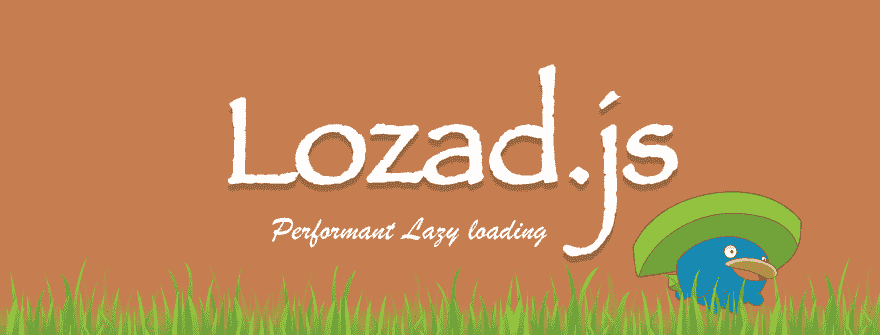

# 🚀介绍 Lozad.js: Performant &轻型延迟加载库

> 原文：<https://dev.to/apoorv_saxena/-introducing-lozadjs-performant--light-lazy-loading-library>

[T2】](https://res.cloudinary.com/practicaldev/image/fetch/s--ntGPFLxg--/c_limit%2Cf_auto%2Cfl_progressive%2Cq_auto%2Cw_880/https://thepracticaldev.s3.amazonaws.com/i/nptus1dcu12hkhdnjghc.png)

> 惰性加载是一种编程实践，其中组件仅在需要时加载。这极大地提高了性能，尤其是当加载一个组件的时间很长，并且一个应用程序中有多个这样的组件时。

在网页、图片/社交工具/广告/视频等。由于它们的大小或它们所加载的资源，是导致页面加载时间增加的主要原因。因此，为了减少页面加载时间，绝对有必要在需要的时候延迟加载所有这些不重要的组件。

### 又一个懒加载 JavaScript 库，为什么？

现有的延迟加载库与 scroll 事件挂钩，或者使用定期计时器并对需要延迟加载的元素调用`getBoundingClientRect()`。然而，这种方法非常慢，因为每次调用`getBoundingClientRect()`都会迫使浏览器重新布局整个页面，并且会给你的网站带来相当大的麻烦。

使其更加高效和高性能是[intersect observer](https://developers.google.com/web/updates/2016/04/intersectionobserver)的设计目的，它已经在 Chrome 51 中实现。IntersectionObservers 让您知道被观察的元素何时进入或退出浏览器的视口。

* * *

### 介绍 **Lozad.js** :

*   lazy 使用纯 JavaScript 高效地加载元素，
*   是一个轻量级的库，只是 **535 字节**缩小了& gzipped，
*   没有依赖项:)
*   也允许动态添加元素的延迟加载。

### 安装

```
# You can install lozad with npm
$ npm install --save lozad

# Alternatively you can use Yarn.
$ yarn add lozad

# Another option is to use Bower.
$ bower install lozad 
```

Enter fullscreen mode Exit fullscreen mode

或者通过 **CDN** 加载并包含在页面的`head`标签中。

```
<script type="text/javascript" src="https://cdn.jsdelivr.net/npm/lozad/dist/lozad.min.js"></script> 
```

Enter fullscreen mode Exit fullscreen mode

### 用法

在 HTML 中，向元素添加一个标识符(默认的选择器标识为`lozad`类):

```
 
```

Enter fullscreen mode Exit fullscreen mode

你现在需要做的只是如下实例化 Lozad:

```
// lazy loads elements with default selector as '.lozad'
const observer = lozad();
observer.observe(); 
```

Enter fullscreen mode Exit fullscreen mode

* * *

详情请查看 Github 上的 [Lozad.js repo](https://github.com/ApoorvSaxena/lozad.js)