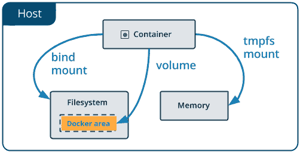
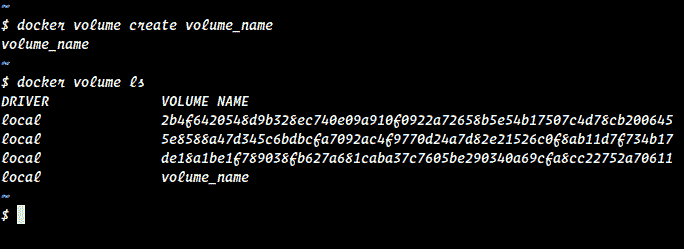

# Docker 卷:介绍

> 原文:[https://dev . to/stephenafamo/docker-volumes-an-introduction-3m9m](https://dev.to/stephenafamo/docker-volumes-an-introduction-3m9m)

[T2】](https://res.cloudinary.com/practicaldev/image/fetch/s--5fFO4Gs6--/c_limit%2Cf_auto%2Cfl_progressive%2Cq_auto%2Cw_880/https://i1.wp.com/stephenafamo.com/blog/wp-content/uploads/2018/02/types-of-mounts-volume.png%3Ffit%3D502%252C255%26ssl%3D1)

当我们需要在 Docker 容器中持久存储数据或在容器之间共享数据时，Docker 卷非常有用。

Docker 卷非常重要，因为当 Docker 容器被销毁时，它的整个文件系统也会被销毁。因此，如果我们想以某种方式保存这些数据，我们有必要使用 Docker 卷。

通过使用-v 标志，Docker 卷在执行`docker run`命令期间被附加到容器

## 需要 Docker 卷时

让我们看看我们在[上一篇文章](https://scotch.io/bar-talk/working-effectively-with-docker-images)中创建的 docker 图像。`stephenafamo/adonisjs`图像。

工作目录是`/var/www`，应用代码在那里。如果我们想在这个映像的容器中运行 Adonis 应用程序，并且不希望在停止容器后删除所有文件，那么我们有几个选择。

## 1。绑定安装

绑定挂载只是将主机上的目录映射到容器中的目录。但是，当容器被删除时，它不会影响目录。

如果`-v`或`--volume`标志的值是一个路径，那么它被认为是一个绑定挂载。如果该目录不存在，则将创建它。当我们这样做时，目录`/path/to/app/directory`将包含与容器中的`/var/www`相同的文件。

```
docker run -d --name adonis \
    -v /path/to/app/directory:/var/www \
    stephenafamo/adonisjs:1.0.0 
```

<svg width="20px" height="20px" viewBox="0 0 24 24" class="highlight-action crayons-icon highlight-action--fullscreen-on"><title>Enter fullscreen mode</title></svg> <svg width="20px" height="20px" viewBox="0 0 24 24" class="highlight-action crayons-icon highlight-action--fullscreen-off"><title>Exit fullscreen mode</title></svg>

> **注意**:如果你对如何使用`docker run`命令或者如何运行容器感到困惑，那么你可以浏览[上一篇文章](https://dev.to/stephenafamo/understanding-docker-containers-43id)。
> 
> ## 2。Docker 卷

卷是保存 Docker 容器生成和使用的数据的首选机制。虽然绑定装载依赖于主机的目录结构，但卷完全由 Docker 管理。与绑定装载相比，卷有几个优势:

*   卷比绑定装载更容易备份或迁移。
*   您可以使用 Docker CLI 命令或 Docker API 来管理卷。
*   卷在 Linux 和 Windows 容器上都可以工作。
*   可以在多个容器之间更安全地共享卷。
*   卷驱动程序允许您在远程主机或云提供商上存储卷，加密卷的内容，或添加其他功能。
*   新卷的内容可以由容器预先填充。

此外，卷通常是比在容器的可写层中保存数据更好的选择，因为使用卷不会增加使用它的容器的大小，并且卷的内容存在于给定容器的生命周期之外。

### 创建和删除 Docker 卷

我们可以使用命令
创建一个 Docker 卷

```
docker volume create volume_name 
```

<svg width="20px" height="20px" viewBox="0 0 24 24" class="highlight-action crayons-icon highlight-action--fullscreen-on"><title>Enter fullscreen mode</title></svg> <svg width="20px" height="20px" viewBox="0 0 24 24" class="highlight-action crayons-icon highlight-action--fullscreen-off"><title>Exit fullscreen mode</title></svg>

要列出所有卷，我们使用以下命令。

```
docker volume ls 
```

<svg width="20px" height="20px" viewBox="0 0 24 24" class="highlight-action crayons-icon highlight-action--fullscreen-on"><title>Enter fullscreen mode</title></svg> <svg width="20px" height="20px" viewBox="0 0 24 24" class="highlight-action crayons-icon highlight-action--fullscreen-off"><title>Exit fullscreen mode</title></svg>

<figure>[](https://res.cloudinary.com/practicaldev/image/fetch/s--v-7xb-sX--/c_limit%2Cf_auto%2Cfl_progressive%2Cq_auto%2Cw_880/https://i0.wp.com/stephenafamo.com/blog/wp-content/uploads/2018/02/docker-volume-ls.png%3Fresize%3D684%252C249%26ssl%3D1) 

<figcaption>坞站卷 ls</figcaption>

</figure>

如果我们选择删除 Docker 卷，我们可以使用命令。

```
docker volume rm volume_name 
```

<svg width="20px" height="20px" viewBox="0 0 24 24" class="highlight-action crayons-icon highlight-action--fullscreen-on"><title>Enter fullscreen mode</title></svg> <svg width="20px" height="20px" viewBox="0 0 24 24" class="highlight-action crayons-icon highlight-action--fullscreen-off"><title>Exit fullscreen mode</title></svg>

### 将 Docker 卷附加到容器

我们还可以使用`-v`或`--volume`标志将 Docker 卷附加到容器。然而，我们并没有像绑定挂载那样在主机上放置目录的路径，而是简单地放置了卷名。

```
docker run -d --name adonis \
    -v adonis_vol:/var/www \
    stephenafamo/adonisjs:1.0.0 
```

<svg width="20px" height="20px" viewBox="0 0 24 24" class="highlight-action crayons-icon highlight-action--fullscreen-on"><title>Enter fullscreen mode</title></svg> <svg width="20px" height="20px" viewBox="0 0 24 24" class="highlight-action crayons-icon highlight-action--fullscreen-off"><title>Exit fullscreen mode</title></svg>

> **注意**:如果我们指定一个不存在的卷，它将被创建

## 挂载新的 Docker 卷或空目录

如果我们启动一个创建新卷的容器，并将其附加到包含文件的容器中的目标，那么目标中的文件将被复制到卷中。

例如，在我们的`stephenafamo/adonisjs`映像中，如果在`/var/www`目录中挂载了一个空卷，那么将在那里创建一个新的应用程序。

## 在只读模式下使用挂载

由于 Docker 卷(或 bind mount)可以附加到多个容器，因此只有一些容器能够对其进行写入可能是有用的。

为此，我们需要以只读模式将该卷附加到其他容器。这是通过像这样添加`ro`选项来完成的；

```
docker run -d --name adonis \
    -v adonis_vol:/var/www:ro \
    stephenafamo/adonisjs:1.0.0 
```

<svg width="20px" height="20px" viewBox="0 0 24 24" class="highlight-action crayons-icon highlight-action--fullscreen-on"><title>Enter fullscreen mode</title></svg> <svg width="20px" height="20px" viewBox="0 0 24 24" class="highlight-action crayons-icon highlight-action--fullscreen-off"><title>Exit fullscreen mode</title></svg>

这适用于 Docker 卷和绑定装载。

## 结论

因此，这涵盖了 Docker 卷的常见用途。还有几个允许更多功能的卷驱动程序。也许我们会在另一篇文章中讨论这个问题，或者我以后会更新这个。

一如既往，我很欣赏评论，建议和更正。谢谢你。

帖子[Docker Volumes:a Introduction](https://stephenafamo.com/blog/docker-volumes-introduction/)首先出现在 [Stephen AfamO 的博客](https://stephenafamo.com/blog)上。