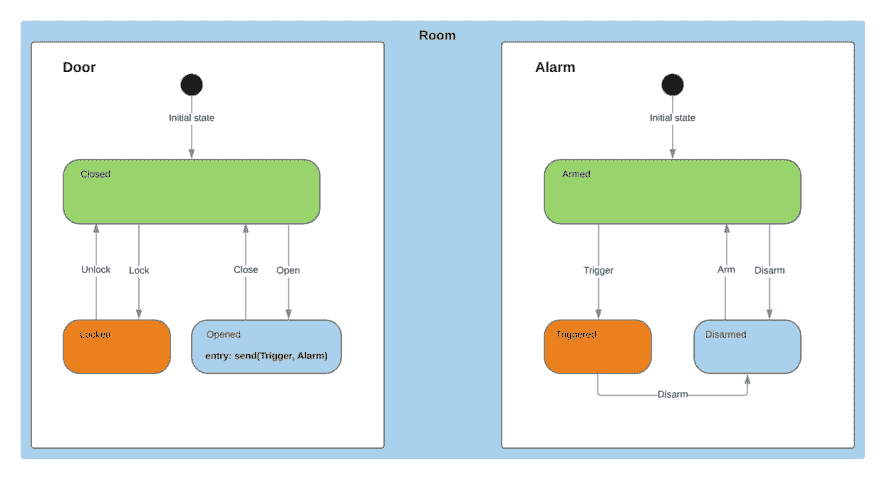

# 用户界面的状态驱动开发(第 3 部分:并行状态机)

> 原文:[https://dev . to/nimmo/state-driven-development-for-user-interfaces-part-3-parallel-state-machines-2oja](https://dev.to/nimmo/state-driven-development-for-user-interfaces-part-3-parallel-state-machines-2oja)

这是由三部分组成的系列的最后一部分。在阅读本书之前，可能值得先阅读第 1 部分、[、](https://dev.to/dnimmo/state-driven-development-for-user-interfaces-part-1-an-introduction-27f1)、第 2 部分、[、](https://dev.to/dnimmo/state-driven-development-for-user-interfaces-part-2-finite-state-machines-3hgc)。:)

您可能已经意识到，在很大程度上，试图将整个应用程序作为单个状态机进行推理可能会导致难以管理的状态数量。到目前为止，我们已经讨论过的想法仍然可以*工作*，但是仅仅通过引入像弹出菜单这样的东西，你最终会有两倍的状态，这感觉并不理想。

让我们考虑一下需要相互交互的并行状态机的概念。回到我们在本系列的第一部分中构建的`door`，让我们考虑一下为了给门所在的房间添加一个`alarm`我们需要做些什么。

我们的`door`的状态可以保持之前的状态:

```
LOCKED
CLOSED
OPENED 
```

<svg width="20px" height="20px" viewBox="0 0 24 24" class="highlight-action crayons-icon highlight-action--fullscreen-on"><title>Enter fullscreen mode</title></svg> <svg width="20px" height="20px" viewBox="0 0 24 24" class="highlight-action crayons-icon highlight-action--fullscreen-off"><title>Exit fullscreen mode</title></svg>

我们的`alarm`的状态将看起来像:

```
ARMED
DISARMED
TRIGGERED 
```

<svg width="20px" height="20px" viewBox="0 0 24 24" class="highlight-action crayons-icon highlight-action--fullscreen-on"><title>Enter fullscreen mode</title></svg> <svg width="20px" height="20px" viewBox="0 0 24 24" class="highlight-action crayons-icon highlight-action--fullscreen-off"><title>Exit fullscreen mode</title></svg>

到目前为止，很简单。但是我们需要像以前一样对状态之间的转换进行建模，其中一个需要向另一个广播信息，这增加了复杂性。让我们看看它在图上的样子:

[T2】](https://res.cloudinary.com/practicaldev/image/fetch/s--nMv0ZhJI--/c_limit%2Cf_auto%2Cfl_progressive%2Cq_auto%2Cw_880/https://thepracticaldev.s3.amazonaws.com/i/kvixbm33fci5wbbrzn66.png)

我们在这个图中引入的是基于进入另一个状态机的给定状态，在一个状态机中发生一个动作的能力。也就是说，当门被打开时，`trigger`动作被触发，这将警报设置为其`TRIGGERED`状态，但关键的是*只有在从*可以访问`trigger`动作的状态下。

无论何时开门都会触发`trigger`动作，但是门不需要知道是否报警；那不是门的问题。还记得吗，在本系列的介绍中，我们决定不需要将不可用的转换放到我们的图中？这里同样的事情- `trigger`将使警报进入其`TRIGGERED`状态，但是*只有在当前处于`ARMED`状态时才会进入*状态。

希望您能看到这可以多么容易和干净地扩展；例如，如果您想让系统在门锁上时自动报警。

# 实现

我们需要首先添加`alarm`的文件，不出所料，这些文件看起来与我们的`door`没有太大的不同。如果你想看，你可以在 Github 上看到[。](https://github.com/dnimmo/state-machine-example)

因为我们已经在我们华而不实的新安全系统中引入了层级和并行机制，所以我认为稍微改变一下我们的`containers`也是有意义的。

而不是:

```
containers/
  alarm.js
  door.js
  room.js
store/
  alarm.js
  door.js 
```

<svg width="20px" height="20px" viewBox="0 0 24 24" class="highlight-action crayons-icon highlight-action--fullscreen-on"><title>Enter fullscreen mode</title></svg> <svg width="20px" height="20px" viewBox="0 0 24 24" class="highlight-action crayons-icon highlight-action--fullscreen-off"><title>Exit fullscreen mode</title></svg>

下面有请:

```
containers/
  room/
    sub_containers/
      alarm.js
      door.js
    room.js
store/
  room/
    alarm.js
    door.js 
```

<svg width="20px" height="20px" viewBox="0 0 24 24" class="highlight-action crayons-icon highlight-action--fullscreen-on"><title>Enter fullscreen mode</title></svg> <svg width="20px" height="20px" viewBox="0 0 24 24" class="highlight-action crayons-icon highlight-action--fullscreen-off"><title>Exit fullscreen mode</title></svg>

我们需要添加一些东西来允许一个状态机向另一个状态机广播。经过一番深思熟虑后，我们决定将`broadcastAction`添加到任何需要向另一个状态机广播动作的动作创建者的返回值中:

```
import {
  actionTypes as alarmActionTypes,
} from './alarm';

// snip!

export
const open = 
  () => ({ 
    type: actionTypes.OPEN,
    broadcastAction: alarmActionTypes.TRIGGER,
  }); 
```

<svg width="20px" height="20px" viewBox="0 0 24 24" class="highlight-action crayons-icon highlight-action--fullscreen-on"><title>Enter fullscreen mode</title></svg> <svg width="20px" height="20px" viewBox="0 0 24 24" class="highlight-action crayons-icon highlight-action--fullscreen-off"><title>Exit fullscreen mode</title></svg>

我们还添加了一个非常小的定制中间件，我们称之为`state bridge` :

```
const stateBridge = 
  store => 
    next => 
      action => {
        const shouldBroadcastAction =
          action.broadcastAction !== undefined

        if (shouldBroadcastAction) {
            next({ type: action.broadcastAction })
        };

        return next(action);
      };

export default stateBridge; 
```

<svg width="20px" height="20px" viewBox="0 0 24 24" class="highlight-action crayons-icon highlight-action--fullscreen-on"><title>Enter fullscreen mode</title></svg> <svg width="20px" height="20px" viewBox="0 0 24 24" class="highlight-action crayons-icon highlight-action--fullscreen-off"><title>Exit fullscreen mode</title></svg>

这将拦截通过`Redux`调用的任何动作，并检查是否有任何动作需要在被激活时广播，如果有，则在执行原始动作之前广播它们。

当[配置我们的商店](https://github.com/dnimmo/state-machine-example/blob/master/src/store/config.js)时，我们应用了上面的方法。

这就是我们拥有的。我们现在有能力将动作从一个状态机广播到另一个状态机，我们已经更新了我们的`door`上的`OPEN`动作，以便它广播来自我们的`alarm`的`TRIGGER`动作，并且我们不需要对我们的`alarm`做*任何额外的*事情来完成这个工作，因为*接收*状态机不需要知道外部动作来自哪里(根据我们前面的状态图)，它只需要知道当它被要求时如何处理那个转换。

# 结论

人们很容易忘乎所以地将一些特性捆绑到一个应用程序上，而没有过多地考虑更广泛的背景。提前考虑这些事情很无聊，对吧？我知道，你只是想写一些代码，在屏幕上看到一些东西；相信我，我明白。我们本质上被驱使从 HTML 开始构建我们的应用程序；大多数前端工程师最初就是这样进入开发的。但是我们已经走了很长的路，因为我们只是脚本动画和动态显示和隐藏元素。随着我们的客户端应用程序的发展，我们需要考虑以前只与服务器端开发相关的数据驱动问题的类型。

但是我们经常发现自己认为状态是应用程序的辅助，而没有意识到它是应用程序中唯一最重要的东西。

*任何一组*数据都会引起一种奇异的视觉状态。如果我们的应用程序接收到一组与单个状态类型不匹配的数据，那么我们得到了一个异常，这应该得到适当的处理。我们越是认为我们的视觉输出是一种有限的(已知的)可能的状态类型，我们就越是限制我们出错的可能性。有了今天可用的令人惊奇的工具，我们可以很容易地测试我们的状态是否如我们期望的那样呈现。

小心管理你的状态，我估计你会很快感谢自己。:)

如果你想看看 SDD 的具体实现，[托德](https://www.twitter.com/TRunham)在 Github 上提供了几个例子[。](https://github.com/clicktravel-toddrunham/state-driven-development)