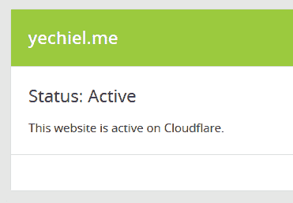
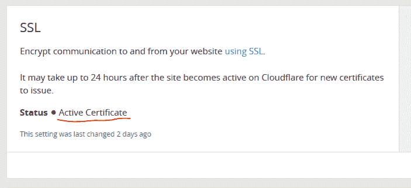

# 使用自定义域将 HTTPS 添加到 GitHub 页面

> 原文：<https://dev.to/yechielk/adding-https-to-github-pages-using-a-custom-domain-12il>

***编辑 2018 年 5 月 1 日**:从今天起这篇博文就过时了。今天，GitHub 宣布将增加 HTTPS 对使用 GitHub 页面的自定义域名的支持。关于如何配置你的 GitHub 页面来使用 HTTPS 的信息，请看[这篇文章](https://blog.github.com/2018-05-01-github-pages-custom-domains-https/)。*

我只是尽了自己的一份力量，让网络成为一个更安全的地方；我更新了我的网站，在 HTTPS 工作。

[T2】](https://res.cloudinary.com/practicaldev/image/fetch/s--xtTDb7nl--/c_limit%2Cf_auto%2Cfl_progressive%2Cq_auto%2Cw_880/https://cdn-images-1.medium.com/max/243/1%2AtZMiyspf3FqCVlqhR9h0vA.png)

通过 HTTPS 提供服务的网站会对服务器和浏览器之间的所有通信进行加密，因此任何试图监听流量的人只会看到一串乱码、无意义的文本，而不是可能应该是隐私的信息，如密码、信用卡号、个人信息以及你阿姨与你分享的猫 gif。

*(旁注:即使我的个人网站不收集或显示任何敏感信息，但用 HTTPS 加密仍然使网络成为每个人更安全的地方，因为加密的“常规”流量越多，恶意行为者就越难找出哪些加密的流量包含敏感数据。这就是为什么如果你还没有使用 HTTPS 的话，你应该设置你的网站。*

我想把我的网站更新到 HTTPS，但是我把我的网站放在 GitHub 页面上，GitHub 页面不支持使用自定义域名的网站使用 HTTPS。

最近，我了解到我可以使用 Cloudflare 将 HTTPS 添加到我的网站中。有许多教程展示了如何做到这一点，但我注意到那里的许多信息都有点过时(包括 Cloudflare 上的一些信息)，所以我决定写下我是如何做到的。

#### 什么是 Cloudflare？

Cloudflare 是一种介于用户和网站之间的服务，可以保护您的网站免受某些类型的攻击。他们所做的是，通过他们的服务器将所有的流量发送到你的网站，并阻止他们认为是恶意的流量。

[T2】](https://res.cloudinary.com/practicaldev/image/fetch/s--lHPEkYsK--/c_limit%2Cf_auto%2Cfl_progressive%2Cq_auto%2Cw_880/https://cdn-images-1.medium.com/max/307/0%2AW0zuu_gjOSYjzFpY.png)

他们提供的服务之一是，他们允许你使用他们的 SSL 证书，即使网站没有 SSL 证书。因此，最终会发生的是，当用户访问您的网站时，访问者和 Cloudflare 之间的任何流量都将使用 HTTPS 进行保护，然后 Cloudflare 将使用常规 HTTP 将流量路由到您的服务器。这并不完美，如果你的网站确实收集敏感数据，你可能不应该使用它，但对于一个常规的静态网站(像大多数 GitHub Pages 网站)来说，这应该足够了。

另外，Cloudflare 还提供了更多功能，让您的网站更安全、更可靠、更快速。

#### 我是怎么做到的？

第一步是获得免费的 Cloudflare 帐户。

一旦您的帐户被设置，您将被提示添加您的域。一旦你输入你的域名，Cloudflare 会完成剩下的工作；它将扫描 DNS 记录，并设置它的大部分。你唯一要做的就是用你的域名所有者(GoDaddy，Google Domains 等)更新域名服务器。)每个注册商的流程都不同，因此如果您需要帮助，请向他们咨询。

[T2】](https://res.cloudinary.com/practicaldev/image/fetch/s--xw6TSXUv--/c_limit%2Cf_auto%2Cfl_progressive%2Cq_auto%2Cw_880/https://cdn-images-1.medium.com/max/371/1%2ASV8pyYmTlLrtZ-UVjRh6QQ.png)

一旦您向您的注册商更新了名称空间信息，您的帐户状态将变为活动，您现在必须等待 Cloudflare 为您的域颁发 SSL 证书。对于免费账户来说，这个过程可能需要 24 小时，但以我的经验来看，它几乎是立即发生的。您可以通过转到仪表板中的“加密”选项卡来检查状态；您应该在 SSL 下看到“状态:活动证书”:

[T2】](https://res.cloudinary.com/practicaldev/image/fetch/s--Qz9QY7H2--/c_limit%2Cf_auto%2Cfl_progressive%2Cq_auto%2Cw_880/https://cdn-images-1.medium.com/max/703/1%2Ar2SaGgl-lUJApU2joDEaHA.png)

一旦你的 SSL 证书被激活，确保你选择了正确的设置。这里有相互矛盾的信息，因为不同的教程是由拥有不同配置的网站的人编写的，所以这里有你需要选择的:如果你在 GitHub Pages 网站上使用自定义域，这意味着你的网站不支持 HTTPS，你应该选择“灵活的”SSL 支持。另一方面，如果您正在使用 GitHub Pages 域(username.github.io)并且启用了 SSL，那么您应该选择“完全”SSL 支持(而不是“完全(严格)”)。

一旦你有 httpS 工作(你可以通过尝试访问你的网站，并把 https 而不是 HTTP 放在 URL 来测试)，下一步是确保任何人访问你的网站只使用 HTTPS 而不是 HTTP。大多数教程告诉您在 Cloudflare 上设置页面规则，但似乎他们将该选项作为设置添加到了 Crypto 选项卡，因此您不必用完三个免费页面规则中的一个。

[T2】](https://res.cloudinary.com/practicaldev/image/fetch/s--lCYsoK3Y--/c_limit%2Cf_auto%2Cfl_progressive%2Cq_auto%2Cw_880/https://cdn-images-1.medium.com/max/980/1%2AyOfpseh3gTYU5EoxxmSE3Q.png)

假设您做的一切都是正确的，现在您应该会在浏览器中看到指示器，告诉您每次访问您的网站时都是安全的。

[T2】](https://res.cloudinary.com/practicaldev/image/fetch/s--r4AantOb--/c_limit%2Cf_auto%2Cfl_progressive%2Cq_auto%2Cw_880/https://cdn-images-1.medium.com/max/302/1%2AdpuJyfqTZkzjNYbQTy_OFA.png)

恭喜你！多亏了你，网络现在对我们所有人来说都是一个更安全的地方！

#### 哇哇！

我确实遇到了一个小问题。我的博客在同一个域中，但由使用 https 的 Medium 托管，因此当 Cloudflare 尝试使用 HTTP 将访问者路由到我的博客时，Medium 将他们重定向到 HTTPS，这促使 Cloudflare 将他们路由回 HTTP，从而促使 Medium…导致无限循环。解决方案是为 my blog.yechiel.me 子域设置一个页面规则，告诉 Cloudflare 仅对该子域使用“完全 SSL”设置。

[T2】](https://res.cloudinary.com/practicaldev/image/fetch/s--MsFoN60m--/c_limit%2Cf_auto%2Cfl_progressive%2Cq_auto%2Cw_880/https://cdn-images-1.medium.com/max/1008/1%2Ax0eOCM7kUxxS5Ql535ic8Q.png)

* * *

*这篇文章是从我的博客 [Rabbi On Rails](https://blog.yechiel.me/adding-https-to-github-pages-using-a-custom-domain-7e4ee8ab1c50) 交叉发布的。
你可以在那里了解更多关于我的编程之旅，或者在 Twitter 上关注我 [@yechielk](https://twitter.com/yechielk)*