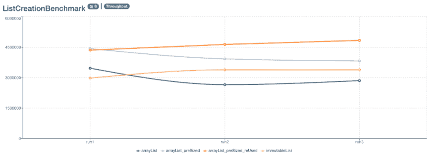

# JVM 的基准基础设施

> 原文：<https://dev.to/o_a_e/benchmarking-infrastructure-for-the-jvm-4lg0>

> 当衡量绩效时，绩效就会提高。当性能被测量和报告时，改进的速度会加快。—托马斯·蒙森

有一个叫做 [JMH](http://openjdk.java.net/projects/code-tools/jmh/) 的工具，它是 [JVM 的](https://en.wikipedia.org/wiki/Java_virtual_machine)在性能跟踪和分析方面最好的朋友之一。在这篇文章中，我…

*   描述一下我在 JMH 周围开发的基础设施，以及你如何将它们用于你自己的努力…
*   讲述一个为什么的长故事...；)

### 如何和为什么——第一章

几年前——在大数据平台 [Datameer](https://www.datameer.com) 工作——一些客户担心性能。*“为什么这个和那个工作在 Hive 只需要五个小时，而在 Datameer 却需要八个小时？”*深浅不一的那种。因此一个小团队着手调查&在投诉变成问题之前解决它们。他们做的第一件事，是精心制作一个基准测试套件，该套件使用 Hive 和 Datameer 在 Hadoop 上运行数据处理作业。这样，他们能够比较两种产品，找出如何改进 Datameer，我们最终能够满足客户对性能的期望。

几个月后，我问*“嘿，我们的性能套件在哪里运行？我在哪里可以看到报告？”。*回应类似于*“嗯，您必须准备一个环境，然后手动触发基准测试，然后您就可以找到打印到日志中的性能数字了！”*。

唷，如果这个套件没有定期运行，如果它没有用一些花哨的图表来警告或鼓励任何人，那么它很快就会腐烂。也许我只是在思考，也许我用更礼貌的语言表达了我的担忧。无论如何…

我不能证明适当的报告和自动化会挽救这个基础设施的生命，但最终它会死去一段时间，并在几年后从代码库中删除。

### 如何和为什么——第二章

两年前——仍然在 Datameer 工作——我们开始开发一个新的主要功能。该功能的主要特点是关于性能。它并没有真正为桌面带来新的功能，但通过它的速度，它应该可以实现新的用例。

这一次我更加投入，基于以前的经验，我有了以下想法:

*   如果性能如此重要，我们必须衡量每个特性的实际状态，并跟踪每个开发步骤的得失。
*   我想要良好的报告和适当的自动化！！

很明显...应该有合适的软件，我想…

没过多久，我就发现 [JMH](http://openjdk.java.net/projects/code-tools/jmh/) 是一种事实上的工具，被大多数人(和越来越多的&人)用来在 JVM 上实现微基准。虽然 JMH 的优势肯定在于微观基准，但我发现它在“集成基准”中也有很好的用途。它可以运行的可插拔分析器也非常酷。它们有助于找到对所见性能的解释，如对象分配、JIT 工作等...

但是在展示基准测试结果方面……JMH 周围的大多数工具缺少我想要的东西。Gradle 插件是有的，但仅仅是为了执行。现有的 Jenkins 插件很有帮助，但是不够深入。一个在线可视化工具确实存在…但是它隐藏的很好，我当时没有发现。JMH 在执行结束时做的打印输出/结果文件…如果你在一个小的基准集上工作，这很好，但是一旦你增加了你的套件…祝你好运保持你的远见！

这就是为什么我开始开发我自己的一套工具…

### JMH 可视化工具—在线可视化工具

从一个基于基准测试结果生成 html 和 javascript 的 gradle 插件开始，我很快发现这是不可扩展的，用标准工具开发一个普通的 webapp 会让我走得更远更快。

所以它在这里，一个主要是 javascript 的 app， *JMH 可视化器:*[*http://jmh . more than . io*](http://jmh.morethan.io)*。*

代码在[https://github.com/jzillmann/jmh-visualizer](https://github.com/jzillmann/jmh-visualizer)。假设你知道如何执行 JMH 基准，你可以指示 JMH 输出 JSON 而不是 CSV(例如 java -jar benchmarks.jar -rf json)。只需在 [JMH 可视化页面](http://jmh.morethan.io)上传生成的 json，您将获得如下 JSON 的图形表示:

<figure> 

<figcaption>一次基准运行</figcaption>

</figure>

第二次执行基准测试，上传两个 JSON 文件，您将得到一个比较视图:

<figure> 

<figcaption>两次基准运行</figcaption>

</figure>

上传三个或更多的 JSON 文件，你会得到一个折线图:

<figure> 

<figcaption>三次以上基准运行</figcaption>

</figure>

以下是在线可视化工具的一些附加要点:

*   它是在线的，但是您的数据保持离线状态(*一旦加载了 hmtl 和 javascript，您就可以安全地断开与互联网的连接，并开始使用可视化工具*
*   你通常在一个类中编写你的基准。JMH 可视化工具通常会将一个类的基准捆绑到一个图表中。
*   它试图利用大部分提供的数据，因此除了它可视化的分数之外，它还提供对分数误差、迭代结果和二级指标的见解，如 *gc.alloc.rate.norm.*

#### 从 Gists 或外部 URL 加载报告

如果您已经将基准测试结果(以 JSON 格式)发布到了 web 上的任何地方，现在您可以引用它们(而不是上传)。JMH 视觉化理解那 4 个参数:*来源，来源，要点，要点*:

*   [http://jmh.morethan.io/?source = https://gist . githubusercontent . com/jzillmann/7d 23 b 2382911 cc 434754 a 23773 b 06598/raw/1 bcad 4 bb 64624d 8 a2 be 15114 a 4 eee 4 c 406 C3 AE 95/string-concatenation _ JDK 7 . JSON](http://jmh.morethan.io/?source=https://gist.githubusercontent.com/jzillmann/7d23b2382911cc434754a23773b06598/raw/1bcad4bb64624d8a2be15114a4eee4c406c3ae95/string-concatenation_jdk7.json)
*   [http://jmh . more than . I/？资料来源= https://gist . githubusercontent . com/jzillmann/7d 2382911 cc 43754 a 23773 b 06598/raw/1 bcad 4 bb 644 D8 a2 be 15114 a 4 eee 4c 406 C3 AE 95/string-link _ JDK 7 . JSON，https://gist . githubusercontent . com/jzillmann/866 d3d 39 b264 f 507 a 67368 f 2323 baca/raw/d0 AE 1502 e 8](http://jmh.morethan.io/?sources=https://gist.githubusercontent.com/jzillmann/7d23b2382911cc434754a23773b06598/raw/1bcad4bb64624d8a2be15114a4eee4c406c3ae95/string-concatenation_jdk7.json,https://gist.githubusercontent.com/jzillmann/866d39d43b264f507a67368f2313baca/raw/d0ae1502e8c493e6814c83f2df345fecb763c078/string-concatenation_jdk8.json)
*   [http://jmh.morethan.io/?gist = 7d 23 b 2382911 cc 434754 a 23773 b 06598](http://jmh.morethan.io/?gist=7d23b2382911cc434754a23773b06598)
*   [http://jmh.morethan.io/?gists = 7d 23 b 2382911 cc 434754 a 23773 b 06598，866d 39d 43 b 264 f 507 a 67368 f 2313 baca](http://jmh.morethan.io/?gists=7d23b2382911cc434754a23773b06598,866d39d43b264f507a67368f2313baca)

如果您想与他人分享您的结果，例如在问题跟踪器中，这尤其有用！

### 格雷尔·JMH 报道

一旦构建了在线可视化工具，就可以直接将其放入一个 [Gradle](https://gradle.org/) 插件中，然后该插件可以为执行的基准生成一个本地报告。你可以在这里找到:【https://plugins.gradle.org/plugin/io.morethan.jmhreport】的[和【https://github.com/jzillmann/gradle-jmh-report】的](https://plugins.gradle.org/plugin/io.morethan.jmhreport)中包含的入门指南。

注意:这个插件只基于基准测试结果生成可视化报告。它不会为您执行您的基准测试套件*(我曾经写过如何在*[*【JMH】和 Gradle 中设置执行——从容易到简单*](https://dev.to/o_a_e/jmh-with-gradle--from-easy-to-simple-4jj9-temp-slug-1646988) *)。*

### 詹金斯插件

最后……自动化……在一个插件 [Jenkins](https://jenkins.io) 中连接了在线可视化工具:https://plugins.jenkins.io/jmh-report

这允许定期运行您的基准测试套件，并轻松地找出回归或改进(即使在一个大套件中)。

### 高于和超越

JMH 是一头野兽。编写有意义的基准测试并不像编写好的单元测试那样容易(有时甚至是有挑战性的)。理解 JVM 的内部机制通常对于理解 JMH 的一些“尴尬”和避免微观基准测试固有的常见陷阱是必要的。

我发现可视化 JMH 产生的数据对我理解 JMH 和编写可接受的基准有很大帮助。我很乐意以此为基础。分析基准测试并向用户发出警告或提示(比如“这个基准测试有很大的变化，试试吧……”)可能很容易，从而帮助其他 JMH 初学者...然而，由于缺乏空闲时间，分别由于 idea 为一个更好的世界创建软件的丰富…我不确定我将在多大程度上推动这个堆栈向前发展…所以参与是受欢迎的，通过[https://github.com/jzillmann/jmh-visualizer/issues](https://github.com/jzillmann/jmh-visualizer/issues)联系我！！

另外，你可能会对我整理的其他 JMH 工具列表感兴趣。

* * *