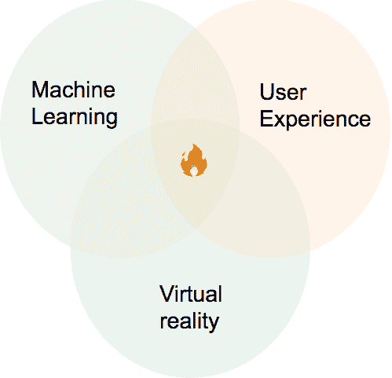
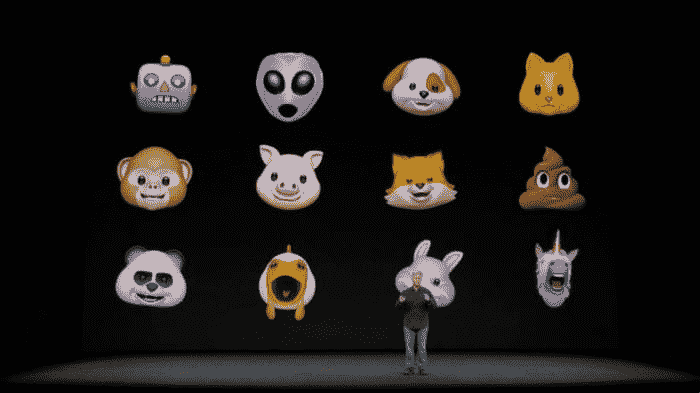

# 使用 ML 新建 UX(用于游戏)

> 原文：<https://dev.to/senior_sigan/ux-ml-55c>

> TL；dr；ML 创造了虚拟现实能够感受我们的方式。通过 VR/AR，我们对它的感觉相当好，但她对我们几乎一无所知。UX 的未来是给虚拟现实这些机会。

我们已经有了 t0ml t1，t2ar t3t 4 VR t5t 5 如果最后两个在游戏中做得很清楚，那么可以用 ML 做什么？在那里，所有的电脑视觉，内容的产生，任何东西的预测。新游戏在哪里，ML 在用什么？T8 我建议幻想并想出新的游戏流派或新的管理方式。

[T2】](https://res.cloudinary.com/practicaldev/image/fetch/s--BrkJDijp--/c_limit%2Cf_auto%2Cfl_progressive%2Cq_auto%2Cw_880/https://dev-to-uploads.s3.amazonaws.com/i/3lgbyd7zs7xc9p7jl76u.png)

# t0t 1 的新管理

用键盘、操纵杆或鼠标控制游戏是相当无聊的。这是早在八十年代发明的。将近 40 年过去了(原文如此！从那时起。你和我看了一些精彩的电影，不仅仅是通过神经接口控制思想力量游戏的地方。但是，在家里，不太可能把电极贴在头上，所以暂时搁置这个话题。不过，我们有一个网络摄像头，甚至几个，还有一个麦克风。游戏中不流行使用的两个界面。但现在，2018 年，我们已经掌握了如此多的图像和声音，我们必须利用这一点。开始产生想法。

## t 0t 1 面部表情控制

<figure>

[T2】](https://res.cloudinary.com/practicaldev/image/fetch/s--MlxLrt5Y--/c_limit%2Cf_auto%2Cfl_progressive%2Cq_auto%2Cw_880/https://dev-to-uploads.s3.amazonaws.com/i/mitr6sbjctaqwxtdncvv.png)

<figcaption>Apple анонсировали emoji, повторяющие мимику человека</figcaption>

</figure>

让我们从简单开始。可以为咪咪做普通的丹科润版液。想象一下，苹果幻灯片上的那张笑脸(emoji)正在落下，你也需要时间微笑。当然，看看 emoji，问题是:“一个人到底能描绘出什么？”。冷静点。

[T2】](https://res.cloudinary.com/practicaldev/image/fetch/s--aOgKG4im--/c_limit%2Cf_auto%2Cfl_progressive%2Cq_auto%2Cw_880/https://dev-to-uploads.s3.amazonaws.com/i/bwpkocrg67fuohnsgace.jpeg)

如果你在派对上做这些事，把视频拍成别人的样子，那会很好笑，大家都会记得。谁能更快地换咪咪，更确切地说，电脑能更好地识别谁的咪咪，可以安排比赛。

## t0t 1 人脸方向控制

实际上，拟态是我们游戏的按钮，我们还需要操纵杆或"箭号"的替代品来指示方向。

我最近碰到了一个教室，在那里用面部方向驾驶飞机，张开嘴开枪。还可以实现为头部倾斜几度。

[https://www.youtube.com/embed/cGR30llvamU](https://www.youtube.com/embed/cGR30llvamU)

顺便说一句，这样的游戏，在那里要控制眼睛、脸、嘴，可以用来锻炼专注。如果你分心了，就会失去管理，也会输。有趣的一点，是吗？

# t 0t 1 姿势控制

如果我们有一个足够简单的方法来获取关于一个人的手-脚-头所在空间位置的信息，那么显然可以做各种运动游戏、舞蹈、网球。据我所知，已经有了，但他们使用的是特殊的 T0 设备。这个想法是，根据相机数据，这是自动魔法发生的。这甚至可以在智能手机上运行。

自然，有关于身体分割、视频定位姿势的研究。并且已经有了成功的实施，您可以自己看看:t0 t1

*   t0os vos:one-shot 视频对象 segmentation t1-视频中的整块体分割，parkur 6 所有事务。
*   t0realtime _ multi-Person _ pose _ estimation _ t1 _ 更有趣的是，这里建了一个人的骨架。例子显示，就像在跳舞的人身上。

## t0t 1 语音控制

至少，要用语音发出命令的应用程序会很好玩。请想象一下出租车司机控制应用程序: "左转，不是那边，而是这边，快些"，或者指挥军队。顺便提一下，在“No game，no life”t1 系列中，主角们下象棋，给人物下命令，而由于他们的决心和说服力，人物们决定是否去。我想，通过构建情感和意图识别模型，可以得到一个反应我们情感的游戏。科技论文 T2 可以找到 T3。

## t0t 1 MMORPG 游戏中的增强现实

这种技术已经濒临幻境，即使是动画也在使用这种技术，并于 2017 年发布，名为《世界在线》，《世界空间》T1。在这里，人们戴着特殊的“眼镜”，用它们来补充现实，在 MMORPG 中玩！但这太棒了，怎么办？事情很简单(不)。

为此，您将需要:一个图像分割模型，以便在其上突出显示一个人；根据 2D 图像或视频构建 3D mesh 曲面的模型；服装或部分三维曲面的替换算法；通过增强现实眼镜输出到将在人或任何其他物体之上看到的面具眼睛上。Profit！你在增强的现实中做了世界上第一个 MMORPG，人们穿着盔甲跑步。我估计，至少 mesh 计算和掩模应用将很快准备好，T0 已经有 T1 条了。现在，带着眼镜，我们得请 Google 拿出一个新样品。

# t0t 1 输出

我们对应用 ML 来创造新的管理方式的所有思考并不完全是可笑或愚蠢的。我们用这些新方法解决了下一个 VR 和 AR 问题——我们正在改善一个人进入虚拟现实的方式。到目前为止，VR/AR 这只是 3D 眼镜，GPS，眼镜是特制的。但是，输入和与虚拟现实交互的方法基本上还是一样的:键盘和鼠标，达特拉斯克。这是什么意思？而我们可以通过眼镜、听到它、甚至通过例如操纵杆的振动来感受虚拟现实，那么除了通过按钮，虚拟本身在我们之前是无法触摸的。我们需要一些方法，我们也能赋予它一些能力:理解我们站在哪里，看哪里，我们有什么表情，我们有什么声音，我们有多少决心，我们如何前进。而且最棒的是，我们现在就可以开始这样做了。而且我认为，在这后面，UX 的未来。

...

这篇文章的部分内容是在 it 周六的节目上介绍的。

[https://www.youtube.com/embed/nSZWvW8SALk](https://www.youtube.com/embed/nSZWvW8SALk)

T0 演示文稿幻灯片。t1￥1