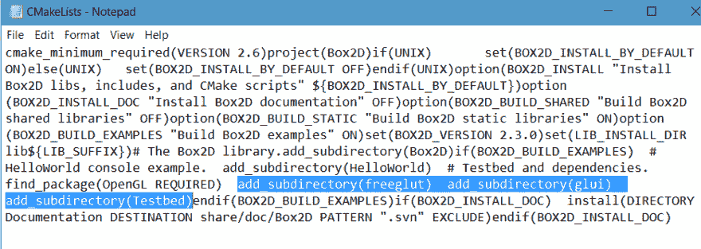
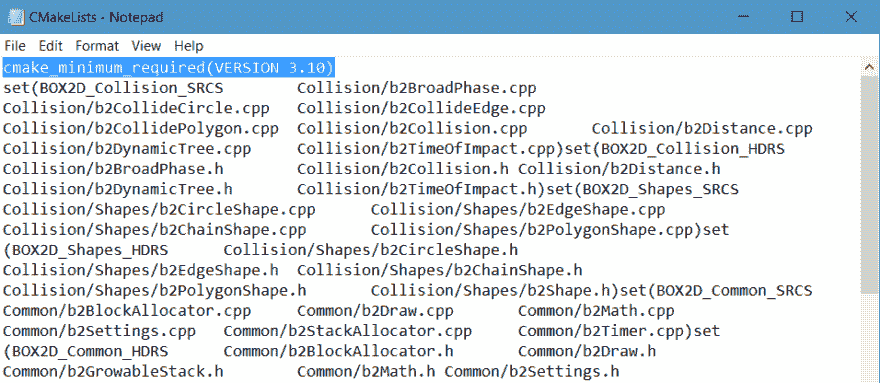
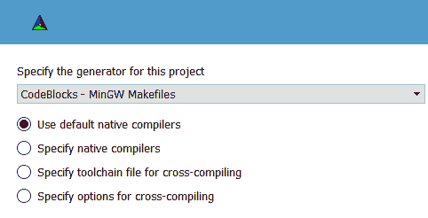
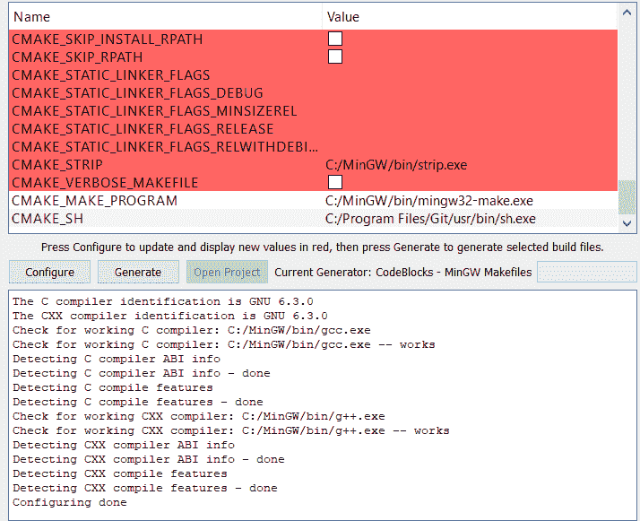

# 使用 mingw 和 cmake 从源代码为代码块编译 Box2D

> 原文：<https://dev.to/mutatedbread/compiling-box2d-from-source-for-codeblock-using-mingw-and-cmake-2a2e>

# 编译 Box2D 静态库

## 1。拿调味汁

从 [github 链接](https://github.com/erincatto/Box2D/releases)获取最新的 Box2D 版本作为 zip 格式。

解压后放入任何你喜欢的目录。

## 2。修改一些东西

打开`Box2D > CMakeLists.txt`，如下图:

[T2】](https://res.cloudinary.com/practicaldev/image/fetch/s--DGHlQvWa--/c_limit%2Cf_auto%2Cfl_progressive%2Cq_auto%2Cw_880/https://thepracticaldev.s3.amazonaws.com/i/c3rz31whs2ofso7wnlg2.png)

然后将包括 glui、freeglut 和 test bed 在内的这几行代码删除到编译中，这样就不需要添加它们了，如下所示:

[T2】](https://res.cloudinary.com/practicaldev/image/fetch/s--k_S-pXOh--/c_limit%2Cf_auto%2Cfl_progressive%2Cq_auto%2Cw_880/https://thepracticaldev.s3.amazonaws.com/i/kh1aojgmi3smei7v3chw.png)

那就省省吧。

然后转到`Box2D > Box2D > CMakeLists.txt`，在上面加上这一行:

```
cmake_minimum_required(VERSION 3.10) 
```

Enter fullscreen mode Exit fullscreen mode

您也可以更改您的 cmake 版本。

[T2】](https://res.cloudinary.com/practicaldev/image/fetch/s--9B6Le7q6--/c_limit%2Cf_auto%2Cfl_progressive%2Cq_auto%2Cw_880/https://thepracticaldev.s3.amazonaws.com/i/rs6seikk3dmh4l0i21tv.png)

## 3。配置 Cmake 并生成

打开 cmake-gui，按照您的 box2d 目录设置源和目标路径:
[](https://res.cloudinary.com/practicaldev/image/fetch/s--o10kJq0D--/c_limit%2Cf_auto%2Cfl_progressive%2Cq_auto%2Cw_880/https://thepracticaldev.s3.amazonaws.com/i/kco68mfmde3vyi2eu0nn.png)

然后，点击`Configure`。

选择`CodeBlocks - MinGW Makefiles`。
[](https://res.cloudinary.com/practicaldev/image/fetch/s--Bf8YeOsh--/c_limit%2Cf_auto%2Cfl_progressive%2Cq_auto%2Cw_880/https://thepracticaldev.s3.amazonaws.com/i/pvchism2n0iq5d0xhdgm.png)

点击 ok，然后你可能会看到这样的内容和一些错误:
[](https://res.cloudinary.com/practicaldev/image/fetch/s--Yt7JCLZd--/c_limit%2Cf_auto%2Cfl_progressive%2Cq_auto%2Cw_880/https://thepracticaldev.s3.amazonaws.com/i/taf1bbjhzpms0bczvo0o.png)

忽略它们，再次点击`Configure`即可。您应该看到它像这样完成配置:

[T2】](https://res.cloudinary.com/practicaldev/image/fetch/s--IxZAKhcv--/c_limit%2Cf_auto%2Cfl_progressive%2Cq_auto%2Cw_880/https://thepracticaldev.s3.amazonaws.com/i/xkisups4q28lg8vtjd88.png)

如果完成了，就点击那里的`Generate`。一个`Generating done`将被注销。

## 4。收集

然后转到`Box2D > Build`，

在那里生成一个终端并运行`mingw32-make`

[T2】](https://res.cloudinary.com/practicaldev/image/fetch/s---KkHRQEN--/c_limit%2Cf_auto%2Cfl_progressive%2Cq_auto%2Cw_880/https://thepracticaldev.s3.amazonaws.com/i/yno00e2ah6tt5unhle9y.png)

等到它运行完毕。

然后转到`Box2D > Build > Box2D`，你会在那里找到`libBox2D.a`，如下图:

[T2】](https://res.cloudinary.com/practicaldev/image/fetch/s--nLOhgC47--/c_limit%2Cf_auto%2Cfl_progressive%2Cq_auto%2Cw_880/https://thepracticaldev.s3.amazonaws.com/i/ys7yeubjqtcg0gcwny81.png)

## 5。与代码块一起使用

1.  将`libBox2D.a`放入`MinGW > lib`中。
2.  将`Box2D > Box2D`、`root Box2D directory`中的`Box2D folder`复制成‘mingw>include’。
3.  然后在代码块中，打开`Settings > Compiler > Linker Settings > Add Library`并选择`MinGW > lib > libBox2D.a`。

## 6。设置完成:)

测试一下，这是我大学课程[要点](https://gist.github.com/MutatedBread/3b88095b334d8fdd1fce5c5a4b5c2011)中的一个测试 cpp。

## 7。我为什么要这么做

我只是试着挑战自己去编译它，而不是按照说明去做。

## 8。测试？

我用 uni 提供的 cpp 和 sfml 测试了编译后的库，不知何故它没有 glui 和 freeglut。

```
 ¯\_(ツ)_/¯ 
```

Enter fullscreen mode Exit fullscreen mode