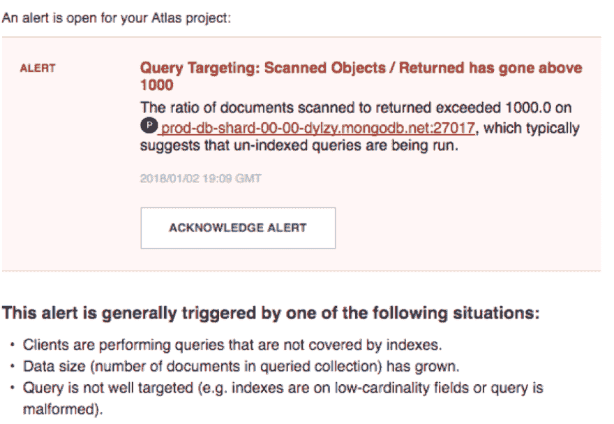
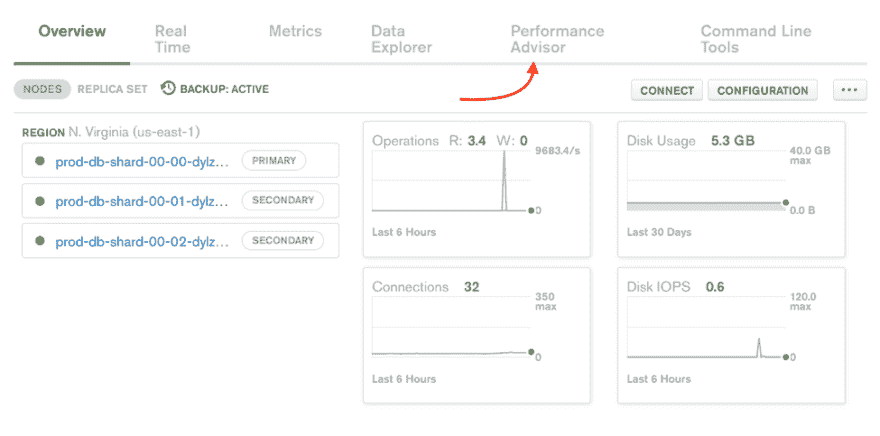
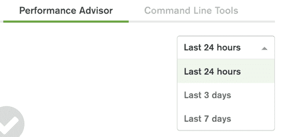
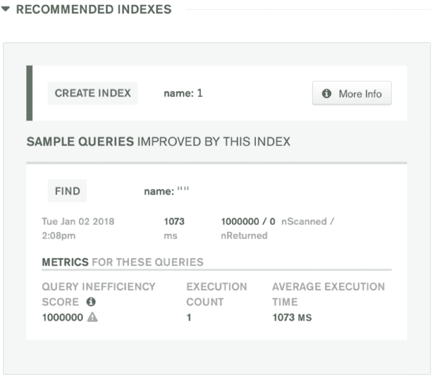
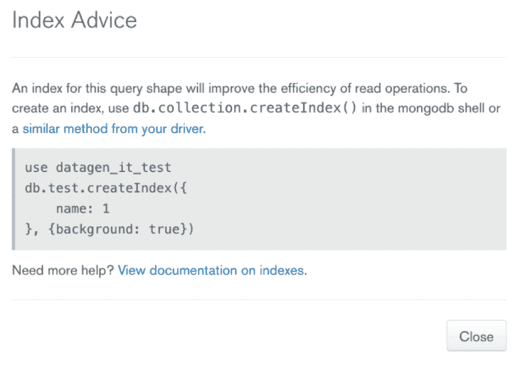
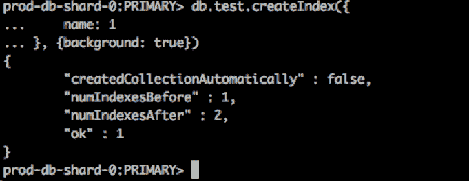

# 使用自动生成的索引建议提高 MongoDB 性能

> 原文:[https://dev . to/MongoDB/improving-MongoDB-performance-with-automatically-generated-index-suggestions-3fe 1](https://dev.to/mongodb/improving-mongodb-performance-with-automatically-generated-index-suggestions-3fe1)

除了良好的数据建模，负责优化查询性能的团队还可以利用一些流程:在日志中寻找 [COLLSCANS](https://docs.mongodb.com/manual/reference/explain-results/#collection-scan-vs-index-use) ，分析[解释结果](https://docs.mongodb.com/manual/reference/explain-results/)，或者依靠第三方工具。虽然这些努力可以帮助您解决您注意到的一些问题，但它们通常需要挖掘文档、时间和金钱，而您的应用程序始终会因问题而陷入困境。

MongoDB Atlas，[完全托管的数据库服务](https://www.mongodb.com/cloud/atlas)，通过为您提供确保尽可能高效地访问您的数据的工具，帮助您更轻松地解决性能问题。这篇文章将提供如何访问 MongoDB Atlas Performance Advisor 的基本概述，这是一个在长达两周的时间内审查您的查询并在适当的时候提供推荐索引的工具。

### 入门

这个简短的教程利用了以下内容:

*   用`mgodatagen`生成的演示数据集
*   一个专用的 MongoDB Atlas 集群(性能顾问可用于 M10 或更大版本)
*   MongoDB shell 安装(创建索引)

我的数据库有两百万个文档，分两个独立的集合:

[T2】](https://res.cloudinary.com/practicaldev/image/fetch/s--5W3yaRuv--/c_limit%2Cf_auto%2Cfl_progressive%2Cq_auto%2Cw_880/https://webassets.mongodb.com/_com_assets/cms/IndexSuggestions1-toupcbun4k.png)

如果应用程序试图在没有正确索引的情况下访问这些文档，将会进行一次*集合*扫描。数据库将*扫描*整个集合以找到所需的文档，任何不在内存中的文档都将从磁盘中读取。这可能会显著降低性能，并导致应用程序的响应速度比预期的慢。

举个例子，当我试图对我的集合运行一个无索引的查询时，MongoDB Atlas 会自动创建一个警告，指出这个查询没有很好地定位。

[T2】](https://res.cloudinary.com/practicaldev/image/fetch/s--SWH9_WG0--/c_limit%2Cf_auto%2Cfl_progressive%2Cq_auto%2Cw_880/https://webassets.mongodb.com/_com_assets/cms/IndexSuggestions2-2dkp5h1lc3.png)

### 查看性能顾问

性能顾问监视运行缓慢的查询(任何执行时间超过 100 毫秒的查询)，并建议新的索引来提高查询性能。

要访问此工具，请转到您的 Atlas 控制面板，然后单击您的集群的名称。然后你会发现“性能顾问”在顶部。

[T2】](https://res.cloudinary.com/practicaldev/image/fetch/s--ysW1T8Sn--/c_limit%2Cf_auto%2Cfl_progressive%2Cq_auto%2Cw_880/https://webassets.mongodb.com/_com_assets/cms/IndexSuggestions3-un65388oee.png)

单击该链接，您将被带到一个页面，在该页面中，您将根据页面顶部的固定时间段看到任何相关的索引建议。

[T2】](https://res.cloudinary.com/practicaldev/image/fetch/s--AJ_cnZ5J--/c_limit%2Cf_auto%2Cfl_progressive%2Cq_auto%2Cw_880/https://webassets.mongodb.com/_com_assets/cms/IndexSuggestionsPerformanceAdvisor-kp4t26h5jl.png)

在本例中，我将回顾过去 24 小时的查询性能。性能顾问为我提供了一些关于如何提高慢速查询速度的建议:

[T2】](https://res.cloudinary.com/practicaldev/image/fetch/s--rE9IjwSG--/c_limit%2Cf_auto%2Cfl_progressive%2Cq_auto%2Cw_880/https://webassets.mongodb.com/_com_assets/cms/IndexSuggestions5-obxb1jxsgj.png)

看起来带有字段“name”的*测试*集合可以使用一个索引。我们可以通过单击“更多信息”按钮来查看要进行的具体更改。

[T2】](https://res.cloudinary.com/practicaldev/image/fetch/s--jjtbElBm--/c_limit%2Cf_auto%2Cfl_progressive%2Cq_auto%2Cw_880/https://webassets.mongodb.com/_com_assets/cms/IndexSuggestions6-km3sxp7ogc.png)

我可以复制这个推荐的内容，并将其粘贴到我的 MongoDB Shell 中，以创建推荐的索引。您会注意到 createIndex 命令传递了一个特殊的选项{ background: true }。使用此命令可以确保索引创建不会阻止任何操作。如果您正在生产系统上构建新的索引，我强烈建议您阅读更多关于[索引构建操作](https://docs.mongodb.com/manual/core/index-creation/)的内容。

[T2】](https://res.cloudinary.com/practicaldev/image/fetch/s--ikfc-E9w--/c_limit%2Cf_auto%2Cfl_progressive%2Cq_auto%2Cw_880/https://webassets.mongodb.com/_com_assets/cms/IndexSuggestions7-eb07if9yx3.png)

既然已经创建了推荐的索引，我就可以检查我的应用程序的性能，看看它是否满足我的用户的要求。我之前收到的 Atlas 警报已经解决，这是一个好现象:

[T2】](https://res.cloudinary.com/practicaldev/image/fetch/s--ba6EpTGa--/c_limit%2Cf_auto%2Cfl_progressive%2Cq_auto%2Cw_880/https://webassets.mongodb.com/_com_assets/cms/IndexSuggestions8-zg98hcyr6p.png)

未编制索引的查询带来的明显性能下降会损害应用程序的用户体验，这可能会导致参与度降低或客户流失。MongoDB Atlas 中的 Performance Advisor 为您提供了一种简单且经济高效的方法，以确保您充分利用已配置的资源。

首先，[注册 MongoDB Atlas 并在几分钟内部署一个集群](https://www.mongodb.com/cloud/atlas)。