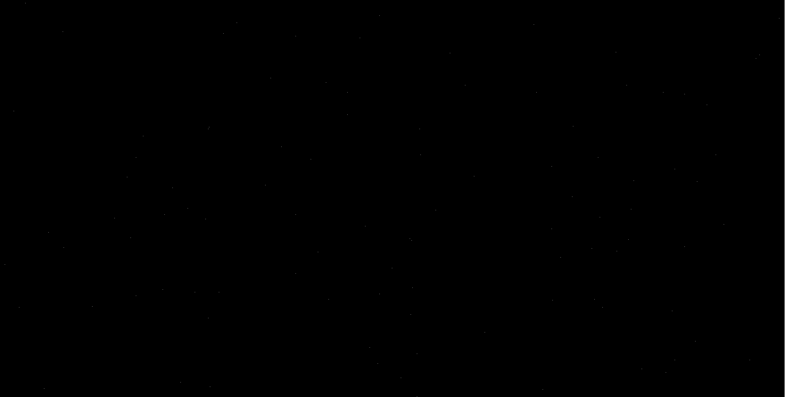
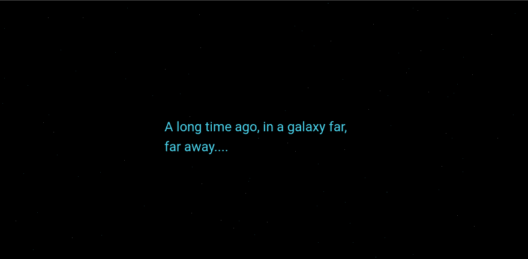
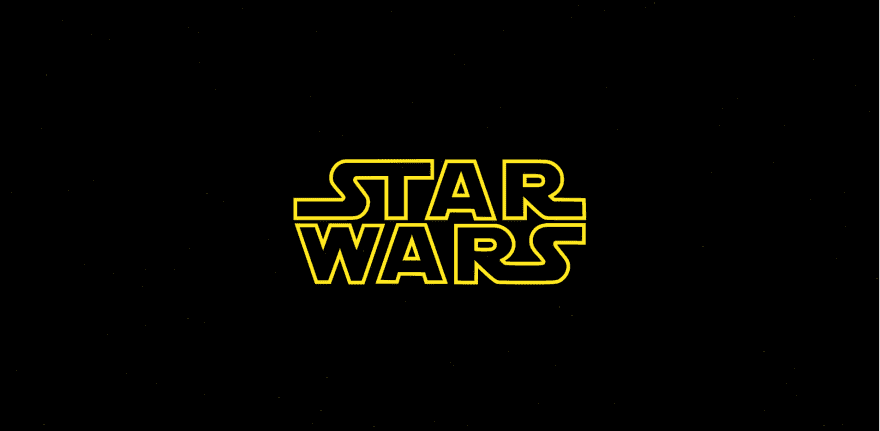
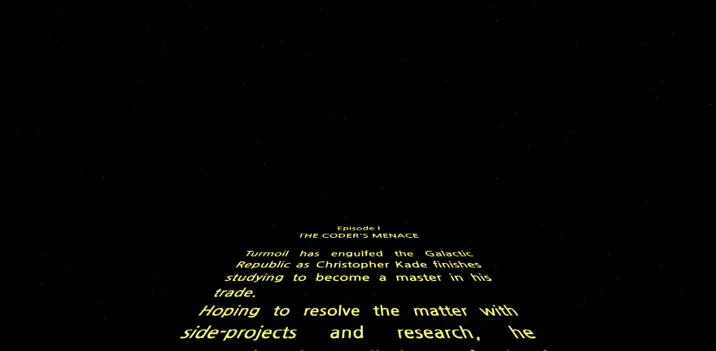

# 用 HTML/CSS 开发星球大战开场爬行

> 原文:[https://dev . to/Christopher kade/developing-the-star-wars-opening-crawl-in-html CSS-2j9e](https://dev.to/christopherkade/developing-the-star-wars-opening-crawl-in-htmlcss-2j9e)

尽管《星球大战:最后的绝地武士》是一部有争议的电影(我保证这不是本文的重点)，但它启发我开发了最无用的东西:该系列著名的开场爬行仅使用 HTML、CSS 和一点点 Javascript(但出于一个很酷的原因)。

爬行包含 5 个基本要素:

*   背景
*   介绍短语
*   标志
*   正文
*   音乐

我将简单地通过必要的步骤，从建立每个元素到一些最后的润色，如添加约翰·威廉姆斯著名的轨道。

# 第一步:创建背景

让我们做一些比添加空间图片更有创意的事情。让我们随机生成星星！

JS:

```
// Sets the number of stars we wish to display
const numStars = 100;

// For every star we want to display
for (let i = 0; i < numStars; i++) {
  let star = document.createElement("div");  
  star.className = "star";
  var xy = getRandomPosition();
  star.style.top = xy[0] + 'px';
  star.style.left = xy[1] + 'px';
  document.body.append(star);
}

// Gets random x, y values based on the size of the container
function getRandomPosition() {  
  var y = window.innerWidth;
  var x = window.innerHeight;
  var randomX = Math.floor(Math.random()*x);
  var randomY = Math.floor(Math.random()*y);
  return [randomX,randomY];
} 
```

<svg width="20px" height="20px" viewBox="0 0 24 24" class="highlight-action crayons-icon highlight-action--fullscreen-on"><title>Enter fullscreen mode</title></svg> <svg width="20px" height="20px" viewBox="0 0 24 24" class="highlight-action crayons-icon highlight-action--fullscreen-off"><title>Exit fullscreen mode</title></svg>

CSS:

```
body {
  margin: 0;
  background-color: black;
}

.star {
  position: absolute;
  width: 1px;
  height: 1px;
  background-color: white;
} 
```

<svg width="20px" height="20px" viewBox="0 0 24 24" class="highlight-action crayons-icon highlight-action--fullscreen-on"><title>Enter fullscreen mode</title></svg> <svg width="20px" height="20px" viewBox="0 0 24 24" class="highlight-action crayons-icon highlight-action--fullscreen-off"><title>Exit fullscreen mode</title></svg>

**Tada！**我们现在有了一个漂亮的背景来显示爬行。

它看起来像这样(注意，这张图片上的星星很难看到，因为它们只有一个像素宽，但一旦你实际实现它们，它们会看起来很好，我向你保证):

[T2】](https://res.cloudinary.com/practicaldev/image/fetch/s--JUDOxQH3--/c_limit%2Cf_auto%2Cfl_progressive%2Cq_auto%2Cw_880/https://user-images.githubusercontent.com/15229355/34257748-c9afcda8-e663-11e7-8b3b-c9a0e0bd9119.png)

# 第二步:添加著名的介绍短语

> 很久以前，在一个遥远的星系里....

这句话大家有生之年都已经听过、看过或者小声说过了，那就补充一下吧(附带必要效果)。

HTML:

```
...

<section class="intro">
  A long time ago, in a galaxy far,<br> far away....
</section> 
```

<svg width="20px" height="20px" viewBox="0 0 24 24" class="highlight-action crayons-icon highlight-action--fullscreen-on"><title>Enter fullscreen mode</title></svg> <svg width="20px" height="20px" viewBox="0 0 24 24" class="highlight-action crayons-icon highlight-action--fullscreen-off"><title>Exit fullscreen mode</title></svg>

CSS:

```
...

/* Center it, set the color, size and hide the text */
.intro {
    position: absolute;
    top: 45%;
    left: 50%;
    z-index: 1;
    animation: intro 6s ease-out 1s;
    color: rgb(75, 213, 238);
    font-weight: 400;
    font-size: 300%;
    opacity: 0;
}

@keyframes intro {
    0% {
        opacity: 0;
    }
    20% {
        opacity: 1;
    }
    90% {
        opacity: 1;
    }
    100% {
        opacity: 0;
    }
} 
```

<svg width="20px" height="20px" viewBox="0 0 24 24" class="highlight-action crayons-icon highlight-action--fullscreen-on"><title>Enter fullscreen mode</title></svg> <svg width="20px" height="20px" viewBox="0 0 24 24" class="highlight-action crayons-icon highlight-action--fullscreen-off"><title>Exit fullscreen mode</title></svg>

结果:

[T2】](https://res.cloudinary.com/practicaldev/image/fetch/s--F7_QUJ8i--/c_limit%2Cf_auto%2Cfl_progressive%2Cq_auto%2Cw_880/https://user-images.githubusercontent.com/15229355/34257979-c9982382-e664-11e7-8453-8ed19a800c4c.png)

# 第三步:显示标志

这个标志是至关重要的开幕序列，这里是我如何添加它。

HTML:

```
...

<section class="logo">
    <!-- SVG GOES HERE -->
</section> 
```

<svg width="20px" height="20px" viewBox="0 0 24 24" class="highlight-action crayons-icon highlight-action--fullscreen-on"><title>Enter fullscreen mode</title></svg> <svg width="20px" height="20px" viewBox="0 0 24 24" class="highlight-action crayons-icon highlight-action--fullscreen-off"><title>Exit fullscreen mode</title></svg>

`SVG`是一个很长的文件，我已经把它上传到[这里](https://gist.github.com/christopherkade/97fd94f20c3a4ffddfa5aba46261082f)供你复制粘贴。

CSS:

```
...

/* Set the animation & hide the logo */
.logo {    
    position: absolute;
    top: 20%;
    left: 45%;
    z-index: 1;
    margin: auto;
    animation: logo 9s ease-out 9s;
    opacity: 0;
}

.logo svg {
    width: inherit;
}

/* Scale the logo down and maintain it centered */
@keyframes logo {
    0% {
        width: 18em;        
        transform: scale(2.75);
        opacity: 1;
    }
    50% {
        opacity: 1;
        width: 18em;      
    }
    100% {
        opacity: 0;
        transform: scale(0.1);
        width: 18em;        
    }
} 
```

<svg width="20px" height="20px" viewBox="0 0 24 24" class="highlight-action crayons-icon highlight-action--fullscreen-on"><title>Enter fullscreen mode</title></svg> <svg width="20px" height="20px" viewBox="0 0 24 24" class="highlight-action crayons-icon highlight-action--fullscreen-off"><title>Exit fullscreen mode</title></svg>

这就是我们美丽的动画标志:

[T2】](https://res.cloudinary.com/practicaldev/image/fetch/s--qwxQFHi3--/c_limit%2Cf_auto%2Cfl_progressive%2Cq_auto%2Cw_880/https://user-images.githubusercontent.com/15229355/34258253-ced4043c-e665-11e7-9393-3fe729f29a57.png)

# 第四步:添加滚动文本

这可能是爬行中最重要的部分，但实现起来相当容易。

HTML:

```
...

<!-- Change the text to your liking -->
<div id="board">  
  <div id="content">
    <p id="title">Episode I</p>
    <p id="subtitle">THE CODER'S MENACE</p>
    <br>
    <p>Turmoil has engulfed the Galactic Republic as Christopher Kade finishes studying to become a master in his trade.</p>    
    <!-- Add as many paragraphs as you want -->
    <!-- And make it cheesy ! -->
  </div>  
</div> 
```

<svg width="20px" height="20px" viewBox="0 0 24 24" class="highlight-action crayons-icon highlight-action--fullscreen-on"><title>Enter fullscreen mode</title></svg> <svg width="20px" height="20px" viewBox="0 0 24 24" class="highlight-action crayons-icon highlight-action--fullscreen-off"><title>Exit fullscreen mode</title></svg>

CSS:

```
...

p {
  color: #FFFF82;
}

/* Set the font, lean the board, position it */
#board {
  font-family: Century Gothic, CenturyGothic, AppleGothic, sans-serif;
  transform: perspective(300px) rotateX(25deg);
  transform-origin: 50% 100%;
  text-align: justify;
  position: absolute;
  margin-left: -9em;
  font-weight: bold;
  overflow: hidden;
  font-size: 350%;
  height: 50em;
  width: 18em;
  bottom: 0;
  left: 50%;
}

#board:after {
  position: absolute;
  content: ' ';
  bottom: 60%;
  left: 0;
  right: 0;
  top: 0;
}

/* Set the scrolling animation and position it */
#content {
  animation: scroll 100s linear 16s;
  position: absolute;
  top: 100%;
}

#title, #subtitle {
  text-align: center;
}

@keyframes scroll {
    0% {
        top: 100%;
    }
    100% {
        top: -170%;
    }
} 
```

<svg width="20px" height="20px" viewBox="0 0 24 24" class="highlight-action crayons-icon highlight-action--fullscreen-on"><title>Enter fullscreen mode</title></svg> <svg width="20px" height="20px" viewBox="0 0 24 24" class="highlight-action crayons-icon highlight-action--fullscreen-off"><title>Exit fullscreen mode</title></svg>

我们走吧！

[T2】](https://res.cloudinary.com/practicaldev/image/fetch/s--z_EIOLiE--/c_limit%2Cf_auto%2Cfl_progressive%2Cq_auto%2Cw_880/https://user-images.githubusercontent.com/15229355/34258462-bafd09a8-e666-11e7-8002-72b1ad71d343.png)

# 最后一击:音乐

如果没有音乐,《星球大战》会是什么样子？

既然我们已经提前给我们的动画计时了，那应该是小菜一碟！

首先，下载 `.mp3`之后的[文件，并将其添加到项目的资产中。](https://s.cdpn.io/1202/Star_Wars_original_opening_crawl_1977.mp3)

然后，在我们的 HTML 文件中添加:

```
<audio preload="auto" autoplay>
  <source src="@/assets/audio/Star_Wars_original_opening_crawl_1977.mp3" type="audio/mpeg">
</audio> 
```

<svg width="20px" height="20px" viewBox="0 0 24 24" class="highlight-action crayons-icon highlight-action--fullscreen-on"><title>Enter fullscreen mode</title></svg> <svg width="20px" height="20px" viewBox="0 0 24 24" class="highlight-action crayons-icon highlight-action--fullscreen-off"><title>Exit fullscreen mode</title></svg>

它会在页面加载时预加载音乐并自动播放。

瞧，一切都应该像预期的那样工作。

# 最后的想法

你可以在这个[码本](https://codepen.io/christopherkade/pen/rJVPjz)上找到成品(不带音乐)。

研究一些随机的东西来探索普通网络技术的可能性总是很有趣的。我希望这对你们中的一些人来说是一个行动的号召，并希望在评论中听到关于它的一切。

感谢阅读，

克里斯托弗·卡德