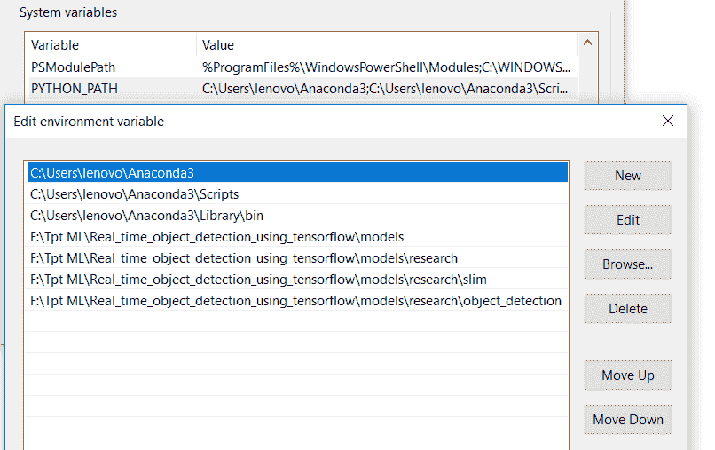
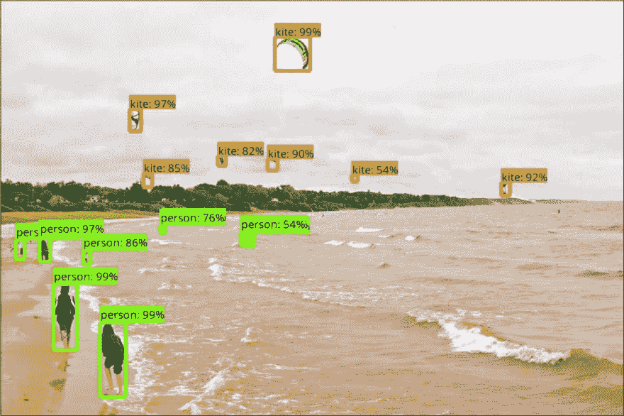
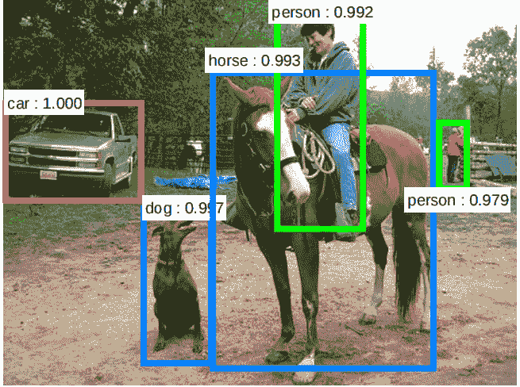

# 如何在 Windows 上使用 TensorFlow 对象检测 API

> 原文:[https://dev . to/rohitpatil 5/how-to-use-tensor flow-object-detection-API-on-windows-21 B4](https://dev.to/rohitpatil5/how-to-use-tensorflow-object-detection-api-on-windows-21b4)

大约在 2017 年 7 月，TensorFlow 的对象检测 API 发布。TensorFlow 对象检测 API 是一个构建在 TensorFlow 之上的开源框架，它使得构建、训练和部署对象检测模型变得非常容易。

这个 API 的巨大之处在于，它不像 YOLO、SSD 等其他型号，你不需要复杂的硬件设置来运行它。

他们发表了一篇题为 [**现代卷积物体探测器**](https://arxiv.org/pdf/1611.10012.pdf) **的速度/精度权衡的论文。**在这里，他们讨论了可用于对象检测的各种架构，如 YOLO、更快的 R-CNN、SSD 和 R-FCN。

这个 API 能够识别许多类型的物体，如汽车、行人、人、风筝、狗等等。你可以在这里找到整个列表[。](https://github.com/tensorflow/models/tree/master/research/object_detection/data)

我已经使用这个 API，在 Udacity 的自动驾驶汽车 nanodegree 项目的 capstone 项目的直播视频流中检测交通信号。在这个项目中，我们必须在道路上运行卡拉(Udacity 的自动驾驶汽车)。

[](https://res.cloudinary.com/practicaldev/image/fetch/s--Yf_EjmWY--/c_limit%2Cf_auto%2Cfl_progressive%2Cq_auto%2Cw_880/https://cdn-images-1.medium.com/max/347/1%2AQWfzSzTFabLWSginzECvDQ.png) 

<figcaption>从模拟器的视频馈送中输出。</figcaption>

让我们开始设置。

1.  克隆[tensor flow-模型库](https://github.com/tensorflow/models)。
2.  主要的 API 文档位于[https://github . com/tensor flow/models/tree/master/research/object _ detection](https://github.com/tensorflow/models/tree/master/research/object_detection)。
3.  Install tensorflow.

```
# For CPU
pip install tensorflow
# For GPU
pip install tensorflow-gpu 
```

1.  安装所有其他依赖项

```
pip install pillow
pip install lxml
pip install jupyter
pip install matplotlib 
```

1.  下载谷歌 Protobuf[https://github.com/google/protobuf](https://github.com/google/protobuf)Windows v 3 . 4 . 0 发布“protoco-3 . 4 . 0-win32 . zip”

2.  将 Protobuf 下载解压缩到程序文件中，特别是

```
C:\Program Files\protoc-3.4.0-win32 
```

1.  现在 cd 进入模型\研究。

```
cd path\to\models\research 
```

1.  执行 protobuf 编译

```
“C:\Program Files\protoc-3.4.0-win32\bin\protoc.exe” object\_detection/protos/\*.proto --python\_out=. 
```

这是安装过程中最重要的一步。

1.  现在导航到 models \ research \ object _ detection \ protos 并验证。编译后成功创建了 py 文件。(只有。原型文件在那里开始)

2.  cd 到\模型\研究\对象 _ 检测。打开 jupyter 笔记本 object _ detection _ tutorial . ipynb，在这里可以玩 API。

#### 你可能会面临的问题:

*   如果您将笔记本移动到任何其他目录，并运行它，您将得到一个错误

```
ModuleNotFoundError: No module named 'utils' 
```

*   这个错误的来源是代码中的这两行。

```
from utils import label\_map\_util
from utils import visualization\_utils as vis\_util 
```

*   这个错误是因为我们还没有通知 Python 如何找到这些行使用的 utils 目录。

#### 问题解决:

*   转到系统->高级系统设置->环境变量->新建，添加一个名为 PYTHON_PATH 的变量，值如下:

[T2】](https://res.cloudinary.com/practicaldev/image/fetch/s--5L12vPfz--/c_limit%2Cf_auto%2Cfl_progressive%2Cq_auto%2Cw_880/https://cdn-images-1.medium.com/max/806/1%2ASKX64WwYgCYKXToHPZusXg.png)

*   在系统变量中，编辑路径并添加%PYTHON_PATH%。
*   您将需要重新启动系统，然后您可以在系统的任何地方自由使用此代码。

#### 点输出样本

[T2】](https://res.cloudinary.com/practicaldev/image/fetch/s--sHhEDB8b--/c_limit%2Cf_auto%2Cfl_progressive%2Cq_auto%2Cw_880/https://cdn-images-1.medium.com/max/1000/1%2Al33kFqOZt7ti98kAKLwadQ.jpeg)

[T2】](https://res.cloudinary.com/practicaldev/image/fetch/s--_VowbTiN--/c_limit%2Cf_auto%2Cfl_progressive%2Cq_auto%2Cw_880/https://cdn-images-1.medium.com/max/655/1%2A62JsN-0BZ2rl1QdhNLSN8A.png)

为了试验这个 API，我使用了我的网络摄像头和手机摄像头。我使用了 [IP 网络摄像头 Android 应用](https://play.google.com/store/apps/details?id=com.pas.webcam&hl=en)来连接手机摄像头。您可以签出存储库。

[rohts-Patil/tensor flow-Object-Detection-API-On-Live-Video-Feed](https://github.com/rohts-patil/TensorFlow-Object-Detection-API-On-Live-Video-Feed)

感谢您的阅读。你可以在 Twitter @Rohitpatil5 上找到我，或者在 [LinkedIn 上联系我。](https://www.linkedin.com/in/rohitrpatil/)