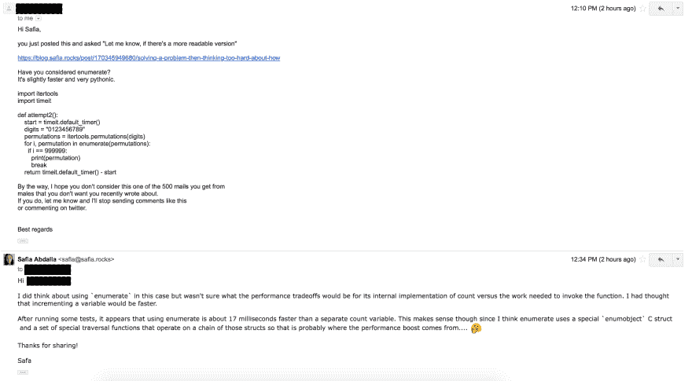

# 解决一个问题，然后努力思考你是如何解决这个问题的

> 原文:[https://dev . to/captainsafia/solving-a problem-then-thinking-too-hard-about-how-you-solving-the-problem-2i6j](https://dev.to/captainsafia/solving-a-problem-then-thinking-too-hard-about-how-you-solved-the-problem-2i6j)

又是一个周三，又是一篇博文！

今天，我要做一个项目欧拉问题。必须保持这些解决问题的技巧！明白我的意思吗？

在我的[上一篇博文](https://dev.to/captainsafia/problem-solving-with-safia-the-optimizersdilemma-1342-temp-slug-6341914)中，我完成了第 23 次挑战。所以今天，是时候解决第 24 个[问题](https://projecteuler.net/problem=24)了。问题的正文如下。

> 排列是对象的有序排列。例如，3124 是数字 1、2、3 和 4 的一种可能的排列。如果所有的排列都按数字或字母顺序排列，我们称之为字典序。0、1 和 2 的字典排列是:
> 
> 012 021 102 120 201 210
> 
> 数字 0、1、2、3、4、5、6、7、8 和 9 的第一百万个字典排列是什么？

因此，正如我在以前的帖子中提到的，我对这类事情(以及许多其他事情)的解决策略只是实现解决问题的最简单的事情。我不是在想性能或者优雅什么的。我只是在完成它！无论如何，在这种情况下，完成它看起来像这样。

```
import itertools
digits = "0123456789"
permutations = list(itertools.permutations(digits))
print(permutations[999999]) 
```

那么，挑战的答案是什么？！！？

```
> ('2', '7', '8', '3', '9', '1', '5', '4', '6', '0') 
```

事实证明，这才是正确的反应！

不过，还有一件事。尽管这种解决方案运行速度很快，并产生正确的输出，但它占用了大量空间。所以，这就是原因。`itertools.permutations`函数返回一个迭代器。这是一个 Python 对象，它逐个计算并返回存储在其中的值。当我在迭代器上调用`list`时，我要求它重复调用 next 并将所有结果保存在一个列表中。如果我想做一些涉及存储所有数字排列的操作，这是有意义的，但我没有。因此，更省时、更省空间(并且正确)的解决方案实现如下。

```
import itertools
digits = "0123456789"
permutations = itertools.permutations(digits)
i = 0
for permutation in permutations:
  if i == 999999:
    print(permutation)
    break
  i += 1 
```

它稍微有点儿冗长。可能有办法减少这种冗长，但我认为我在这里写的是好的。让我知道你是否能想出一些不那么冗长，但仍然容易理解的东西！

旁注:这总是一个警告，不是吗？“容易理解”的部分。这是我离开“聪明代码”阶段很久的一个重要原因。

现在，如果它在这里结束，这将是一个相当无聊的博客帖子。但是我想谈谈我上面提供的“最简单的可能的解决方案”。

当我大约 14 岁的时候，我开始研究欧拉项目问题。我做了 20 多个才停下来。那时，我的解决方案使用了很多基本的编程概念，比如迭代和列表构建。几年后，我可以更好地利用 Python 标准库来解决这些问题，而不是将这些想法作为我解决某些问题的首选方案。

为此我很自豪。

这可能看起来很微妙，没什么大不了的，但对我来说，这种转变代表了专业知识和智力资本的积累。我认为成为一名优秀的程序员(或者成为一名优秀的做事的人)的很大一部分是在你利用最少的努力时不断推动你所能产生的东西。当你为自己投入很少的智力时，你创造的东西有多好？在利用脑力方面，你能变得多有效率？

我不会假装是第一个得到这个启示的人。如果说工业时代代表了人类有效利用和分配机械能的努力，那么信息时代则代表了我们更有效地利用和分配智力能的努力。

也就是说，如果我要描述对我更有效地分配智力来解决技术问题的能力贡献最大的事情，那将是下面这些:

1.  先验知识。站在巨人的肩上。集体智慧。你抓住钻头。
2.  练习。模式识别。多练习。养成习惯。
3.  通过经验获得的远见。

第一点已经被历史上许多人所认识和归因。我们推动知识进步的能力依赖于我们利用前人创造的大量知识的能力。无论您是使用开源软件的软件工程师，还是使用他人证明的公理的数学家，查看任何领域的现有工作并适当利用它的能力都是非凡的。

第二点也得到了认可。我做得越多，我的大脑就越能更好地自动化其中“无聊”的部分。我承认，在很大程度上，很多编程任务对我来说相当枯燥。这并不是因为我不喜欢编程，而是因为我解决某个特定问题所需的智力能量已经大大减少了。

第三点是我仍在努力的。我正试图达到这样一个点，我可以利用我过去的经验来发展对未来结果的近乎透视的感知。我还没有一个可靠的方法来做到这一点，因为这是我仍在成长的东西(并且可能会在我的余生中继续发展)，但我正在努力。

所以，是的，我认为作为一名软件程序员，我自己的成长经历和学习拓展更少的智力能量来解决问题的经历是人类正在追随的大趋势的一部分。我们越来越擅长用更少的资源做更多的事情。悲观主义者可能会声称，这种趋势会让我们变得懒惰，逃避问题。乐观主义者可能会说，这种趋势将驱使我们接受越来越大的问题来挑战我们的智力。我认为现实可能介于两者之间。

哇！这篇博文在某个时候来了个急转弯，不是吗？这只是展示我的大脑是如何思考问题的！

我保证下一个不会有任何切线…

编辑:有人通过电子邮件向我提出了一个性能稍微好一点的解决方案。这里有一个解决方案的截图，以及我对其原因的简短解释。

[T2】](https://res.cloudinary.com/practicaldev/image/fetch/s--BjiFdSG3--/c_limit%2Cf_auto%2Cfl_progressive%2Cq_auto%2Cw_880/https://cldup.com/mNcHKlGwRD.png)