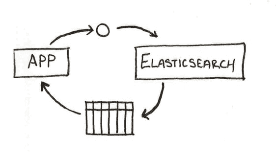
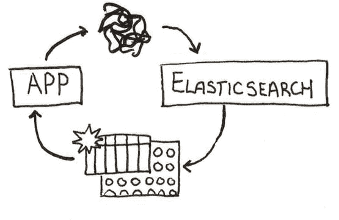
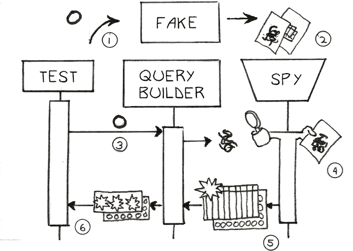
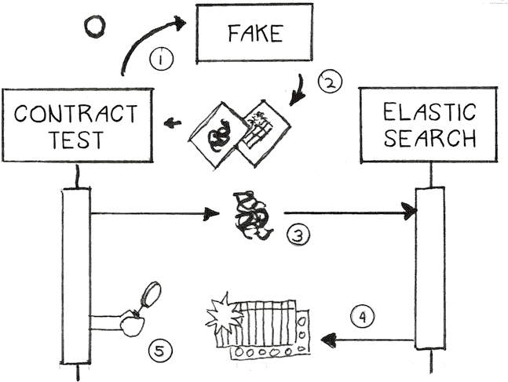

# 嘲讽弹性搜索

> 原文：<https://dev.to/jeffreymfarley/mocking-elasticsearch-5goj>

让我知道这听起来是否熟悉...

### 开始是如此天真无邪...

在阅读了 Elasticsearch 教程后，我很快编写了一段代码，这段代码发送一个简单的字符串并返回大量有用的数据。

[T2】](https://res.cloudinary.com/practicaldev/image/fetch/s--eIiozZ8H--/c_limit%2Cf_auto%2Cfl_progressive%2Cq_auto%2Cw_880/https://thepracticaldev.s3.amazonaws.com/i/ncrw75x5r9ovabfgfggx.png)

### 深入兔子洞

我立刻注意到了“真实”数据的位置。它埋在下面很远的地方。所以我更新了代码块，以便从嘈杂的元数据中提取有用的数组。

随着我继续发展，微妙的搜索差异开始出现，需要加以处理:

*   在用户搜索中处理通配符或特殊符号
*   我用`query_string`还是`match`？
*   `term`对`terms`
*   `must`对`should`

即使找到了正确的搜索，实际应用程序中还有其他功能，比如聚合和突出显示，这会产生更多的概念，比如`post_filter`和`.raw`字段。原本很简单的东西开始变得更像一团毛。

[T2】](https://res.cloudinary.com/practicaldev/image/fetch/s--e2wnkvfC--/c_limit%2Cf_auto%2Cfl_progressive%2Cq_auto%2Cw_880/https://thepracticaldev.s3.amazonaws.com/i/yog892jxrcilz68v85fb.png)

### 我知道了，我会创建一个 QueryBuilder

最终，我想回到最初的简单。最好的做法是创建一个接受一些参数的模块，构建大型查询并处理返回的结果。这是模块化开发的一个好例子，我可以用测试来验证它是否工作正常。

[T2】](https://res.cloudinary.com/practicaldev/image/fetch/s--YPgs7btR--/c_limit%2Cf_auto%2Cfl_progressive%2Cq_auto%2Cw_880/https://thepracticaldev.s3.amazonaws.com/i/qby2wf91avr44imed1n4.png)

现在有一些棘手的问题需要回答:

*   为了测试这段代码，是不是每个开发人员都像我一样访问同一个 Elasticsearch 实例？CI 服务器呢？
*   设置一个测试传递参数给模块(1)很容易，但是如何设置一个 spy at (2)来验证这个毛球呢？
*   在(4)设置断言更糟糕。在急于停止思考这个问题的时候，我可能写了一个类似这样的测试:

```
expect(response.hits.hits).toBeDefined() 
```

这几乎和根本没有测试一样糟糕。说得有点迂腐，这些甚至不是单元测试，这些是系统集成测试。范围太大，不适合实际开发。

### 后退一步

当我第二次或第三次经历这个过程时，我开始思考更好的方法。关键是 CI 服务器。我不希望詹金斯，特拉维斯或 CircleCI 击中一个活生生的例子。就 PII 而言，它可能无论如何都不被允许访问这些数据。我希望有一个看起来像 Elasticsearch，但却是静态和确定性的东西。

戴上函数式编程的帽子，它看起来像这样:

[T2】](https://res.cloudinary.com/practicaldev/image/fetch/s--f8a6hNqD--/c_limit%2Cf_auto%2Cfl_progressive%2Cq_auto%2Cw_880/https://thepracticaldev.s3.amazonaws.com/i/ei6ihup52h1xn0bjzyi3.png)

一组参数(圆圈)产生一对形状，即请求和响应。通过枚举要测试的参数，我可以为每个测试生成一对形状。这是一个很好的理论，但如何付诸实践呢？我需要想出如何:

*   枚举参数集
*   存储请求/响应对
*   捕获伴随每组参数的请求
*   捕捉回应
*   将两人一组装入测试中
*   自动化这一过程
*   检测弹性搜索何时改变

太多了，让我们开始吧:

### 枚举该组参数

如果时间和金钱是无限的，我们可以详尽地测试参数的每一个组合，以确保所有的可能性都包括在内。因为我们不生活在那个现实中，代码覆盖度量是下一个最好的事情。第一步是创建测试，覆盖您感觉舒适的代码百分比。此时不要担心好的断言，我们只是希望确保所有代码路径都被命中。

### 准备存储请求/响应对

我使用下面的目录层次结构来指导每个请求/响应对的位置:

```
+- <API root>
  +- <module>
    +- __mocks__
      +- <index-name>
        +- <endpoint> 
```

| 目录 | 描述 | 例子 |
| --- | --- | --- |
| *API 根* | 应用程序的根。 | 书店 |
| *模块* | 静止端点 | 书籍、订单 |
| `__mocks__` | 我喜欢的一个来自 [Jest](https://facebook.github.io/jest/) 的约定 | - |
| *索引名称* | 弹性搜索指数 | 销售 |
| *终点* | 弹性搜索终点。 | _ 搜索，_ 建议 |

### 创建一个假的来封装行为

定义了目录结构后，我将创建一个隐藏一些血淋淋的细节的类。这应该位于项目的根目录。

```
 class FakeElasticsearch(object):
    def __init__(self,
                 short_name,
                 subdir,
                 index_name,
                 endpoint='_search'):

        self.short_name = short_name
        self.path = os.path.join(
            os.path.dirname(__file__),
            subdir,
            "__mocks__",
            index_name,
            endpoint
        )

    def buildPath(self, suffix):
        return os.path.join(
            self.path, self.short_name + suffix
        )

    def load_request(self):
        fileName = self.buildPath('_req.json')
        with open(fileName, 'r') as f:
            return json.load(f)

    def load_response(self):
        fileName = self.buildPath('_resp.json')
        with open(fileName, 'r') as f:
            return json.load(f)

    def save_request(self, body):
        fileName = self.buildPath('_req.json')
        with open(fileName, 'w') as f:
            return json.dump(f, indent=2) 
```

### 捕获现有请求(方法 1 -服务器端)

下一步是找到调用 Elasticsearch 的代码，并临时插入几行代码来保存请求。

```
 @api_view(['GET'])
def search(request):
    short_name = request.query_params

    ...

    if settings.SAVE_REQUESTS:
        fake = FakeElasticsearch(short_name, 'books', index_name)
        fake.save_request(body)
    resp = es.search(index=index_name, body=body)

    ... 
```

### 捕获现有请求(方法 2 -基于浏览器)

当构建查询并调用 Elasticsearch 的代码在浏览器中运行时，捕捉请求会变得稍微复杂一些。基本上，有几个选择:

1.  使用 developer tools 中的`Network`选项卡手动复制请求对象，并将其粘贴到 JSON 文件中的正确位置。这是一个很好的开始选择，因为它不需要额外的代码，但是很快变得难以处理。

2.  使用 Elasticsearch 的[“慢速日志”](http://www.elasticsearch.org/guide/reference/index-modules/slowlog/)功能来捕获它正在接收的查询。然后搜索日志，将有用的请求保存到 JSON 文件中。

3.  快速创建一个 API 端点，并在那里发布请求。这具有服务器端版本的所有优点，但是会导致额外的开发时间。

### 自动捕捉响应

我让 [`curl`](https://curl.haxx.se/docs/manpage.html) 来做点击 Elasticsearch 实例并捕捉响应的繁重工作。原始响应包含一些在运行之间会有所不同的元数据，比如`took`，所以需要将其剥离。我用的是 [`jq`](https://stedolan.github.io/jq/) ，但是`awk`或者`sed`也可以。

另外，如果你像我一样是一个*nix 初学者，那么构造`${REQ%_req.*}`看起来什么也不做，但是它是 [shell 字符串操作](http://tldp.org/LDP/abs/html/string-manipulation.html)，并且非常容易理解。

```
URL="http://www.example.org:9200"

for REQ in $(find . -name "*_req.json")
do PREFIX="${REQ%_req.*}"
  RESPONSE="$PREFIX"_resp.json
  INDEX="$(echo $PREFIX | cut -d "/" -f4)"
  ENDPOINT="$(echo $PREFIX | cut -d "/" -f5)"

  if [ "$ENDPOINT" = "_suggest" ]
  then JQ_PROCESS="{sgg}"
  else JQ_PROCESS="{hits, aggregations} | with_entries(select(.value != null ))"
  fi echo "Processing $REQ"
  curl $URL/$INDEX/$ENDPOINT?pretty -s -d @$REQ | jq  "$JQ_PROCESS" > $RESPONSE
done 
```

### 载入测试

一旦捕获了请求和响应对，就可以使用[测试假](https://stackoverflow.com/questions/346372/whats-the-difference-between-faking-mocking-and-stubbing)来代替 Elasticsearch，将它们集成到单元测试中。

[T2】](https://res.cloudinary.com/practicaldev/image/fetch/s--Ceex4E5Y--/c_limit%2Cf_auto%2Cfl_progressive%2Cq_auto%2Cw_880/https://thepracticaldev.s3.amazonaws.com/i/vkcr78merxdlb5yinj45.png)

```
 class BookstoreTest(APITestCase):

    ...

    @patch.object(Elasticsearch, 'search')
    def test_authors_search(self, mock_search):
        index_name = 'sales'

        # (1)
        fake = FakeElasticsearch('authors=King', 'books', index_name)

        # (2)
        body = fake.load_request()
        resp = fake.load_response()

        # (5)
        mock_search.return_value = resp

        # (3)
        response = self.client.get(self.end_point, self.baseParams)
        actual = json.loads(response.content)

        self.assertEqual(response.status_code, 200)

        # (4)
        mock_search.assert_called_with(index=index_name, body=body)

        # (6)
        expected = resp['hits']['hits']
        self.assertEqual(expected, actual) 
```

### 检测弹性搜索何时改变

拼图的最后一块来自马丁·福勒，一个[合同测试](https://martinfowler.com/bliki/ContractTest.html)。这个想法是针对一个活动实例测试保存的响应，以确保假设的响应仍然是准确的。如果失败了，也许是时候重新生成请求并修改代码了！

[T2】](https://res.cloudinary.com/practicaldev/image/fetch/s--eIcC8-v---/c_limit%2Cf_auto%2Cfl_progressive%2Cq_auto%2Cw_880/https://thepracticaldev.s3.amazonaws.com/i/ovwedib00khhlrmstwwa.png)

```
from elasticsearch import Elasticsearch
from fake_es import FakeElasticsearch
from nose_parameterized import parameterized

class TestElasticsearchContract(unittest.TestCase):
    @unittest.skipUnless(settings.LIVE_ELASTIC)
    def setUp(self):
        self.client = Elasticsearch([settings.ES_HOST])

    @parameterized.expand([
        ['authors=King', 'sales'],
        ['orders=cancelled', 'sales'],
        ['isbn=99999', 'books'],
    ])
    def test_request_response(self, pair_name, index_name):
        # (1)
        fake = FakeElasticsearch(pair_name, 'books', index_name)

        # (2)
        body = fake.load_request()
        expected = fake.load_response()

        # (3)
        actual = self.client.search(index=index_name, body=body)

        # (4)
        # <Elasticsearch returns the results of the query> 
        # (5)
        self.assertDictContainsSubset(expected, actual) 
```

## 终于

应该注意的是，上述技术可以应用于任何外部 API，而不仅仅是 Elasticsearch。

*更新于 2018 年 3 月 31 日*:这篇博文也可以作为[谷歌幻灯片展示](https://docs.google.com/presentation/d/1qLQnsRiA9C87U2q25_aw_ZwM4aEN1McR-flk-GCHdRI/edit?usp=sharing)