# 使用 Slack 和 ChatOps 创建新项目

> 原文：<https://dev.to/kellyjandrews/using-slack-and-chatops-to-create-new-projects-4bag>

我想做一个 Slack 机器人已经有一段时间了，不是为了什么特别的原因，只是想自己尝试一下。

幸运的是，有许多很棒的工具可以简化我们的过程。我使用 [`Botkit`框架](https://github.com/howdyai/botkit)构建了一个机器人，它可以在【Slack】中与用户交互，在 [GitLab](https://gitlab.com) 和 [Codeship](http://codeship.com/?utm_source=DevTo&utm_medium=blog&utm_content=Slack-Codeship-ChatOps) 中创建新项目，而无需离开 Slack 应用程序。

## 什么是 ChatOps？

ChatOps 不是任何一个具体的东西，更多的是很多东西的互联。其核心是，它将人们与工具和自动化联系起来，以缓解软件开发中固有的沟通问题。

您可以将许多工具直接连接到 Slack，并创建通信通道，以便在服务器停机、拉请求被合并或流量上升时向您发出警报。

在这个例子中，我想为团队成员创建一个流程，在 Slack 中用一个对话框创建新的项目和存储库。

为什么这很重要？很高兴你问了！精简任何一个流程，都能让大家的生活轻松一点。作为一名开发人员，我可以在几秒钟内创建一个项目，而不是几分钟(甚至更长)。作为一名 DevOps 工程师，我可以创建易于重新创建和调整的模板，而无需培训时间来推广。作为一名开发经理，我可以看到生产时间增加了，挫折感减少了。

## 创建 Slack App

Slack 已经为应用程序开发创建了一个非常容易上手的框架。在这篇文章中，我不会花太多时间讨论构建 Slack 应用程序的各种可能性，但我确实想讨论如何开始。

### 创建新应用

1.  前往[https://api.slack.com/apps?new_app=1](https://api.slack.com/apps?new_app=1)
2.  给你的应用命名
3.  选择要附加应用程序的工作空间
4.  点击`Create App`

[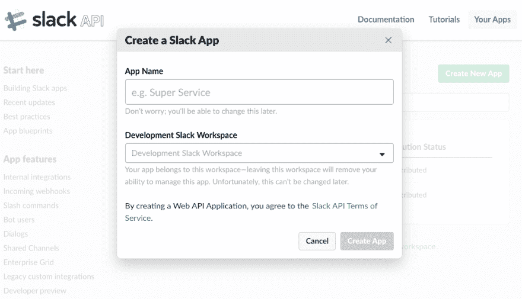T2】](https://res.cloudinary.com/practicaldev/image/fetch/s--T6igxw-D--/c_limit%2Cf_auto%2Cfl_progressive%2Cq_auto%2Cw_880/https://gitlab.com/kellyjandrews/shipwright/uploads/cacb6004169122c6b9beca33830ed80b/create_slack_app.png)

我把我的公司命名为“造船厂”,因为它在建造可运输的东西。你可以随意给自己取任何你喜欢的名字。

创建应用程序后，您应该会看到这个屏幕。

[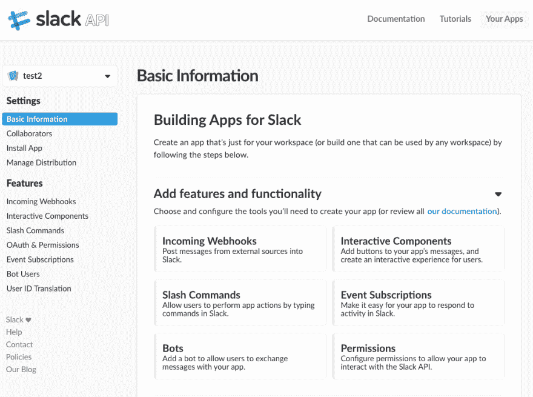T2】](https://res.cloudinary.com/practicaldev/image/fetch/s--_Ya6Llj0--/c_limit%2Cf_auto%2Cfl_progressive%2Cq_auto%2Cw_880/https://gitlab.com/kellyjandrews/shipwright/uploads/fababaa840a99442a098486548ec3dd4/basic_info.png)

现在，我们可以跳过大部分内容，稍后再来讨论。但是，您需要应用程序凭据才能开始。

[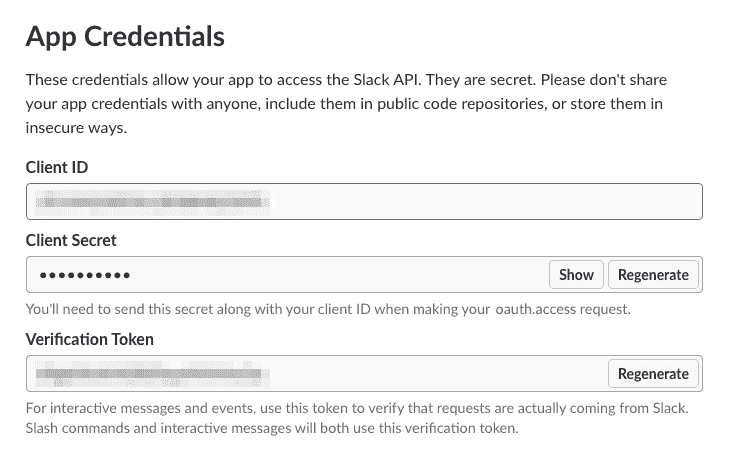T2】](https://res.cloudinary.com/practicaldev/image/fetch/s--f_2gv-Il--/c_limit%2Cf_auto%2Cfl_progressive%2Cq_auto%2Cw_880/https://gitlab.com/kellyjandrews/shipwright/uploads/7f742a9dc81098924a9109d67f822493/app_credentials.png)

## 构建 Bot

我决定使用 Botkit 来构建我的聊天机器人。他们有一个很好的框架来构建不同的机器人，它与 Slack 配合得很好。

你可以在 https://gitlab.com/kellyjandrews/shipwright 下载代码。

### 设置环境变量

该项目是使用 [Docker](https://www.docker.com/) 和 Docker Compose 设置的。您将需要安装这些来运行这个项目。在`docker-compose.yml`中，有一个对您需要设置的`.env`文件的引用。

```
SLACK_TOKEN=
SLACK_ID=
SLACK_SECRET=

GITLAB_TOKEN=

CODESHIP_USER=
CODESHIP_PW=
CODESHIP_ORG_NAME= 
```

Enter fullscreen mode Exit fullscreen mode

#### 懈怠

`SLACK_TOKEN`、`SLACK_ID`和`SLACK_SECRET`环境变量来自我们在上一步中设置的应用程序。直接复制粘贴在等号后面。

#### 代号船

[Codeship API](https://apidocs.codeship.com/v2) 将使用您的用户名和密码进行验证。建议专门为 API 使用创建一个用户。

这将要求 API 用户能够访问 Codeship 中的正确团队，以及匹配的 Gitlab 用户，以便将服务连接到 Codeship。

出于初始测试的目的，您可以使用您当前的用户，并确保您有 Gitlab 设置作为连接。您可以在[https://app.codeship.com/authentications](https://app.codeship.com/authentications)找到您连接的服务。

[T2】](https://res.cloudinary.com/practicaldev/image/fetch/s--GCL3A0Mi--/c_limit%2Cf_auto%2Cfl_progressive%2Cq_auto%2Cw_880/https://gitlab.com/kellyjandrews/shipwright/uploads/79d7bbe193587d98e1ab7df64edaed33/codeship_gitlab_connected.png)

此示例仅使用 Codeship 中的组织名称。在 API 认证期间，它将匹配名称以在适当的组织中创建项目。

您可以在设置屏幕中找到组织名称。

#### Gitlab

首先，确保您登录到连接到 Codeship 的同一个用户。然后在 Gitlab UI 的右上角，点击用户图标进入下拉菜单，选择`Settings`。然后导航至左侧菜单上的`Access Tokens`。在这个屏幕上，你可以创建一个`personal access token`。

[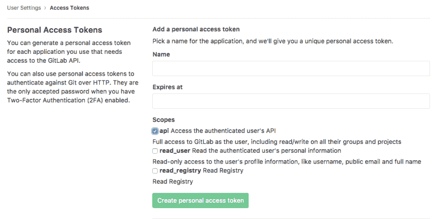T2】](https://res.cloudinary.com/practicaldev/image/fetch/s--1F38KMrd--/c_limit%2Cf_auto%2Cfl_progressive%2Cq_auto%2Cw_880/https://gitlab.com/kellyjandrews/shipwright/uploads/bc6b93d1bb368e6be9f60694ce54bb0a/gitlab_access_token.png)

您将只需要 API 访问。给它起个名字，然后点击`Create personal access token`。页面将刷新并在顶部显示令牌。您只会看到一次，所以请确保现在复制它，并将其粘贴到`.env`文件中。

[T2】](https://res.cloudinary.com/practicaldev/image/fetch/s--t0IdGvS9--/c_limit%2Cf_auto%2Cfl_progressive%2Cq_auto%2Cw_880/https://gitlab.com/kellyjandrews/shipwright/uploads/25b791ab870db547a5a802440e291da1/gitlab_token.png)

### 本地运行你的机器人

Slack 使用 webhooks 与应用程序进行通信。在将您的 bot 推向生产之前，您希望用您的本地开发环境测试功能，我发现最简单的方法之一是使用 [Ngrok](https://ngrok.com/2) 。

`Ngrok`将打开一个安全的 URL，允许您直接连接到您的本地主机。安装很容易，说明可以在这里找到-[https://ngrok.com/download](https://ngrok.com/download)。

安装完成后，您需要启动一个会话，通过端口`3000`将外部世界连接到您的`localhost`。

```
$ ngrok http 3000

ngrok by @inconshreveable                                                                                                                                 (Ctrl+C to quit)

Session Status                online
Version                       2.2.8
Region                        United States (us)
Web Interface                 http://127.0.0.1:4040
Forwarding                    http://1234ABCD.ngrok.io -> localhost:3000
Forwarding                    https://1234ABCD.ngrok.io -> localhost:3000

Connections                   ttl     opn     rt1     rt5     p50     p90
                              0       0       0.00    0.00    0.00    0.00 
```

Enter fullscreen mode Exit fullscreen mode

此时，我们可以启动 Docker 容器，并在 Slack 中完成应用程序设置。

```
$ docker-compose up

// build output

Initializing Botkit v0.6.8
info: ** Using simple storage. Saving data to ./db_slackbutton_bot/
debug: Setting up a handler for spawned
debug: Setting up a handler for heard_trigger
debug: Setting up a handler for command_triggered
debug: Setting up a handler for remote_command_end
debug: Setting up a handler for slash_command
debug: Setting up a handler for dialog_submission
info: ** Starting webserver on port 3000
info: ** Serving webhook endpoints for Slash commands and outgoing webhooks at: http://0.0.0.0:3000/slack/receive
info: ** Serving login URL: http://0.0.0.0:3000/login
info: ** Serving outh return endpoint: http://0.0.0.0:3000/oauth 
```

Enter fullscreen mode Exit fullscreen mode

如果遇到问题，请验证您的环境变量，停止容器并重新构建。如果您有其他问题，请随时[提出问题](https://gitlab.com/kellyjandrews/shipwright/issues)并让我知道，我们可以尝试解决它。

## 这是什么代码？

僵尸工具文档有时很难整理。任何框架的困难在于有太多的选择，以至于你很容易迷失在寻找你真正需要的东西的过程中。

我不打算涵盖关于僵尸工具的所有内容，但想强调项目中的几个项目，它们可能会帮助您了解正在发生的事情，并让您对您的机器人有所了解。

### 启动 web 服务器

我正在使用一些交互式项目，这需要我们使用 OAuth 和 webhooks。使用 Botkit，它将创建与 Slack 交互所需的正确端点，因此我不必担心这一点。

```
// set up a botkit app to expose oauth and webhook endpoints
controller.setupWebserver(process.env.port, () => {
  controller.createWebhookEndpoints(controller.webserver);

  controller.createOauthEndpoints(controller.webserver, (err,req,res) => {
    if (err) {
      res.status(500).send('ERROR: ' + err);
    } else {
      res.send('Success!');
    }
  });
}); 
```

Enter fullscreen mode Exit fullscreen mode

### 处理斜线命令

斜杠命令是使用僵尸工具中的一个事件处理器来处理的。我设置了它，以便以后可以使用 switch 语句轻松添加额外的功能。`message`对象有一个可以匹配的`command`属性。

```
controller.on('slash_command', (bot, message) => {
  let command = message.command;

  switch (command) {
  case '/create':
    return createDialog(bot, message);
  default:
    return;
  }

}); 
```

Enter fullscreen mode Exit fullscreen mode

### 创建对话框

在 Botkit 中创建对话框元素的界面真的相当有用， [docs](https://github.com/howdyai/botkit/blob/master/docs/readme-slack.md#dialogs) 让它很容易理解。

```
function createDialog(bot, message) {
  var dialog = bot.createDialog('Create New Project','callback_id','Create')
    .addText('Project Name','projectName','')
    .addSelect('Project Type','projectType',null,[{label:'Pro',value:'pro'},{label:'Basic',value:'basic'}],{placeholder: 'Select One'});
  bot.replyPrivate(message, 'Ok, let\'s create a new project');
  bot.replyWithDialog(message, dialog.asObject());
} 
```

Enter fullscreen mode Exit fullscreen mode

在项目设置期间，我希望获得一个名称和项目类型，以传递给 Gitlab 和 Codeship。这里的可能性非常令人兴奋——但现在我保持简单。

### 提交对话框

一旦对话框被提交，我想通过机器人的直接消息传递功能与用户进行交流。这一部分比预期的更棘手，但是经过一些尝试和错误，我能够得到我想要的。

```
controller.on('dialog_submission', (bot, message) => {
  const projectType = message.submission.projectType;
  const projectName = message.submission.projectName;

  bot.dialogOk();
  bot.createPrivateConversation(message, (err,dm) => {
    dm.say(`I am now creating the Codeship ${projectType} project and \`${projectName}\` repo.`);
    gitlab.createRepo(projectName)
      .then(gitlab_res => {
        dm.say(`The GitLab Url is ${gitlab_res.web_url}`);
        return codeship.createProject(gitlab_res.ssh_url_to_repo, projectType);
      })
      .then(codeship_res => {
        dm.say(`The Codeship Project Url is https://app.codeship.com/projects/${codeship_res.project.id}`);
        dm.activate();
      })
      .catch(err => {
        // respond with error messages here
        console.log(err);
      });
  });

}); 
```

Enter fullscreen mode Exit fullscreen mode

总的来说，代码不太复杂，这让我很高兴。僵尸工具让我可以毫不费力地创建一些可靠的功能。该项目还有一些连接 Gitlab 和 Codeship APIs 的代码，您也可以查看。

## 添加功能

既然您已经启动并运行了 bot，Slack 需要设置一些权限，然后安装到您的团队中。

从上一步返回到[https://api.slack.com/apps](https://api.slack.com/apps)，点击你创建的应用程序。

### 交互组件

为了让对话框正常工作，您需要使用`ngrok`路径和`/slack/receive`设置交互组件请求 URL。

[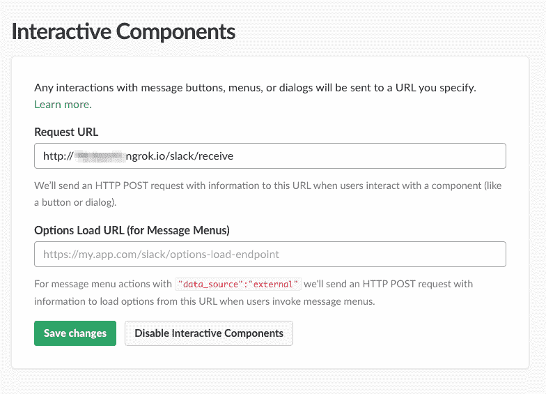T2】](https://res.cloudinary.com/practicaldev/image/fetch/s--1FRdLtJE--/c_limit%2Cf_auto%2Cfl_progressive%2Cq_auto%2Cw_880/https://gitlab.com/kellyjandrews/shipwright/uploads/ef53e41581bf01da957d1ec3decc84dd/interactive_components.png)

### 斜线命令

我决定使用斜杠命令来允许用户启动工作流。我目前的设置不需要任何额外的细节，只是使用了`/create`命令。请求 URL 与带有`/slack/receive`的交互组件 URL 相同。

[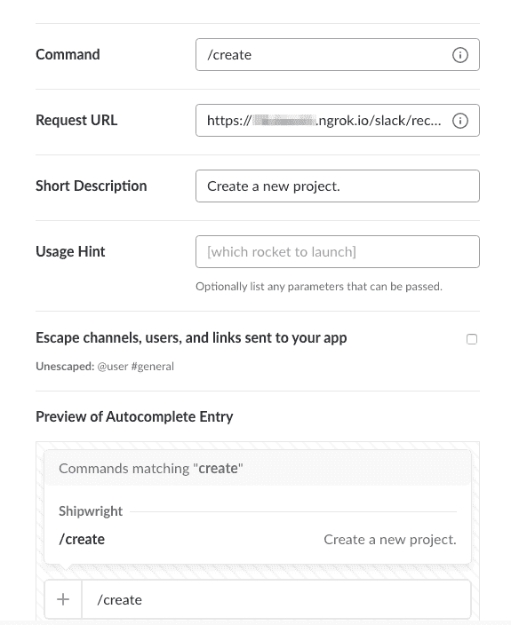T2】](https://res.cloudinary.com/practicaldev/image/fetch/s--8eBMBOql--/c_limit%2Cf_auto%2Cfl_progressive%2Cq_auto%2Cw_880/https://gitlab.com/kellyjandrews/shipwright/uploads/65a50e6afad4e0c164094fd255058799/slash_command.png)

如果我愿意，您也可以从用户那里获得命令文本，这也可以保存一个对话框。文本值在 slash 命令返回的 Botkit 对象中可用。

### OAuth &权限

此部分允许您向应用程序添加范围，在本例中我们暂时不需要这样做。我们确实需要为初始设置添加一个重定向 URL。

同样，您将需要您的`ngrok` URL，并添加路线`/oauth`。

[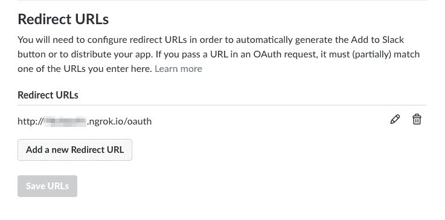T2】](https://res.cloudinary.com/practicaldev/image/fetch/s--Xs7vQ2K0--/c_limit%2Cf_auto%2Cfl_progressive%2Cq_auto%2Cw_880/https://gitlab.com/kellyjandrews/shipwright/uploads/90bebe0eafa4c56a59528999d55aae47/redirect_urls.png)

### Bot 用户

最后，您需要添加您的 bot 用户。这将是直接显示在 Slack 中的名称。我在这里也把我的机器人命名为`shipwright`,但是请随意给你的机器人起一个对你来说有意义的名字。

[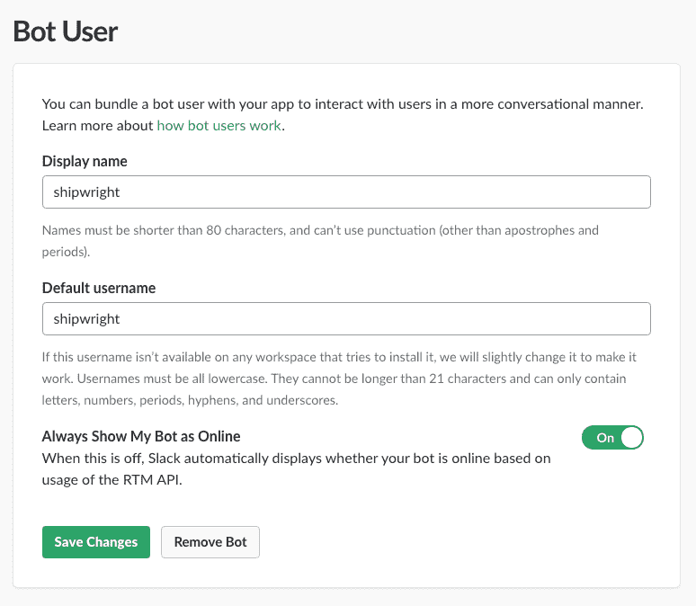T2】](https://res.cloudinary.com/practicaldev/image/fetch/s--nrv2rBFs--/c_limit%2Cf_auto%2Cfl_progressive%2Cq_auto%2Cw_880/https://gitlab.com/kellyjandrews/shipwright/uploads/57ff80cf4e12d5d94e20ae2a8de62391/slack_bot_user.png)

### 安装 App

一旦你设置好了一切，你现在需要将应用程序安装到 Slack 中。点击`Install App`菜单项，从这里安装应用程序。在构建过程中，如果您更改权限并需要授权，这也是您可以重新安装应用程序的地方。

[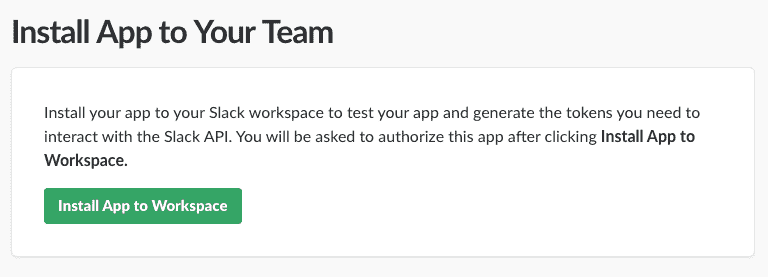T2】](https://res.cloudinary.com/practicaldev/image/fetch/s--OC5r2STf--/c_limit%2Cf_auto%2Cfl_progressive%2Cq_auto%2Cw_880/https://gitlab.com/kellyjandrews/shipwright/uploads/ba6b84a5a88297894b49f8b99d706f4b/slack_install_app.png)

[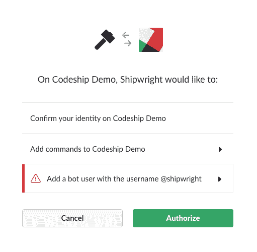T2】](https://res.cloudinary.com/practicaldev/image/fetch/s--5s4dP3U1--/c_limit%2Cf_auto%2Cfl_progressive%2Cq_auto%2Cw_880/https://gitlab.com/kellyjandrews/shipwright/uploads/e403d97a0edbfd3e5f4fbbf576f430a1/slack_authorize_app.png)

### 登录您的应用程序

一旦安装了应用程序，您还需要登录来授权您的用户。

从网络浏览器中，访问您需要指向`http://1234abcd.ngrok.io/login`。然后单击授权按钮。这将授权应用程序并将团队信息保存到`db_slackbutton_bot`目录。

### 测试出来

安装、运行并验证了所有东西之后，现在您应该能够进入 Slack 并输入命令`/create`。这将弹出一个对话框，供您输入信息。

[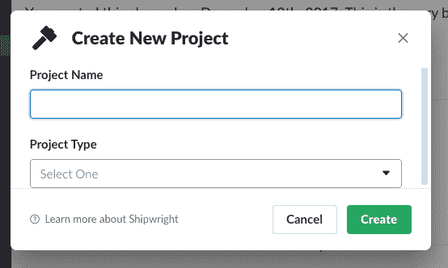T2】](https://res.cloudinary.com/practicaldev/image/fetch/s--PlDvKU8t--/c_limit%2Cf_auto%2Cfl_progressive%2Cq_auto%2Cw_880/https://gitlab.com/kellyjandrews/shipwright/uploads/afcd5e72424763a534bd69cd1ebed947/slack_create_project.png)

一旦你添加了你的信息并点击创建，这个机器人就会在完成后直接给你更新信息，提供你需要的网址。

## 注意事项

我还没有在这个项目上投入太多的时间——错误处理和安全性。

目前，如果某件事失败了，事情就不会进展顺利。外部 API 调用有几个失败点，很容易失败——复制项目、身份验证失败等等。

此外，任何人都可以在这一点上做项目，如果他们有权使用 Slack。我很可能需要在这里添加一些额外的部分，以确保那些可以创造是有限的。

总的来说，这里的回报非常好。我最终可以创建一些模板化的项目来复制一个初学者，我可以在不到一分钟的时间内为每个项目设置功能。在此之前，需要多次点击两个应用程序才能完成设置。Codeship API 还允许我创建特定的 pro/basic 配置，以保持一致性。

除了 Codeship 和 Gitlab 之外，我还可以设置错误日志和 app metrics 应用程序或项目中我通常需要的任何东西。通过该对话框，您还可以添加复选框，使其成为可选的。对于一些伟大的功能，这里有很大的潜力。

作为 ChatOps 世界的第一个项目，我对事情是如何发生的感觉非常好。我还想补充几个项目，也很想听听你们的建议——可以随意添加一个关于回购[https://gitlab.com/kellyjandrews/shipwright/issues](https://gitlab.com/kellyjandrews/shipwright/issues)的问题。