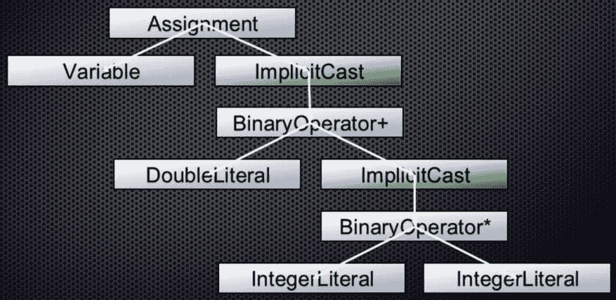

# 编译器 103–语义分析器

> 原文:[https://dev.to/lefebvre/compilers-103-语义分析器-540k](https://dev.to/lefebvre/compilers-103--semantic-analyzer-540k)

语义分析器是编译器的真正核心。它的工作是验证代码，并找出代码的真正含义。本质上，它验证代码在语义上是正确的。

这是我的编译器系列的第三篇文章。以前的帖子:

*   [编译器 101–概述和词法分析器](https://dev.to/lefebvre/compilers-101---overview-and-lexer-3i0m)
*   [编译器 102-解析器](https://dev.to/lefebvre/compilers-102---parser-2gni)

## 语义分析器

有了解析器的输出，编译器所拥有的就是用户实际输入的内容，尽管被转换成了编译器易于理解的格式。

语义分析器知道关于编程语言的所有规则。例如，它知道一个整数可以与一个双精度数相乘。它知道字符串不能与双精度值相比较。它知道如何给变量赋值。它知道对象可以与“新建”命令一起使用。它知道范围信息。编译器所知道的通过初始语法检查的一切都在语义分析器中。

如果我们从解析器生成的语法树开始，语义分析器将仔细检查它，并将有关类型的信息添加到语法树中。不仅仅是类型，还增加了语言中隐含的信息。例如，你可能没有想到，但是如果你做一些事情，比如把一个 Double 赋值给一个 Integer，就会发生隐式转换。

正如您在下面看到的，语义分析器已经遍历了语法树，并在隐式转换(ImplicitCast)完成时对其进行了更新。

[T2】](https://res.cloudinary.com/practicaldev/image/fetch/s--5_SOtdhq--/c_limit%2Cf_auto%2Cfl_progressive%2Cq_auto%2Cw_880/https://blog.xojo.com/wp-content/uploads/2017/05/2017-05-19_09-02-03.png)

这个更新的树然后被交给编译器的下一部分， [IR 生成](https://dev.to/lefebvre/compilers-104---ir-generation-39e8)