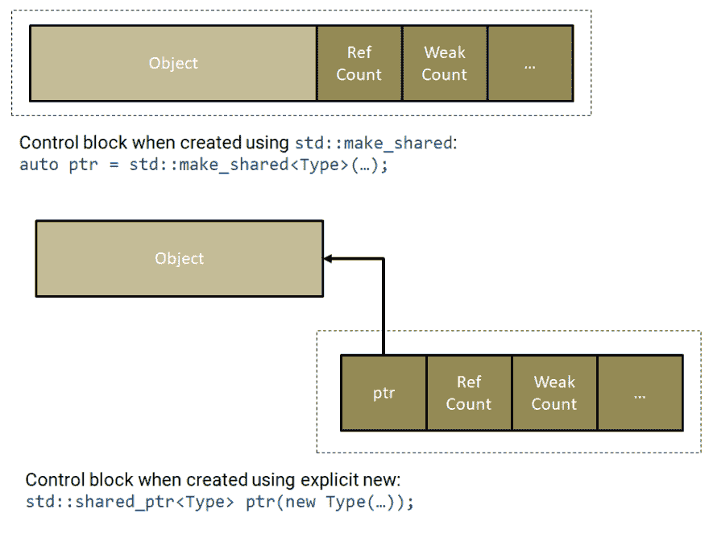

# weak_ptr 如何阻止托管对象的完全内存清理

> 原文:[https://dev . to/fenbf/how-a-weak ptr-may-prevent-full-memory-clean-up-of-managed-object-i0i](https://dev.to/fenbf/how-a-weakptr-might-prevent-full-memory-cleanup-of-managed-object-i0i)

[T2】](http://www.bfilipek.com/2017/12/weakptr-memory.html)

当我在开发 [C++智能指针引用卡](http://eepurl.com/dcIXXT)时，我遇到了一个非常有趣的问题。似乎在某些情况下，分配给由`smart_ptr`控制的对象的内存可能不会被释放，直到所有的**弱指针**也‘死’为止。

这种情况让我很惊讶，因为我认为最后一个`share_ptr`下降的那一刻，内存就被释放了。

让我们深入了解这个案例。这可能很有趣，因为我们将了解共享/弱指针是如何相互作用的。

注意:这篇文章来自我的博客: [Bartek 的编码博客:weak_ptr 可能如何阻止托管对象的完全内存清理](http://www.bfilipek.com/2017/12/weakptr-memory.html)。

## 案情

好吧，那有什么问题？

首先，我们需要了解案例的要素:

*   一个托管对象，让我们假设它很大
    *   这里我们关心的是带有大“`sizeof()`”的对象(如一条评论中提到的)。例如，如果一个类使用一些标准容器，它们可能会分配单独的内存块。
*   `shared_ptr`(一个或多个)——它们指向上面的对象(资源)
*   `make_shared` -用于创建共享指针
*   `weak_ptr`
*   共享/弱指针的控制块

代码很简单:

指向我们的大对象的共享指针超出了范围。引用计数器达到 0，可以销毁对象。但是也有一个弱指针比共享指针寿命长。

```
weak_ptr<MyLargeType> weakPtr;
{
    auto sharedPtr = make_shared<MyLargeType>();
    weakPtr = sharedPtr;
    // ...
}
cout << "scope end...\n"; 
```

在上面的代码中，我们有两个作用域:内部——使用共享指针，外部——使用弱指针(注意，这个弱指针只保存一个‘弱’引用，它不使用`lock()`来创建强引用)。

当共享指针超出内部块的范围时，它应该销毁被管理对象...对吗？

**这一点很重要**:当最后一个共享指针消失时，它会在调用`MyLargeType`的析构函数的意义上破坏对象...但是分配的内存呢？我们也能放出来吗？

为了回答这个问题，让我们考虑第二个例子:

```
weak_ptr<MyLargeType> weakPtr;
{
    shared_ptr<MyLargeType> sharedPtr(new MyLargeType());
    weakPtr = sharedPtr;
    // ...
}
cout << "scope end...\n"; 
```

几乎一样的代码...对吗？不同之处仅在于创建共享指针的方法:这里我们使用显式的`new`。

让我们看看运行这两个示例时的输出。

为了获得一些有用的消息，我需要覆盖全局`new`和`delete`，并在调用我的示例类的析构函数时进行报告。

```
void* operator new(size_t count) {
    cout << "allocating " << count << " bytes\n";
    return malloc(count);
}

void operator delete(void* ptr) noexcept {
    cout << "global op delete called\n";
    free(ptr);
}

struct MyLargeType {
    ~MyLargeType () { cout << "destructor MyLargeType\n"; }

private: 
    int arr[100]; // wow... so large!!!!!!
}; 
```

好的，好的...现在让我们看看输出:

对于`make_shared`:

```
allocating 416 bytes
destructor MyLargeType
scope end...
global op delete called 
```

对于明确的`new`情况:

```
allocating 400 bytes
allocating 24 bytes
destructor MyLargeType
global op delete called
scope end...
global op delete called 
```

这里发生了什么？

第一个重要的观察是，正如您可能已经知道的，`make_shared`将只执行一次内存分配。通过显式的`new`,我们有两个单独的分配。

所以我们需要一个空间来放两样东西:物体和...控制块。

控制块是依赖于实现的，但是它包含指向一个对象的指针和引用计数器。加上一些其他的东西(比如自定义删除器，分配器，...).

当我们使用显式`new`时，我们有两个独立的内存块。所以当最后一个共享指针消失时，我们可以销毁对象，同时释放内存。

我们看到了输出:

```
destructor MyLargeType
global op delete called 
```

析构函数和`free()`都被调用——在作用域结束之前。

然而，当使用`make_shared()`创建一个共享指针时，被管理的对象与其余的实现细节驻留在同一个内存块中。

这是一张表达这个想法的图片:

[T2】](https://res.cloudinary.com/practicaldev/image/fetch/s--YFaZThCG--/c_limit%2Cf_auto%2Cfl_progressive%2Cq_auto%2Cw_880/https://2.bp.blogspot.com/-2XIQxeCUBFc/Wi2JGz_EcXI/AAAAAAAADNU/vEkN6ZtXR-Yon5YuZWBxk-6kjmHD1011ACLcBGAs/s1600/control_block.png)

事情是这样的，当你创建一个弱指针时，那么在控制块内部“弱计数器”通常会增加。弱指针和共享指针需要这种机制，这样它们就可以回答“指针是否死了”(或者调用`expire()`方法)的问题。

换句话说，如果周围有一个弱指针(而所有共享指针都是死的)，我们就不能移除控制块。因此，如果被管理对象被分配在同一个内存块中，我们也不能为它释放内存——我们不能只释放部分内存块(至少没那么容易)。

正如一个评论中提到的:使用独立内存的类

下面你可以找到一些 MSVC 实现的代码，这些代码是从`shared_ptr`的析构函数调用的(当它是从`make_shared`创建的时候):

```
~shared_ptr() _NOEXCEPT
{   // release resource
    this->_Decref();
}

void _Decref()
{    // decrement use count
    if (_MT_DECR(_Uses) == 0)
    {    // destroy managed resource, 
        // decrement weak reference count
        _Destroy();
        _Decwref();
    }
}

void _Decwref()
{    // decrement weak reference count
    if (_MT_DECR(_Weaks) == 0)
    {
        _Delete_this();
    }
} 
```

如你所见，销毁对象是分离的——只调用析构函数，而`Delete_this()`——只在弱计数为零时发生。

这里是 coliru 的链接，如果你想玩代码的话: [Coliru 示例](http://coliru.stacked-crooked.com/a/51fc80cffee33b62)。

## 不惧！

内存分配和清理的故事很有趣...但是它对我们有那么大的影响吗？

可能不多。

你不应该仅仅因为那个原因就停止使用`make_shared`！:)

问题是这种情况很少见。

尽管如此，在实现一些依赖于共享弱指针的复杂系统时，了解这种行为并牢记在心还是有好处的。

例如，我正在考虑 Herb Sutter 提出的`concurrent weak dictionary`数据结构:[我最喜欢的 c++ 10-Liner | going native 2013 | Channel 9](https://channel9.msdn.com/Events/GoingNative/2013/My-Favorite-Cpp-10-Liner)。

如果我错了，请纠正我:

`make_shared`将为控制块和小工具分配一块内存。因此，当所有共享指针都失效时，弱指针将存在于缓存中...这也会导致整个内存块都在那里。(调用了析构函数，但无法释放内存)。

为了增强解决方案，应该实现一些额外的机制来不时地清理未使用的弱指针。

## 备注

在我理解了这个案例之后，我也意识到我的解释有点晚了——其他人过去也做过:)尽管如此，我还是想把事情记下来。

这里有一些资源的链接，它们也描述了这个问题:

*   [有效的现代 C++](http://amzn.to/2C4vpJI) -第 21 项——“更喜欢用`std::make_unique`和`std::make_shared`直接使用 new。”
*   [Make_shared，差点银弹|我就不买这个博客了，刮花了！](https://lanzkron.wordpress.com/2012/04/22/make_shared-almost-a-silver-bullet/)。

摘自 **[有效的现代 C++](http://amzn.to/2C4vpJI)** ，第 144 页:

> 只要 std::weak_ptrs 引用一个控制块(即弱计数大于零)，该控制块就必须继续存在。只要控制块存在，包含它的内存就必须保持分配状态。由 std::shared_ptr make 函数分配的内存在最后一个 std::shared_ptr 和引用它的最后一个 std::weak_ptr 被销毁之前不能被释放。

## 总结

整篇文章是一个迷人的调查！

有时候，我发现自己在一些可能不太重要的事情上花了太多时间。尽管如此，他们还是很吸引人。我能以博客的形式分享这些真是太好了:)

整个调查的底线是共享和弱指针的实现相当复杂。当控制块与被管理对象被分配在同一个内存块中时，当我们想要释放所分配的内存时，必须特别小心。

顺便说一句:如果你想下载的话，这里还有一个到 C++智能指针参考卡的链接。