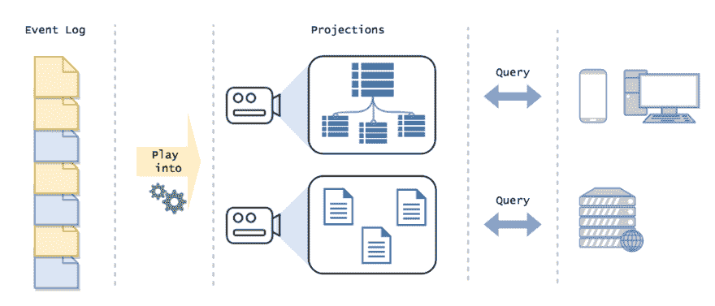
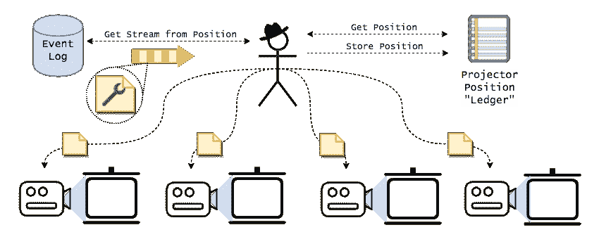

# 投影构建模块:构建投影需要什么

> 原文:[https://dev . to/barryo sull/projection-building-blocks-what-you-need-to-build-projections-5g1n](https://dev.to/barryosull/projection-building-blocks-what-youll-need-to-build-projections--5g1n)

(最初发布在[我的博客](http://barryosull.com/blog/projection-building-blocks-what-you-ll-need-to-build-projections)上)

我们来谈谈投影。这个主题很大，所以这是关于预测的四部分系列的第一部分。

1.  **投影构建模块**:构建投影需要什么
2.  **用 PHP 广播事件**:技巧与技术
3.  设计投影:如何设计和实现真实世界的投影
4.  **Projection DevOps** :持续部署新的/更新的预测，零停机时间

如果你读过我以前的文章，你应该对[事件源](https://dev.toevent-sourcing-what-it-is-and-why-its-awesome) / [事件驱动](https://dev.to/barryosull/event-granularity-modelling-events-in-event-driven-applications-e50)命令查询责任分离( [CQRS](https://martinfowler.com/bliki/CQRS.html) )系统有所了解。其核心有两个概念，输出事件的命令端和读取事件的查询端。

到目前为止，我主要关注的是命令方面，即我们如何在应用程序中模拟状态变化。我提到了预测，但总是用手挥舞的语句，没有任何真正的细节。让我们做点什么。

[T2】](https://res.cloudinary.com/practicaldev/image/fetch/s--kVYiYk6K--/c_limit%2Cf_auto%2Cfl_progressive%2Cq_auto%2Cw_880/https://res.cloudinary.com/practicaldev/image/fetch/s--O4HIIlNN--/c_limit%2Cf_auto%2Cfl_progressive%2Cq_auto%2Cw_880/https://thepracticaldev.s3.amazonaws.com/i/lhhlvel6ifqaj0y4otb7.png)

# 什么是投影？

预测是任何事件源或 CQRS 系统的必要组成部分。这些系统不依赖于单一的通用数据源，如标准化的 MySQL 数据库。相反，你通过播放事件来建立你的数据集，也就是“电影”，把它们“投射”成你想要的形状。这提供了很大的灵活性，因为您不再受单一数据模型的束缚，而您必须在单一数据模型上运行越来越庞大的 SQL 查询(12+join any one？).通过预测，您可以专门为手头的问题建立一个数据模型。

例如，假设您的应用程序有以下要求:

1.  Webapp 需要获取用户、他们的活动购物车和购物车的商品，所有这些都作为一个文档。
2.  营销部门需要一份清单，列出每个用户在 6 个月内的花费，并按月细分。

构建一个能够产生两种答案的通用数据模型是可能的，但是很困难，并且会导致复杂的 SQL 语句和脆弱的数据结构。相反，为每个用例建立一个定制的数据集要容易得多，保持它们的独立性和最小化。

在上面的例子中，webapp 将监听适当的事件，并构建一个用户、他们的购物车及其商品的树。这个结构将被存储在一个文档数据库中，比如 MongoDB，以后需要的时候再取出来。很好很容易。

对于营销报告来说，有点不一样。我们监听相同的事件，但我们没有建立相同的结构。相反，我们跟踪三条数据:users_id、月份和他们当月的消费金额。我们将数据存储在 RDBMS 中，比如 MySQL，以便于查询。

这两个数据集简单却完全不同。它们都是为回答特定问题而设计的，因此更容易理解和构建。这就是投射的力量。

[T2】](https://res.cloudinary.com/practicaldev/image/fetch/s--4W-TDRwC--/c_limit%2Cf_auto%2Cfl_progressive%2Cq_auto%2Cw_880/https://thepracticaldev.s3.amazonaws.com/i/7pkqurqyjf7rpgksf1as.png)

# 积木

构建一个健壮的*投影系统不是一项简单的任务，因为有许多概念和活动部件。在你能建造一个之前，你需要孤立地理解每一部分，然后看看它们是如何一起工作的。

*一个贴切的词，由于在大学里被过度使用而毁了

[T2】](https://res.cloudinary.com/practicaldev/image/fetch/s--IX2EvhWv--/c_limit%2Cf_auto%2Cfl_progressive%2Cq_auto%2Cw_880/https://thepracticaldev.s3.amazonaws.com/i/rsdnvlottw5irdvm0be9.png)

## 事件

事件是一个命名的对象，代表系统中发生的一些谨慎的变化。它通常被建模为一个包含属性集合的类，给出足够有用的信息。

例如

```
<?php namespace Domain\Selling\Events;

use ...;

class CartCreated extends Event
{
    /** @var Uuid */
    public $cart_id;

    /** @var Uuid */
    public $customer_id;     
} 
```

<svg width="20px" height="20px" viewBox="0 0 24 24" class="highlight-action crayons-icon highlight-action--fullscreen-on"><title>Enter fullscreen mode</title></svg> <svg width="20px" height="20px" viewBox="0 0 24 24" class="highlight-action crayons-icon highlight-action--fullscreen-off"><title>Exit fullscreen mode</title></svg>

事件还包含一些通用的元信息，每个事件都应该包含这些信息，以便于使用。我推荐以下内容。

*   事件的 ID(唯一的)
*   当事件发生时
*   触发事件的参与者(可能是个人或系统流程)
*   事件的版本(事件会随着时间的推移而改变形状，我们将在后面讨论)

```
<?php namespace Domain\Events;

use ...;

abstract class Event 
{
    /** @var Uuid */
    public $id;

    /** @var Carbon */
    public $occurred_at;

    /** @var Actor */
    public $actor;

    /** @var integer */
    public $version = 1;
} 
```

<svg width="20px" height="20px" viewBox="0 0 24 24" class="highlight-action crayons-icon highlight-action--fullscreen-on"><title>Enter fullscreen mode</title></svg> <svg width="20px" height="20px" viewBox="0 0 24 24" class="highlight-action crayons-icon highlight-action--fullscreen-off"><title>Exit fullscreen mode</title></svg>

## 事件存储和事件流

EventStore 是您访问系统中曾经发生过的所有事件的访问点。你给它一个位置/时间点，它给你一个事件流，你可以迭代。从那里开始，就像遍历流一样简单，直到没有剩下任何事件。

```
<?php
$last_position = "b70931a6-b330-4866-97b4-0710c8ad5d3e";
$event_store = new EventStore();
$event_stream = $event_store->getStream($last_position);
while ($event = $event_stream->next()) {
    // Do things
}
?> 
```

<svg width="20px" height="20px" viewBox="0 0 24 24" class="highlight-action crayons-icon highlight-action--fullscreen-on"><title>Enter fullscreen mode</title></svg> <svg width="20px" height="20px" viewBox="0 0 24 24" class="highlight-action crayons-icon highlight-action--fullscreen-off"><title>Exit fullscreen mode</title></svg>

在幕后，事件存储和流可以用多种技术实现，SQL、NoSQL、Kafka，甚至文件系统。只要他们满足以下约束，你就是好的。

1.  你可以从流中的任何一点开始读
2.  事件按发生的顺序读取
3.  事件流只是附加的(历史不会改变)

现在我们有了从日志中读取事件的方法，让我们来看看如何处理它们。

## 投影仪

为了建立数据集，您需要监听一组事件。这就是投影仪的用武之地。他们的工作是监听事件，然后将它们传递给构建数据集的投影。

有很多方法可以做到这一点，但这是我的首选。

```
 <?php namespace App\Projections\Carts;

use Domain\Shopping\Events;

class Projector
{
    private $projection;

    public function __construct(Projection $projection)
    {
        $this->projection = $projection;
    }

    public function whenCartCreated(Events\CardCreated $event)
    {
        $this->projection->createCart($event->cart_id, $event->customer_id);
    }

    public function whenItemAddedToCart(Events\ItemAddedToCart $event)
    {
        $this->projection->addItemToCart($event->cart_id, $event->item);
    }

    public function whenItemRemovedFromCart(Events\ItemRemovedFromCart $event)
    {
        $this->projection->removeItemFromCart($event->cart_id, $event->item_id;
    }

    public function whenCartCheckedOut(Events\CartCheckedOut $event)
    {
        $this->projection->checkoutCart($event->cart_id);
    }
} 
```

<svg width="20px" height="20px" viewBox="0 0 24 24" class="highlight-action crayons-icon highlight-action--fullscreen-on"><title>Enter fullscreen mode</title></svg> <svg width="20px" height="20px" viewBox="0 0 24 24" class="highlight-action crayons-icon highlight-action--fullscreen-off"><title>Exit fullscreen mode</title></svg>

正如您在上面看到的，方法签名定义了我们正在监听的事件，方法本身提取数据并将其提供给投影。

## 投影

投射是“投射”一系列事件的结果。它有两类功能:命令和查询([标准 CQS 模式](https://martinfowler.com/bliki/CommandQuerySeparation.html))。命令会更改基础数据集的形状。查询从数据集中获取结果，通常是为了回答业务问题或展示数据。

这里有一个简单的例子，它照看客户的购物车及其商品。

```
<?php namespace DoctrinePlayground\App\Projections\Carts;

use Doctrine\DBAL\Connection;
use Ramsey\Uuid\UuidInterface;
use Carbon\Carbon;
use DoctrinePlayground\Domain\Selling\Entities\Item;

class Projection
{
    private $db;

    const CARTS_TABLE = 'carts';
    const CART_ITEMS_TABLE = 'cart_items';

    public function __construct(Connection $db)
    {
        $this->db = $db;
    }

    /** Example Commands **/

    public function createCart(UuidInterface $cart_id, UuidInterface $customer_id, Carbon $created_at)
    {
        $this->db->insert(self::CARTS_TABLE, [
            'cart_id'     => $cart_id,
            'customer_id' => $customer_id,
            'active'      => true,
            'created_at'  => $created_at->format("Y-m-d H:i:s"),
        ]);
    }

    public function addItemToCart(UuidInterface $cart_id, Item $item)
    {
        $this->db->insert(self::CART_ITEMS_TABLE, [
            'cart_id'     => $cart_id,
            'item_id'     => $item->item_id,
            'item_ref'    => $item->reference
        ]);
    }

    /** Example Queries **/

    public function getActiveCart(UuidInterface $customer_id)
    {
        $cart_arr = $this->db->fetchAssoc('SELECT * FROM '.self::CARTS_TABLE.' WHERE customer_id = ? AND active = 1', [$customer_id]);

        if (!$cart_arr) {
            return null;
        }

        $cart = (object)$cart_arr;

        $items = $this->db->fetchAll('SELECT * FROM '.self::CART_ITEMS_TABLE.' WHERE cart_id = ?', [$cart->cart_id]);

        $cart->items = array_map(function($item) {
            return (object)$item;
        }, $items);

        return $cart;
    }
} 
```

<svg width="20px" height="20px" viewBox="0 0 24 24" class="highlight-action crayons-icon highlight-action--fullscreen-on"><title>Enter fullscreen mode</title></svg> <svg width="20px" height="20px" viewBox="0 0 24 24" class="highlight-action crayons-icon highlight-action--fullscreen-off"><title>Exit fullscreen mode</title></svg>

### 在实现上靠边站

如果您计划让同一个投影有许多不同的实现，我建议将这些方法提取到一个接口中，否则就不要费心了。如果你真的写了一个接口，一些开发人员提倡把命令和查询端分开，但是我认为这是多余的；我们对每个项目都这样做，这只是让代码更难导航、理解和更改。并没有带来什么真正的好处。

## 放映员

为了与投影隐喻保持一致，我们也有一个放映员。放映员负责播放一组放映机。在内部，放映员通过跟踪每个投影仪在流中的位置(通过事件位置或事件 id)来实现这一点，然后从该点向前播放每个投影仪，记录每个投影仪看到的最后一个事件。

## 投影仪位置台账

如上所述，放映员需要某种方法来跟踪每个投影仪在事件日志中的位置。这就是投影仪位置分类帐的用武之地。这是一个简单的数据存储，跟踪每个投影仪及其位置。它相当简单，可以在任何存储技术中实现。

这是一个方便的想法，它还应该跟踪投影仪是否坏了。如果投影仪试图运行并抛出意外异常，投影仪应被标记为“损坏”,放映员应停止尝试播放它。这样你就不会试图一直玩一个坏掉的投影仪，用重复的异常填满你的 bug 跟踪器。

## 事件升级者

这个组件稍微高级一点，但还是值得一提。有时你需要改变事件的形状，通常是通过添加或改变属性。发生这种情况时，您需要“升级”事件形状。这就是为什么每个事件都有一个“版本”属性，所以我们可以检查事件的版本，并在需要时应用适当的升级程序。

该组件位于事件流中，并在将事件数据反序列化为实际的事件类之前对其进行操作。命令端和查询端都使用它。

我不会在这里说太多细节，因为这很复杂，只要知道它的存在就行了。可以把事件升级器想象成动态运行的事件的迁移，这样你就差不多完成了。

# 把所有的东西放在一起

这些都是组件，让我们看看它们是如何协同工作的。

[T2】](https://res.cloudinary.com/practicaldev/image/fetch/s--0Wje2n09--/c_limit%2Cf_auto%2Cfl_progressive%2Cq_auto%2Cw_880/https://thepracticaldev.s3.amazonaws.com/i/ea3uvjpnhca5wokt6tnx.png)

放映员得到了一套放映机。他们检查每个投影仪，并获取在每个人看过的最后一个事件之后开始的事件流。新事件通过放映机播放，完成后放映员记录下放映机看到的最后一个事件。

就是这样，这些就是你需要建立一个有效的投影系统的部分，至少在开始的时候。

# 下一步

上面少了一点，你怎么触发你的放映员播放放映机？这是一个复杂的问题，尤其是当你使用 PHP 的时候。这就是为什么我要在下一篇文章中专门讨论这个问题。我们将讨论一些实现细节，探索每种方法的优缺点，然后确定我认为最好的解决方案。

第三篇文章将深入探讨如何使用各种旨在解决特定问题的技术来构建复杂的投影。在这篇文章中，我们将重点介绍我们团队在构建、设计和实施项目时发现的一些有用的技术。

第四篇文章将深入探讨投影版本化、无缝发布以及一些与投影仪/放映员相关的更高级的概念。

在那之前，祝你好运！