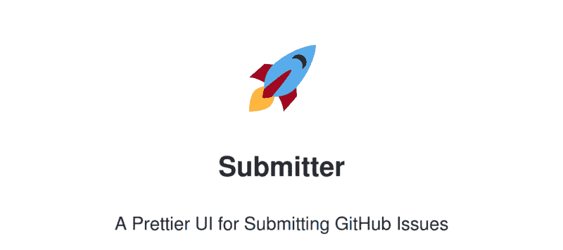

# RIP“提交者”

> 原文：<https://dev.to/z0al/rip-submitter-12mh>

[T2】](https://res.cloudinary.com/practicaldev/image/fetch/s--GEKnXTah--/c_limit%2Cf_auto%2Cfl_progressive%2Cq_auto%2Cw_880/https://cdn-images-1.medium.com/max/800/1%2AZfycb2bWn-rpXG0ViwVY2g.png)

几个月前，我开始了一个小实验，我称之为**提交者**。目标是让人们更容易在 GitHub 上打开新问题。你可能需要阅读 [dev.to post](https://dev.to/ahmedtaj/idea-to-build-submission-friendly-projects-intro-2dc) 来了解详细的故事。

今天，我很难过也很高兴地告诉你，我放弃了这个实验，转而支持 GitHub 的新功能:[多个发布和拉取请求模板](https://github.com/blog/2495-multiple-issue-and-pull-request-templates)。难过的是放开我的宝贝实验，开心的是看到 GitHub 背后的团队在努力解决问题。

虽然 GitHub 采取了不同的方法，但很明显最终的项目不会像我最初想的那样有帮助，所以我认为现在停止它是有意义的。

在这篇文章中，我将分享自从[上一篇文章](https://dev.to/ahmedtaj/idea-to-build-submission-friendly-projects-format--stack-7ee)以来，我在做我的小实验时所做的改变和学到的东西。

#### Auth0 …太多

虽然 [Auth0](http://auth0.com/) 是非常棒和简单的服务，但对于我这样的小东西来说太多了，我最终使用了老式的 passport.js + GitHub。

#### YAML 改为降价销售

Markdown 很容易编写，但很难被 submitter 之类的工具正确读取，还没有。是的，GitHub 对它们的实现有一个[规范](https://github.github.com/gfm/)，但是它还不是很稳定，我个人在尝试制作 GFM 解析器时遇到了一些规范错误。

另一方面，我认为 YAML 对人类和机器都很友好。因此，下面是一个简单的 submit.yml(如何在。github 文件夹)看起来会像: