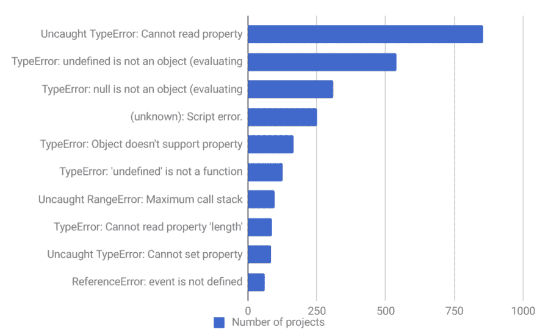
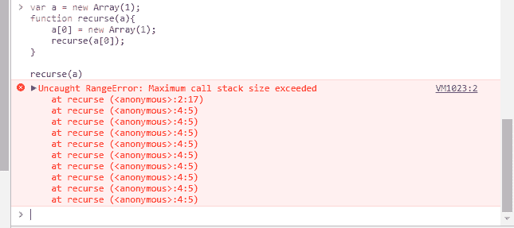

# 来自 1000 多个项目的 10 大 JavaScript 错误(以及如何避免它们)

> 原文:[https://dev . to/mostly Jason/top-10-JavaScript-errors-from-1000-projects-and-how-to-avoid-them-3bkh](https://dev.to/mostlyjason/top-10-javascript-errors-from-1000-projects-and-how-to-avoid-them-3bkh)

*注:这篇文章最初发表在 [Rollbar 的博客](https://rollbar.com/blog/top-10-javascript-errors/)上。*

为了回馈我们的开发者社区，我们查看了数千个项目的数据库，发现了 JavaScript 中的 10 大错误。我们将向您展示它们的成因以及如何防止它们发生。如果你避免这些“陷阱”，它会让你成为一个更好的开发者。

因为数据为王，我们收集、分析、排名了前 10 位的。滚动条收集每个项目的所有错误，并总结每个错误发生的次数。我们通过根据错误的 **[指纹](https://rollbar.com/docs/grouping-algorithm/)** 对错误进行分组来做到这一点。基本上，如果第二个错误只是第一个错误的重复，我们将这两个错误归为一组。这为用户提供了一个很好的概览，而不是像您在日志文件中看到的那样大量的转储。

我们重点关注最有可能影响您和您的用户的错误。为了做到这一点，我们根据不同公司遇到错误的项目数量对错误进行了排序。如果我们只查看每个错误发生的总次数，那么高容量客户可能会用与大多数读者无关的错误淹没数据集。

以下是十大 JavaScript 错误:

[T2】](https://res.cloudinary.com/practicaldev/image/fetch/s--9mE8olQM--/c_limit%2Cf_auto%2Cfl_progressive%2Cq_auto%2Cw_880/https://rollbar.com/assets/blimg/top-10-javascript-errors/javascript-error-graph.png)

为了便于阅读，每个错误都被缩短了。让我们更深入地研究每一个问题，以确定是什么导致了它，以及如何避免它的发生。

## 1。未捕获的类型错误:无法读取属性

如果您是一名 JavaScript 开发人员，您可能已经看到过比您愿意承认的更多的错误。当你在一个未定义的对象上读取一个属性或者调用一个方法时，Chrome 就会出现这种情况。你可以在 Chrome 开发者控制台中很容易地测试这一点。

[T2】](https://res.cloudinary.com/practicaldev/image/fetch/s--2mUXkfIV--/c_limit%2Cf_auto%2Cfl_progressive%2Cq_auto%2Cw_880/https://rollbar.com/assets/blimg/top-10-javascript-errors/cannot-read-property.png)

出现这种情况的原因有很多，但一个常见的原因是在呈现 UI 组件时状态初始化不正确。让我们看一个例子，看看这是如何发生在现实生活中的应用程序。我们将选择 React，但是不正确初始化的相同原则也适用于 Angular、Vue 或任何其他框架。

```
class Quiz extends Component {
  componentWillMount() {
    axios.get('/thedata').then(res => {
      this.setState({items: res.data});
    });
  }

  render() {
    return (
      <ul>
        {this.state.items.map(item =>
          <li key={item.id}>{item.name}</li>
        )}
      </ul>
    );
  }
} 
```

<svg width="20px" height="20px" viewBox="0 0 24 24" class="highlight-action crayons-icon highlight-action--fullscreen-on"><title>Enter fullscreen mode</title></svg> <svg width="20px" height="20px" viewBox="0 0 24 24" class="highlight-action crayons-icon highlight-action--fullscreen-off"><title>Exit fullscreen mode</title></svg>

这里有两件重要的事情需要注意:

1.  组件的状态(如`this.state`)以`undefined`开始。
2.  当您异步获取数据时，组件将在加载数据之前至少呈现一次——不管它是在构造函数中获取的，`componentWillMount`还是`componentDidMount`。当测验第一次呈现时，`this.state.items`是未定义的。这反过来意味着`ItemList`得到未定义的条目，而 *you* 在控制台得到一个错误——“未捕获类型错误:无法读取未定义的属性‘映射’”。

这很容易解决。最简单的方法:在构造函数中用合理的默认值初始化状态。

```
class Quiz extends Component {
  // Added this:
  constructor(props) {
    super(props);

    // Assign state itself, and a default value for items
    this.state = {
      items: []
    };
  }

  componentWillMount() {
    axios.get('/thedata').then(res => {
      this.setState({items: res.data});
    });
  }

  render() {
    return (
      <ul>
        {this.state.items.map(item =>
          <li key={item.id}>{item.name}</li>
        )}
      </ul>
    );
  }
} 
```

<svg width="20px" height="20px" viewBox="0 0 24 24" class="highlight-action crayons-icon highlight-action--fullscreen-on"><title>Enter fullscreen mode</title></svg> <svg width="20px" height="20px" viewBox="0 0 24 24" class="highlight-action crayons-icon highlight-action--fullscreen-off"><title>Exit fullscreen mode</title></svg>

您的应用程序中的确切代码可能会有所不同，但我们希望我们已经为您提供了足够的线索，可以在您的应用程序中修复或避免此问题。如果没有，请继续阅读，因为我们将在下面讨论更多相关错误的例子。

## 2。类型错误:“undefined”不是对象(正在计算

这是在 Safari 中读取属性或对未定义的对象调用方法时出现的错误。您可以在 Safari 开发人员控制台中非常容易地测试这一点。这与 Chrome 的上述错误基本相同，但 Safari 使用了不同的错误信息。

[T2】](https://res.cloudinary.com/practicaldev/image/fetch/s--w-wgB9C3--/c_limit%2Cf_auto%2Cfl_progressive%2Cq_auto%2Cw_880/https://rollbar.com/assets/blimg/top-10-javascript-errors/undefined-is-not-an-object.png)

## 3。类型错误:null 不是对象(正在计算

这是在 Safari 中读取属性或对空对象调用方法时出现的错误。您可以在 Safari 开发人员控制台中非常容易地测试这一点。

[T2】](https://res.cloudinary.com/practicaldev/image/fetch/s--ikzeTvDE--/c_limit%2Cf_auto%2Cfl_progressive%2Cq_auto%2Cw_880/https://rollbar.com/assets/blimg/top-10-javascript-errors/null-is-not-an-object.png)

有趣的是，在 JavaScript 中，null 和 undefined 是不一样的，这就是为什么我们会看到两个不同的错误消息。Undefined 通常是尚未赋值的变量，而 null 表示值为空。要验证它们是否不相等，请尝试使用严格相等运算符:

[T2】](https://res.cloudinary.com/practicaldev/image/fetch/s--RSLB81gA--/c_limit%2Cf_auto%2Cfl_progressive%2Cq_auto%2Cw_880/https://rollbar.com/assets/blimg/top-10-javascript-errors/null-is-not-an-object1.png)

在现实世界的例子中，出现这种错误的一种方式是，在加载元素之前，尝试在 JavaScript 中使用 DOM 元素。这是因为对于空白的对象引用，DOM API 返回 null。

任何执行和处理 DOM 元素的 JS 代码都应该在 DOM 元素被创建之后执行。JS 代码从上到下被解释为 HTML 中的布局。因此，如果在 DOM 元素之前有一个标记，script 标记中的 JS 代码将在浏览器解析 HTML 页面时执行。如果在加载脚本之前没有创建 DOM 元素，就会出现这个错误。

在这个例子中，我们可以通过添加一个事件监听器来解决这个问题，这个监听器会在页面准备好的时候通知我们。一旦触发了`addEventListener`，方法`init()`就可以使用 DOM 元素。

```
<script>
  function init() {
    var myButton = document.getElementById("myButton");
    var myTextfield = document.getElementById("myTextfield");
    myButton.onclick = function() {
      var userName = myTextfield.value;
    }
  }
  document.addEventListener('readystatechange', function() {
    if (document.readyState === "complete") {
      init();
    }
  });
</script> 
<form>
  <input type="text" id="myTextfield" placeholder="Type your name" />
  <input type="button" id="myButton" value="Go" />
</form> 
```

<svg width="20px" height="20px" viewBox="0 0 24 24" class="highlight-action crayons-icon highlight-action--fullscreen-on"><title>Enter fullscreen mode</title></svg> <svg width="20px" height="20px" viewBox="0 0 24 24" class="highlight-action crayons-icon highlight-action--fullscreen-off"><title>Exit fullscreen mode</title></svg>

## 4。(未知):脚本错误

当未捕获的 JavaScript 错误违反跨来源策略跨越域边界时，会发生脚本错误。例如，如果您将 JavaScript 代码托管在 CDN 上，任何未捕获的错误(冒泡到 window.onerror 处理程序的错误，而不是在 try-catch 中捕获的错误)将被报告为简单的“脚本错误”，而不是包含有用的信息。这是一种浏览器安全措施，旨在防止在不允许通信的域之间传递数据。

要获得真正的错误消息，请执行以下操作:

**1。发送访问控制允许来源报头**

将`Access-Control-Allow-Origin`头设置为*表示可以从任何域正确访问该资源。如有必要，您可以用您的域替换*:例如，`Access-Control-Allow-Origin: www.example.com`。然而，处理多个域变得棘手，如果您使用 CDN，由于可能出现的缓存问题，可能不值得花费精力。更多 **[见此处](http://stackoverflow.com/questions/1653308/access-control-allow-origin-multiple-origin-domains)** 。

以下是一些关于如何在各种环境中设置此标题的示例:

***阿帕奇*T3】**

在提供 JavaScript 文件的文件夹中，创建一个包含以下内容的`.htaccess`文件:

```
Header add Access-Control-Allow-Origin "*" 
```

<svg width="20px" height="20px" viewBox="0 0 24 24" class="highlight-action crayons-icon highlight-action--fullscreen-on"><title>Enter fullscreen mode</title></svg> <svg width="20px" height="20px" viewBox="0 0 24 24" class="highlight-action crayons-icon highlight-action--fullscreen-off"><title>Exit fullscreen mode</title></svg>

***Nginx*T3】**

将 add_header 指令添加到为您的 JavaScript 文件服务的位置块:

```
location ~ ^/assets/ {
    add_header Access-Control-Allow-Origin *;
} 
```

<svg width="20px" height="20px" viewBox="0 0 24 24" class="highlight-action crayons-icon highlight-action--fullscreen-on"><title>Enter fullscreen mode</title></svg> <svg width="20px" height="20px" viewBox="0 0 24 24" class="highlight-action crayons-icon highlight-action--fullscreen-off"><title>Exit fullscreen mode</title></svg>

***HAProxy*T3】**

将以下内容添加到提供 JavaScript 文件的资产后端:

```
rspadd Access-Control-Allow-Origin:\ * 
```

<svg width="20px" height="20px" viewBox="0 0 24 24" class="highlight-action crayons-icon highlight-action--fullscreen-on"><title>Enter fullscreen mode</title></svg> <svg width="20px" height="20px" viewBox="0 0 24 24" class="highlight-action crayons-icon highlight-action--fullscreen-off"><title>Exit fullscreen mode</title></svg>

**2。在脚本标签**上设置 crossorigin="anonymous "

在 HTML 源代码中，对于每个已经设置了`Access-Control-Allow-Origin`头的脚本，在脚本标签上设置`crossorigin="anonymous"`。在脚本标签上添加`crossorigin`属性之前，确保您验证了为脚本文件发送了头。在 Firefox 中，如果`crossorigin`属性存在，而`Access-Control-Allow-Origin`头不存在，脚本将不会被执行。

## 5。类型错误:对象不支持属性

这是在 IE 中调用未定义的方法时出现的错误。您可以在 IE 开发者控制台中测试这一点。

[T2】](https://res.cloudinary.com/practicaldev/image/fetch/s--x4N0TXpU--/c_limit%2Cf_auto%2Cfl_progressive%2Cq_auto%2Cw_880/https://rollbar.com/assets/blimg/top-10-javascript-errors/Object-doesnot-support-property.png)

这相当于 Chrome 中的错误“TypeError: 'undefined '不是函数”。是的，不同的浏览器对于同一个逻辑错误可以有不同的错误信息。

这是 IE 在使用 JavaScript 命名空间的 web 应用程序中的一个常见问题。在这种情况下，99.9%的问题是 IE 无法将当前名称空间中的方法绑定到`this`关键字。例如，如果您有 JS 名称空间`Rollbar`和方法`isAwesome.`，如果您在`Rollbar`名称空间内，您可以用下面的语法调用`isAwesome`方法:

```
this.isAwesome(); 
```

<svg width="20px" height="20px" viewBox="0 0 24 24" class="highlight-action crayons-icon highlight-action--fullscreen-on"><title>Enter fullscreen mode</title></svg> <svg width="20px" height="20px" viewBox="0 0 24 24" class="highlight-action crayons-icon highlight-action--fullscreen-off"><title>Exit fullscreen mode</title></svg>

Chrome、Firefox 和 Opera 会很乐意接受这种语法。另一方面，IE 不会。因此，在使用 JS 命名空间时，最安全的做法是始终以实际的命名空间作为前缀。

```
Rollbar.isAwesome(); 
```

<svg width="20px" height="20px" viewBox="0 0 24 24" class="highlight-action crayons-icon highlight-action--fullscreen-on"><title>Enter fullscreen mode</title></svg> <svg width="20px" height="20px" viewBox="0 0 24 24" class="highlight-action crayons-icon highlight-action--fullscreen-off"><title>Exit fullscreen mode</title></svg>

## 6。类型错误:“undefined”不是函数

这是在 Chrome 中调用未定义的函数时出现的错误。你可以在 Chrome 开发者控制台和 Mozilla Firefox 开发者控制台中测试这一点。

[T2】](https://res.cloudinary.com/practicaldev/image/fetch/s--t3kW5VOI--/c_limit%2Cf_auto%2Cfl_progressive%2Cq_auto%2Cw_880/https://rollbar.com/assets/blimg/top-10-javascript-errors/undefined-is-nota-function.png)

随着 JavaScript 编码技术和设计模式多年来变得越来越复杂，回调和闭包中的自引用范围也相应增加，这是这种/那种混淆的常见来源。

考虑这个示例代码片段:

```
function testFunction() {
  this.clearLocalStorage();
  this.timer = setTimeout(function() {
    this.clearBoard();    // what is "this"?
  }, 0);
}; 
```

<svg width="20px" height="20px" viewBox="0 0 24 24" class="highlight-action crayons-icon highlight-action--fullscreen-on"><title>Enter fullscreen mode</title></svg> <svg width="20px" height="20px" viewBox="0 0 24 24" class="highlight-action crayons-icon highlight-action--fullscreen-off"><title>Exit fullscreen mode</title></svg>

执行上述代码会导致以下错误:“未捕获类型错误:未定义不是函数。”你得到上面错误的原因是当你调用`setTimeout()`时，你实际上是在调用`window.setTimeout()`。因此，传递给`setTimeout()`的匿名函数是在窗口对象的上下文中定义的，它没有`clearBoard()`方法。

一个传统的、兼容旧浏览器的解决方案是简单地将对`this`的引用保存在一个变量中，这个变量可以被闭包继承。比如:

```
function testFunction () {
  this.clearLocalStorage();
  var self = this;   // save reference to 'this', while it's still this!
  this.timer = setTimeout(function(){
    self.clearBoard();  
  }, 0);
}; 
```

<svg width="20px" height="20px" viewBox="0 0 24 24" class="highlight-action crayons-icon highlight-action--fullscreen-on"><title>Enter fullscreen mode</title></svg> <svg width="20px" height="20px" viewBox="0 0 24 24" class="highlight-action crayons-icon highlight-action--fullscreen-off"><title>Exit fullscreen mode</title></svg>

或者，在较新的浏览器中，您可以使用`bind()`方法来传递适当的引用:

```
function testFunction () {
  this.clearLocalStorage();
  this.timer = setTimeout(this.reset.bind(this), 0);  // bind to 'this'
};

function testFunction(){
    this.clearBoard();    //back in the context of the right 'this'!
}; 
```

<svg width="20px" height="20px" viewBox="0 0 24 24" class="highlight-action crayons-icon highlight-action--fullscreen-on"><title>Enter fullscreen mode</title></svg> <svg width="20px" height="20px" viewBox="0 0 24 24" class="highlight-action crayons-icon highlight-action--fullscreen-off"><title>Exit fullscreen mode</title></svg>

## 7。未捕获的范围错误:最大调用堆栈

这是 Chrome 在几种情况下出现的错误。一种是当你调用一个没有终止的递归函数时。你可以在 Chrome 开发者控制台中测试这一点。

[T2】](https://res.cloudinary.com/practicaldev/image/fetch/s--Pgn0nxUb--/c_limit%2Cf_auto%2Cfl_progressive%2Cq_auto%2Cw_880/https://rollbar.com/assets/blimg/top-10-javascript-errors/maximum-call-stack.png)

如果您将一个值传递给一个超出范围的函数，也可能会发生这种情况。许多函数只接受特定范围的数字作为输入值。例如，`Number.toExponential(digits)`和 N `umber.toFixed(digits)`接受 0 到 20 的数字，`Number.toPrecision(digits)`接受 1 到 21 的数字。

```
var a = new Array(4294967295);  //OK
var b = new Array(-1); //range error

var num = 2.555555;
document.writeln(num.toExponential(4));  //OK
document.writeln(num.toExponential(-2)); //range error!

num = 2.9999;
document.writeln(num.toFixed(2));   //OK
document.writeln(num.toFixed(25));  //range error!

num = 2.3456;
document.writeln(num.toPrecision(1));   //OK
document.writeln(num.toPrecision(22));  //range error! 
```

<svg width="20px" height="20px" viewBox="0 0 24 24" class="highlight-action crayons-icon highlight-action--fullscreen-on"><title>Enter fullscreen mode</title></svg> <svg width="20px" height="20px" viewBox="0 0 24 24" class="highlight-action crayons-icon highlight-action--fullscreen-off"><title>Exit fullscreen mode</title></svg>

# 8。TypeError:无法读取属性“length”

这是 Chrome 中出现的一个错误，原因是读取未定义变量的长度属性。你可以在 Chrome 开发者控制台中测试这一点。

[T2】](https://res.cloudinary.com/practicaldev/image/fetch/s--aewBkr1A--/c_limit%2Cf_auto%2Cfl_progressive%2Cq_auto%2Cw_880/https://rollbar.com/assets/blimg/top-10-javascript-errors/cannot-read-property-length.png)

您通常可以在数组中找到定义的长度，但是如果数组没有初始化或者变量名称隐藏在另一个上下文中，您可能会遇到此错误。让我们用下面的例子来理解这个错误。

```
var testArray= ["Test"];

function testFunction(testArray) {
    for (var i = 0; i < testArray.length; i++) {
      console.log(testArray[i]);
    }
}

testFunction(); 
```

<svg width="20px" height="20px" viewBox="0 0 24 24" class="highlight-action crayons-icon highlight-action--fullscreen-on"><title>Enter fullscreen mode</title></svg> <svg width="20px" height="20px" viewBox="0 0 24 24" class="highlight-action crayons-icon highlight-action--fullscreen-off"><title>Exit fullscreen mode</title></svg>

当你声明一个带参数的函数时，这些参数就变成了局部参数。这意味着即使你有名字为`testArray`的变量，在一个函数中有相同名字的参数仍然会被视为**局部变量。**

您有两种方法来解决您的问题:

1.  移除函数声明语句中的参数(原来您想要访问那些在函数外部声明的变量，所以您的函数不需要参数):

```
 var testArray = ["Test"];

   /* Precondition: defined testArray outside of a function */
   function testFunction(/* No params */) {
       for (var i = 0; i < testArray.length; i++) {
         console.log(testArray[i]);
       }
   }

   testFunction(); 
```

<svg width="20px" height="20px" viewBox="0 0 24 24" class="highlight-action crayons-icon highlight-action--fullscreen-on"><title>Enter fullscreen mode</title></svg> <svg width="20px" height="20px" viewBox="0 0 24 24" class="highlight-action crayons-icon highlight-action--fullscreen-off"><title>Exit fullscreen mode</title></svg>

1.  调用函数，将我们声明的数组传递给它:

```
 var testArray = ["Test"];

   function testFunction(testArray) {
      for (var i = 0; i < testArray.length; i++) {
         console.log(testArray[i]);
       }
   }

   testFunction(testArray); 
```

<svg width="20px" height="20px" viewBox="0 0 24 24" class="highlight-action crayons-icon highlight-action--fullscreen-on"><title>Enter fullscreen mode</title></svg> <svg width="20px" height="20px" viewBox="0 0 24 24" class="highlight-action crayons-icon highlight-action--fullscreen-off"><title>Exit fullscreen mode</title></svg>

## 9。未捕获的类型错误:无法设置属性

当我们试图访问一个未定义的变量时，它总是返回`undefined`并且我们不能获取或设置`undefined`的任何属性。在这种情况下，应用程序将抛出“未捕获的类型错误无法设置未定义的属性”

例如，在 Chrome 浏览器中:

[T2】](https://res.cloudinary.com/practicaldev/image/fetch/s--aTGwZA0J--/c_limit%2Cf_auto%2Cfl_progressive%2Cq_auto%2Cw_880/https://rollbar.com/assets/blimg/top-10-javascript-errors/cannot-set-property.png)

如果`test`对象不存在，错误将抛出“未捕获类型错误无法设置未定义的属性”

## 10。ReferenceError:事件未定义

当您试图访问未定义或超出当前范围的变量时，会引发此错误。你可以在 Chrome 浏览器中非常容易地测试它。

[T2】](https://res.cloudinary.com/practicaldev/image/fetch/s--3-VcgieJ--/c_limit%2Cf_auto%2Cfl_progressive%2Cq_auto%2Cw_880/https://rollbar.com/assets/blimg/top-10-javascript-errors/event-is-not-defined.png)

如果您在使用事件处理系统时遇到此错误，请确保使用作为参数传入的事件对象。像 IE 这样的老浏览器提供了一个全局变量事件，但是并不是所有的浏览器都支持它。像 jQuery 这样的库试图规范这种行为。尽管如此，最好还是使用传递给事件处理函数的那个。

```
function myFunction(event) {
    event = event.which || event.keyCode;
    if(event.keyCode===13){
       alert(event.keyCode);
    }
} 
```

<svg width="20px" height="20px" viewBox="0 0 24 24" class="highlight-action crayons-icon highlight-action--fullscreen-on"><title>Enter fullscreen mode</title></svg> <svg width="20px" height="20px" viewBox="0 0 24 24" class="highlight-action crayons-icon highlight-action--fullscreen-off"><title>Exit fullscreen mode</title></svg>

## 结论

我们希望你学到了一些新的东西，可以避免将来的错误，或者这个指南帮助你解决了一个棘手的问题。然而，即使有了最佳实践，生产中也会出现意外的错误。了解影响用户的错误，并拥有快速解决这些错误的好工具是非常重要的。

滚动条为 JavaScript 应用程序提供了独特的功能，如 **[遥测](https://rollbar.com/blog/introducing-javascript-telemetry/)** ，它会告诉你用户的浏览器上发生了什么导致了错误。这是您在本地开发人员控制台之外所没有的洞察力。了解更多关于 JavaScript 应用程序 的 **[特性的完整列表。](https://rollbar.com/error-tracking/javascript/)**