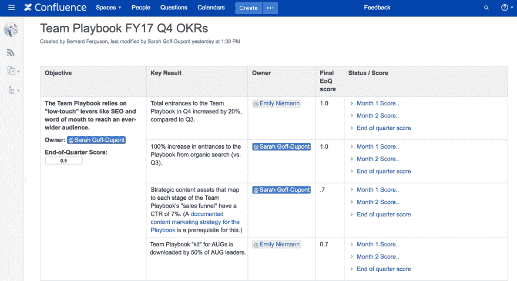
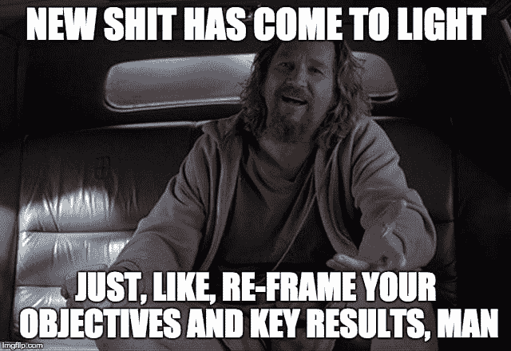

# 讨厌 OKRs？避免这 7 个错误

> 原文:[https://dev . to/atlassian/hate-okrs-avoid-these-7-errors-7jp](https://dev.to/atlassian/hate-okrs-avoid-these-7-mistakes-7jp)

* * *

当我听到它的时候，我的首字母缩写过敏了:OKRs。我在另一家公司完成了 S.M.A.R.T .的目标，它们有点糟糕。季度 As & Os(成就和目标)也是如此。很明显，OKRs 的事情还是老样子。

他们确实有点糟糕。我们会在当前季度还剩整整一个月的时候开始制定下一个季度的 okr，所以感觉我们总是处于计划模式。然后，整整一个季度，我都会在我的 KRs 清单上做我可能会做的事情，想知道如何使它们正式化的那个月不是无意义的开销。

#### *OKRs(“目标和关键结果”)*n .——*又一个企业目标设定框架。*

OKRs 有一点对他们有利，那就是价值链上游的人设定高水平的目标，然后让最接近实际工作的人(比如像我这样的人)来决定我们到底该如何做出贡献。这部分完全有道理，我欣赏这种程度的自主权。

尽管如此，OKRs 仍然感觉像是一种令人困惑且不必要的过程繁重的明星拍摄方式。
[T3】](https://res.cloudinary.com/practicaldev/image/fetch/s--gLEUDm95--/c_limit%2Cf_auto%2Cfl_progressive%2Cq_auto%2Cw_880/https://thepracticaldev.s3.amazonaws.com/i/uqnun0drerbv882uj2uv.png)

然后我意识到我在很多方面都做错了。事实上，我们大多数人都对 OKRs 有所误解。难怪会令人困惑。长话短说，我们理顺了自己，现在 okr 实际上是富有成效的——我将在下面向您展示一些现实生活中的例子。

如果你讨厌 okr，你至少应该确保你做得对(因为你可能无论如何都要做，尽管有愤怒)。下面是一个到处蔓延的错误列表，加上几个你应该知道的额外的反模式。

完全披露:我们没有消除他们所有人。还没有。

### OKRs 的 ABC

如果你已经对基础知识很熟悉，跳过下面的错误。但是对于门外汉来说……目标和关键结果(OKRs)是一个设定目标的框架，通常以季度为基础。您的团队设定了 3-5 个要追求的高层次目标(目的)，以及 2-3 个成功衡量标准，您将使用这些标准来确定您是否达到了目标(关键结果)。

在季度末，你用从 0 到 1 的滑动标度给每个 KR 评分(0 =完全没有进步；1 =您达到或超过了目标；. 1-.9 =介于两者之间)。在这一季度，你检查并根据你目前的跟踪情况预测最终分数。这让 OKRs 在你的脑海中保持新鲜，并作为 OKRs 的早期检测系统，可能需要一些额外的关注。

### 错误 1:混淆主题和目标

“生态系统”不是一个有用的目标。“客户体验”也不是。他们没有说太多关于你想要达到什么目标或者你想去哪里。当然，它们是很好的主题。但它们并不是真正的目标。

相反，写下你的目标，这样你以后可以回头看，清楚地看到你是否达到了目标。

我们设计团队的目标之一是，“改进我们的工艺、速度和设计决策的质量。”他们把它和 KRs 搭配起来，比如“50%的产品发布有一个合格的 UX 记分卡”(我不知道 UX 记分卡是什么，但我相信我们的设计团队知道)。

### 错误二:把你所有的东西都写成 OKRs

你的 KRs 不应该是你和你的团队正在做的每一件事情的详尽清单。属于“照常营业”类别的东西，如修复 bug 或关闭季报，不需要放在那里。

如果你的目标是改变你照常开展业务的方式，这可能值得包括——“缩短客户报告错误的周转时间”或“将延迟提交的费用报告减少 20%。”

okr 是你最高优先级的物品，“刚好够用”就够了。FWIW，我是一个高级别的个人贡献者，我通常每个季度拥有 1-3 kr。

### 错误三:把 KRs 和任务混为一谈

很长一段时间，我写的 KRs 只不过是一个待办事项清单。当他们完成时，检查他们，给他们一个 1 分(一会儿会有更多)，然后今天就到此为止。令人满意，当然…但还是那句话:把我的任务形式化为 KRs 只是感觉像是忙碌的工作。此外，有时候，在季度进行到一半的时候，我意识到这个任务不会让我更接近目标。“但这是一场缠斗！我义不容辞地要坚持到底！”呃。

当我意识到“R”代表“结果”时，我灵光一现。(Duhhh。)

因此，我没有说“发布 3 篇与[团队行动手册](https://www.atlassian.com/team-playbook?utm_source=devto&utm_medium=social&utm_campaign=okr-mistakes)相关的博客文章”，而是开始说“将与行动手册相关的文章的流量提高 15%。”我如何获得 15%的增长是灵活的。我可以推广旧的帖子，为搜索优化它们，发布新的东西，或者它们的组合。此外，达到 15%的增幅似乎是一个巨大的挑战。因为老实说，我可以在睡觉的时候写 3 篇文章。他们会得到糟糕的结果，但我能做到。)

思考结果——而不是产出。

### 错误 4:凭直觉评分

你可能见过类似“更好的客户参与度”这样的 KRs 你怎么能得分呢？？这非常主观，因此在设定目标的背景下毫无意义。

然而，当你将 KRs 描述为可衡量的结果时，它们很容易得分。算算就知道了。回到我上面的“将 Playbook 相关帖子的流量增加 15%”KR，假设我的博客帖子的流量只增加了 5%。我用 5 除以 15，然后嘣:我的 KR 分数是 0.3(大概)。

另一方面，目标经常被清晰地表达出来，以至于你不能客观地给它们打分。但这其实没关系。取所有 KR 分数的平均值，你就得到了 O 分。

[T2】](https://res.cloudinary.com/practicaldev/image/fetch/s--zbRCFzyA--/c_limit%2Cf_auto%2Cfl_progressive%2Cq_auto%2Cw_880/https://cdn-images-1.medium.com/max/1800/1%2AMVh8VHzbRbpJixWCe-E3GA.png)

### 错误 5:用错误的尺度给 KRs 评分

谷歌上有一篇著名的关于 OKRs 的文章,讲述了 0.7 分如何被认为是好的。这导致了我们团队的一些困惑，如果你达到了你的目标，你是否会得到 KR . 7 vs . 1。(论点是，得分 0.7 给你留下了超越它的空间，并为超额完成“获得信贷”。)

是这样的。如果你击中了你的 KR 的目标，你得到 1 分。至少，谷歌是这么做的。如果你超出了目标，你仍然会给它打 1 分——下次考虑设定一个更远大的目标。这让我想到…

### 错误 6:每次 OKR 都得 1 分

7 被认为是好的原因是你的既定目标应该很难达到。如果你大部分时间都在做，那你就没有尽力。或者，你的 kr 实际上只是获得二进制 0 或 1 分数的任务(见上文)。也许两者都是。

我的团队曾经给我们的一个微型网站设定了一个基于 SEO 的流量翻倍的 KR，老实说，这感觉像是一个白日梦。但是瞧，我们做到了！一路上我们学到了很多，如果我们设定了一个目标，我们就可以梦游了，这些就不会发生了。这是我的另一个灵感时刻。

### 错误之七:固执地追求一个伪 OKR

如果不是那块石头，就不要一直凿石头。事情变了，新的信息出现了，等等。如果你不再认为移除或放弃 OKR 是正确的做法，那也没关系。给它打 0 分，用一个正确的代替它。
[T3】](https://res.cloudinary.com/practicaldev/image/fetch/s--Ju-fDYJx--/c_limit%2Cf_auto%2Cfl_progressive%2Cq_auto%2Cw_880/https://cdn-images-1.medium.com/max/1440/1%2A1oIZA1POaWSobjLWBsszpw.jpeg)

OKRs 的一个重要方面是零不可罚。(如果是，那你就真的做错了。)相反，零应该提示问题。为什么我们错过了这么多？为什么这是错误的目标？下一季度怎么才能定一个更好的目标？如果你从零开始学到了东西，你就没有浪费时间。

### 讨厌 OKRs 没关系…但我不再讨厌了

在按照预期的方式(或接近预期的方式)做了几个季度之后，我总体上感觉更专注了。很容易判断出我在这个季度的任何时候应该做什么。如果有人要求我做额外的工作，我可以将其与 OKR 相关的工作进行权衡，并迅速给他们一个是/否的答复。

我也感觉与我周围的人正在做的工作联系更紧密了(作为一名远程员工，这是加倍重要的)。我和我的队友经常拥有各自的 kr，这有助于实现共同的目标，让我们比以前更多地分享信息和想法。

作为一个额外的收获，设定挑战性目标让我不再沉溺于平庸。自满是职业杀手，我离退休还有很多年，不能固步自封。

所以，是的:我已经从一个讨厌 OKR 的人变成了一个重生的 OKRs 支持者。这让我想知道我的生活中还有什么看起来有点糟糕…但只是因为我做错了。