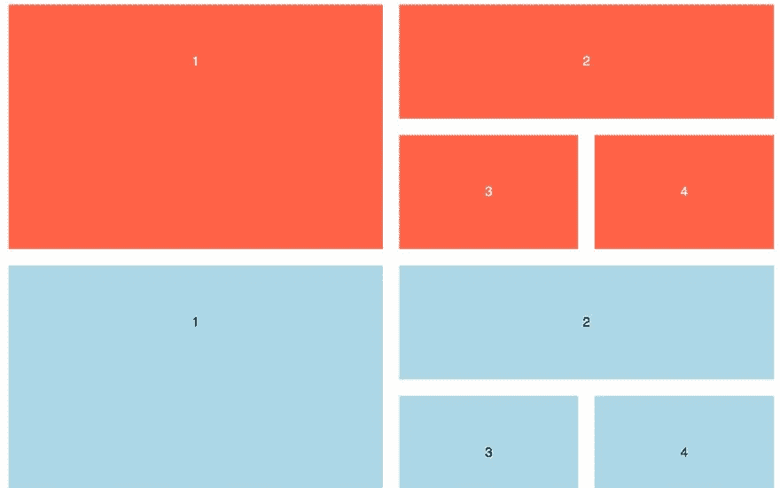
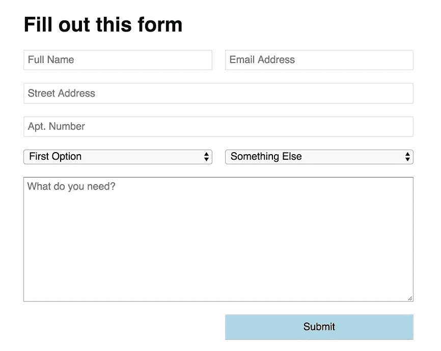

# CSS 网格入门的 3 个策略

> 原文:[https://dev . to/brob/3-strategies-for-getting-started-with-CSS-grid-ep3](https://dev.to/brob/3-strategies-for-getting-started-with-css-grid-ep3)

CSS 网格布局出现在主流浏览器中已经两年多了。尽管知情人士对此感到兴奋，但并非所有人都加入了进来。

我明白。尽管浏览器在创纪录的时间内被采用，我们有时仍然生活在 IE 的世界里。

虽然 2017 年是 CSS Grid 的浏览器采用年，但 2018 年和 2019 年是其开发者采用年。

如果你想知道如何开始，这里有三个将它应用到你的工作流程中的策略。

## 减少过度加价

在过去的五年里，我们对更好设计的需求增加了。由于这一点，以及我们对旧布局技术的依赖，我们看到了嵌套标记的爆炸式增长。

以这个简单的促销网格布局为例。

[T2】](https://res.cloudinary.com/practicaldev/image/fetch/s--0cCURrs0--/c_limit%2Cf_auto%2Cfl_progressive%2Cq_auto%2Cw_880/https://bryanlrobinson.cimg/grid-comparison.jpg)

为了实现这一点，我们必须引入大量标记来在行内添加行。

```
<section class="flexgrid">
<div class="left-side">
    <div class="item">1</div>
</div>

<div class="right-side">

    <div class="right-top">
        <div class="item">2</div>
    </div>

    <div class="right-bottom">
        <div class="item">3</div>
        <div class="item">4</div>
    </div>

</div>
</section> 
```

<svg width="20px" height="20px" viewBox="0 0 24 24" class="highlight-action crayons-icon highlight-action--fullscreen-on"><title>Enter fullscreen mode</title></svg> <svg width="20px" height="20px" viewBox="0 0 24 24" class="highlight-action crayons-icon highlight-action--fullscreen-off"><title>Exit fullscreen mode</title></svg>

跟踪筑巢是一件令人头疼的事情。它也对抗干净的、语义化的 HTML。

让我们采用同样的设计，构建 CSS 网格所需的 HTML。

```
<section class="grid">
    <div class="grid__item">1</div>
    <div class="grid__item">2</div>
    <div class="grid__item">3</div>
    <div class="grid__item">4</div>
</section> 
```

<svg width="20px" height="20px" viewBox="0 0 24 24" class="highlight-action crayons-icon highlight-action--fullscreen-on"><title>Enter fullscreen mode</title></svg> <svg width="20px" height="20px" viewBox="0 0 24 24" class="highlight-action crayons-icon highlight-action--fullscreen-off"><title>Exit fullscreen mode</title></svg>

有了一个父母和四个直系子女，我们可以完成不均匀的行和列。

网格布局的承诺是语义标记和关注点真正分离的承诺。

[并排查看我的布局代码笔](https://codepen.io/brob/pen/GQRXMe?editors=0100)

我在这里更深入地探讨了这个模式:

[](/brob) [## 网格 vs. Flex:“简单”促销空间的故事

### 布莱恩·罗宾逊 1914 年 5 月 30 日阅读

#css #cssgrid #design #tutorial](/brob/grid-vs-flex-a-tale-of-a-simple-promo-space-p96)

## **构建多栏表单**

当你简化你的标记时，你也可以看看如何升级你的表单游戏。

当然，一个单栏的表单可以完成任务，但是为什么不用多栏来增加一点趣味呢？

[T2】](https://res.cloudinary.com/practicaldev/image/fetch/s--LzQNZ-GL--/c_limit%2Cf_auto%2Cfl_progressive%2Cq_auto%2Cw_880/https://bryanlrobinson.cimg/2-column-form.jpg)

不要在一个表单中设置多行内容，而是将表单分为两列，并让某些区域伸展。

在这个例子中，我们希望街道地址和评论框有更多的空间来方便书写。

通过创建一个使用 grid-column: span 2 的“fullwidth”类，我们可以让一个输入改变它的布局。其他可以更小的输入并排保留。

```
.form {
    display: grid;
    grid-template-columns: 1fr 1fr;
    grid-gap: 20px;
}
.fullwidth {
    grid-column: span 2;
} 
```

<svg width="20px" height="20px" viewBox="0 0 24 24" class="highlight-action crayons-icon highlight-action--fullscreen-on"><title>Enter fullscreen mode</title></svg> <svg width="20px" height="20px" viewBox="0 0 24 24" class="highlight-action crayons-icon highlight-action--fullscreen-off"><title>Exit fullscreen mode</title></svg>

[查看 CodePen 上的示例](https://codepen.io/brob/pen/BYyrjw?editors=1100)

## **用网格布局代替自举或基础网格**

我试着写了很多关于网格布局带来新的设计选项的文章，但是有时候使用经过测试的方法是值得的。

如果你想一步一步进入网格，试着重新创建你的 12 列引导或基础网格。

从简单的网格声明和设置开始。

```
.grid {
    display: grid;
    grid-template-columns: repeat(12, 1fr);
    grid-column-gap: 10px;
} 
```

<svg width="20px" height="20px" viewBox="0 0 24 24" class="highlight-action crayons-icon highlight-action--fullscreen-on"><title>Enter fullscreen mode</title></svg> <svg width="20px" height="20px" viewBox="0 0 24 24" class="highlight-action crayons-icon highlight-action--fullscreen-off"><title>Exit fullscreen mode</title></svg>

从那里，您可以设置跨越不同列数的类。

```
.span3 {
    grid-column: span 3;
}
.span9 {
    grid-column: span 9;
} 
```

<svg width="20px" height="20px" viewBox="0 0 24 24" class="highlight-action crayons-icon highlight-action--fullscreen-on"><title>Enter fullscreen mode</title></svg> <svg width="20px" height="20px" viewBox="0 0 24 24" class="highlight-action crayons-icon highlight-action--fullscreen-off"><title>Exit fullscreen mode</title></svg>

我打赌你能想出剩下的。

如果你正在寻找开始，这是你工作流程中的一个简单的转变。这不是网格的最佳用途。开始扩展你的思维，在传统的网格概念之外工作。

## **奖励:制作一个没有媒体询问的响应式网格**

网格布局中最酷的特性之一是 repeat()和 minmax()函数的组合。

我写了一篇关于如何制作一个没有媒体质疑的流动卡片网格的博文。它非常光滑。

## 开始试验网格

最重要的是，这代表了我们开发网站方式的转变。它需要你在里面玩耍和工作。

无论您采用什么策略来学习网格，都要开始学习。

### 免费电子书-常用 CSS 网格模式

CSS 网格是网页布局的一次革命。在这本电子书中，我介绍了 Grid 更容易、更好、更有创造性地解决的 3 种设计模式，以帮助我们的设计朝着更好的方向发展。

[立即下载！](https://store.codecontemporary.com/solving-three-design-problems-with-css-grid/buy)