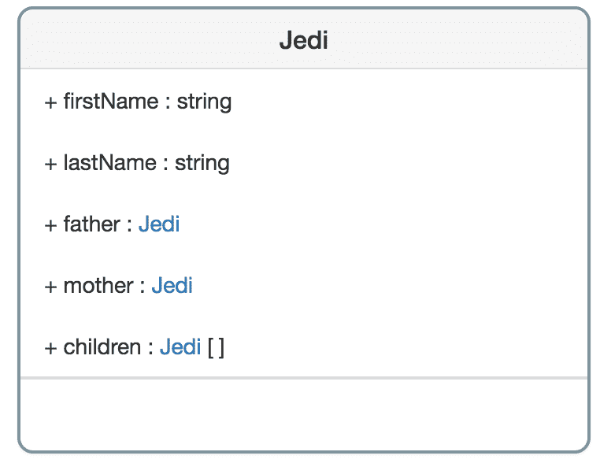
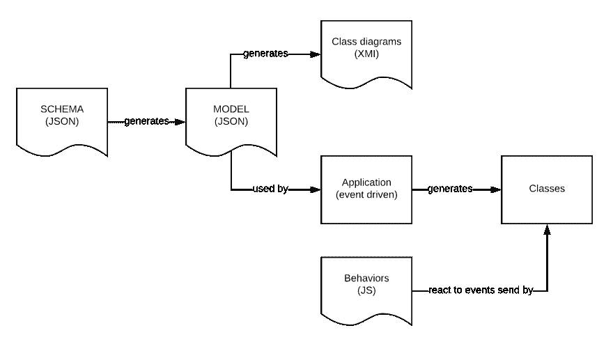

# 用 JavaScript 设计模型

> 原文：<https://dev.to/ecarriou/designing-models-in-javascript-53je>

我的曾祖母是一个叫 brodeuse 的人，法语中是刺绣者的名字。她为我的家人做了漂亮的[传统服装](https://en.wikipedia.org/wiki/Breton_costume)，我们非常珍惜。最近在打扫她的家时，我们发现了一个宝藏，她用来制作衣服的图案。她过去常常在很大很大的纸上画她的图案。通过看图案，我们可以清楚地了解她想做什么样的衣服。

我可以停止拿我们的工作做类比。在开发时，我们避免了太多次这种基本的设计步骤。我们在设计应用程序的模型之前就开始编码，只是因为我们认为代码就是模型。事实并非如此。**代码只是构成应用程序的结构**。通过阅读代码，我们只能猜测使用了什么模型、模式来创建应用程序。此外，因为我们是人，因为我们的思维方式因开发人员而异，我们还需要理解开发人员在编码时的心理空间组织。这并不容易。

## 分离顾虑

这就是为什么不管你使用什么样的框架和编写什么样的代码，最重要的是你定义的创建应用程序的模型。并且这个**模型不一定要在代码**中。**它必须在别的地方**，**以人类可读的格式**规范化。但是什么格式呢？我们可以使用 [UML](http://uml.org) ，它现在很常见，有很多设计工具都在使用它。但问题是，它不是一种格式，它是一种语言。当你需要理解一个图表的时候，它是相当复杂的，而且不是那么人性化。我知道 UML 图可以保存为 XMI 的格式，但是它是为机器而不是人为的。

## 创建模型的模式

让我们用一个例子找到我们需要的格式。假设我们想要创建一个绝地的模型。一个*绝地*是由它的*名*和*姓*定义的，她/他有一个*母亲*和一个*父亲*，并且可以生孩子。假设我们**将所有与这个模型相关的信息放入一个 JSON 文件**，我们可以得到这样的结果:

```
{  "_name":  "Jedi",  "firstName":  "property",  "lastName":  "property",  "mother":  "link",  "father":  "link",  "children":  "collection"  } 
```

Enter fullscreen mode Exit fullscreen mode

当阅读这篇 JSON 时，我们很容易理解:

*   一个绝地有两个**属性**、*名*和*姓*，
*   一名绝地**与**的*母亲*和*父亲*联系在一起
*   一个绝地有一个*孩子*的**集合**。

这个 JSON 实际上是我们模型的**模式**。

## 生成模型并扩展

能够定义这样一个模型就太好了，对吧？现在我们有了这个模式，让我们更进一步。如果我们能够**从模型**中生成 UML 类图，得到这样的结果会怎么样:

[T2】](https://res.cloudinary.com/practicaldev/image/fetch/s--SwSxRvEL--/c_limit%2Cf_auto%2Cfl_progressive%2Cq_auto%2Cw_880/https://thepracticaldev.s3.amazonaws.com/i/a672irh1rrhifcsaf4jx.png)

为了做到这一点，我们缺少一些基本信息，如属性的类型。如何处理我们的文件？通过简单地**从模式中用缺省值生成一个完整的模型，然后编辑它** :

```
{  "_name":  "Jedi",  "firstName":  {  "type":  "any",  "readOnly":  false,  "mandatory":  false,  "default":  ""  },  "lastName":  {  "type":  "any",  "readOnly":  false,  "mandatory":  false,  "default":  ""  },  "mother":  {  "type":  "Component",  "readOnly":  false,  "mandatory":  false,  "default":  ""  },  "father":  {  "type":  "Component",  "readOnly":  false,  "mandatory":  false,  "default":  ""  },  "children":  {  "type":  ["Component"],  "readOnly":  false,  "mandatory":  false,  "default":  []  }  } 
```

Enter fullscreen mode Exit fullscreen mode

我们这里有所有在*模式*中定义的信息，我们可以以人类可读的格式编辑它们。例如，对于*的名字*，我们可以将其*类型*(默认值为 *any* ，这意味着它可以有任何类型)设置为*字符串*。

从这个 JSON 中，很容易生成一个 UML 类图。我们有完整的*模型*来构建应用程序。

## 运行时使用模型

那么代码呢？在[模型驱动架构方法](http://www.omg.org/mda/)中，我们从模型中生成代码，通常是从 UML 图中。这很好，但并不完美，因为我们定义的模型与代码不同步的风险更高。那么如何避免这种情况呢？通过简单地**在运行时使用应用程序的模型定义**。**应用程序必须读取我们定义的模式和模型，以创建模型的类、方法和组件**。

是的，看起来很酷，但是如果它是在运行时生成的，我该如何实现这些方法呢？为此**你需要[在系统中思考](https://dev.to/ecarriou/designing-systems-17po)** 。**方法就是系统对事件**做出反应时的一个动作。

在我们的例子中，假设我们需要在 *Jedi* 中有一个方法来获取她/他的全名。所以我们将编辑**模式**，使其类似于

```
{  "_name":  "Jedi",  "firstName":  "property",  "lastName":  "property",  "mother":  "link",  "father":  "link",  "children":  "collection",  "fullName":  "method"  } 
```

Enter fullscreen mode Exit fullscreen mode

我们在*模式*中添加了*全名* **方法**。所以我们在生成的模型中会有:

```
{  "_name":  "Jedi",  "firstName":  {  "type":  "any",  "readOnly":  false,  "mandatory":  false,  "default":  ""  },  "lastName":  {  "type":  "any",  "readOnly":  false,  "mandatory":  false,  "default":  ""  },  "mother":  {  "type":  "Component",  "readOnly":  false,  "mandatory":  false,  "default":  ""  },  "father":  {  "type":  "Component",  "readOnly":  false,  "mandatory":  false,  "default":  ""  },  "children":  {  "type":  ["Component"],  "readOnly":  false,  "mandatory":  false,  "default":  []  },  "fullName":  {  "params":  [  {  "name":  "param",  "type":  "any",  "mandatory":  false,  "default":  null  }  ],  "result":  "any"  }  } 
```

Enter fullscreen mode Exit fullscreen mode

默认情况下， *fullName* 带一个可选参数，可以返回任何类型的*值。现在假设我们想要实现这个方法。怎么做呢？通过简单的**在全名事件发送时添加一个行为** :* 

```
// require the Jedi class
const Jedi = runtime.require('Jedi');
// add a behavior
Jedi.on('fullName', () => this.firstName() + '  ' + this.lastName()); 
```

Enter fullscreen mode Exit fullscreen mode

这个事件什么时候发送？当代码中调用 *fullName* 方法时。事实上这个方法已经从模型中生成，当我们调用它时，它只是发送一个同步的*全名*事件。然后将执行与该事件相关的现有行为。

现在，如果我们改变方法的模型，它将永远不会覆盖它的行为。

## 结论

以下是设计模型时要遵循的不同步骤:

[T2】](https://res.cloudinary.com/practicaldev/image/fetch/s--GdrFgXxx--/c_limit%2Cf_auto%2Cfl_progressive%2Cq_auto%2Cw_880/https://thepracticaldev.s3.amazonaws.com/i/fmqgmkkgpxelwpzq61xb.png)

*   **以人类可读的格式在高层次定义您的模型**。
*   将从该模式中生成一个模型。
*   **编辑生成的模型**以指定模型的类型、默认值等。
*   使用这个模型在运行时创建你的模型的类、方法和组件。
*   **使用事件驱动的方法构建您的应用程序，向方法中添加行为**。
*   使用你的模型生成 UML 类图。

如果你想看到这种方法的具体应用，你可以看看我的两个项目:

*   [系统运行时](https://github.com/design-first/system-runtime)，一个运行和管理系统的 JavaScript 库
*   [系统设计师](https://github.com/design-first/system-designer)，一个设计系统的 web IDE

深入使用这种方法。为此，我创建了[**格式**](https://designfirst.io/systemruntime/documentation/docs/en/design-your-model.html#defining-your-model)**(用于*元模型 JavaScript 对象符号*)来以人类可读的格式定义模型。但这并不是这种方法的唯一可能的实现，请找到符合您需求的方法。**

 *** * *

*演职员表:封面图片由[克里斯蒂安·坎德尔](https://unsplash.com/@christiankaindl)拍摄。***