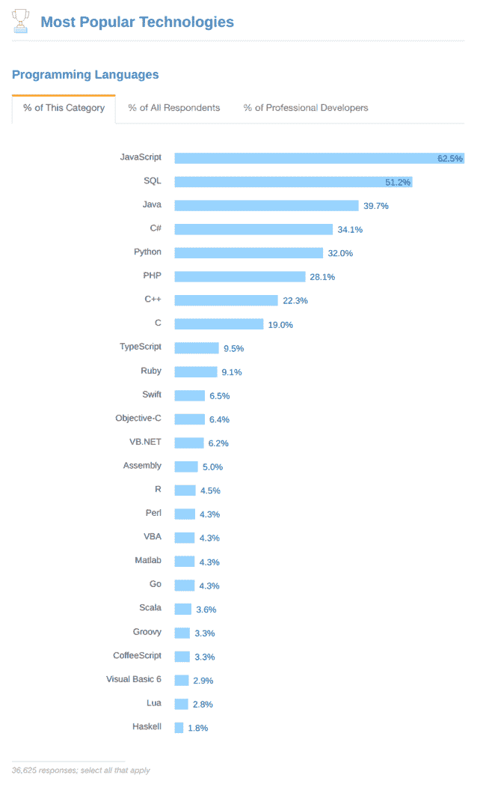
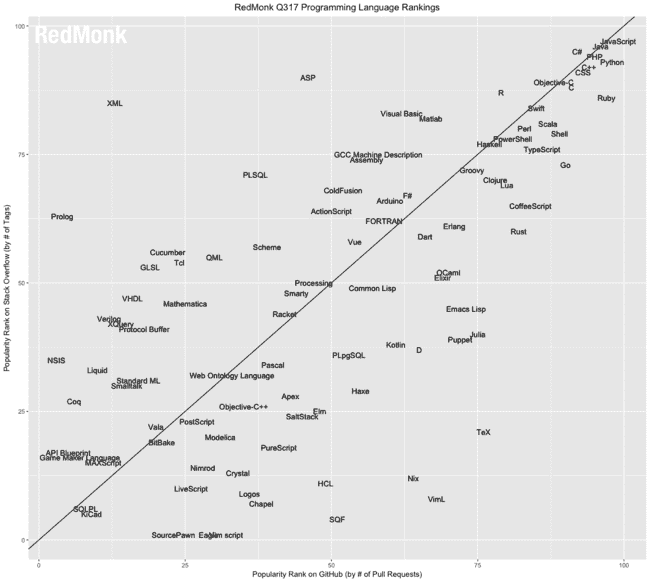
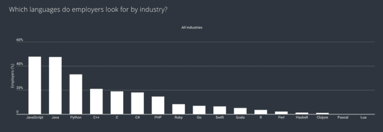
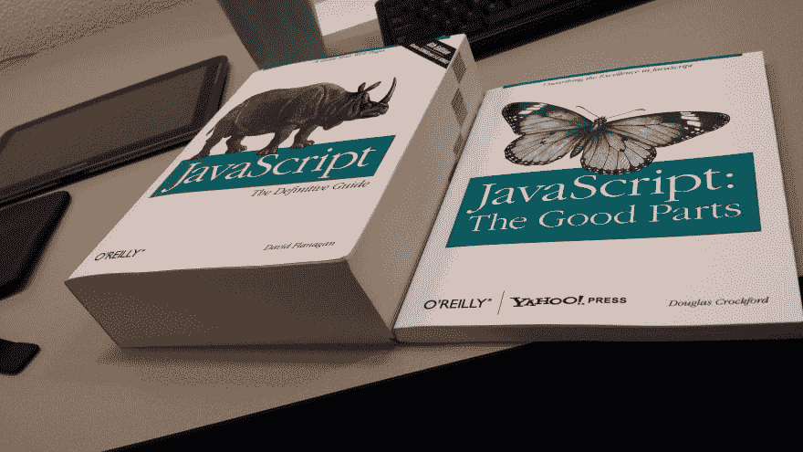

# JavaScript 的成功给我们上了最重要的一课

> 原文：<https://dev.to/remojansen/the-most-important-lesson-that-the-success-of-javascript-has-taught-us-4ike>

JavaScript 在过去的十年里经历了惊人的流行。根据 stack overflow[【1】](https://insights.stackoverflow.com/survey/2017)的年度开发者调查，JavaScript 是当今世界上最流行的编程语言:

[T2】](https://res.cloudinary.com/practicaldev/image/fetch/s--KUYsm_wz--/c_limit%2Cf_auto%2Cfl_progressive%2Cq_auto%2Cw_880/https://svbtleusercontent.com/h8ojppccedhaq_small.png)

JavaScript 还在其他研究和调查中领先，如 Redmonk 的季度编程语言排名[【2】](http://redmonk.com/sogrady/2017/06/08/language-rankings-6-17/)或 hacker rank[【3】](https://research.hackerrank.com/developer-skills/2018/)的 2018 年开发者技能报告:

[T2】](https://res.cloudinary.com/practicaldev/image/fetch/s--XM_rGVls--/c_limit%2Cf_auto%2Cfl_progressive%2Cq_auto%2Cw_880/https://svbtleusercontent.com/9cjam0o4rodlfg_small.png)

[T2】](https://res.cloudinary.com/practicaldev/image/fetch/s--0i0O3WKu--/c_limit%2Cf_auto%2Cfl_progressive%2Cq_auto%2Cw_880/https://svbtleusercontent.com/6arkkhxzowutla_small.png)

JavaScript 的成功如此引人注目，以至于我们甚至有了一条关于它的“定律”:

> 任何可以用 JavaScript 编写的应用程序，最终都会用 JavaScript 编写。

然而，JavaScript 的成功并非没有诋毁者。JavaScript 是一些著名笑话的灵感来源:

[T2】](https://res.cloudinary.com/practicaldev/image/fetch/s--YGIyBvKX--/c_limit%2Cf_auto%2Cfl_progressive%2Cq_auto%2Cw_880/https://svbtleusercontent.com/cgddjt9nrsautg.jpg)

JavaScript 一直是许多负面批评的焦点，甚至被一些人描述为“一种群体精神病现象”:

> JavaScript 程序员被误导了，认为 JavaScript 是一种好的编程语言。总统谈到了“群体精神病”和“群体思维”，但我使用了斯德哥尔摩综合症和邪教心理学的类比。想想帕蒂·赫斯特和山达基。

然而，所有这些负面评论似乎都没能阻止它变得异常成功。所以，一段时间以来我一直在问自己一个问题:为什么？JavaScript 为什么这么成功？

# 无障碍事宜

如果我们可以用一个词来解释 JavaScript 的成功，那会是什么？答案是**可达性**。

我认为“可访问性”是为有残疾的人设计的产品、设备、服务或环境。然而，根据牛津词典，术语可访问性有更广泛的含义:

> ### 可达性
> 
> #### /əksɛsɪˈbɪlɪti/
> 
> 名词
> 
> *   能够到达或进入的性质。
> *   容易获得或使用的性质。
> *   容易理解或欣赏的性质。

请不要误解我的意思，我并不是想强调为残疾人设计产品的重要性。这是非常重要的是要有同理心，并确保当我们创造的东西，它也可以被残疾人所享受。

我最近在读尤瓦尔·诺亚·哈拉里的《德乌斯人:明日简史》一书，他认为使人类能够征服世界的并不是人类独有的意识，因为动物在不同程度上也有意识。独一无二的是我们有能力大量合作。

> 附注:如果你觉得这个想法很有趣，你可能会喜欢读《德乌斯人》或者看 TED 演讲“为什么人类统治世界”。

当大量的人合作时，我们能够成就伟大的事情。群体越大，成就越大。如果我们希望能够猜测某个事物将会发展和进步多少，我们需要做的就是测量这个事物周围的社区有多大。可访问性使得 JavaScript 社区的发展成为可能，而社区也使得它的进步和发展成为可能。

JavaScript 的成功教给我们的最重要的一课是，当构建一个产品、应用程序、服务、框架、库或其他东西时；如果我们致力于为每个人创造无障碍的环境，我们会取得更好的结果。如果一开始我们正在创建的东西缺乏特性，或者速度不如我们希望的那样快，或者不能像我们希望的那样扩展，这都没有关系。如果我们的产品是可访问的，围绕它的社区将增长，然后社区将培养维持长期成功所需的创造力和创新。

同样重要的是，要思考这样一个事实，即这是一个可以应用于许多不同类型的组织的教训。开源项目、创业公司、研究集体和政府只是其中的一部分。

## 关注可达性

在这一点上，我们的主要问题应该是:我们如何才能关注可访问性？

我的第一个建议是练习一厢情愿的编程。如意编程[【8】](https://blog.thesoftwarecraft.com/2013/11/wishful-programming.html)是一种非常强大的编程实践，可以帮助我们创建可访问的 API。然而，许多程序员并没有意识到这一点:

> 在我们实现组件之前，编写一些使用组件的代码。这有助于发现我们需要什么样的函数和数据，而遵循这一发现将会引导我们找到更简单、更有用的 API。

当我们实践一厢情愿的编程时，我们把精力集中在创建简单而有用的 API 上。要做到这一点，我们可以问自己，在我们实施之前，允许某人尝试、安装、使用、理解、扩展某样东西的最简单、最简单的方法是什么。

我的第二个建议是努力确保我们的社区也是可访问的，而不仅仅是我们的产品。我们可以通过促进多样性和包容性来实现这一目标。

你喜欢这篇文章吗？你有任何其他想法可以帮助我们关注可访问性吗？请让我知道。

感谢阅读！