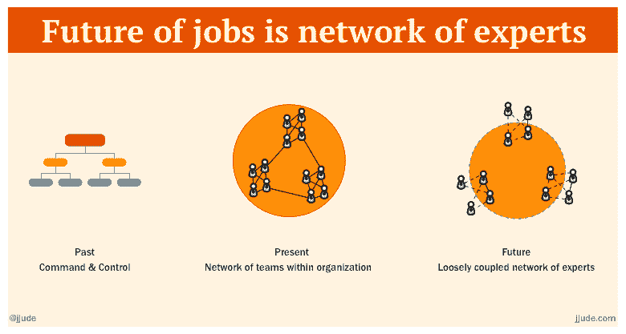

# 我已经看到了乔布斯的未来，这是好莱坞模式

> 原文:[https://dev . to/j Jude/I-have-see-the-future-of-jobs-and-it-is-Hollywood-model-i55](https://dev.to/jjude/i-have-seen-the-future-of-jobs-and-it-is-hollywood-model-i55)

*这是我在我的[博客](https://jjude.com/future-of-jobs/)上发布的帖子的摘要。*

A.R .拉赫曼和丹尼·鲍伊尔首次合作是因为广受欢迎的电影《贫民窟的百万富翁》。这部电影获得了八项奥斯卡奖和七项英国电影电视艺术学院奖。从那以后，他们多次合作。

作为好莱坞的球员，拉赫曼和丹尼·鲍伊尔并不为对方工作。事实上，他们不为任何人工作。安东尼奥·帕拉伊索在他的 *[波尔图商学院讲座](https://www.youtube.com/watch?v=1HIVBmjtt5g)* 中讨论好莱坞的工作模式时说:“他们**失业**。正如他在演讲中解释的那样，他们有自己的事业，而不是工作。他们不为公司工作，他们从事有趣的项目。

在传统的 IT 行业，公司雇佣员工的时间是**长期**。他们可能会接受培训或参与客户项目，或留在“板凳”上，或接受再培训，或被要求离开。看到员工在同一家公司工作几十年是很常见的。只要他们在一家公司工作，员工只在雇佣他们的公司内的**项目上工作。**

[T2】](https://res.cloudinary.com/practicaldev/image/fetch/s--tNyLfGLZ--/c_limit%2Cf_auto%2Cfl_progressive%2Cq_auto%2Cw_880/https://cdn.jjude.com/future-of-jobs.png)

好莱坞颠覆了这一模式。

没有一家工作室会长期雇佣导演、音乐家或编辑。正如安东尼奥所说，好莱坞的人没有工作；他们从事项目。工作室确定一个项目，并为该项目召集一个合适的团队。团队根据需要一起工作，直到完成项目——不管是六个月还是三年。成员可以根据需要来来去去。一些成员可能专门从事一个项目；有些人可能同时从事许多项目。他们一起工作**为自己和他人创造价值**。有些得到报酬；有些人分享利润。当项目完成后，他们继续前进。他们可能会也可能不会再次合作。

## 政府在其首要项目中采用好莱坞模式

印度政府(GoI)在最大的生物识别身份系统 [**UIDAI**](https://uidai.gov.in/) 项目中采用了这种模式。一旦 GoI 确定了项目，它就任命[南丹·尼勒卡尼](https://en.wikipedia.org/wiki/Nandan_Nilekani)负责项目实施。

GoI 还引进了同样模式的 Slideshare 的联合创始人阿密特·兰詹和 T2。

Taavi Kotka 是波罗的海地区最大的软件开发公司的总经理。爱沙尼亚政府任命他为首席信息官，负责设计广受欢迎的爱沙尼亚电子居留计划。

## 现在是公司拥抱这种模式的时候了

技术正在渗透到每个领域。像区块链这样的新技术和 GDPR 这样的新法规正以前所未有的速度涌现。这种变化会扰乱但也会带来巨大的机遇。任何公司都不可能在内部培养必要的人才来利用这些机会。公司繁荣的唯一途径是接受这种好莱坞式的基于项目的价值创造。

## 对开发者意味着什么

直到现在，如果你从工程学院毕业，你可以进入软件公司。一旦你进入一家公司，如果你努力工作，你就有很好的机会在这家公司成长。

不再是了。

多莉·克拉克是这方面的两本书的作者——《重塑你》和《脱颖而出》。她确定了在嘈杂的世界中脱颖而出的三个基本技巧。她在她的 [HBR 文章](https://hbr.org/2017/01/what-you-need-to-stand-out-in-a-noisy-world)中写道:

> 这些是**社交证明**，给人一个听你说话的理由；**内容创作**，让他们评估你创意的质量；还有你的**网络**，它让你的想法得以传播。

如果你想在好莱坞模特界工作，你的关系网起着重要的作用。“谁知道谁”是这个模型中的一个重要方面。你仍然需要创建一个投资组合，并把它公之于众。这反过来会扩大你的人际网络，因为新的人会接触到你的工作。

在科学管理的幌子下，整体专业知识退化为狭隘的专业化。随着世界变得越来越协作，我们都应该发展跨学科的技能。具体来说，我们应该成为“T”型专家——在几个领域拥有深厚的专业知识，并对其他相关领域有基本的了解。

正如罗伯特·海因莱茵所说:

> “一个人应该能够换尿布，策划入侵，杀猪，造船，设计建筑，写十四行诗，结算账目，建一堵墙，接骨，安慰垂死的人，接受命令，发号施令，合作，独自行动，解方程，分析新问题，扔粪肥，给计算机编程，做一顿美味的饭菜，高效率地战斗，英勇地死去。**专精是为了昆虫**。

彼得·梅勒尔为开发者们重新定义了它:

> 一个程序员应该能够修复一个 bug，销售一个应用程序，维护一个遗产，领导一个团队，设计一个架构，破解一个内核，安排一个项目，设计一个类，路由一个网络，给出一个参考，接受订单，下订单，使用配置管理，原型，应用模式，创新，写文档，支持用户，创建一个酷的网站，有效地发送电子邮件，平稳地辞职。专业化是招聘人员的事。

## 对一些人来说是福音，对另一些人来说是悲剧

好莱坞模式不会对所有人都是好消息。历史会重演。能适应的人会成功。其他的可能会在歌曲中出现。

赢家通吃
输家不得不倒下
这很简单明了
我为什么要抱怨

*在我的[博客](https://jjude.com/future-of-jobs/)* 阅读全文