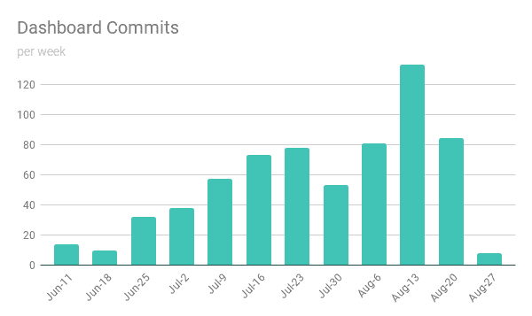

# 提高开发速度的限制

> 原文:[https://dev . to/nylas/raising-the-limits-on-developer-speed-4d GL](https://dev.to/nylas/raising-the-limits-on-developer-speed-4dgl)

### 我们如何使用 React/Redux、Jest 和 automation 在短短三个月内重建我们的仪表板

直到五个月前，我们的[仪表盘](https://dashboard.nylas.com)还很慢，功能有限，而且(最糟糕的是)写得很有棱角。我们对 Angular 本身没有什么特别的反对意见，但是我们团队中没有人对它有任何重要的经验。这意味着即使是修复一个很小的 bug 也需要付出很大的努力。我们有很大的计划要在我们的仪表板上添加一些很棒的功能——组织、每个用户多个应用程序、可查询的日志等等！—但是我们不相信在我们的遗留代码之上构建是对我们时间的最好利用。所以我们放弃了。

我们的目标是以一种能够使我们快速有效地开发的方式来构建新的仪表板。我们知道我们想要使用 React，以便与我们内部的其他 JavaScript 项目保持一致，但是仪表板有大量的应用程序状态，所以我们决定也使用 Redux。我们从 Bumpers 的 *[开始，难道我们的代码不是最好的吗🙄](https://medium.com/bumpers/isnt-our-code-just-the-best-f028a78f33a9)篇*。

与许多 Redux 应用程序中常见的将所有存储文件直接放在`/store`级别不同，我们将存储分成几个子目录，每个子目录都有自己的动作、reducers 和选择器文件。这些子目录中的每一个都对应于我们的一个模型，例如帐户、组织、应用程序等。通过将相关代码组合在一起，这使得开发速度更快。现在，当有人想对账户状态进行更改时，他们只需导航到`/store/account`就可以找到代码，而不必在大量文件中`ctrl+f`将不同模型的所有代码捆绑在一起。

*旁注:我们从 Bumpers 文章中得到的另一点是在每个商店子目录中添加了一个端点文件。API 调用可以在这个文件中处理，并由 actions 文件依次调用。这是一个很好的关注点分离，可以很容易地切换动作或 API 接口，而不会影响另一个，并为测试提供了一个干净的存根接口。*

这种分离使得修改商店变得非常容易，但不幸的是，添加新商店需要大量的准备工作。对于每个新商店，我们必须创建一个新目录，添加一堆文件，并编写相同的初始框架代码——所有这些工作都可以自动化！我们编写了一个脚手架脚本来完成这项工作，并将它添加到我们的 *package.json* 文件中。我们可以通过`yarn scaffold <type> <name>`用 Yarn 运行这个脚本。我们在这个脚本中添加了其他几段框架代码，这样我们就可以快速创建组件和模型定义以及商店。这使得添加新代码的过程变得非常简单和快速。大部分代码只需要增加一些细节，然后就可以运行了。👍

我们为提高开发速度所做的另一件事是使用 [Jest](https://facebook.github.io/jest/) 进行测试。我们相信测试是开发的一个重要部分，但是编写测试会大大减慢开发过程。Jest 的视觉输出非常棒(与 Python 的 pytest 不相上下)，但真正的亮点是它的快照概念。

使用 Jest 的快照就像`expect(testData).toMatchSnapshot()`一样简单。首次运行该测试时，将提示用户检查`testData`并确认其具有预期值。Jest 然后用确认的数据值创建一个快照文件。在每个后续的测试运行中，Jest 会将`testData`的当前值与存储在快照中的值进行比较。如果值不匹配，控制台将显示两个值之间的差异，并询问是否应该更新快照。

这比 1)在最初编写测试时(特别是当它有一个复杂的结构时)计算出数据的值应该是什么，以及 2)当某些东西确实合理地改变时(这在早期开发阶段经常发生)，必须去改变一堆硬编码的测试值要快得多。我们能够将框架测试添加到我们的 scaffold 脚本中，因此每个 React 组件都会自动得到一个测试，如下所示:

```
// @flow
import React from 'react';
import renderer from 'react-test-renderer';
import NewComponent from './index';

test('renders as expected', () => {
  const component = renderer.create(<NewComponent />);
  const tree = component.toJSON();
  expect(tree).toMatchSnapshot();
}); 
```

<svg width="20px" height="20px" viewBox="0 0 24 24" class="highlight-action crayons-icon highlight-action--fullscreen-on"><title>Enter fullscreen mode</title></svg> <svg width="20px" height="20px" viewBox="0 0 24 24" class="highlight-action crayons-icon highlight-action--fullscreen-off"><title>Exit fullscreen mode</title></svg>

这有助于确保我们所有的组件都经过测试。如果是简单的组件，骨架测试就足够了。如果它是一个更复杂的组件，测试将会失败，并提示开发人员更新测试以使其更加准确。这有效地消除了开发人员忘记为组件编写测试的情况，并且不必做任何额外的工作来测试更简单的组件是一个巨大的优势。

*旁注:我们在[工具博客文章](https://dev.to/nylas/how-do-we-even-js-the-components-of-nylass-javascript-stack-6h)中提到的自动格式化程序 Prettier 也为我们的开发速度创造了奇迹。你不会意识到你在间隔上花了多少时间，直到你不再需要这样做。*

随着这些变化被整合到我们的工作流程中，我们的开发速度越来越快。我们在惊人的 12 周内完成了整个仪表板项目(以及支持我们想要实现的新特性所必需的相关后端更改)。我们从这次经历中学到的关键教训是，将最初的时间投入到构建一个强大的开发基础上是非常值得的！对于这个项目来说，构建这样一个坚实的基础包括以一种功能性的方式将代码分组在一起，并尽可能多地自动化模式。展望未来，我们一定会在其他项目中寻找同样的方法！

[](https://res.cloudinary.com/practicaldev/image/fetch/s--Ray-rVJx--/c_limit%2Cf_auto%2Cfl_progressive%2Cq_auto%2Cw_880/https://www.nylas.com/hs-fs/hubfs/blog%2520images/dashboard.png%3Ft%3D1516818502866%26width%3D1200%26name%3Ddashboard.png) 
*我们对仪表板项目的提交数量呈上升趋势，直到它接近完成。这是一个由 4-5 名工程师组成的团队完成的，具体视周而定。*

* * *

这篇文章最初发表在 Nylas 工程博客上。