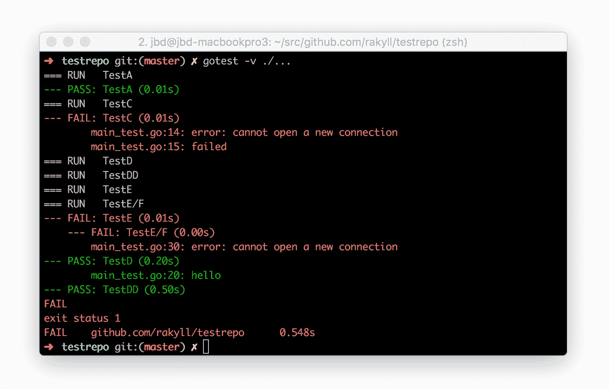

# 我关于 goroutine/defer 的愚蠢错误

> 原文：<https://dev.to/mattn/my-stupid-mistake-about-goroutinedefer-5ddb>

今天，我发现了一个小程序，它可以显示 go 测试(例如:通过/失败)输出的绿色或红色。

[https://github.com/rakyll/gotest](https://github.com/rakyll/gotest)

[T2】](https://camo.githubusercontent.com/2c01f8f54692b861595ca8c6207c1cefcef03a34/68747470733a2f2f692e696d6775722e636f6d2f75646a57755a782e676966)

这是很好的看到容易通过或失败的测试。玩了一段时间这个，遇到了 gotest 的一个奇怪行为。输出的部分经常不显示。但我很快就能找出原因。

```
func main() {
    setPalette()
    enableOnCI()
    gotest(os.Args[1:])
}

func gotest(args []string) {
    r, w := io.Pipe()
    defer w.Close()

    args = append([]string{"test"}, args...)
    cmd := exec.Command("go", args...)
    cmd.Stderr = w
    cmd.Stdout = w
    cmd.Env = os.Environ()

    go consume(r)

    if err := cmd.Run(); err != nil {
        if ws, ok := cmd.ProcessState.Sys().(syscall.WaitStatus); ok {
            os.Exit(ws.ExitStatus())
        }
        os.Exit(1)
    }
}

func consume(r io.Reader) {
    reader := bufio.NewReader(r)
    for {
        l, _, err := reader.ReadLine()
        if err == io.EOF {
            return
        }
        if err != nil {
            log.Fatal(err)
        }
        parse(string(l))
    }
} 
```

Enter fullscreen mode Exit fullscreen mode

当外部命令退出，并完成调用`cmd.Run()`时，goroutine `consume`必须完成读取，直到调用`os.Exit()`。所以我打了如下补丁。

```
func main() {
    setPalette()
    enableOnCI()
    os.Exit(gotest(os.Args[1:]))
}

func gotest(args []string) int {
    r, w := io.Pipe()
    defer w.Close()

    args = append([]string{"test"}, args...)
    cmd := exec.Command("go", args...)
    cmd.Stderr = w
    cmd.Stdout = w
    cmd.Env = os.Environ()

    var wg sync.WaitGroup
    wg.Add(1)
    defer wg.Wait()

    go consume(&wg, r)

    if err := cmd.Run(); err != nil {
        if ws, ok := cmd.ProcessState.Sys().(syscall.WaitStatus); ok {
            return ws.ExitStatus()
        }
        return 1
    }
    return 0
}

func consume(wg *sync.WaitGroup, r io.Reader) {
    defer wg.Done()
    reader := bufio.NewReader(r)
    for {
        l, _, err := reader.ReadLine()
        if err == io.EOF {
            return
        }
        if err != nil {
            log.Print(err)
            return
        }
        parse(string(l))
    }
} 
```

Enter fullscreen mode Exit fullscreen mode

增加`sync.WaitGroup`等待增长`consume`，返回退出代码。我希望这能像预期的那样工作。但这会引起恐慌。

```
fatal error: all goroutines are asleep - deadlock!

goroutine 1 [semacquire]:
sync.runtime_Semacquire(0xc0420083fc)
        c:/go/src/runtime/sema.go:56 +0x40
sync.(*WaitGroup).Wait(0xc0420083f0)
        c:/go/src/sync/waitgroup.go:129 +0x79
main.gotest(0xc04203e260, 0x0, 0x0, 0x1)
        c:/dev/go/src/github.com/rakyll/gotest/main.go:54 +0x3bf
main.main()
        c:/dev/go/src/github.com/rakyll/gotest/main.go:33 +0x74 
```

Enter fullscreen mode Exit fullscreen mode

起初，我以为这是 Go 的一个 bug。所以我打算把这个问题放到 GitHub 上。但这完全是我的错。在退出函数`gotest`时调用`wg.Wait()`。由`io.Pipe()`打开的`w`在下一次关闭。但是`reader.ReadLine()`一直阻塞，直到`w.Close()`被调用。所以这完全是死锁(正如上面的消息所说)。正确的修正必须在下面。

```
func main() {
    setPalette()
    enableOnCI()
    os.Exit(gotest(os.Args[1:]))
}

func gotest(args []string) int {
    var wg sync.WaitGroup
    wg.Add(1)
    defer wg.Wait()

    r, w := io.Pipe()
    defer w.Close()

    args = append([]string{"test"}, args...)
    cmd := exec.Command("go", args...)
    cmd.Stderr = w
    cmd.Stdout = w
    cmd.Env = os.Environ()

    go consume(&wg, r)

    if err := cmd.Run(); err != nil {
        if ws, ok := cmd.ProcessState.Sys().(syscall.WaitStatus); ok {
            return ws.ExitStatus()
        }
        return 1
    }
    return 0
}

func consume(wg *sync.WaitGroup, r io.Reader) {
    defer wg.Done()
    reader := bufio.NewReader(r)
    for {
        l, _, err := reader.ReadLine()
        if err == io.EOF {
            return
        }
        if err != nil {
            log.Print(err)
            return
        }
        parse(string(l))
    }
} 
```

Enter fullscreen mode Exit fullscreen mode

地鼠的教导。

> 仔细阅读错误信息。