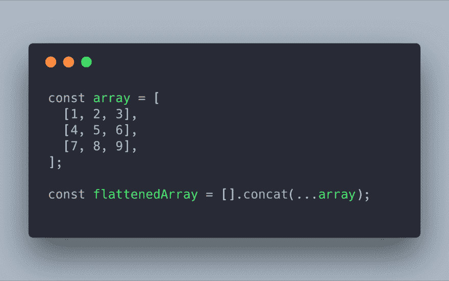

# 有你想要分享的便利的 JS 片段吗？

> 原文：<https://dev.to/nickytonline/handy-js-snippets-352f>

所以这很简单。我在寻找一两行有用的 JavaScript 代码。

我来开个头，先举几个例子:

*   通过阵列传播进行浅层阵列克隆。

```
const originalArray = [1, 2, 3];
const shallowArrayClone = [...originalArray]; 
```

Enter fullscreen mode Exit fullscreen mode

*   通过`Array.protoype.slice`进行浅层数组克隆。

```
const originalArray = [1, 2, 3];
const shallowArrayClone = originalArray.slice(); 
```

Enter fullscreen mode Exit fullscreen mode

> [@ Nicky tonline](https://dev.to/nickytonline)[@ kyleshevlin](https://twitter.com/kyleshevlin)[@ acemarke](https://twitter.com/acemarke)你可以只做 const new array = this.props.slice()。sort()2017 年 04:27AM-15 Sep[](https://twitter.com/intent/tweet?in_reply_to=908547800442404864)[](https://twitter.com/intent/retweet?tweet_id=908547800442404864)[](https://twitter.com/intent/like?tweet_id=908547800442404864)

*   通过对象传播对对象进行浅层克隆。

```
const originalObject = { a:1, b: 2, c: 3 };
const shallowObjectClone = {...originalObject}; 
```

Enter fullscreen mode Exit fullscreen mode

*   通过覆盖了一个属性的对象传播对对象进行浅层克隆。

```
const originalObject = { a:1, b: 2, c: 3 };
const shallowObjectClone = {...originalObject, c: 45 }; 
```

Enter fullscreen mode Exit fullscreen mode

*   使用`Set`获取数组的唯一值

```
const arrayWithDuplicateValues = [1, 2, 3, 3, 1, 5];
const uniqueArray = Array.from(new Set(arrayWithDuplicateValues); 
```

Enter fullscreen mode Exit fullscreen mode

或者

```
const arrayWithDuplicateValues = [1, 2, 3, 3, 1, 5];
const uniqueArray = [...new Set(arrayWithDuplicateValues)]; 
```

Enter fullscreen mode Exit fullscreen mode

*   查看两个数组是否有相同的值(无序和原始值)。

```
const a = [1, 2, 3];
const b = [2, 3, 4];

const uniques = new Set(a.concat(b));
const haveSameValues = uniques.length === a.length // or uniques.length === b.length; 
```

Enter fullscreen mode Exit fullscreen mode

*   用 ES spread 操作符和 Array.prototype.concat 展平数组。

> Jonathan z . white@ jonathanzwhitetil 您可以使用 concat 和 ES6 扩散运算符☀️03:47am-2018 年 4 月 16 日[](https://twitter.com/intent/tweet?in_reply_to=985726458466263042)[](https://twitter.com/intent/retweet?tweet_id=985726458466263042)[](https://twitter.com/intent/like?tweet_id=985726458466263042)t28】

```
const arrayToFlatten = [ [1,2,3], [4,5,6], [7,8,9] ];
const flattenedArray = [].concat(...arrayToFlatten); 
```

Enter fullscreen mode Exit fullscreen mode

以上 2020 年更新为

```
[ [1,2,3], [4,5,6], [7,8,9] ].flatMap(x=>x) 
```

Enter fullscreen mode Exit fullscreen mode

走吧。

Flickr 用户[韦恩·格里维尔](https://www.flickr.com/photos/56462773@N07/8995095069/in/photolist-eGSdo2-eVj8Xm-F7SDKj-gyziYJ-5GmieA-aQjZ5Z-qB3MDY-gG1f-4CPscx-bdrdAv-Mcpb8-Ds5Ck5-UPFRjE-cooZaE-7JL9Ce-6hB26p-5JFmTS-aDC2mi-4RCrCE-8qaRq-adbMyX-8pCVMh-bnJfyw-sXQZ7-fnCVbL-4RCroh-dVzSH6-fckNay-pA6MdP-6VHf97-662aRZ-aiJwYD-9Liq36-pfXnJ2-81t4TV-fnoErz-76pUCy-aDFSfu-8GBKvz-dBM5-e4tTWW-9kHH6Q-r6hZzK-95uyfv-rdHr-qBJTsu-fc3tgQ-cwgbMh-7ZQGwo-UA7SdP)的封面图片关怀。