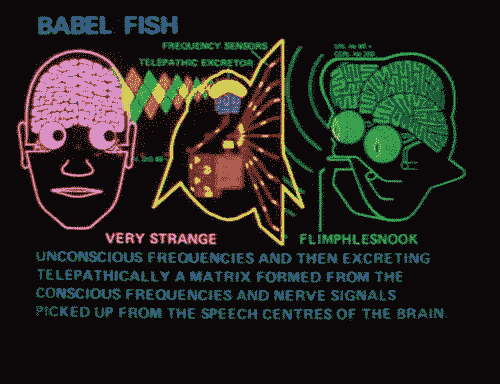

# 标准化启示元数据的超媒体搭便车指南

> 原文：<https://dev.to/mikeralphson/the-hypermedia-hitchhikers-guide-to-standardised-affordance-metadata-4g61>

> 休息是问 Siri“你能做什么？”RPC 正在从 osxdaily 查找命令列表或试图猜测。

#### [菲尔鲟鱼](https://twitter.com/philsturgeon/status/955371535073767425)

[T2】](https://res.cloudinary.com/practicaldev/image/fetch/s--z7JN6dGj--/c_limit%2Cf_auto%2Cfl_progressive%2Cq_66%2Cw_880/https://s-media-cache-ak0.pinimg.com/originals/03/9b/93/039b936b15253a16ed6537c0e3b01d0e.gif)

让我们稍微推断一下。

Siri 的反应可能是什么，从 REST API 来看会是什么样的？

## Siri:你能干什么？

让我们敲敲那个 hoopy API 的根，看看我们是否能得到任何有用的东西。

`GET /`

神圣的比利时人！

```
{  "_links":  [  {  "rel":  "self",  "href":  "/"  },  {  "rel":  "siri:whats-playing",  "href":  "/nowplaying"  },  {  "rel":  "siri:play-song",  "href":  "/nowplaying/{songName}"  },  {  "rel":  "siri:send-message",  "href":  "/messages/{recipient}/{message}"  },  {  "rel":  "siri:buy-book-by-title",  "href":  "/purchases/book/{title}"  },  {  "rel":  "siri:buy-book-by-title-and-author",  "href":  "/purchases/book/{title}/by/{author}"  }  ]  } 
```

Enter fullscreen mode Exit fullscreen mode

顺便说一下，作为一个 Linux 用户，我自然必须从 [OSXDaily](http://osxdaily.com/2016/09/28/use-mac-siri-commands/) 获得上面列表的信息，我们可以把它看作是一个静态 API 描述文档(类似于[open API 规范](https://github.com/OAI/OpenAPI-Specification))，在谷歌上搜索之后，我们可以把它看作是某种 API 发现机制/注册表查找。

现在一个永恒的问题是*我们如何*执行那些链接关系动作？

> “在银河系复杂的东旋臂中访问任何超媒体 API 往往要经过三个不同的、可识别的阶段，即定位、查询和困惑阶段，也称为在哪里、做什么和如何阶段。例如，第一阶段的特点是“这个 API 在哪里？”第二个问题是“我能用这个 API 做什么？”第三个问题是‘哦，我放弃了，我怎么知道下一步该做什么？"

#### 带着对道格拉斯·亚当斯的歉意

显而易见，`GET`对`/nowplaying`的请求将返回当前正在播放的巴赫作品的信息，但是为了让一些普洛柯哈伦摇滚起来，我需要`POST`对`/nowplaying/whiter%20%shade%20of%20pale`，或者可能`PUT`，甚至`PATCH`资源表示吗？

如果我想买某个作者的书(我想看道格拉斯·亚当斯和马克·卡沃丁的原著《最后的机会》，而不是马克·c 和史蒂芬·弗莱的《T2》续集《T3》)，我能同时通过这两位作者吗？我要把它们连接起来吗？我要用数组吗？

如果我能查阅 API 的搭便车指南呢？

显然，带外文档是 REST 的禁忌，但是带内文档呢？

如果有一种检索资源元数据的标准化方法会怎样...比如:

`OPTIONS /nowplaying/:songName`

它为给定的端点返回一个最小的、动态生成的 OpenAPI 定义(包括任何必要的支持定义，如参数、头、响应等)。

OpenAPI 格式用于描述端点的可见性，`Allow`响应头为我们提供了端点支持的 HTTP 方法，作为 OpenAPI [pathItem 对象](https://github.com/OAI/OpenAPI-Specification/blob/master/versions/3.0.1.md#path-item-object)的索引。

通过使用`ETag`和`If-None-Match`头，可以有效地缓存启示元数据。

如果自客户端最后一次检查以来元数据没有改变，API 应该使用 HTTP [412](https://httpstatuses.com/412) 响应`OPTIONS`请求，根据 [RFC7232](https://tools.ietf.org/html/rfc7232#section-3.2) 响应“前提条件失败”。

显然，基于内容类型协商，可以返回其他 API 描述格式。

使用`OPTIONS`方法的另一种方法是包含一个关系类型为[服务-desc](https://tools.ietf.org/html/rfc8631#section-4.2) 的链接，并以这种方式链接您的部分 OAS 定义。

如果您想尝试返回部分 OpenAPI 定义，我已经在 Node.js - [openapi-extract](https://github.com/Mermade/openapi-extract) 中拼凑了一个概念验证实用程序。它适用于 OpenAPI (fka Swagger) 2.0 和 3.0.x。

### 参考文献

#### 又名太阳底下无新事

*   [http://zacstewart.com/2012/04/14/http-options-method.html](http://zacstewart.com/2012/04/14/http-options-method.html)
*   [https://www . iana . org/assignments/link-relations/link-relations . XHTML](https://www.iana.org/assignments/link-relations/link-relations.xhtml)
*   [http://json-schema.org/latest/json-schema-hypermedia.html](http://json-schema.org/latest/json-schema-hypermedia.html)