# 我解读大型内容迁移的经验

> 原文:[https://dev . to/fernalvarez 590/my-experience-unruding-a-big-content-migration-58lo](https://dev.to/fernalvarez590/my-experience-unscrambling-a-big-content-migration-58lo)

[*本文原载于*](https://medium.com/@lordferquad/my-experience-unscrambling-a-big-content-migration-9d527885731c)

[T2】](https://res.cloudinary.com/practicaldev/image/fetch/s--KQzeiekb--/c_limit%2Cf_auto%2Cfl_progressive%2Cq_auto%2Cw_880/https://cdn-images-1.medium.com/max/600/1%2AAEoWvUBRaVw4bh5WWhv7Sg.png)

这是办公室里美好的一天，鸟儿歌唱，花儿开放，咖啡也非常宜人。那天，客户告诉我们一个新的要求，当时，我们认为这是小菜一碟…我们错了…

客户告诉我们，他们需要将当前 CMS 中的所有内容迁移到我们正在构建的新内容交付流中。**“将内容从一个节点移动到另一个节点”**听起来很容易，但在这个短语背后有许多问题需要解决。

### 旧 vs 新

客户想要一个别致的、全新的内容交付流，包括一个无头 CMS、无服务器后端和一个显示内容的前端。他们当前的 CMS 有很多问题:从糟糕的客户端性能和缓慢的交付流，到服务器停机。

我们提出的架构如下所示:

[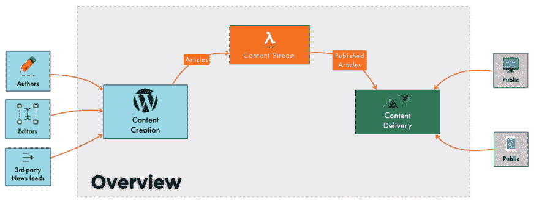](https://res.cloudinary.com/practicaldev/image/fetch/s--AgTcLFUN--/c_limit%2Cf_auto%2Cfl_progressive%2Cq_auto%2Cw_880/https://cdn-images-1.medium.com/max/1003/1%2AkWB0Ks5qVEAfF5d9AzLTjg.png) 

<figcaption>高层建筑</figcaption>

CMS 用户可以在基于 WordPress 的无头 CMS 中创建和管理内容。当用户发布文章时，CMS 会将其发送到内容流。内容流使用 [AWS 无服务器 Lambdas](https://aws.amazon.com/lambda/?nc1=h_ls) 来转换和确认内容。内容由[的弹性搜索服务托管。](https://aws.amazon.com/elasticsearch-service/) Web 客户端访问前端，可以在网站上导航。前端内置于 [VueJS](https://vuejs.org/) 和[nuxt . js](https://nuxtjs.org/)(vue js 的服务器端渲染)。前端从 ElasticSearch 获取数据来显示内容。对于第三方新闻提要，使用 WordPress REST API 加载内容。

### **我们要动什么？**

对我们来说，要求很明确:

> 该团队需要将大约 50 万篇文章从旧的内容管理系统转移到新的内容交付流中。内容必须可供前端和 CMS 用户在里面管理。文章必须显示与旧 CMS 相同的内容，并应足够灵活，可以在 WordPress 编辑它。
> 
> ### 设计迁移流程

客户为我们提供了一个包含所有要迁移的数据的 ElasticSearch 端点，而不是直接查询他们的数据库。起初，我们想从他们的 ElasticSearch 迁移到我们的 Delivery ElasticSearch，为网站的外部访问者准备好内容，但这种方法有一个问题:内容在 WordPress 中无法编辑和管理。看到这个问题后，我们开始做一些关于“按需”获取内容的研究，使用类似于 WordPress 的 [ElasticPress 插件的过程。因为没有时间做这个要求，我们放弃了这个想法。](https://github.com/10up/ElasticPress)

在这个设计过程的下一次迭代中:我们决定将迁移的内容插入 WordPress:我们已经有了一个插件，它将内容和元数据转换成 ElasticSearch 需要的模式；我们只需要将每篇文章从客户的 ElasticSearch 转换到 WordPress post schema。

为此，我们认为在自动化从 ES 客户端到 WordPress 实例的接收时，我们的第一选择是使用亚马逊简单队列服务(简称 SQS)来抑制内容接收。这个计划很简单，这张图表就这样诞生了:

[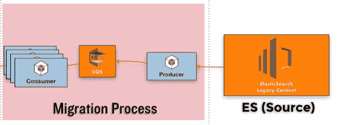T2】](https://res.cloudinary.com/practicaldev/image/fetch/s--_HBg0Xy4--/c_limit%2Cf_auto%2Cfl_progressive%2Cq_auto%2Cw_880/https://cdn-images-1.medium.com/max/557/1%2Ah-HJDoWWDmfZkcoTKs8F7Q.png)

我们只需要一个 SQS 生产者(从 ES 中抓取并将其接收到 SQS 队列中)和几个 SQS 消费者(监听队列并将消息插入到 WordPress 中)。我们的技术选择是 [NodeJS](https://nodejs.org) ，因为在 NPM 有两种易于使用的 NodeJS SQS P[生产商](https://www.npmjs.com/package/sqs-producer)和 C [消费者](https://www.npmjs.com/package/sqs-consumer)模块。

在我们开发 SQS 生成器的时候，我们面临一个重要的问题:ElasticSearch 对 from + size 查询的 10K 文档的限制导致了这个问题。为了解决这个问题，我们决定使用 [Scroll API](https://www.elastic.co/guide/en/elasticsearch/reference/5.5/search-request-scroll.html) 来分块访问每个文档。

我们在开发生成器时面临的另一个问题是，如果流程终止，状态就无法保存，所有的东西都需要重新消化。

为了避免这个问题，我们保存了摄入物品的状态。为了跟踪最后一个进入 SQS 的文档，我们在每次流程再次运行时将该文档的 UUID 保存在数据库中。它检查数据库中最新的 UUID。然后，滚动 API 使用 UUID 知道从哪里开始。

消费者过程很容易实现。我们创建了一个 NodeJS 脚本来监听队列，并以十为单位获取数据。之后，它会尝试将它们插入 WordPress。如果这个过程失败 15 次，SQS 就会将这些破碎的消息发送到一个死信队列中。为了保持这一进程，我们使用了 PM2。

在创建了 SQS 生产者和消费者之后，我们开始为 WordPress REST API 开发内容转换器。起初，我们决定获取 WordPress 中的所有依赖项，但是我们开始注意到这些请求花费了很多时间。对于 WordPress 和 MySQL 来说，在 CMS 内部转换和获取数据是一项繁重的工作。经过一个下午艰难的头脑风暴如何解决这个问题，我们决定获取 SQS 生产者的所有依赖。我们将这项工作转移到 Node 而不是 WordPress，以避免 API 请求超时。

制片人换了之后，一切都开始变好了。我们决定开始测试迁移过程，并注意到 MySQL 和 PHP 花了太长时间将数据转换和插入 CMS。

我们决定使用 Amazon Aurora 来提升数据库能力。从那以后，情况开始有所好转，但我们注意到这个过程需要很多天才能完成。每分钟大约 50 篇文章，整个过程将永远持续下去，所以我们决定纵向扩展 CMS。

我们创建了一个 [Terraform](https://www.terraform.io/) 模板来创建一个由 5 个 WP 实例组成的集群，这些实例具有相同的大功率，并且都连接到 Aurora。每个请求通过一个弹性负载均衡器(AWS ELB)并使用循环访问每个实例。

最后，我们有了迁移流程的第一个架构设计:

[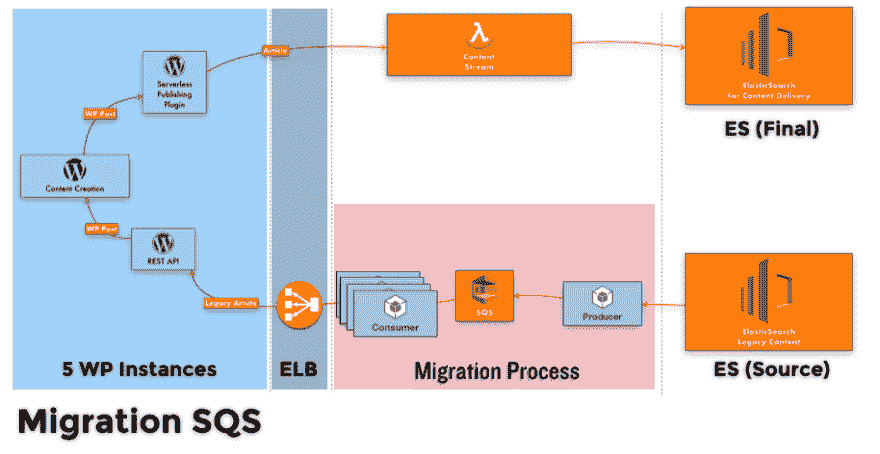](https://res.cloudinary.com/practicaldev/image/fetch/s---mVerF_C--/c_limit%2Cf_auto%2Cfl_progressive%2Cq_auto%2Cw_880/https://cdn-images-1.medium.com/max/914/1%2APmSpTnwQ5z14eoJdNHXIQQ.png) 

<figcaption>架构的内容迁移使用 SQS</figcaption>

那一刻我们非常自豪，因为一切都开始变得非常好！但我们知道这可以改进，以加快这一进程多一点。我们决定通过使用亚马逊 Kinesis 进入下一个阶段。

[T2】](https://res.cloudinary.com/practicaldev/image/fetch/s--4B9kOTSa--/c_limit%2Cf_auto%2Cfl_progressive%2Cq_auto%2Cw_880/https://cdn-images-1.medium.com/max/551/1%2AZQLqvm8oClz6J0AFC9f9IQ.png)

我们决定将 SQS 生产者改为支持 SQS 和 Kinesis 摄取的混合体。对于消费者，我们创建了一个 lambda 函数，当一个新的事件被摄入到 Kinesis 流中时，该函数就会被触发。在那个时候，我们可以达到每分钟 150 左右，你猜怎么着！这个过程对 WordPress 来说太多了，开始超时。答案是纵向扩展 EC2 实例。最后，我们用 Kinesis 完成了迁移过程。

[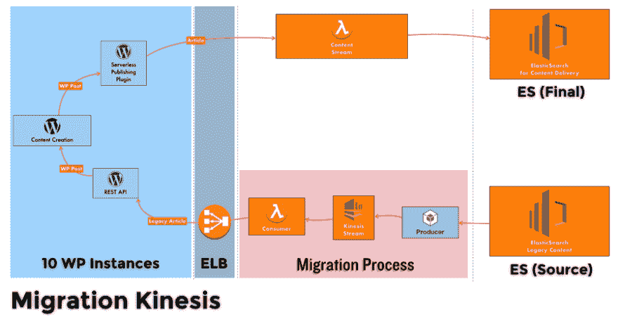](https://res.cloudinary.com/practicaldev/image/fetch/s--isJcd9i7--/c_limit%2Cf_auto%2Cfl_progressive%2Cq_auto%2Cw_880/https://cdn-images-1.medium.com/max/901/1%2ARrFniRBVcrvTnAcYFr7A4w.png) 

<figcaption>架构的内容迁移使用 Kinesis</figcaption>

在这一点上，一切都开始异常顺利，每个请求的时间非常好，每分钟处理的请求数量非常大…然后一切都开始变得对我们不利。

### 路上的颠簸

我们当时认为我们已经摆脱了困境，但我们错了。第一次冲击是当我们达到 100，000 篇文章时，所有的东西都倒下了:

[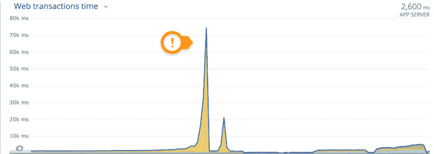](https://res.cloudinary.com/practicaldev/image/fetch/s--r3xfT724--/c_limit%2Cf_auto%2Cfl_progressive%2Cq_auto%2Cw_880/https://cdn-images-1.medium.com/max/1024/1%2AD0jFYyZ-pG--gy_qMYlR7A.png) 

<figcaption>多么奇怪的山峰……</figcaption>

我们对此感到惊讶:在我们注意到一些有趣的事情之前，我们从未想过在这个过程中会出现这样的峰值:

[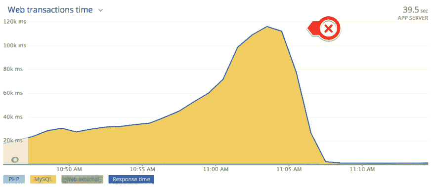T2】](https://res.cloudinary.com/practicaldev/image/fetch/s--37cfbek6--/c_limit%2Cf_auto%2Cfl_progressive%2Cq_auto%2Cw_880/https://cdn-images-1.medium.com/max/962/1%2ADa8izfZK7X-xPlxssFcinw.png)

我们注意到让依赖关系将它发送到交付流花费了太长的时间，但是为什么呢？？！我们注意到 WordPress 的 wp_postmeta 表有大约 150 万行，很多值没有被索引，MySQL 需要很多时间来解析。这个问题很严重，因为我们在 WordPress 存储文章元数据的方式上面临一个*可能*的设计问题。为了解决这个问题，我们安装了 [ElasticPress 插件](https://github.com/10up/ElasticPress)，将 WordPress 的所有内容保存到另一个 ElasticSearch 实例中。一切又开始正常运行了！

[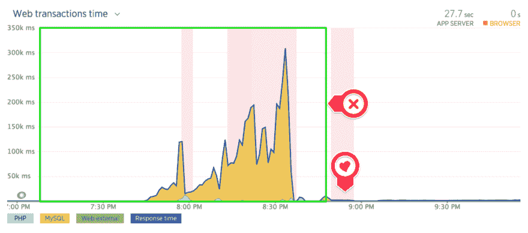](https://res.cloudinary.com/practicaldev/image/fetch/s--SUWoWVbw--/c_limit%2Cf_auto%2Cfl_progressive%2Cq_auto%2Cw_880/https://cdn-images-1.medium.com/max/1024/1%2A-9mozCPRQHgo4D_WHbAASA.png) 

<figcaption>弹力压前和弹力压后</figcaption>

我们面临的另一个问题是，运动的过程突然结束。

[T2】](https://res.cloudinary.com/practicaldev/image/fetch/s--1c8wBzrD--/c_limit%2Cf_auto%2Cfl_progressive%2Cq_auto%2Cw_880/https://cdn-images-1.medium.com/max/1024/1%2ADU-5_V4iPM2Rv4WZMbpnIg.png)

[T2】](https://res.cloudinary.com/practicaldev/image/fetch/s--G-Vq_7W3--/c_limit%2Cf_auto%2Cfl_progressive%2Cq_auto%2Cw_880/https://cdn-images-1.medium.com/max/1024/1%2AXT8R95855f4OGJl1GiS2fA.png)

幸运的是，这只是一个配置问题，通过在 AWS 控制台中更改事件的数据保留期就可以轻松解决

 

<figcaption>从保留 24 小时到保留一周</figcaption>

我们在测试中面临的另一个问题是，当数据库有大约 100 万篇文章时，每分钟的请求数量非常慢:

[T2】](https://res.cloudinary.com/practicaldev/image/fetch/s--eIsGX2T6--/c_limit%2Cf_auto%2Cfl_progressive%2Cq_auto%2Cw_880/https://cdn-images-1.medium.com/max/711/1%2ANB2TXnwPov_VGAlDB99meg.png)

为了解决这个问题，运营团队建议我们使用 WordPress 的 [HyperDB 插件来轻松管理读取和写入副本，因为我们正在使用](https://es.wordpress.org/plugins/hyperdb/) [AWS RDS Aurora](https://aws.amazon.com/rds/aurora/) 作为数据库基础设施。插件配置完成后，结果非常令人满意:

 

<figcaption>HyperDB 帮助我们管理读写副本，加快进程。</figcaption>

### 运行数据迁移的时间

经过这些颠簸之后，我们终于能够在客户的基础设施中运行数据迁移。我们设置好了一切，并在早上的第一个小时开始了这个过程，在 10k 篇文章之后，我们开始注意到 AWS Aurora 集群中的过程缓慢、超时和非常高的 CPU 使用率。

我们再次对我们的基础架构进行了一些测试，一切正常，但他们的基础架构不工作！有些可疑的事情正在发生。我们面临着一个有趣且不可预测的问题。如此接近，但迄今为止，我们开始使用 new relic 调试过程，我们注意到他们的基础设施中有一些有趣的东西:

[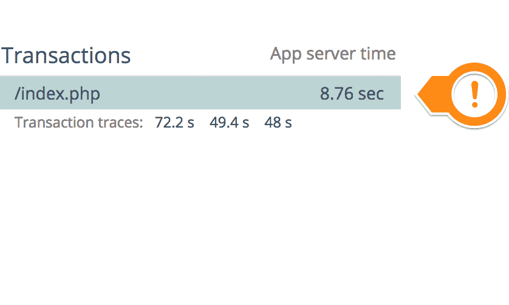](https://res.cloudinary.com/practicaldev/image/fetch/s--dJYRJUxX--/c_limit%2Cf_auto%2Cfl_progressive%2Cq_auto%2Cw_880/https://cdn-images-1.medium.com/max/838/1%2Aqko4KK7u9vToaDWx8kaAFw.png) 

<figcaption>每一个请求几乎耗时 9 秒！</figcaption>

 

<figcaption>126 个实例！？</figcaption>

经过一番彻底的调试后，架构开发人员发现了可伸缩性策略中的一个错误，问题得到了解决，实例的数量开始变得更加一致，但我们仍然注意到速度很慢，我们发现:

[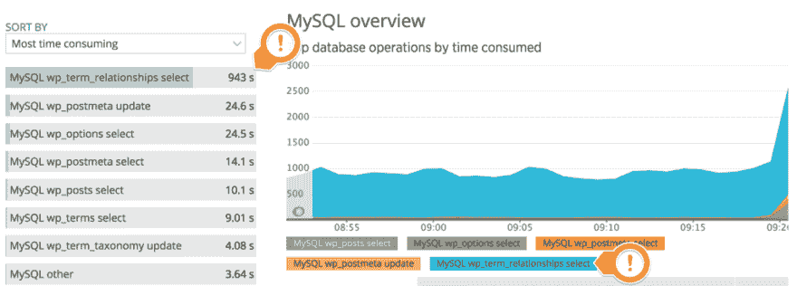T2】](https://res.cloudinary.com/practicaldev/image/fetch/s--DsTqzB26--/c_limit%2Cf_auto%2Cfl_progressive%2Cq_auto%2Cw_880/https://cdn-images-1.medium.com/max/1024/1%2AxRCPQVm8iBnX929P5r9JQw.png)

[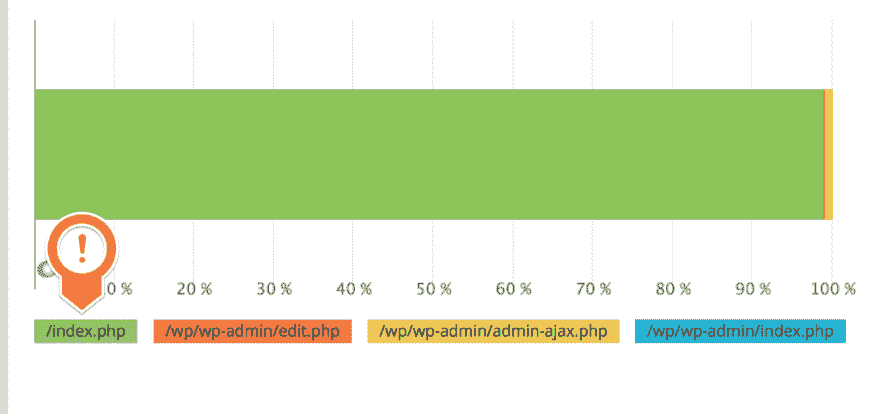](https://res.cloudinary.com/practicaldev/image/fetch/s--nCOr3cgi--/c_limit%2Cf_auto%2Cfl_progressive%2Cq_auto%2Cw_880/https://cdn-images-1.medium.com/max/1024/1%2AH4BupAXeBjg0Mqy6n-_x1A.png) 

<figcaption>痛苦漫长的请求</figcaption>

出于某些奇怪的原因，select 花费了大量时间，数据库 CPU 的使用率达到了 100%。这个问题解决起来很有趣，因为我们需要在我们的基础设施中复制同样的问题。我们发现，每个 post insert 都会向该表请求增加术语的数量。我们的 CMS 显然不需要这样，所以我们做了一些查询改进和优化，但问题仍然存在。我们决定使用 [Redis](https://redis.io/) 和插件 [Redis 对象缓存](https://es.wordpress.org/plugins/redis-cache/)添加一个缓存层，结果比我们预期的要好:

#### 缓存前

[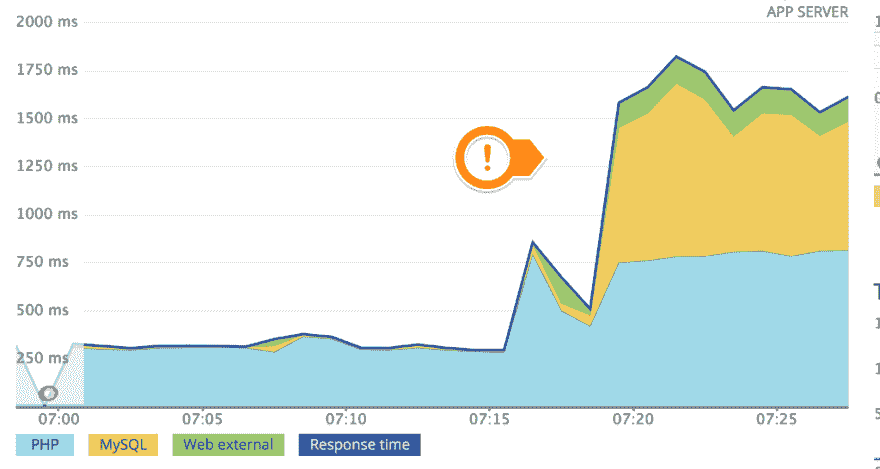T2】](https://res.cloudinary.com/practicaldev/image/fetch/s--OQ7kwYnd--/c_limit%2Cf_auto%2Cfl_progressive%2Cq_auto%2Cw_880/https://cdn-images-1.medium.com/max/1024/1%2AOZ_rzxa4PLaZK_pQQnUtzw.png)

[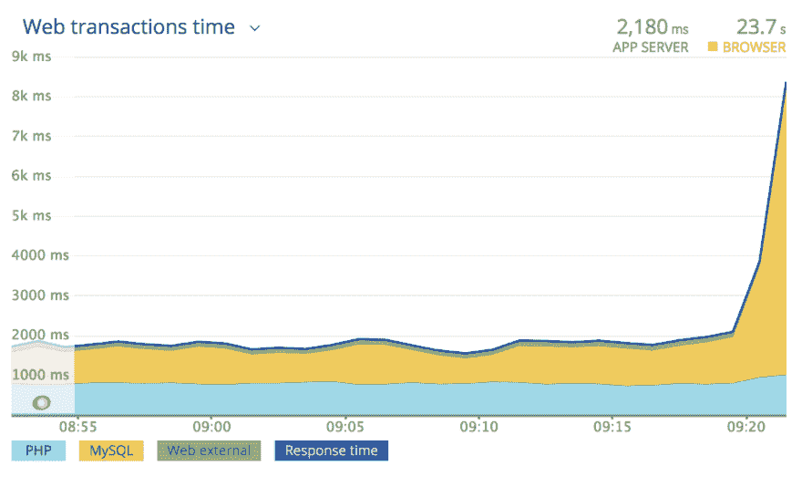](https://res.cloudinary.com/practicaldev/image/fetch/s--vA-eyky4--/c_limit%2Cf_auto%2Cfl_progressive%2Cq_auto%2Cw_880/https://cdn-images-1.medium.com/max/1024/1%2A-kWiwssGJQ52t6dO9GYJqQ.png) 

<figcaption>痛苦地 MySQL 突突峰起</figcaption>

#### 缓存后

[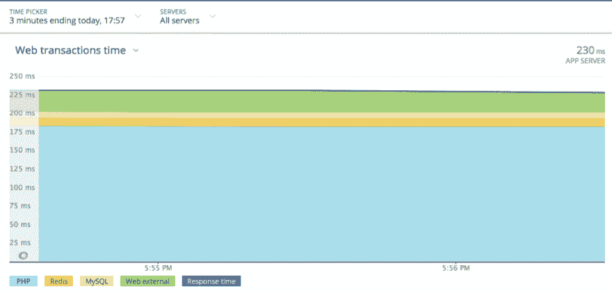](https://res.cloudinary.com/practicaldev/image/fetch/s--5j0R3t7d--/c_limit%2Cf_auto%2Cfl_progressive%2Cq_auto%2Cw_880/https://cdn-images-1.medium.com/max/1024/1%2AJzf8WadIp0rGpOLsbopLUQ.png) 

<figcaption>每一个请求开始用了不到一秒钟</figcaption>

### 结论

我们学到的一个宝贵经验是，数据迁移并不像听起来那么简单。这整个经历帮助我们更好地理解了数据迁移，这对我们来说有很高的学习价值。目前，本文提供的解决方案对于内容迁移非常有效。我真的建议你成为这类项目开发过程的一部分。

### 特别感谢

非常感谢[维罗·莱昂](https://medium.com/u/79dc767f9a2f)、[埃德尔·迪亚兹](https://medium.com/u/b4df8fb7f602)、[拉法·萨拉扎](https://medium.com/u/ff471ed75d8d)和[爱德华多·罗梅罗](https://medium.com/u/b0f1eeeaa8dd)帮助我把这篇文章写得更好！

### 🙌感谢阅读！🙌