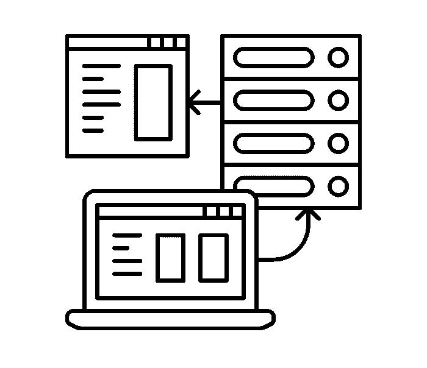

# 在 G Adventures 部署代码

> 原文：<https://dev.to/gadventurestech/deploying-code-at-g-adventures-37mh>

#### 在 G Adventures，我们每天部署 20 多次不同的服务，通过保持简单来处理数百万的请求和数百万美元的交易

<figure> 

<figcaption>[丹尼尔·波尔欣](https://thenounproject.com/everydaytemplate/)来自名词项目</figcaption>

</figure>

我开发和部署软件的指导原则之一就是尽可能长时间地保持简单。过早的优化浪费了开发人员宝贵的时间，解决了可能永远不会成为现实的问题。这在 G Adventures 中很明显的一个领域就是我们如何部署代码。今天我将谈谈我们部署代码的常用方法，每种方法的优缺点以及我们的未来。

### 环境

在 G，我们以使用合适的工具来完成工作而自豪。虽然我们主要是一家 Python 商店，使用 Django 作为我们的网站，但我们也有一些用 go 编写的服务，并且已经开始使用 React 构建我们的前端。在部署方面，每个环境都有不同的挑战和最佳实践，我将在下面进行描述。

我们使用 [GitHub](https://github.com) 来托管我们的代码，使用 [Jenkins](https://jenkins-ci.org/) 和 [Travis CI](https://travis-ci.com/) 来自动化我们的测试，现在我们的大部分应用和代码都位于多伦多外的虚拟机中。我们正处于向 AWS 过渡的过程中，但我将把这个问题留给另一篇文章。

其他我们常用的技术有 [Postgres](https://www.postgresql.org/) (初级 DBs)[Redis](https://redis.io/)(缓存和键/值存储) [RabbitMQ](https://www.rabbitmq.com/) (消息代理)[芹菜](http://www.celeryproject.org/)(任务队列)。在未来的博客文章中，我们将分解单个团队和堆栈。

历史上，每个团队都围绕代码审查、迁移和部署开发了自己的流程。随着我们的成长，我们努力标准化我们的流程，让团队更容易共享开发人员和资源。我们如何部署仍然很明显，每个团队做的都略有不同。

### 当前部署策略

#### **布料+饭桶拉**

这是我们部署应用程序的最简单也是最古老的方法。它使用 [Fabric](http://www.fabfile.org/) ，一个用于简化 SSH 连接的命令行工具和 [git](https://git-scm.com/) 来更新我们服务器上的代码，并部署我们应用程序的新版本。