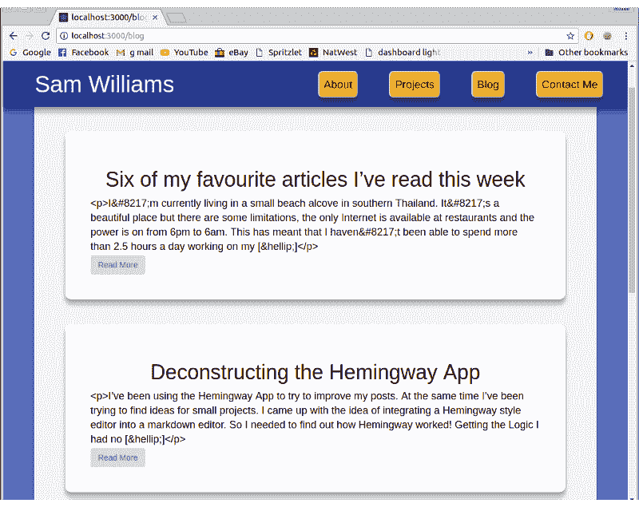
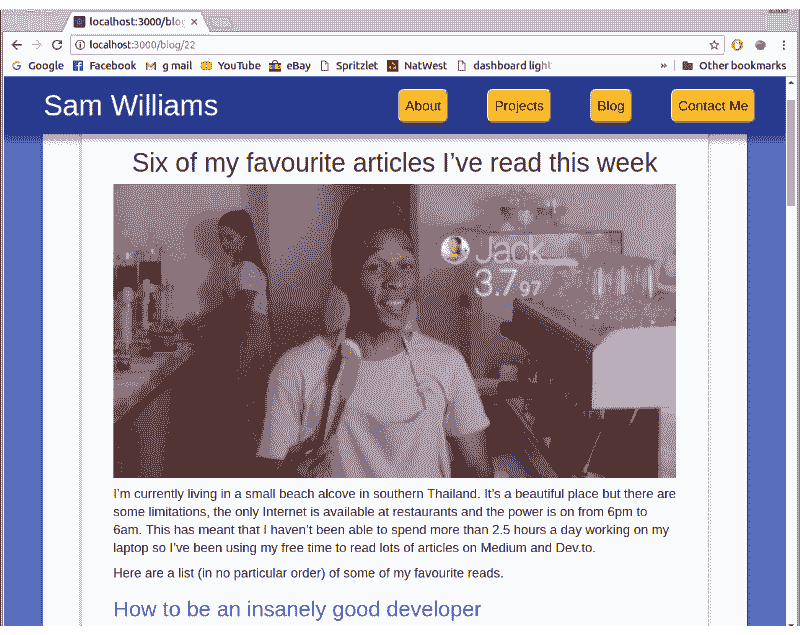

# 用 React 和 WordPress API 在你的网站上创建一个博客

> 原文：<https://dev.to/samwsoftware/get-a-blog-on-your-website-with-react-and-wordpress-api-2g4p>

在过去的几个月里，我读了很多文章，我经常注意到的一件事是在开始的时候声明这些帖子来自他们自己的网站。写了几篇文章并想增加我的曝光率后，我决定我也想在我的网站上开一个博客。但是怎么做呢？

## 选项

将博客整合到我的网站有几个可能的选择，但主要的两个是自定义内容管理系统(CMS)或 WordPress。我想快速设置好，所以我使用了 WordPress。

## WordPress API

在过去的几周里，我听说了一些关于 WordPress API 的事情，所以开始搜索。我在 WordPress.com 建立了一个免费博客，并从 Medium 导入了我的文章。这是超级简单的媒体导出工具和 WordPress 的“从媒体导入”工具。

现在我在 WordPress 上有了我的文章，我必须弄清楚如何访问它们。我在文档中找到了这个页面，并构建了一个非常基本的网页进行测试。

```
<h1>wordpress checker</h1>
<script src="https://cdnjs.cloudflare.com/ajax/libs/jquery/3.1.0/jquery.min.js"></script>
<script src="getWordpress.js"></script> 
```

Enter fullscreen mode Exit fullscreen mode

```
console.log("this is a proof of concenpt");

$.get(
  "http://public-api.wordpress.com/rest/v1/sites/YourSite.wordpress.com/posts",
  function(response) {
    console.log(response);
  }
); 
```

Enter fullscreen mode Exit fullscreen mode

这做了一个非常简单的任务，调用 WordPress API 并从“YourSite.wordpress.com”中请求所有的帖子。由此我得到了一个包含帖子数量和每个帖子的数组的响应对象。

## 路由

现在我要在我的网站上有一个博客部分，我不得不改变以前的单一页面。我安装了 react-router-dom，并将`BrowserRouter`和`Route`导入到我的布局文件中。

```
<BrowserRouter>
    <div id="center-stripe">
        <Nav />
        <Route exact path="/" component={main} />
        <Route exact path="/blog" component={Blog} />
    </div> </BrowserRouter> 
```

Enter fullscreen mode Exit fullscreen mode

## 在 React 中创建博客

我的个人网站是使用 create-react-app 建立的，有一个非常基本的结构。我需要做的下一件事是添加一个新的“博客”页面，在这个页面上可以显示所有的文章预览。

```
export default class Blog extends Component {
  constructor(props) {
    super(props);
    this.state = {
      posts: []
    };
  }
  componentDidMount() {
    axios
      .get(
        "http://public-api.wordpress.com/rest/v1/sites/samwcoding.wordpress.com/posts"
      )
      .then(res => {
        this.setState({ posts: res.data.posts });
        console.log(this.state.posts);
      })
      .catch(error => console.log(error));
  }

  render() {
    return (
      <div className="blog">
        <h1 className="sectionTitle">Articles</h1>
        {this.state.posts.map(post => <ArticlePreview post={post} />)}
      </div>
    );
  }
} 
```

Enter fullscreen mode Exit fullscreen mode

我会告诉你这个代码。顶部用一个空的 posts 数组设置组件的状态。然后我使用`componentDidMount`函数用 axios 执行对 WordPress API 的调用。当 API 调用返回时，我将 this.state.postss 设置为 post 数组。这导致第 24 行为每个帖子呈现一个`ArticlePreview`组件。

```
render() {
  if (this.props.post) {
    return (
      <div className="article">
        <a href={"/blog/" + this.props.post.ID} className="blackLink">
          {this.props.post.featured_image ? (
            
          ) : (
            ""
          )}
          <h1 className="text-center">{this.props.post.title}</h1>
          <div className="content">{excerpt}</div>
        </a>
        <Link to={"/blog/" + this.props.post.ID}>
          <button className="btn">Read More</button>
        </Link>
      </div>
    );
  } else {
    return null;
  }
} 
```

Enter fullscreen mode Exit fullscreen mode

ArticlePreview 接收每篇文章，并呈现带有标题和摘录的预览，标题和摘录都由 WordPress API 提供。如果帖子也有特色图片，那也包括在内。

[T2】](https://res.cloudinary.com/practicaldev/image/fetch/s--QknKeyeZ--/c_limit%2Cf_auto%2Cfl_progressive%2Cq_auto%2Cw_880/https://cdn-images-1.medium.com/max/800/1%2AZygv4F72-f7w_6fiepGFvA.png)

我重用了网站其他部分的 CSS 来设计文章预览，看起来很不错。一个主要的错误是“

我'”和类似的比特星罗棋布的摘录。为了解决这个问题，我将摘录设置为在呈现到屏幕之前运行一个`removeUnicode()`函数。它只是用逗号替换了所有的`&#8217`，并删除了`<p>`和`[&hellip;]`标签。这并不优雅，但很有效。

现在我有了文章列表，我必须为整篇文章创建一个组件。我为`/blog/:id`添加了另一条路线，并开始新的组件。它几乎与`ArticlePreview`组件相同，除了不是只呈现摘录，而是只呈现一篇文章。从 WordPress 获取文章非常简单，只需将文章 ID 添加到前面的 API 调用的末尾。

```
axios.get(
    "http://public-api.wordpress.com/rest/v1/sites/samwcoding.wordpress.com/posts/" +
    this.props.match.params.id
) 
```

Enter fullscreen mode Exit fullscreen mode

获得文章回应是我遇到的第一个绊脚石。文章的主体都是字符串化的 HTML 格式。我用`dangerouslySetInnerHTML`函数找到了解决方法。(如果有人对如何更好地实现这一点有任何建议，请告诉我)。

[T2】](https://res.cloudinary.com/practicaldev/image/fetch/s--C1CWaoDr--/c_limit%2Cf_auto%2Cfl_progressive%2Cq_auto%2Cw_880/https://cdn-images-1.medium.com/max/800/1%2AcePHka90ljGiCw4Sfsp2qw.png)

做完这些后，我要做一些改变。顶部的导航按钮只是连接到锚定标签，在单页网站上运行良好，但现在它们将用户发送到`/blog#about`，这不起作用。通过将链接明确定义为`/#about`和`/#projects`解决了这个问题。

博客现在可以很好地处理我目前写的文章数量，但当有 50 或 100 篇文章时，它将如何应对？在未来，我可能不得不一次呈现一些文章预览，如果用户滚动到底部，会呈现更多。我可以添加的另一个功能是搜索。

在 [SamWSoftware](https://samwsoftware.herokuapp.com/) 博客查看博客，在这里查看我的[全部代码。](https://github.com/SamWSoftware/NodePortfolio)