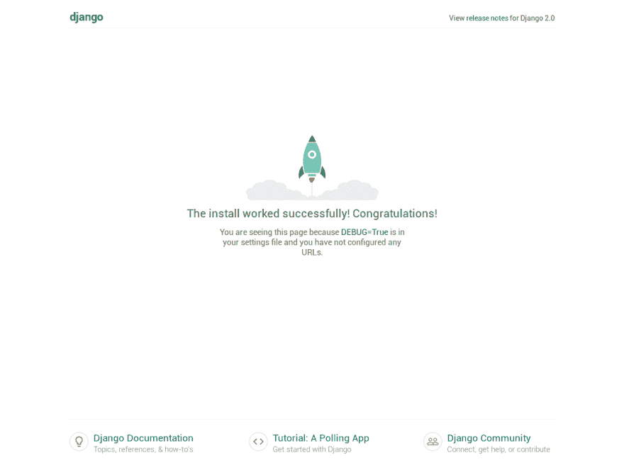
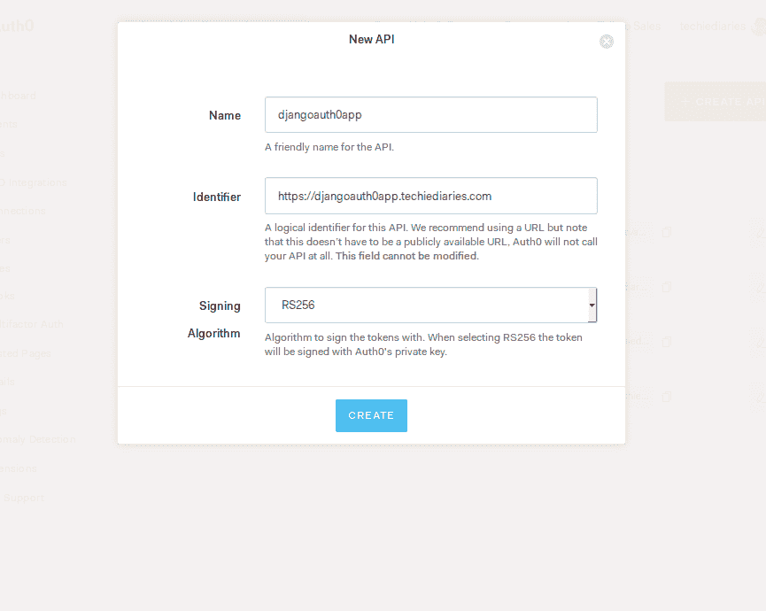
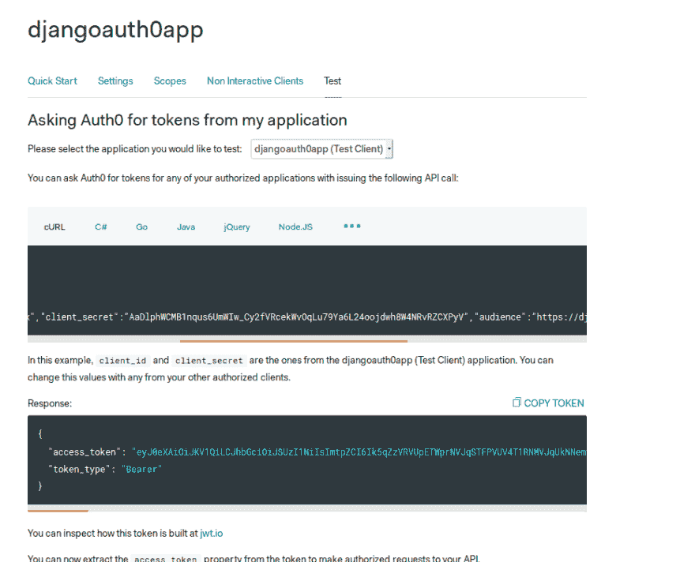
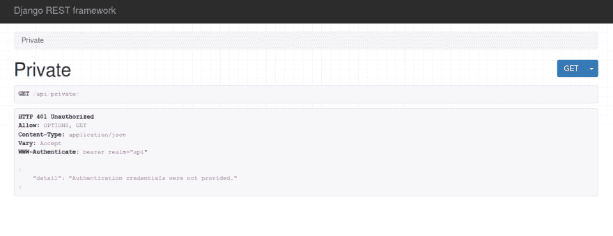
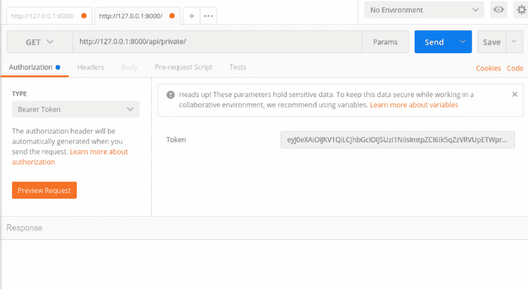
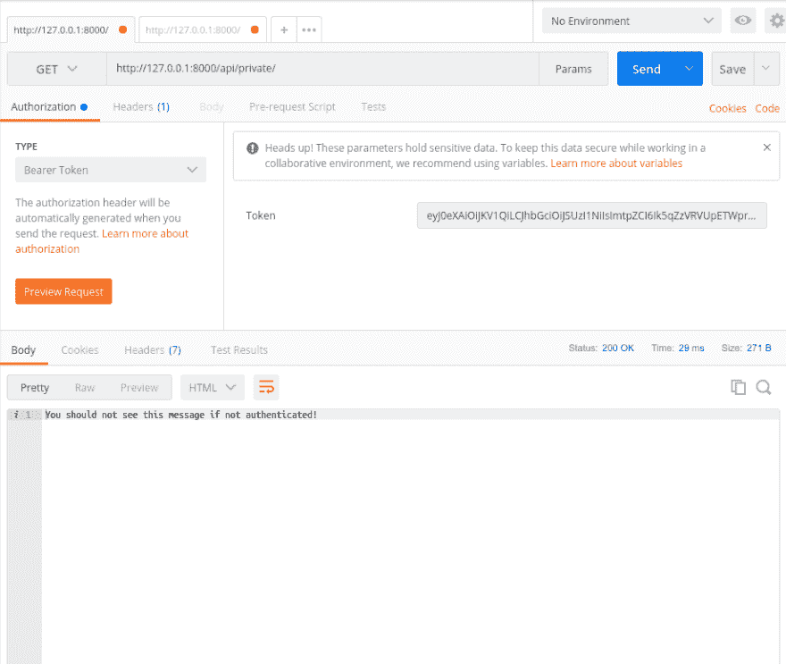

# 使用 Auth0 向 Python 和 Django REST 框架添加 JWT 认证

> 原文:[https://dev . to/techiediaries/adding-jwt-authentic ation-to-python-and-django-rest-framework-using-auth 0-49k 2](https://dev.to/techiediaries/adding-jwt-authentication-to-python-and-django-rest-framework-using-auth0-49k2)

在本教程中，我们将学习如何将 JWT 认证添加到用 Django REST 框架构建的 API 中。基本上，我们将使用`djangorestframework-jwt`包来添加 JWT 认证，就像您通常所做的那样，只是我们将把`JWT_AUTH`改为使用 Auth0。

本教程假设您已经有一台安装了 Python 3 和 pip 的开发机器，并将涵盖以下几点:

*   我们将看到如何创建一个虚拟环境，安装 Django 和其他依赖项(Django REST 框架和`djangorestframework-jwt`)
*   我们将看到如何创建 Auth0 API
*   我们将看到如何将 Auth0 JWT 认证与 Django 集成
*   我们将简要讨论使用 Auth0 规则来检测注册
*   我们将看到如何添加一些 Django 视图来测试 JWT
*   我们将看到如何使用 Postman 来测试带有 Auth0 的 JWT 认证

## 创建 Django 项目

因此，到您的终端，然后创建一个新的虚拟环境，并使用当前工作目录中的`venv`模块激活它:

```
python3 -m venv ./myenv
source myenv/bin/activate 
```

<svg width="20px" height="20px" viewBox="0 0 24 24" class="highlight-action crayons-icon highlight-action--fullscreen-on"><title>Enter fullscreen mode</title></svg> <svg width="20px" height="20px" viewBox="0 0 24 24" class="highlight-action crayons-icon highlight-action--fullscreen-off"><title>Exit fullscreen mode</title></svg>

接下来使用`pip` :
安装 Django

```
pip install django 
```

<svg width="20px" height="20px" viewBox="0 0 24 24" class="highlight-action crayons-icon highlight-action--fullscreen-on"><title>Enter fullscreen mode</title></svg> <svg width="20px" height="20px" viewBox="0 0 24 24" class="highlight-action crayons-icon highlight-action--fullscreen-off"><title>Exit fullscreen mode</title></svg>

现在您需要使用:
创建一个新的 Django 项目

```
django-admin startproject auth0-django-example 
```

<svg width="20px" height="20px" viewBox="0 0 24 24" class="highlight-action crayons-icon highlight-action--fullscreen-on"><title>Enter fullscreen mode</title></svg> <svg width="20px" height="20px" viewBox="0 0 24 24" class="highlight-action crayons-icon highlight-action--fullscreen-off"><title>Exit fullscreen mode</title></svg>

接下来在您的项目中创建一个新的应用程序

```
cd auth0-django-example
python manage.py startapp customers 
```

<svg width="20px" height="20px" viewBox="0 0 24 24" class="highlight-action crayons-icon highlight-action--fullscreen-on"><title>Enter fullscreen mode</title></svg> <svg width="20px" height="20px" viewBox="0 0 24 24" class="highlight-action crayons-icon highlight-action--fullscreen-off"><title>Exit fullscreen mode</title></svg>

将`customers`添加到您项目的`settings.py`文件中已安装的应用:

```
INSTALLED_APPS = [
    'django.contrib.admin',
    'django.contrib.auth',
    'django.contrib.contenttypes',
    'django.contrib.sessions',
    'django.contrib.messages',
    'django.contrib.staticfiles',
    'customers'
] 
```

<svg width="20px" height="20px" viewBox="0 0 24 24" class="highlight-action crayons-icon highlight-action--fullscreen-on"><title>Enter fullscreen mode</title></svg> <svg width="20px" height="20px" viewBox="0 0 24 24" class="highlight-action crayons-icon highlight-action--fullscreen-off"><title>Exit fullscreen mode</title></svg>

接下来迁移您的数据库，然后启动开发服务器

```
python manage.py migrate
python manage.py runserver 
```

<svg width="20px" height="20px" viewBox="0 0 24 24" class="highlight-action crayons-icon highlight-action--fullscreen-on"><title>Enter fullscreen mode</title></svg> <svg width="20px" height="20px" viewBox="0 0 24 24" class="highlight-action crayons-icon highlight-action--fullscreen-off"><title>Exit fullscreen mode</title></svg>

您可以通过 [http://localhost:8000](http://localhost:8000) 访问您的应用程序

[T2】](https://res.cloudinary.com/practicaldev/image/fetch/s--cK7PiH1z--/c_limit%2Cf_auto%2Cfl_progressive%2Cq_auto%2Cw_880/https://screenshotscdn.firefoxusercontent.cimg/622ea6ae-dee4-47ef-895a-e2b9307e7c68.png)

## 创建 Auth0 API

前往您的 [Auth0 仪表板]((https://manage.auth0.com/))，然后创建一个 API

转到 *API* 部分，然后点击*创建 API* 按钮，这将显示一个表格，您需要在其中输入您的 API 详细信息

[T2】](https://res.cloudinary.com/practicaldev/image/fetch/s--u1EOef9M--/c_limit%2Cf_auto%2Cfl_progressive%2Cq_auto%2Cw_880/https://screenshotscdn.firefoxusercontent.cimg/3181e9e6-6fee-44d3-8553-4b60f2c112da.png)

## 将 Auth0 与 Django 集成

现在回到你的终端，安装 Django REST 框架和`djangorestframework-jwt`包，使用`pip`
处理 JWT 认证

```
pip install djangorestframework
pip install djangorestframework-jwt
pip install cryptography
pip install python-jose 
```

<svg width="20px" height="20px" viewBox="0 0 24 24" class="highlight-action crayons-icon highlight-action--fullscreen-on"><title>Enter fullscreen mode</title></svg> <svg width="20px" height="20px" viewBox="0 0 24 24" class="highlight-action crayons-icon highlight-action--fullscreen-off"><title>Exit fullscreen mode</title></svg>

将`rest_framework`和`rest_framework_jwt`添加到`settings.py` :
中已安装的应用中

```
INSTALLED_APPS = [
    'rest_framework',
    'rest_framework_jwt'
] 
```

<svg width="20px" height="20px" viewBox="0 0 24 24" class="highlight-action crayons-icon highlight-action--fullscreen-on"><title>Enter fullscreen mode</title></svg> <svg width="20px" height="20px" viewBox="0 0 24 24" class="highlight-action crayons-icon highlight-action--fullscreen-off"><title>Exit fullscreen mode</title></svg>

接下来，您需要按照以下几个步骤设置`djangorestframework-jwt`来使用 Auth0 中央服务器进行 JWT 认证。

先把`JSONWebTokenAuthentication`加到`DEFAULT_AUTHENTICATION_CLASSES`上:

```
REST_FRAMEWORK = {
    'DEFAULT_PERMISSION_CLASSES': (
        'rest_framework.permissions.IsAuthenticated',
    ),
    'DEFAULT_AUTHENTICATION_CLASSES': (
       'rest_framework_jwt.authentication.JSONWebTokenAuthentication',
    ),
} 
```

<svg width="20px" height="20px" viewBox="0 0 24 24" class="highlight-action crayons-icon highlight-action--fullscreen-on"><title>Enter fullscreen mode</title></svg> <svg width="20px" height="20px" viewBox="0 0 24 24" class="highlight-action crayons-icon highlight-action--fullscreen-off"><title>Exit fullscreen mode</title></svg>

其次，在您的`settings.py`文件中导入以下库:

```
import json
from six.moves.urllib import request
from cryptography.x509 import load_pem_x509_certificate
from cryptography.hazmat.backends import default_backend 
```

<svg width="20px" height="20px" viewBox="0 0 24 24" class="highlight-action crayons-icon highlight-action--fullscreen-on"><title>Enter fullscreen mode</title></svg> <svg width="20px" height="20px" viewBox="0 0 24 24" class="highlight-action crayons-icon highlight-action--fullscreen-off"><title>Exit fullscreen mode</title></svg>

最后将这段代码添加到`settings.py` :

```
AUTH0_DOMAIN = '<YOUR_AUTH0_DOMAIN>'
API_IDENTIFIER = '<YOUR_API_IDENTIFIER>'
PUBLIC_KEY = None
JWT_ISSUER = None
if AUTH0_DOMAIN:
    jsonurl = request.urlopen('https://' + AUTH0_DOMAIN + '/.well-known/jwks.json')
    jwks = json.loads(jsonurl.read().decode('utf-8'))
    cert = '-----BEGIN CERTIFICATE-----\n' + jwks['keys'][0]['x5c'][0] + '\n-----END CERTIFICATE-----'
    certificate = load_pem_x509_certificate(cert.encode('utf-8'), default_backend())
    PUBLIC_KEY = certificate.public_key()
    JWT_ISSUER = 'https://' + AUTH0_DOMAIN + '/'

def jwt_get_username_from_payload_handler(payload):
    return 'someusername'

JWT_AUTH = {
    'JWT_PAYLOAD_GET_USERNAME_HANDLER': jwt_get_username_from_payload_handler,
    'JWT_PUBLIC_KEY': PUBLIC_KEY,
    'JWT_ALGORITHM': 'RS256',
    'JWT_AUDIENCE': API_IDENTIFIER,
    'JWT_ISSUER': JWT_ISSUER,
    'JWT_AUTH_HEADER_PREFIX': 'Bearer',
} 
```

<svg width="20px" height="20px" viewBox="0 0 24 24" class="highlight-action crayons-icon highlight-action--fullscreen-on"><title>Enter fullscreen mode</title></svg> <svg width="20px" height="20px" viewBox="0 0 24 24" class="highlight-action crayons-icon highlight-action--fullscreen-off"><title>Exit fullscreen mode</title></svg>

但是当然你需要用你自己的 Auth0 域替换`AUTH0_DOMAIN`,用你自己的 API 标识符替换`API_IDENTIFIER`。

请注意，您需要在 Django 数据库中创建一个用户名为`someusername`的用户，这样 JWT 认证才能工作。

我们使用的定制`jwt_get_username_from_payload_handler`非常简单，它将您的 Auth0 用户映射到您的 Django 数据库中的一个用户。

因为 Auth0 已经为你管理了用户和配置文件，所以大多数时候你不需要在本地存储用户，也就是在你的 Django 数据库中，除非你出于某种原因需要在你的数据库中存储用户信息。

在这种情况下，您需要创建一个更高级的实现。您可以使用这个自定义方法来代替:

```
def jwt_get_username_from_payload_handler(payload):
    return payload.get('sub').replace('|', '.') 
```

<svg width="20px" height="20px" viewBox="0 0 24 24" class="highlight-action crayons-icon highlight-action--fullscreen-on"><title>Enter fullscreen mode</title></svg> <svg width="20px" height="20px" viewBox="0 0 24 24" class="highlight-action crayons-icon highlight-action--fullscreen-off"><title>Exit fullscreen mode</title></svg>

但这还不是故事的结尾:当用户使用 Auth0 成功注册时，您需要创建一个 Django 用户。

## 使用 Auth0 规则检测注册

对于此任务，您需要使用 Auth0 规则

> 规则是用 JavaScript 编写的函数，每次用户向您的应用程序进行身份验证时，都会在 Auth0 中作为事务的一部分执行。它们在认证之后和授权之前执行。

规则允许您轻松定制和扩展 Auth0 的功能。它们可以链接在一起进行模块化编码，并且可以单独打开和关闭。[来源](https://auth0.com/docs/rules/current)

你也可以看到这个[注册规则](https://github.com/auth0/rules/blob/master/rules/signup.md)的例子

## 添加 Django 视图

现在让我们添加代码来测试 Auth0 JWT 认证:

在`customers/views.py`中添加两个视图功能

```
from rest_framework.decorators import api_view
from django.http import HttpResponse

def public(request):
    return HttpResponse("You don't need to be authenticated to see this")

@api_view(['GET'])
def private(request):
    return HttpResponse("You should not see this message if not authenticated!"); 
```

<svg width="20px" height="20px" viewBox="0 0 24 24" class="highlight-action crayons-icon highlight-action--fullscreen-on"><title>Enter fullscreen mode</title></svg> <svg width="20px" height="20px" viewBox="0 0 24 24" class="highlight-action crayons-icon highlight-action--fullscreen-off"><title>Exit fullscreen mode</title></svg>

在`urls.py`中添加:

```
from django.conf.urls import url
from . import views
urlpatterns = [
    url(r'^api/public/', views.public),
    url(r'^api/private/', views.private)
] 
```

<svg width="20px" height="20px" viewBox="0 0 24 24" class="highlight-action crayons-icon highlight-action--fullscreen-on"><title>Enter fullscreen mode</title></svg> <svg width="20px" height="20px" viewBox="0 0 24 24" class="highlight-action crayons-icon highlight-action--fullscreen-off"><title>Exit fullscreen mode</title></svg>

## 用邮递员测试 JWT 认证

转到您的 API 仪表板，然后转到*测试*选项卡，然后获取您可以用来测试身份验证的令牌

[T2】](https://res.cloudinary.com/practicaldev/image/fetch/s--j0tRJAmI--/c_limit%2Cf_auto%2Cfl_progressive%2Cq_auto%2Cw_880/https://screenshotscdn.firefoxusercontent.cimg/c48e9c45-9408-4d4e-a323-2f531d62eb01.png)

接下来，使用网络浏览器导航至`http://localhost:8000/api/private/`。你应该得到`Authentication credentials were not provided.`

[T2】](https://res.cloudinary.com/practicaldev/image/fetch/s--dsf-8qrw--/c_limit%2Cf_auto%2Cfl_progressive%2Cq_auto%2Cw_880/https://screenshotscdn.firefoxusercontent.cimg/feffec14-963a-4673-99d0-758076f71775.png)

现在让我们使用 Postman 来测试我们的端点:打开 Postman，然后输入端点的 URL，然后选择 *Authorization* 选项卡。

对于*类型*,选择*载体令牌*,并在右侧区域输入您从 Auth0 获得的用于测试的访问令牌。

[T2】](https://res.cloudinary.com/practicaldev/image/fetch/s--dY4BwLbZ--/c_limit%2Cf_auto%2Cfl_progressive%2Cq_auto%2Cw_880/https://screenshotscdn.firefoxusercontent.cimg/bc78659e-1a87-4ea4-813b-97e8a4fb79df.png)

最后按下*发送*按钮，你应该得到:*如果没有认证，你应该看不到这条消息！*如截图所示

[T2】](https://res.cloudinary.com/practicaldev/image/fetch/s--V6lVFAdJ--/c_limit%2Cf_auto%2Cfl_progressive%2Cq_auto%2Cw_880/https://screenshotscdn.firefoxusercontent.cimg/166c3b39-c628-411f-b337-80c592fd590e.png)

## 结论

在本教程中，我们创建了一个简单的 Django 应用程序，它使用 Django REST 框架和 Auth0 来添加 JWT 认证。