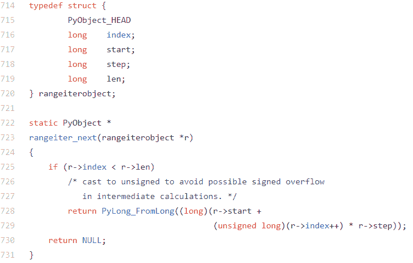
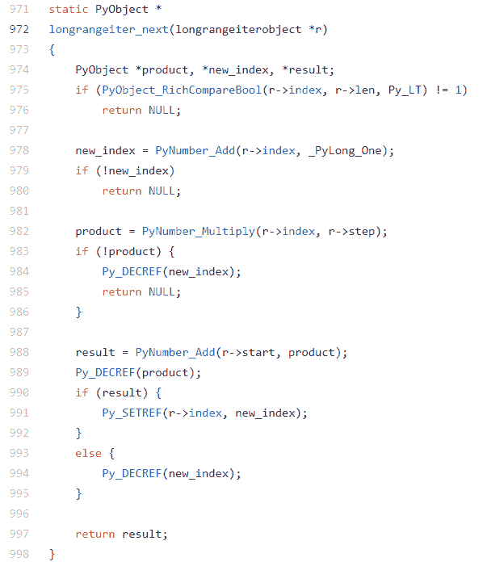

# xrange Python xrange vs . range vs . range

> 原文：<https://dev.to/guy_gold/xrange-vs-range-vs-range-kd4>

# 一个简单的问题

当我在教一个关于迭代器和生成器的课程时，一个学生问了我一个问题，这个问题起初似乎并不那么有趣。“xrange 和 range 哪个更快？”。我试图向他解释，在许多情况下，使用 xrange 比使用 range 更好——但这是因为内存使用更少，而不是因为运行时间。他继续说:“是的，我明白了。但是哪个更快呢？”。很明显，用 range 构建一个列表要比调用 xrange 花费更多的时间——因为当调用 xrange 时，并没有构建真正的列表。更准确地说，问题是:
在列表对象上调用迭代器的 next，或者在 xrange 对象上调用迭代器的 next，哪个更快？

# 简单回答？

我不得不考虑一下。在查看文档或源代码之前，我试图思考我对它的直觉是什么。与其他基本操作相比，这两种操作都应该非常快(比如用 range 构建一个列表)。

*   获取列表中的下一个对象基本上就是访问某个特定索引中的数组(并增加该索引)
*   获取 xrange 对象的下一个对象基本上就是增加一个数，然后返回它。同样，这是一个非常简单的操作。

那么什么更快呢？直接内存访问还是简单的加法？我认为加法(xrange)可能会快一点，但不会太快。

# RTFM

xrange 的文档对此有什么说法？
嗯，根据 xrange 的 Docstring，比 range 略快:

```
In [1]: xrange?
Docstring:
xrange(stop) -> xrange object
xrange(start, stop[, step]) -> xrange object

Like range(), but instead of returning a list, returns an object that
generates the numbers in the range on demand.  For looping, this is
slightly faster than range() and more memory efficient. 
```

Enter fullscreen mode Exit fullscreen mode

但是 Docstring 并没有确切地说明 range 的哪一点更快。所以我们必须猜测他们正在处理调用下一个方法(在 xrange 上迭代)

但是，python 的“正式”文档并没有明确说明 xrange 的速度:

xrange(stop)
xrange(start，stop[，step])
这个函数和 range()非常相似，但是返回的是一个 xrange 对象而不是一个列表。这是一种不透明的序列类型，它产生与相应列表相同的值，但实际上并不同时存储它们。xrange()相对于 range()的优势微乎其微(因为 xrange()仍然需要在被请求时创建值)，除非在内存不足的机器上使用了一个非常大的范围，或者从未使用过该范围的所有元素(比如循环通常以 break 终止)。有关 xrange 对象的更多信息，请参见 xrange 类型和序列类型 str、unicode、list、tuple、bytearray、buffer、XRange。

你可以在这里看到文档-[https://docs.python.org/2/library/functions.html#xrange](https://docs.python.org/2/library/functions.html#xrange)

# 跑吧！

我喜欢 Python 的一个原因是它很容易尝试。如果你想知道什么更快，只要运行代码，看看什么更快！我们希望消除构建范围列表的时间，只关注迭代本身。
ipython 有一个非常好的检查方法运行时间的特性- %timeit。我们可以把它和 next of list 迭代器/ xrange 迭代器一起使用，看看哪个更快。
我们将使用大小为 10，000，000 的 list /xrange 进行测试。我们还需要限制%timeit 执行的测试数量，这样我们就不会遇到 StopIteration 异常(list / xrange 的结尾)。
以下是结果:

```
In [4]: list_iterator = iter(range(10 ** 7))

In [5]: %timeit -n 1000000 list_iterator.next()
1000000 loops, best of 3: 68.7 ns per loop

In [6]: xrange_iterator = iter(xrange(10 ** 7))

In [7]: %timeit -n 1000000 xrange_iterator.next()
1000000 loops, best of 3: 65.9 ns per loop 
```

Enter fullscreen mode Exit fullscreen mode

似乎快了一点，对吧？大约 5%
但是结果不太一致:

```
In [8]: xrange_iterator = iter(xrange(10 ** 7))

In [9]: %timeit -n 1000000 xrange_iterator.next()
1000000 loops, best of 3: 71.6 ns per loop 
```

Enter fullscreen mode Exit fullscreen mode

有时候 xrange 比较慢！差异的来源可能是我的运行环境(一个相当旧的 Ubuntu 14.04 VM，只有 1GB 的内存和一个 CPU)。
重要的是，在 Python 2.7 中，xrange 和 range 的速度似乎没有太大的不同。

# Python 3 怎么样？

在 Python 3 中，xranges 被完全从语言中移除了。现在，range 对象的行为就像古老而受人喜爱的 xranges 一样，它们返回一个可以迭代的对象——但不是一个列表。所以你会认为新的 range 对象会比旧的 xrange 对象更快，对吗？
来看看吧。
记住这一点。Python 3 中也去掉了 next，现在我们需要调用 next(迭代器)而不是 iterator.next()。

```
In [1]: range_iterator = iter(range(10 ** 7))

In [2]: %timeit -n 1000000 next(range_iterator)
111 ns ± 7.63 ns per loop (mean ± std. dev. of 7 runs, 1000000 loops each) 
```

Enter fullscreen mode Exit fullscreen mode

对于一个操作来说，这超过了 110 ns，而不是 Python 2 中的 70 ns！
和 Python 2 一样，遍历列表似乎需要相似的时间:

```
In [3]: list_iterator = iter(list(range(10 ** 7)))

In [4]: %timeit -n 1000000 next(list_iterator)
95.7 ns ± 7.13 ns per loop (mean ± std. dev. of 7 runs, 1000000 loops each) 
```

Enter fullscreen mode Exit fullscreen mode

它甚至比 xrange 还要快一点，但是仍然比 Python 2 中的迭代慢 50%。

这实际上是 Python 3 中的一个已知现象。
你可以在这里读到一些可能的解释-[https://stack overflow . com/questions/23453133/is-there-a-reason-python-3-enumerates-slow-than-python-2](https://stackoverflow.com/questions/23453133/is-there-a-reason-python-3-enumerates-slower-than-python-2)
(虽然，在我看来，这个答案似乎不正确——因为我们只使用小数字——低于 sys.maxint)

# 高数字

上面堆栈溢出链接里的答案让我很好奇——非常高的数字会怎么样？range 和 list(range)还会有相似的速度吗？我的直觉告诉我，结果将类似于我们之前看到的结果——每次调用 next 大约需要 100 ns。但是，发现事物的最好方法是尝试！
所以我们来检查一下:

```
In [2]: list_iterator_high_numbers = iter(list(range(2 ** 64, 2 ** 64 + 10 ** 7)))

In [3]: %timeit -n 1000000 next(list_iterator_high_numbers)
97 ns ± 12.1 ns per loop (mean ± std. dev. of 7 runs, 1000000 loops each) 
```

Enter fullscreen mode Exit fullscreen mode

正如我们所看到的，列表的结果与之前的结果非常相似。这并不奇怪。

```
In [4]: range_iterator_high_numbers = iter(range(2 ** 64, 2 ** 64 + 10 ** 7))

In [5]: %timeit -n 1000000 next(range_iterator_high_numbers)
204 ns ± 9.15 ns per loop (mean ± std. dev. of 7 runs, 1000000 loops each) 
```

Enter fullscreen mode Exit fullscreen mode

现在，这是个惊喜！迭代范围较大的数字比迭代范围较小的数字要慢得多。呼叫 next 平均要多花 100%的时间！

为什么会这样？我在文档中找不到任何提示，所以我必须采取下一步措施

# 读取源代码

Python 的另一个优点是你可以简单地阅读它的源代码。如果你想更彻底地理解一些东西，或者你只是有点好奇，你可以阅读代码本身！
我们要看的相关模块是 Objects/rangeobject.c，它包含了 Python 3 中 range 对象的实现。
你可以在这里找到-[https://github . com/python/cpython/blob/master/Objects/range object . c](https://github.com/python/cpython/blob/master/Objects/rangeobject.c)
找到“下一个”方法的代码相当容易，也就是我们感兴趣的方法:

[T2】](https://res.cloudinary.com/practicaldev/image/fetch/s--BZ32ssvT--/c_limit%2Cf_auto%2Cfl_progressive%2Cq_auto%2Cw_880/https://thepracticaldev.s3.amazonaws.com/i/qcdqs8okbc4pj25ea2kr.PNG)

代码非常简单。如果范围还没有到达它的结尾，将索引加 1，乘以“step”，加上“start ”,然后以 Python long 对象的形式返回值。(选角问题现在与我们无关)。这似乎是一个有效的代码。为什么高数效率更低？
但是等一下。它根本不适用于比 long 更长的数字！
我们刚刚看到 range 确实支持非常高的数字，超过 64 位。C #中的长变量只能存储最多 32(或 64)位的数字。一定有其他代码可以处理更高的数字。
嗯，我第一眼看的时候，错过了这个方法上面的注释:

[](https://res.cloudinary.com/practicaldev/image/fetch/s--L9B6Zbn2--/c_limit%2Cf_auto%2Cfl_progressive%2Cq_auto%2Cw_880/https://thepracticaldev.s3.amazonaws.com/i/6bvvnkpwhlvxlzrv5mqw.PNG) 
它清楚地表明 C longs 有一个实现(我们刚刚看到的那个)和 Python ints 有另一个实现。
该方法出现在大约 250 行之后:

[](https://res.cloudinary.com/practicaldev/image/fetch/s--q7wJchvT--/c_limit%2Cf_auto%2Cfl_progressive%2Cq_auto%2Cw_880/https://thepracticaldev.s3.amazonaws.com/i/hhadv4used4bs02oycaz.PNG) 
看看所有那些代码。
与我们在 rangeiter_next 中看到的 3-4 个基本算术运算不同，在 longrangeiter_next 中有更复杂的运算。不能简单地用“+”加 Python ints 必须用 PyNumber_Add。不能用“*”把“索引”和“步长”相乘——要用 PyNumber_Multiple。
难怪“比长”的号码打电话要花更多的时间——更多的事情正在发生。
但是对于正则列表的下一个方法，列表中的值是什么并不重要——你不需要做任何“复杂”的算术运算，比如乘以 Python 整数来从列表中获得一个条目。

# 最后的话

那么，我们在这里看到了什么？我们从一个简单的问题开始——xrange 和 range 哪个更快？我们发现答案并不明显。
我们接着比较了 Python 2 和 Python 3 的速度，我们惊讶地发现 Python 3 在这方面稍慢。
然后我们观察了高数值的范围，发现它们比“低”数值的范围慢得多。我们不得不研究 Python 源代码来找出原因。

这就是这篇文章的全部内容，希望你喜欢。