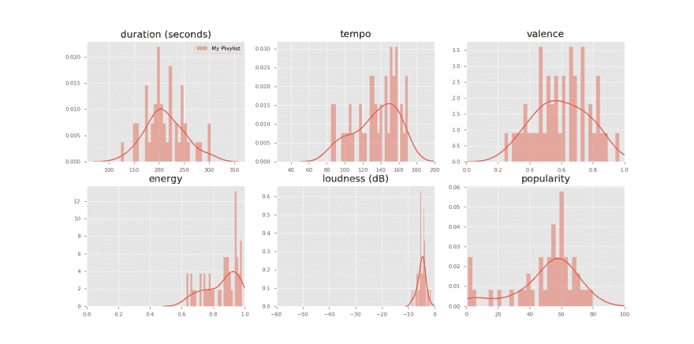
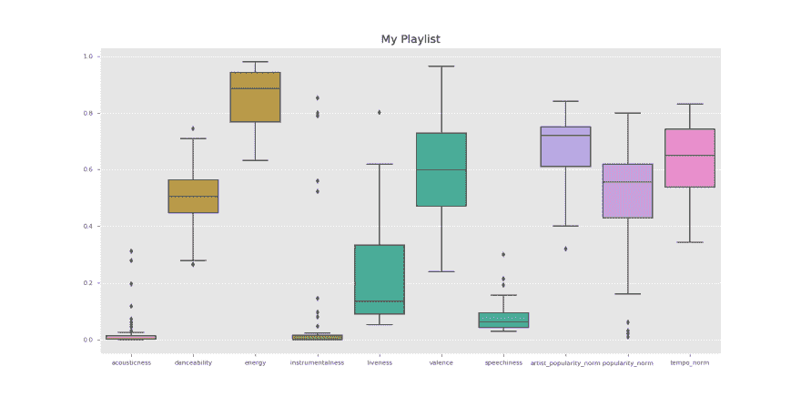
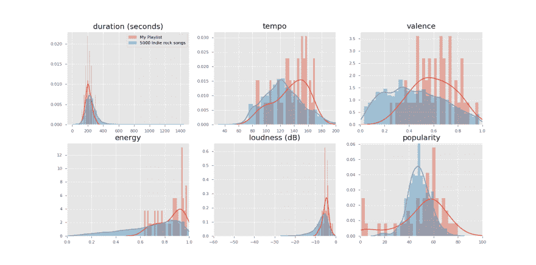
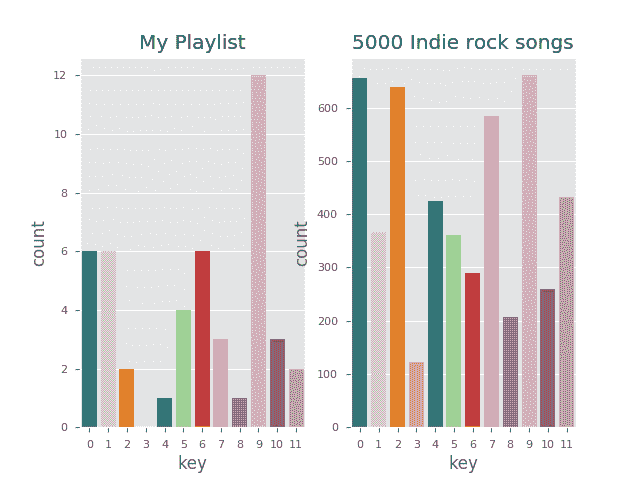
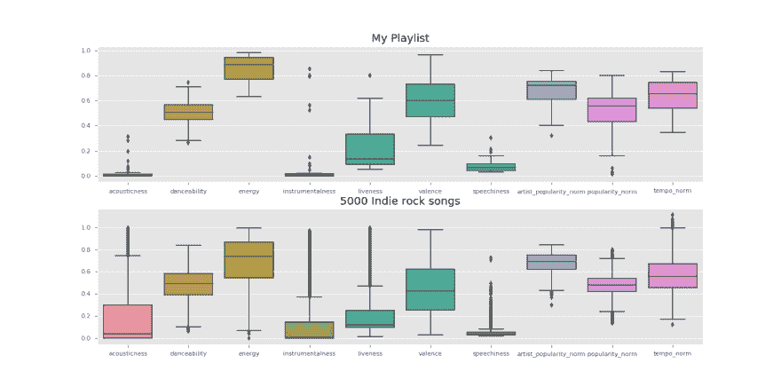

# 在 Spotify 上找到我最喜欢的新歌

> 原文:[https://dev . to/ericbonfadini/finding-my-new-favorite-song-on-Spotify-4 lgc](https://dev.to/ericbonfadini/finding-my-new-favorite-song-on-spotify-4lgc)

当我在发展的时候(或者只是当我去上班的时候)，我通常喜欢听一些摇滚乐。

我在 Spotify 上创建了一些播放列表，但最近我坚持使用同一个播放列表，包含我最喜欢的“独立摇滚”歌曲。这个播放列表由我多年来通过多种方式发现的大约 45 首歌曲组成。

由于我开始厌倦总是听同样的歌曲，上周末我决定使用 Spotify APIs 分析我的播放列表，以便发现见解，并希望找到一些我可以添加的新歌曲。

以下是我在大约 300 行 Python 3 代码中所做的工作(包括样板文件)。你可以在 github 上找到一个 Jupyter 笔记本，上面有我用的代码。

# 设置环境

对于我的分析，我用以下库建立了一个 Python 3 虚拟环境:

*   [熊猫](https://pandas.pydata.org/)进行数据分析
*   [Seaborn](https://seaborn.pydata.org/) 用于数据可视化
*   [Spotipy](https://github.com/plamere/spotipy) 用于与 Spotify APIs 交互

为了访问 Spotify APIs，我[注册了我的应用程序](https://developer.spotify.com/my-applications/#!/applications)，然后我向 Spotify 库提供了 client_id、client_secret 和一个重定向 url。

# 分析我的播放列表曲目

在第一次 API 调用获取我的[播放列表 id](https://developer.spotify.com/web-api/get-list-users-playlists/) 之后，我用另一个 [API 调用](https://developer.spotify.com/web-api/get-playlists-tracks/)获取了我的播放列表的所有曲目，以及一些基本信息，如:歌曲 id、歌曲名称、艺术家 id、艺术家名称、专辑名称、歌曲流行度。

通过另一个 [API 调用](https://developer.spotify.com/web-api/get-several-artists/),我获得了播放列表中艺术家的一些额外信息，比如流派和艺术家流行度。

最后，通过另一个 [API 调用](https://developer.spotify.com/web-api/get-several-audio-features/),我获得了一些关于我的轨迹的有见地的信息:

*   *duration_ms* :以毫秒为单位的轨迹持续时间；
*   *音质*:描述歌曲的音质(1 = >高置信度音轨是声学的)。范围从 0 到 1；
*   *可跳性*:描述一首歌曲的可跳性(1 = >高置信度该曲目可跳)。范围从 0 到 1；
*   *能量*:是对强度和活跃度的感性衡量(如死亡金属能量高，而古典音乐能量低)。范围从 0 到 1；
*   *乐器性*:预测音轨是否不包含人声(1 = >高置信度音轨不包含人声)。范围从 0 到 1；
*   *liveness* :检测录音中是否有观众(1 = >高置信度音轨为 live)。范围从 0 到 1；
*   *响度*:检测音轨的整体响度，单位为分贝。范围从-60dB 到 0dB
*   *价*:描述一首曲目所传达的音乐积极性(1 = >更积极，0 = >更消极)。范围从 0 到 1；
*   *语音*:检测音轨中是否存在语音(1 = >语音，0 = >非语音，仅音乐)。范围从 0 到 1；
*   *键*:描述歌曲的[音高等级符号](https://en.wikipedia.org/wiki/Pitch_class)。范围从 0 到 11；
*   *调式*:一首曲目的调式(0 = >小调，1 = >大调)；
*   *tempo* :以每分钟节拍数(BPM)为单位的一个音轨的整体估计速度；
*   *time_signature* :一个音轨的估计整体拍号(每个小节或小节有多少拍)。

为了简化数据分析，所有这些调用的结果都被放入 Pandas 数据帧中，然后使用艺术家 id 和曲目 id 合并到单个数据帧中。一些数值(宋立科/艺人人气和节奏)已经正常化。

## 探索性数据分析

在确保我的播放列表中的艺术家都包含“独立摇滚”作为流派后，我看到(使用完整数据帧的形状、信息和描述)我的播放列表由 46 个条目组成，包含所有非空值和这些统计:

然后我用 Seaborn 创建了一些图表(distplot，countplot，box plot):

所有这些图表表明，我喜欢声音/乐器/语音低、能量/响度/速度高、艺术家受欢迎程度高、持续时间大约 200 秒的歌曲。价格和歌曲流行度跨度很大，这意味着我的播放列表中有知名和不知名的歌曲，也有正面和负面的歌曲。

但是我的播放列表和独立摇滚风格相比如何呢？

# 将我的播放列表与流派样本进行比较

我使用了一些对[搜索 API](https://developer.spotify.com/web-api/search-item/) 的调用，以‘流派:“独立摇滚”’为关键字，使用‘类型=曲目’来获取独立摇滚流派的样本(总共 5000 首歌曲)。
这个 API 还提供了一些不错的关键词，比如“tag:hipster”(只获取人气最低的 10%的专辑)或“year:1980-2020”(只获取特定年份范围内发布的歌曲)。

然后，我对我当前的播放列表和独立摇滚样本重复了相同的分析，我得到了以下图表:
 

图表显示我的播放列表不同于 5000 首独立摇滚歌曲，因为:

*   我喜欢较短的歌曲
*   我喜欢活力/音量/节奏更高的歌曲
*   我不喜欢太消极情绪(化合价> 0.3)的歌
*   我最喜欢调(0，1，6，9)的歌

箱线图证实了同样的见解，我同意这一分析的结果。
[T3】](https://res.cloudinary.com/practicaldev/image/fetch/s--YeXeIlCN--/c_limit%2Cf_auto%2Cfl_progressive%2Cq_auto%2Cw_880/https://thepracticaldev.s3.amazonaws.com/i/14b0bgzio79c37tcjvdt.png)

# 创建包含我可能喜欢的歌曲的新播放列表

利用这些见解，我对 5000 首歌曲数据帧应用了一些过滤器，以便只保留我可能喜欢的曲目；对于每一步，我都记录了丢弃的歌曲，以仔细检查过滤器的行为。

显然，我应用的第一个过滤器是删除我原来播放列表中已经有的歌曲。

其他过滤器是:

*   声学< 0.1
*   能量> 0.75
*   响度>-7dB
*   化合价在 0.3 和 0.9 之间
*   速度> 120
*   键入(0，1，6，9)
*   原始播放列表持续时间的 10%四分位数和 90%四分位数之间的持续时间(178 秒和 280 秒)

最后，我得到了一个包含 220 首曲目的数据帧，并使用一个 [API 调用](https://developer.spotify.com/web-api/add-tracks-to-playlist/)创建了一个新的播放列表

# 结论和未来步骤

在听了几天新的播放列表后，我对结果非常满意，并且我已经将一些曲目推广到我原来的播放列表中。

这种“推荐”方法非常简单，可能只在这种特定的用例中工作得很好(例如，它是特定类型的一个很好定义的子集)。Spotify 的标准推荐方法显然要好得多，因为除了音频分析，它还混合使用了*协同过滤模型*(分析你和他人的行为)和*自然语言处理(NLP)模型*(分析歌曲文本)。

后续步骤:

*   几个月后再次运行分析，以便考虑我的播放列表中的新条目和 5000 个样本中的新歌曲
*   使用 Spotify APIs(例如[音频分析端点](https://developer.spotify.com/web-api/get-audio-analysis/)或其他服务)用新的东西丰富我已经获得的信息。这将是很好的，作为一个例子，检测轨道中的乐器(吉他，有人吗？？)或存在某些特征，如失真、重复等。
*   使用 API 中的预览样本手动标记我喜欢/不喜欢的 5000 首歌曲的子集，然后运行一些 ML 算法，以便对我喜欢的音乐进行分类
*   使用一些 ML 算法更深入地分析我的播放列表(例如，对我的曲目进行聚类)