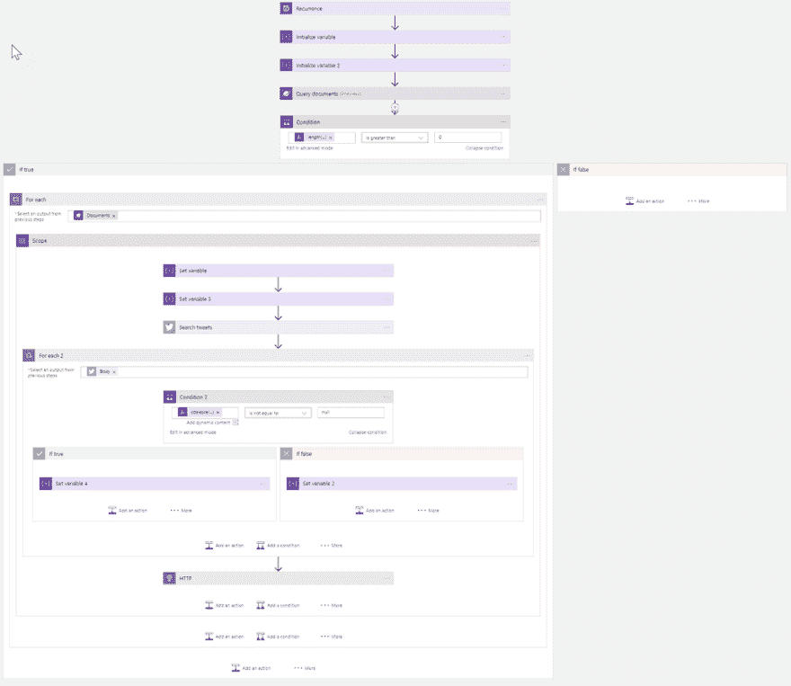
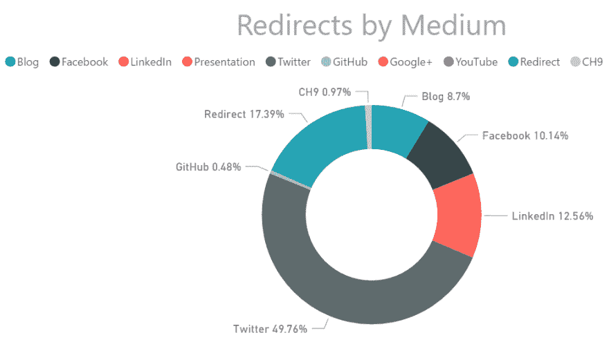
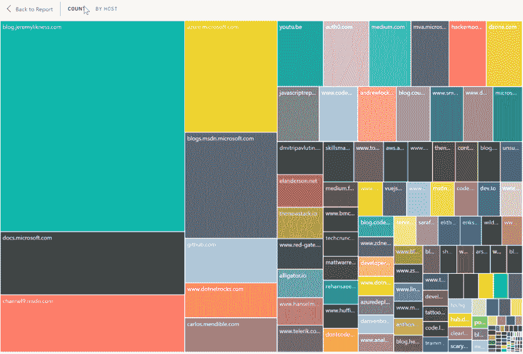
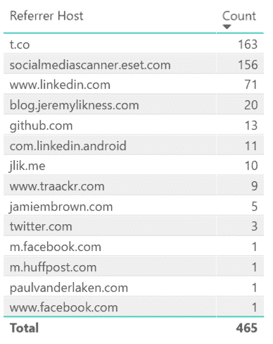
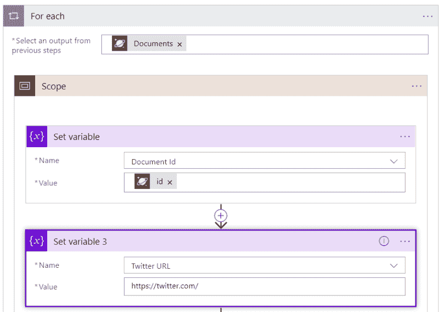
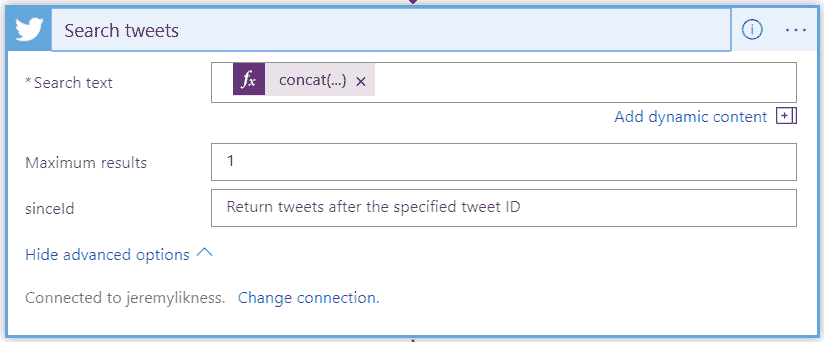
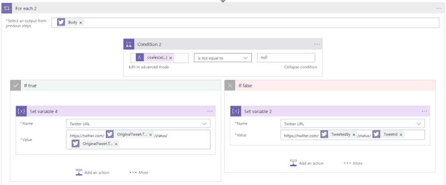
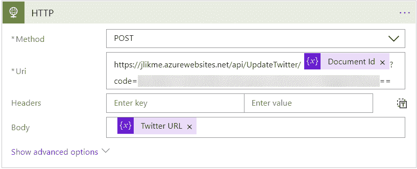
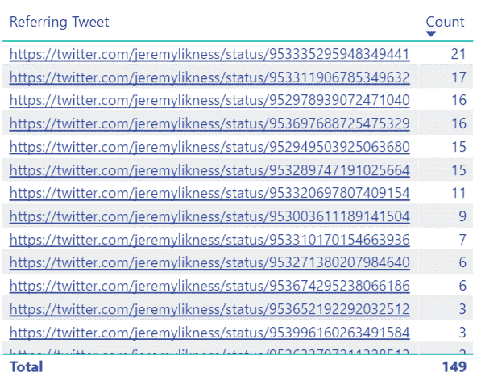

# 使用 CosmosDB 和 Logic 应用程序的无服务器 Twitter 分析

> 原文:[https://dev . to/jeremylikness/server less-Twitter-analytics-with-cosmosdb-and-logic-apps-34ej](https://dev.to/jeremylikness/serverless-twitter-analytics-with-cosmosdb-and-logic-apps-34ej)

#### 使用 Azure 云理解点击行为

我最近在我的 Azure 投资组合中添加了一个[逻辑应用](https://jlik.me/cly)，它提供的见解令人惊叹。我选择了 Logic Apps，因为我需要一种[的简单方式来查询 Twitter](https://jlik.me/clz) 。在 Logic Apps designer 中，我只需点击“Twitter”，登录，并指定我的搜索。剩下的由它来做。我不用写一行代码，甚至不用担心身份验证的细微差别。这都是为我处理的！

 

<figcaption>逻辑 App 工作流程</figcaption>

自从我开始使用我的[自定义链接缩短器](https://blog.jeremylikness.com/build-a-serverless-link-shortener-with-analytics-faster-than-finishing-your-latte-8c094bb1df2c)以来，已经有几个月和数万次点击了。我每天都使用这个工具，并利用分析来完善我发送给社交媒体的信息。我的目标只是找出开发人员对各种主题的反应，这样我就可以排除那些不感兴趣的主题，专注于那些能引起兴趣和兴奋的主题。在工具的上下文中,“点击”是对特定主题的“投票”。

例如，我可以查看过去 24 小时，发现虽然 Twitter 是我目前使用的最活跃的社交媒体，但我在 T2 9 频道的视频、这个博客甚至 T4 GitHub T5 也有很多活动。

 

<figcaption>媒体重定向(过去 24 小时)2018 年 1 月 18 日</figcaption>

我还开始跟踪像目标主机页面这样的数据。这给了我一个有趣的视觉效果，通过我的 URL 跟踪器的大部分点击都在哪里结束。

 

<figcaption>点击主持人</figcaption>

最近，我意识到我遗漏了一些重要的信息。虽然不太一致，但有些来源还是好心提供了推荐信息。每个请求还提供一个用户代理。综合起来，这些信息给了我有价值的见解，如使用的浏览器，我的内容是在移动设备上还是在桌面上阅读，以及点击来自哪里。

我将在另一篇博文中讨论更多的用户代理代码，但是向跟踪数据添加推荐信息非常简单:

[https://medium . com/media/c 0967 f 935 DC 53 a0c 99 b 29 c 3489d 6239 f/href](https://medium.com/media/c0967f935dc53a0c99b29c3489d6239f/href)

这给了我一个页面和一个主机，所以我可以在不同的级别组织数据。我喜欢的是 [CosmosDB](https://jlik.me/cl0) 是一个无模式数据库，所以事后添加新属性很简单。我只是忽略了我的分析中需要推荐信息的旧数据。根据新信息运行一段时间后，我注意到一个有趣的趋势。

 

<figcaption>张胜利主持</figcaption>

大量的推荐来自“t.co ”,这是 Twitter 自己的链接缩短器。事实上，我意识到每条新推文都有一个独特的“短链接”这意味着我可以在 Twitter 上搜索准确的短链接 URL，并找到引用的原始推文！这有助于我分析哪些推文产生了最大的参与度，并与 Twitter 的统计数据进行“事实核对”。

> 注意:在转发级别理解活动是很好的，但是这是不可能的。转发只是引用原始推文，因此无法确定点击是来自原始推文还是转发推文。因此，我设置了跟踪原始 tweet 信息的逻辑，从那里我可以随时从 twitter 查询关于赞和转发的统计数据。

我知道逻辑应用将是处理推文最简单的方式，所以我登录了我的 Azure 门户网站并添加了一个新的逻辑应用。该设计器使得连接到各种资源和资产变得非常容易。这是我工作流程的第一部分。触发器是我每两个小时运行一次的计时器，会根据活动的需要进行调整。我初始化一个变量来表示当前文档和 Twitter 链接，然后获取所有具有 Twitter 引用但尚未映射到原始 tweet 的文档。

 

<figcaption>抓取单据进行处理</figcaption>

请注意 SQL 语法的灵活性，它能够找到尚未定义属性的文档(not(is_defined(…))。CosmosDB 自动索引所有属性，因此这些查询执行速度极快。

我添加了一个“for…each”循环来迭代结果文档。

 

<figcaption>迭代每个文档</figcaption>

我将“文档 id”变量设置为当前 id，将“twitter URL”变量设置为 twitter 网站。这是我将使用的默认设置，以防搜索结果是空的。

> 注意:默认情况下，逻辑应用程序并行运行循环。虽然这对于规模来说很好，但是我编写的过程是连续的，因为我需要将文档直接映射到我找到的链接。因此，我将“设置”下的并行度设置为“1”如果我学会了一种将变量限定在并行流程范围内的方法，我可能会在将来对此进行重构。

如果您感到好奇，这里有一个样本文档，它有一个 Twitter 引用，但是还没有映射到原始的 tweet。

[https://medium . com/media/954 EC 844 c 6b 7921 e 354 C4 ff 837 F3 D2 f/href](https://medium.com/media/954ec844c6b7921e354ce4ff837f3d2f/href)

现在，我在 Twitter 上搜索包含该链接的推文。

 

<figcaption>搜索推特</figcaption>

我只需要一个结果。我还稍微修改了一下推荐 URL，因为有时会附加一个我不需要的 querystring。下面是该步骤的支持代码。

[https://medium . com/media/f 05920 a 212187 a2 D2 efac 89 e 9 DCA 6034/href](https://medium.com/media/f05920a212187a2d2efac89e9dca6034/href)

然后，我迭代结果(最多得到一条)，并根据“原始推文”是否存在进行分支。

 

<figcaption>分支基于原创推文</figcaption>

这些变量是使用原始 tweet 或当前 tweet 设置的。“原始 tweet”是一个嵌套的对象，所以检查它是否存在的最简单的方法是用一个已知的值合并。下面是我与文本文字“null”相比较的表达式:

coalesce(items(' For _ each _ 2 ')[' original tweet ']，' null ')

twitter URL 变量现在包含三个可能值之一:

1.  Twitter URL，因为搜索没有返回结果
2.  因为搜索返回了一个转发
3.  因为搜索返回了一条原创的推文

下一步是将新属性添加到文档中。在 Logic 应用程序中没有直接的连接器，但是 Logic 应用程序可以很好地与 [Azure 函数](https://jlik.me/cl2)配合使用，并且添加函数很简单:

[https://medium . com/media/5 ceca 2 b 6700 e 9 aeed 21 b 0 Fe 74 a 36 c 847/href](https://medium.com/media/5ceca2b6700e9aeed21b0fe74a36c847/href)

功能让生活变得如此简单！通过提供一个 [CosmosDB (DocumentDB 接口)绑定](https://jlik.me/cl3)，我不需要做任何事情来检索文档。绑定会自动从标题中检索 id，找到相应的文档(如果存在)，然后将其传递给 function 方法。我所要做的就是将作为简单文本字符串传递的 URL 作为文章的主体，并将其作为新的 referralTweet 属性添加到文档中。绑定甚至为我做更新！

从 Logic 应用程序调用函数有两种方式。您可以直接连接到某些函数，也可以将函数端点作为客户端调用。我选择了后者。

 

<figcaption>发布到功能端点</figcaption>

注意，我使用变量将文档 id 添加到路由中，并在正文中包含 twitter URL。这个设计允许我随时运行它来捕获未处理的文档，并且已经在我的仪表板上为我提供了新的见解。

 

<figcaption>张胜利推文</figcaption>

当然，现在我有了 tweet，我可以更进一步，抓取 tweet 文本，在仪表板上显示更多的上下文，甚至是预览。但那是另一天的任务！

如果你还没有接触到 Logic 应用程序的强大功能，我鼓励你今天就[看看它们](https://jlik.me/cly)。

直到下一次，

[T2】](https://res.cloudinary.com/practicaldev/image/fetch/s--u6zXBAsP--/c_limit%2Cf_auto%2Cfl_progressive%2Cq_66%2Cw_880/https://cdn-images-1.medium.com/max/197/1%2AKwXn3ElS7vnWIk8lNVhBsA.gif)

* * *