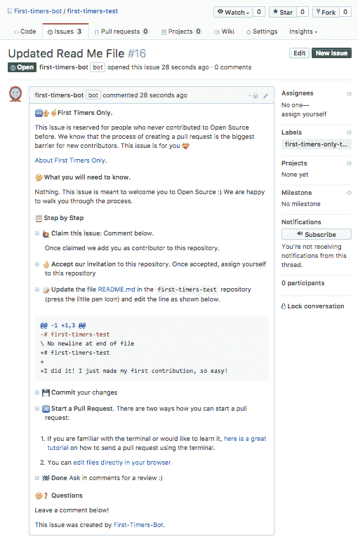

# 自动化新的贡献者问题与第一次机器人

> 原文:[https://dev . to/angieg0nzalez/automating-new-contributor-issues-with-first-timers-bot-4d4m](https://dev.to/angieg0nzalez/automating-new-contributor-issues-with-first-timers-bot-4d4m)

这是新的一年，我们中的许多人已经决定更多地在开源领域工作。也许你第一次想投稿？又或许你是一个项目的维护者，想要有更多的贡献者？让我把你介绍给我的好友[第一次见面的人](https://probot.github.io/apps/first-timers/)，他会帮你实现这些决心。

去年，我的朋友阿琳和我参与了一个名为 [Rails 女孩的代码之夏](https://railsgirlssummerofcode.org/)的项目，来自 [Hoodie](https://github.com/hoodiehq) 的[格雷戈尔·马丁纳斯](https://twitter.com/gr2m)是我们的导师。帽衫有这些超级棒的[仅限首次投稿者的问题](https://github.com/hoodiehq/camp/issues/135)，指导新投稿者完成投稿过程。问题是创建这些一步一步的问题通常会花费维护者比他们自己做修复更长的时间。所以 Gregor 要求我们建造一个机器人来自动完成这个过程。就这样第一时间诞生了！

First Timers 是用 [Probot](https://github.com/probot/probot) 构建的 GitHub 应用。Probot 是一个在 Node.js 中构建 GitHub 应用程序的框架。它使得为存储库上发生的事件设置 webhook 变得非常容易。你可以在下面看到我们的 webhook。我们正在监听“create”事件，每当有事情发生时，我们的函数 handleCreateEvent 就会触发。就是这样！你可以在这里查看我们的代码(欢迎投稿！).

```
module.exports = function (robot) {
  debug(`ready to receive "create" webhooks`)
  robot.on('create', handleCreateEvent)
} 
```

要使用首次计时器，首先你需要[在你的 GitHub repo 上安装](https://github.com/apps/first-timers)该应用。然后，当您想要创建一个新的问题时，转到将发生更改的文件，进行更改，并将其提交到一个新的分支，该分支以“首次”开始，并附有一条描述该做什么的简短消息。然后，首次计时器将检查这个“创建”事件是否是一个分支，以及它是否以“首次计时器-”开始，如果这两个都是真的，那么它将打开一个新的问题，如下所示。
T3T5】

这期杂志有一步一步的指南，显示了需要做哪些改变，有一个链接到需要做改变的文件，并有类似“仅限首次使用”的标签。我们还添加了配置，这意味着您可以更改标签、模板，甚至在不同的存储库中创建问题。查看我们的配置[部分](https://github.com/hoodiehq/first-timers-bot#configuration)了解更多信息。

First timers 已经安装在 200 多个项目上，包括 Jekyll、Processing 和 Semantic-Release！

因此，这是我的行动号召。你有需要改正的错别字吗？你有需要更新的版权年吗？要不要帮人家做第一次贡献？安装首次计时器，并开始创造一些问题！

这里有一个 Gregor 制作的短片来展示它是如何工作的。

[https://www.youtube.com/embed/vyuqd-30Qm4](https://www.youtube.com/embed/vyuqd-30Qm4)

T2】