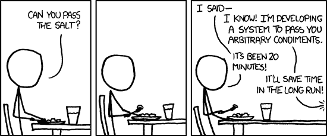

# 练习 YAGNI

> 原文:[https://dev.to/gonedark/practicing-yagni-3n1d](https://dev.to/gonedark/practicing-yagni-3n1d)

不久前，我在拉拉康谈到*练习 YAGNI* 。很荣幸能在这样一个首映式上面对这么多观众。直到今天，我继续收到很多反馈，并对我的演讲感兴趣。

关于这一点，许多人要求我分享我的幻灯片。由于幻灯片大多是讨论的占位符，我觉得博客帖子更好地总结了这次演讲。然而，如果你想看幻灯片，你可以在 [StreamACon](https://streamacon.com/video/laracon-us/jason-mccreary-yagni-with-laravel) 上看我的演讲。

* * *

我认为自己是一个搜寻者。在寻找编程实践的*圣杯*的过程中——这种单一的实践可以立即提升我的技能。虽然我知道这是不存在的，但我相信一套做法。最近，我发现一个是 *YAGNI* 。

YAGNI 是极限编程的一个原则，我每天都在工作中练习。YAGNI 是 T4 的首字母缩写，你不会需要它的。它规定程序员不应该增加功能，除非认为有必要。理论上，这似乎很简单，但是很少有程序员实践它。

## 为什么练 YAGNI 很难

在我们继续谈论 YAGNI 之前，我们需要了解它所解决的问题。问题是*超过工程*。从某种意义上来说，我们开始把自己放在复杂性上——沉迷于玩设计模式宾果游戏，并在我们脑海中构建更加复杂的架构。

[XKCD](http://xkcd.com) 用*【一般问题】*说明工程井。

[T2】](https://res.cloudinary.com/practicaldev/image/fetch/s--fQyAVpK4--/c_limit%2Cf_auto%2Cfl_progressive%2Cq_auto%2Cw_880/http://imgs.xkcd.com/comics/the_general_problem.png)

这很有趣，因为这是真的。但它回避了一个问题——为什么我们不能只传递盐呢？

[吻](https://en.wikipedia.org/wiki/KISS_principle)到底怎么了？一个 [MVP](https://en.wikipedia.org/wiki/Minimum_viable_product) 有什么不好？答案是*没事*。我们需要找到回归简单的方法。YAGNI 可以帮助我们到达那里。

## 如何练习 YAGNI

我认为极限编程的联合创始人之一 Ron Jeffries 很好地总结了实践 YAGNI:

> 在你真正需要的时候实施，而不是在你预见到你需要的时候。

尽管如此，最常见的争论是*计时*。我们不断地编写代码，比我们*实际上需要它们的时间还要早。这就是我们的过度工程师。我们混淆了*预见*和*需要*。*

为了帮助区分这两者，我们可以创建一个时间范围。肯特·贝克在[全栈电台](http://www.fullstackradio.com)的采访中很好地描述了这一点:

> …我做了一个小实验…如果我故意停止尝试预测未来，并将我的设计视野限制在六个月内，会怎么样…事情对我来说变得更好了…我不太懂工程。我进步得更快了。我不那么焦虑了…事情变得更清晰，更容易理解…那么三个月呢？一个月？那个实验我从未达到极限…

这样，练习 YAGNI 就变成了时间实验。一个我们不断减少我们的时间范围来帮助限制我们写的代码。理想情况下，直到我们到达一个点，我们不写代码，直到它实际上是需要的。不仅仅是因为我们在思考它，或者想要思考它，或者它与我们正在编写的代码有关。我们一直等到当前代码*要求*我们实现新代码才能工作。

一开始，我会承认，这感觉像是懒惰。这看起来像是你故意避免写代码。在某种程度上，这是真的。问题是，你希望编写的代码还没有准备好。通过等待，你可以防止你做假设时发生的所有不好的事情。

## 当不练 YAGNI

一旦你意识到 YAGNI 的好处，你会尝试把它应用到任何事情上(另一个程序员诅咒)。你需要记住，权力越大，责任越大。YAGNI 不是说不的地方。YAGNI 是关于推迟不必要的复杂性。

因此，有些时候你不应该给 YAGNI 打电话。不幸的是，这需要经验。因此，我将概述几个场景来帮助初学者。

*   学习新事物:在评估一项新技术时，你应该花时间。你以后会把时间争取回来，并减少因做出错误决定而失去更多时间的风险。
*   基于未来需求的当前设计决策: YAGNI 不应妨碍或破坏我们的努力。在这些场景中，做出面向未来的设计决策，但只实施足以满足当前需求的内容。这使我们能够限制返工，而不会完全破坏 YAGNI。
*   **抽象外部依赖:**外部依赖增加了项目的复杂性。与前面的例子一样，花时间抽象这些依赖关系将避免重复劳动并降低复杂性。
*   **测试、安全性、规模和业务需求:**很抱歉，YAGNI 在编写测试、安全代码、考虑规模或业务需求方面并不是一帆风顺的。

## YAGNI 对我意味着什么

练习 YAGNI 给了我信心。我乐于推迟设计决策，因为我将来会更了解情况。我相信自己快速转换的能力，因为我的代码很简单，很容易重构和发展。我写的代码比较少，说实话，最好的代码是*无*代码。

* * *

***想要更多？**在 Twitter 上关注 [@gonedark](https://twitter.com/gonedark) ，获得每周编码提示、足智多谋的转发和其他随机信息。*