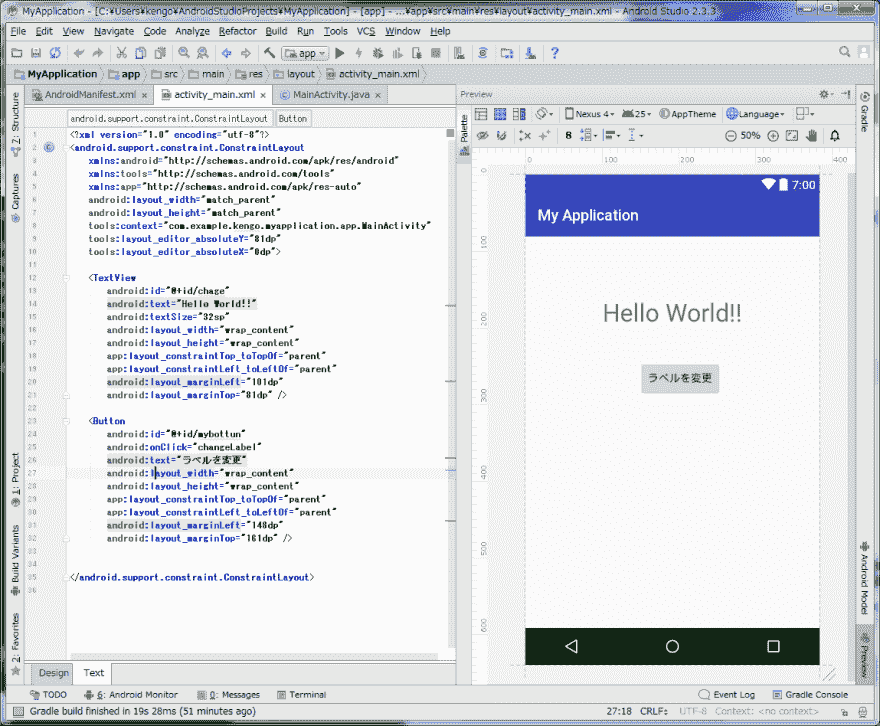
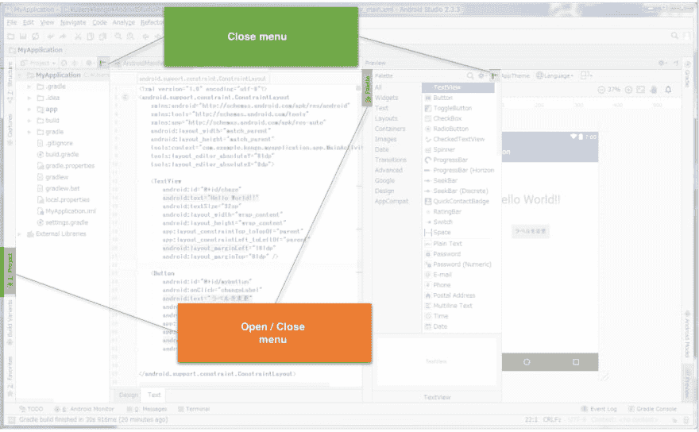
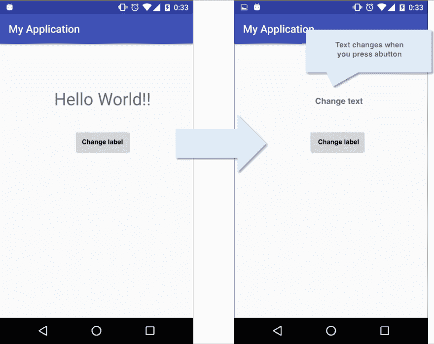
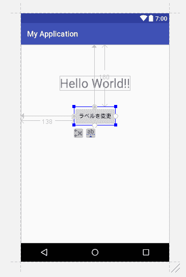

# 使用 Android Studio 尝试“Hello World”

> 原文:[https://dev . to/leen/tryed-hello-world-using-Android-studio-36j](https://dev.to/leen/tried-hello-world-using-android-studio-36j)

> 作者: [@kengo_kuwahara](https://qiita.com/kengo_kuwahara)
> 来源: [Qiita](https://qiita.com/kengo_kuwahara/items/e6a3107870d6e1ec039d)

## 简介

我将向您展示如何使用 Android Studio 开发 Android 应用程序。

## Android studio 是什么？

使用过集成开发环境的人都很熟悉，只是右侧有一个预览屏幕。

[T2】](https://res.cloudinary.com/practicaldev/image/fetch/s--sHpjYV0U--/c_limit%2Cf_auto%2Cfl_progressive%2Cq_auto%2Cw_880/https://thepracticaldev.s3.amazonaws.com/i/b030nqyejoczcbzj9yix.png)

您可以从底部和左右栏打开和关闭菜单。基本上，如上图所示，除了必要的最小菜单(代码和预览)之外，其他菜单都被关闭。

[T2】](https://res.cloudinary.com/practicaldev/image/fetch/s--yonZm8YE--/c_limit%2Cf_auto%2Cfl_progressive%2Cq_auto%2Cw_880/https://thepracticaldev.s3.amazonaws.com/i/r6n0c7wdmgfkjkzdhc4s.png)

## 如何实现

在使用 Android Studio 的开发中，我们将通过编辑 xml 文件和 java 文件来实现它。

#### xml 文件

它是一个用于设置外观的文件，比如按钮和文本框的位置。对于有 JavaScript 开发经验的人来说，可能更容易理解为 JavaScript 开发中的 html 文件。

#### java 文件

它是用于设置操作的文件，例如按下按钮时的处理。如果你有用 JavaScript 开发的经验，在 JavaScript 开发中如果对应 js 文件可能更容易理解。

## 弈

这次我们将编辑 activity_main.xml 和 MainActivity.java。加载完成的图像(或完成后的结果)后，编写实际代码。

## 完整的图像

[T2】](https://res.cloudinary.com/practicaldev/image/fetch/s--G5fAjhla--/c_limit%2Cf_auto%2Cfl_progressive%2Cq_auto%2Cw_880/https://thepracticaldev.s3.amazonaws.com/i/sorz7ooioktfhc71pwn4.png)

设置如下。

#### xml

标签:“你好世界！!"
按钮:“更改标签”

#### Java

按下“更改标签”按钮时放置标签“更改文本”的方法。

#### [T1】activity _ main . XML](#activitymainxml)

```
<?xml version="1.0" encoding="utf-8"?>
<android.support.constraint.ConstraintLayout...
　　<!--(略)-->
    <TextView
        android:id="@+id/chage"
        android:text="Hello World!!"
        android:textSize="32sp"
        android:layout_width="wrap_content"
        android:layout_height="wrap_content"
        app:layout_constraintTop_toTopOf="parent"
        app:layout_constraintLeft_toLeftOf="parent"
        android:layout_marginLeft="101dp"
        android:layout_marginTop="81dp" />

    <Button
        android:id="@+id/mybottun"
        android:onClick="changeLabel"
        android:text="Change text"
        android:layout_width="wrap_content"
        android:layout_height="wrap_content"
        app:layout_constraintTop_toTopOf="parent"
        app:layout_constraintLeft_toLeftOf="parent"
        android:layout_marginLeft="138dp"
        android:layout_marginTop="160dp" />
</android.support.constraint.ConstraintLayout> 
```

<svg width="20px" height="20px" viewBox="0 0 24 24" class="highlight-action crayons-icon highlight-action--fullscreen-on"><title>Enter fullscreen mode</title></svg> <svg width="20px" height="20px" viewBox="0 0 24 24" class="highlight-action crayons-icon highlight-action--fullscreen-off"><title>Exit fullscreen mode</title></svg>

#### <文本视图...

这是一个标签的设置。

#### <按钮...

是按钮的设置。

#### android: id = "@ + id / hoge "

指定对象的 id。

#### Android:layout _ width = " wrap _ content "

指定对象的大小。通过指定“wrap_content ”,它会根据要显示的对象自动调整大小(例如，如果增加按钮上显示的字符“change label ”,按钮会相应变大)。

#### app:layout _ constraint left _ toLeftOf = " parent "

它是关于对象位置的设置。这会将对象设置在屏幕的左侧。

#### layout _ constraint left _ toLeftOf 根据右侧的位置设置=“hoge”。通过指定 parent 来设置屏幕的左边缘。同样，通过设置 app:layout _ constraint left _ toLeftOf = "[object id]"，可以使其与指定对象左对齐。

#### Android:layout _ margin left = " 101 DP "

layout _ constraintLeft _ 设置从 LeftOf 和其他参数指定的位置开始设置的 dp 边距数。

对了，如果在 Andoroid Studio 的 Preview 中把鼠标放在对象上，可以看到从什么位置到什么 dp 位置。也可以通过拖动对象来改变位置。

[T2】](https://res.cloudinary.com/practicaldev/image/fetch/s--rWQ_i1_k--/c_limit%2Cf_auto%2Cfl_progressive%2Cq_auto%2Cw_880/https://thepracticaldev.s3.amazonaws.com/i/x8neflgszddytnn39410.png)

#### MainActivity.java

```
public class MainActivity extends AppCompatActivity {

    @Override
    protected void onCreate(Bundle savedInstanceState) {
        super.onCreate(savedInstanceState);
        setContentView(R.layout.activity_main);
    }

    /**
     *
     * @param view
     */
    public void changeLabel(View view) {
        TextView tv = (TextView) findViewById(R.id.chage);
        tv.setText("changed text");
    }

} 
```

<svg width="20px" height="20px" viewBox="0 0 24 24" class="highlight-action crayons-icon highlight-action--fullscreen-on"><title>Enter fullscreen mode</title></svg> <svg width="20px" height="20px" viewBox="0 0 24 24" class="highlight-action crayons-icon highlight-action--fullscreen-off"><title>Exit fullscreen mode</title></svg>

#### onCreate()

如果你制作了 xml，除非被人阅读，否则它将毫无意义。该方法描述在 setContentView 中调用时调用哪个 xml。这里设置了 activity_main.xml。

#### changeLabel()

描述按下按钮时的操作。为了从屏幕上获取一个事件，需要一个 view 类型的变量作为参数。之后，获取想要更改的标签的 ID，并用 setText 设置该值。