# CSS 文本属性，以及如何在你的网站上使用谷歌字体

> 原文：<https://dev.to/codetheweb/css-text-properties-and-how-to-use-google-fonts-on-your-website-43ni>

[T2】](https://res.cloudinary.com/practicaldev/image/fetch/s--ErqI1vVp--/c_limit%2Cf_auto%2Cfl_progressive%2Cq_auto%2Cw_880/https://codetheweb.blog/assets/img/posts/css-text-properties-and-google-fonts/cover.png)

了解如何改变文本在网站上的显示方式，并了解如何使用世界上最广泛和最强大的免费字体数据库！

嘿大家好！欢迎回到又一个编写 Web 代码的一年！希望你有一个美好的新年，并为 2018 年制定一些好的计划...

[T2】](https://res.cloudinary.com/practicaldev/image/fetch/s--4Y_2r5ui--/c_limit%2Cf_auto%2Cfl_progressive%2Cq_auto%2Cw_880/https://codetheweb.blog/assets/img/posts/css-text-properties-and-google-fonts/new-year-1.jpg)

今天我将谈论文本相关的 CSS 属性，以及如何用这个叫做[谷歌字体](https://fonts.google.com/)的漂亮东西给你的网站增添趣味。

我们走吧！

## 入门

我建议跟随我所有的教程，因为它真的可以帮助你更好地掌握这个主题。如果你想继续学习这篇教程，下面是开始的方法。

首先，创建一个新的项目文件夹，其中包含空白的`index.html`和`style.css`文件。

接下来，让我们编写一些基本的 HTML 来测试我们的字体属性。将以下内容添加到您的`index.html` :

```
<!DOCTYPE html>
<html>
    <head>
        CSS Fonts!
        <link rel="stylesheet" href="style.css">
    </head>
    <body>
        <span>Look at me, I am some awesome text!</span>
    </body>
</html> 
```

Enter fullscreen mode Exit fullscreen mode

在浏览器中打开您的`index.html`文件——它应该看起来像这样:

[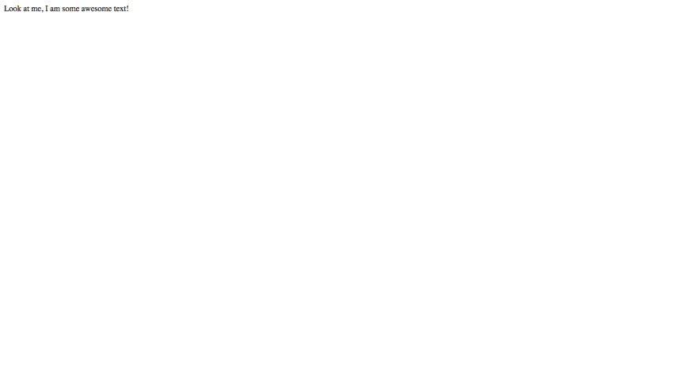T2】](https://res.cloudinary.com/practicaldev/image/fetch/s--dkrRb641--/c_limit%2Cf_auto%2Cfl_progressive%2Cq_auto%2Cw_880/https://codetheweb.blog/assets/img/posts/css-text-properties-and-google-fonts/base-code.png)

现在我们可以走了！

## 字号

你可能已经知道`font-size`了，因为它是一个非常普通的属性，但我还是要过一遍(如果你愿意，你可以[跳过](#font-weight))。

`font-size`相当直接，它决定了文本的大小。它接受任何一个 [CSS 单位](https://codetheweb.blog/2017/12/04/css-units/)中的值。我们来试试吧！

打开你的`style.css`文件，将`<span>`设置成有一个`50px`的`font-size`——看看你是否能独立完成代码...

```
span {
  font-size: 50px;
} 
```

Enter fullscreen mode Exit fullscreen mode

结果如下:

[T2】](https://res.cloudinary.com/practicaldev/image/fetch/s--oWXsfUBw--/c_limit%2Cf_auto%2Cfl_progressive%2Cq_auto%2Cw_880/https://codetheweb.blog/assets/img/posts/css-text-properties-and-google-fonts/font-size.png)

## 字体-粗细

`font-weight`设置文本的粗细(如**加粗**)。它采用以下值:

*   `lighter`
*   `normal`
*   `bold`
*   `bolder`
*   以下数字之一:`100`、`200`、`300`、`400`、`500`、`600`、`700`、`800`、`900`

数字从最细的`100`到最粗的`900`。`400`相当于`normal`，`700`相当于`bold`。**注意数字*后面没有单位*。**

让我们试着制作我们的字体`lighter`——将下面的内容添加到你的 CSS 文件中:

```
span {
  font-size: 50px;
  font-weight: lighter; /* Add this line */
} 
```

Enter fullscreen mode Exit fullscreen mode

结果:
[](https://res.cloudinary.com/practicaldev/image/fetch/s--oWXsfUBw--/c_limit%2Cf_auto%2Cfl_progressive%2Cq_auto%2Cw_880/https://codetheweb.blog/assets/img/posts/css-text-properties-and-google-fonts/font-size.png)

什么？！什么都没发生！这是因为 ***并不是所有的字体都附带所有的权重*** 。这是因为字体的设计者需要单独设计字体的每一种粗细，很多字体设计者不会最终设计出同一种字体的 9 个版本。在这种情况下，这种字体的设计者没有制作`lighter`版本——所以浏览器只显示最接近的对等物`normal`。

在我的[下一篇文章](https://codetheweb.blog/newsletter/)中，我将深入了解不同字体粗细文件实际上是如何指定的。

好的，让我们试着制作我们的文本`bold`——这种字体的设计者*已经*制作了一个`bold`版本...

```
span {
  font-size: 50px;
  font-weight: bold; /* Change this line */
} 
```

Enter fullscreen mode Exit fullscreen mode

结果:
[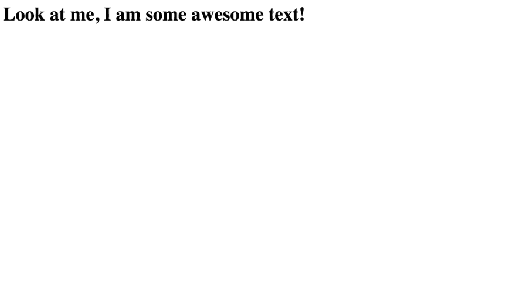](https://res.cloudinary.com/practicaldev/image/fetch/s--t7pYY_uF--/c_limit%2Cf_auto%2Cfl_progressive%2Cq_auto%2Cw_880/https://codetheweb.blog/assets/img/posts/css-text-properties-and-google-fonts/font-weight-bold.png)

呜！让我们继续前进...

## 行高

`line-height`基本控制每行文字的高度。`line-height`越大，文本之间的垂直间距越大。

像`font-size`，`line-height`接受任何 [CSS 单元](https://codetheweb.blog/2017/12/04/css-units/)中的值。我们来试试吧！

首先，让我们将文本分成两行，这样我们就可以通过在 HTML:
中添加一个`<br>`来正确地看到`line-height`

```
<!DOCTYPE html>
<html>
    <head>
        CSS Fonts!
        <link rel="stylesheet" href="style.css">
    </head>
    <body>
        <span>Look at me, <br>I am some awesome text!</span> <!-- Change this line -->
    </body>
</html> 
```

Enter fullscreen mode Exit fullscreen mode

结果:
[](https://res.cloudinary.com/practicaldev/image/fetch/s--nZf9IVom--/c_limit%2Cf_auto%2Cfl_progressive%2Cq_auto%2Cw_880/https://codetheweb.blog/assets/img/posts/css-text-properties-and-google-fonts/two-lines.png)

现在，让我们试着将`line-height`设置为`200px` :

```
span {
  font-size: 50px;
  font-weight: bold;
  line-height: 200px; /* Add this line */
} 
```

Enter fullscreen mode Exit fullscreen mode

现在，看看结果:
[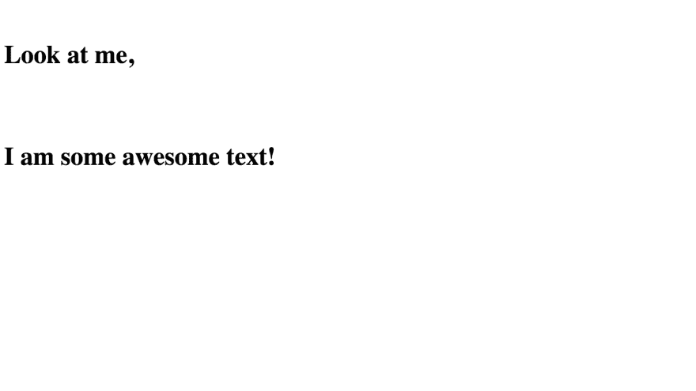](https://res.cloudinary.com/practicaldev/image/fetch/s--gj5sFsGE--/c_limit%2Cf_auto%2Cfl_progressive%2Cq_auto%2Cw_880/https://codetheweb.blog/assets/img/posts/css-text-properties-and-google-fonts/line-height-200px.png)

如你所见，现在文本行之间有了更多的空间。

但是你可能想知道-线*的高度*如何在线之间创造更多的空间*？这是因为从技术上讲，字里行间是没有空隙的。每条线都有`200px`高，文本在这些线的垂直中心*。这意味着随着`line-height`变大而`font-size`保持不变，实际文本之间的差距会变大。这里有一个图表:**

 *[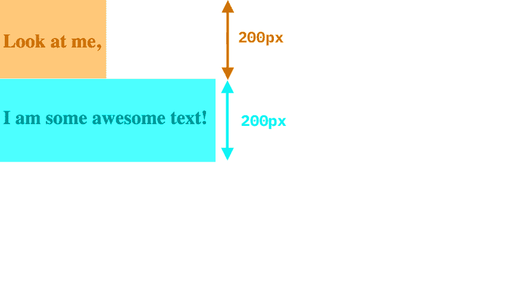T2】](https://res.cloudinary.com/practicaldev/image/fetch/s--Anw1JQEk--/c_limit%2Cf_auto%2Cfl_progressive%2Cq_auto%2Cw_880/https://codetheweb.blog/assets/img/posts/css-text-properties-and-google-fonts/line-height-200px-annotated.png)

`line-height`在使用 [`em`单位](https://codetheweb.blog/2017/12/04/css-units/#em)时工作良好，因为这意味着你可以相对于`font-size`设置`line-height`。例如，`line-height: 2em`会使`line-height`的文本大小加倍。

## 字母间距

`letter-spacing`确定每个字母之间的间距，并以任何 CSS 单位取值。让我们马上开始尝试吧！

尝试给文本一个`5px`的`letter-spacing`...

```
span {
  font-size: 50px;
  font-weight: bold;
  line-height: 200px;
  letter-spacing: 5px; /* Add this line */
} 
```

Enter fullscreen mode Exit fullscreen mode

下面是结果:
[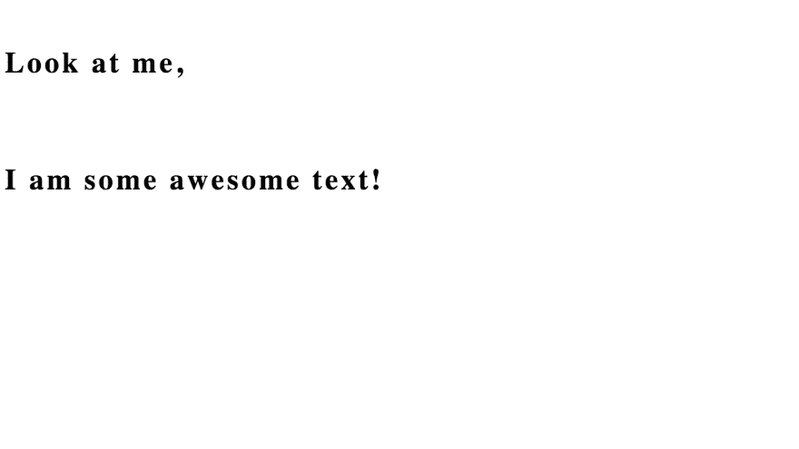](https://res.cloudinary.com/practicaldev/image/fetch/s--JOQXsygP--/c_limit%2Cf_auto%2Cfl_progressive%2Cq_auto%2Cw_880/https://codetheweb.blog/assets/img/posts/css-text-properties-and-google-fonts/letter-spacing.png)

如你所见，字母更加分散。这个例子看起来有点荒谬地展开以使`letter-spacing`变得清晰，但是通常它对于小的调整是好的(类似的事情也适用于`line-height`)。

## font-family

`font-family`告诉浏览器用哪种字体显示文本。以下是可用的默认字体:

> *   serif
> *   sans serif
> *   cursive script
> *   Fantasy
> *   Equal width

让我们试着将我们的字体设置为`fantasy`(不要问我为什么这么叫):

```
span {
  font-size: 50px;
  font-weight: bold;
  line-height: 200px;
  letter-spacing: 5px;
  font-family: fantasy; /* Add this line */
} 
```

Enter fullscreen mode Exit fullscreen mode

下面是结果:
[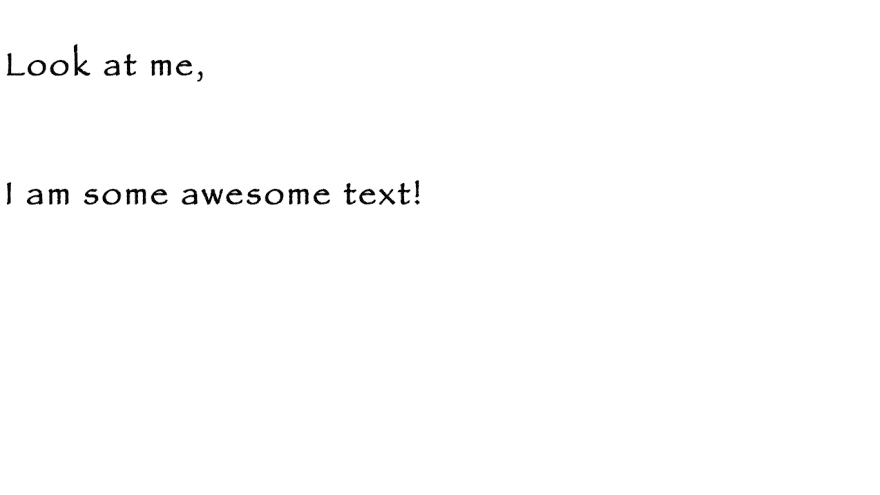](https://res.cloudinary.com/practicaldev/image/fetch/s--5bBn_YtF--/c_limit%2Cf_auto%2Cfl_progressive%2Cq_auto%2Cw_880/https://codetheweb.blog/assets/img/posts/css-text-properties-and-google-fonts/font-family-fantasy.png)

厉害！

请注意，默认字体*在不同的计算机或浏览器*上可能会有所不同，因为它是浏览器认为该类别的默认字体。一般来说，字体看起来是相似的。

您还可以指定计算机系统上安装的任何字体名称(如果字体名称包含空格，请用引号将其括起来，例如`font-family: "Modern Sans"`)。问题是， ***用户机器上没有安装*** 字体就不行。这就是谷歌字体的用武之地...

## 谷歌字体

[T2】](https://fonts.google.com/)

谷歌字体是一个图书馆，里面有成千上万令人敬畏的(免费的😋)字体。

> 谈到免费:在网上使用字体时一定要小心，有时许可证不允许它在网上使用或用于商业用途，或者你可能需要购买许可证。幸运的是谷歌字体上的所有字体都是完全免费的，所以你不用担心！

使用 Google Fonts 中的字体的好处是，它们会为您托管和创建一个字体样式表。这意味着你需要做的就是链接到他们的一个文件，这个字体将适用于所有人——即使用户没有在他们的电脑上安装它。

让我们从谷歌字体中添加一种字体到我们的网站！

首先，去[谷歌字体网站](https://fonts.google.com/)如果你还没有。到了那里，你会看到一堆字体标本:

[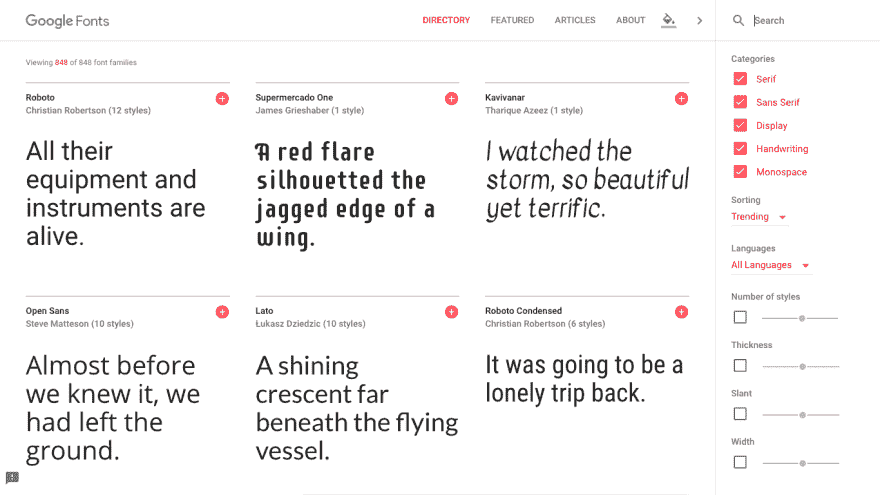T2】](https://res.cloudinary.com/practicaldev/image/fetch/s--un-cM5Rh--/c_limit%2Cf_auto%2Cfl_progressive%2Cq_auto%2Cw_880/https://codetheweb.blog/assets/img/posts/css-text-properties-and-google-fonts/g-fonts-home.png)

还有一个搜索框和许多先进的过滤器来找到你最喜欢的字体-你甚至可以过滤的东西，如厚度或宽度！

在这种情况下，我选择了字体 [Ribeye 髓](https://fonts.google.com/specimen/Ribeye+Marrow)。您可以使用该字体跟随我，也可以选择您自己的字体。

一旦你有了一个字体，点击红色的加号按钮-下图显示了如何在一个特定的字体页面或直接从主页:
[](https://res.cloudinary.com/practicaldev/image/fetch/s--spL8GaS6--/c_limit%2Cf_auto%2Cfl_progressive%2Cq_auto%2Cw_880/https://codetheweb.blog/assets/img/posts/css-text-properties-and-google-fonts/g-fonts-select-font.png)

这样做之后，你的屏幕右下角会出现一个小面板:
[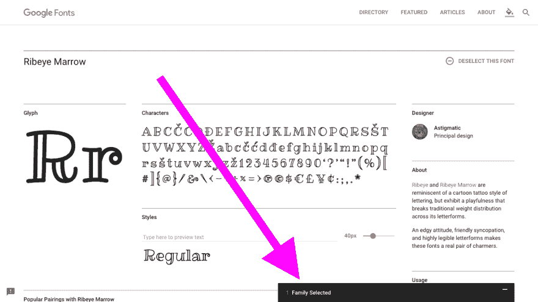](https://res.cloudinary.com/practicaldev/image/fetch/s--qWh4b29c--/c_limit%2Cf_auto%2Cfl_progressive%2Cq_auto%2Cw_880/https://codetheweb.blog/assets/img/posts/css-text-properties-and-google-fonts/g-fonts-selected-panel-closed.png)

通过点击打开它...
[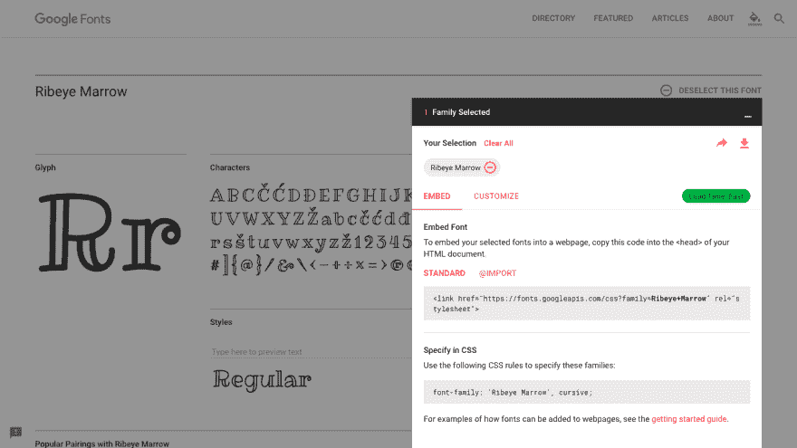T3】](https://res.cloudinary.com/practicaldev/image/fetch/s--cszzwiOR--/c_limit%2Cf_auto%2Cfl_progressive%2Cq_auto%2Cw_880/https://codetheweb.blog/assets/img/posts/css-text-properties-and-google-fonts/g-fonts-selected-panel-opened.png)

首先，我们将需要链接到字体，以便浏览器知道在哪里可以找到这些文件。有两种方法可以做到这一点:使用 HTML(标准)或 CSS (@import)。就个人而言，我更喜欢 CSS，因为字体是页面风格的一部分，所以把它们放在一起是有意义的。

要使用 CSS 选项，请点击“@导入”

[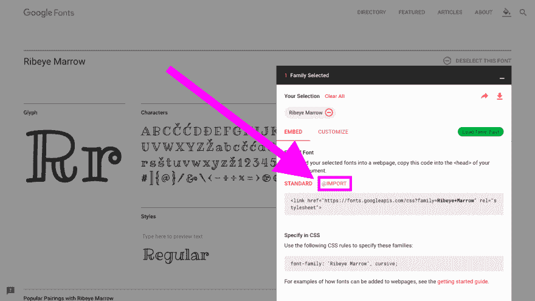T2】](https://res.cloudinary.com/practicaldev/image/fetch/s--T7F6Dk0v--/c_limit%2Cf_auto%2Cfl_progressive%2Cq_auto%2Cw_880/https://codetheweb.blog/assets/img/posts/css-text-properties-and-google-fonts/g-fonts-css-import-button.png)

接下来，复制代码的*中间一行*(里面有`@import`的那一行):
[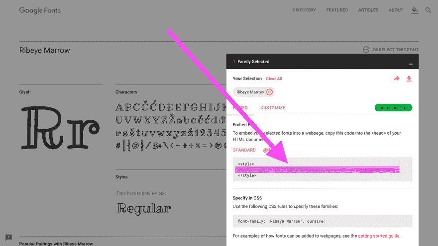](https://res.cloudinary.com/practicaldev/image/fetch/s--ZrKG9NV0--/c_limit%2Cf_auto%2Cfl_progressive%2Cq_auto%2Cw_880/https://codetheweb.blog/assets/img/posts/css-text-properties-and-google-fonts/g-fonts-css-import-copy.png)

现在，我们需要将它粘贴到 CSS 代码中——但是在哪里呢？`@import`语句必须总是在花括号之外，但是在文档中的什么位置- *并不重要，只要它在使用字体的地方*(`font-family`属性)之上。一般来说，我喜欢把谷歌字体导入*放在 CSS 文件的顶部*，这样 CSS 文件的其他部分就可以访问它了。

我将在另一篇文章中解释更多关于 CSS 的内容。

让我们粘贴我们的代码:

```
@import url('https://fonts.googleapis.com/css?family=Ribeye+Marrow'); /* Add this line */

span {
  font-size: 50px;
  font-weight: bold;
  line-height: 200px;
  letter-spacing: 5px;
  font-family: fantasy;
} 
```

Enter fullscreen mode Exit fullscreen mode

重新加载页面-你会看到什么都没有改变！这是因为我们仍然需要使用`font-family`来声明字体。使用`@import`行的原因是，即使用户的计算机上没有安装该字体，它也能工作。

让我们使用我们的字体！我们只需将字体的名称作为一个值赋给`font-family`属性:

```
@import url('https://fonts.googleapis.com/css?family=Ribeye+Marrow');

span {
  font-size: 50px;
  font-weight: bold;
  line-height: 200px;
  letter-spacing: 5px;
  font-family: "Ribeye Marrow"; /* Change this line */
} 
```

Enter fullscreen mode Exit fullscreen mode

如果名称中有空格，请记得加上引号！

下面是结果:
[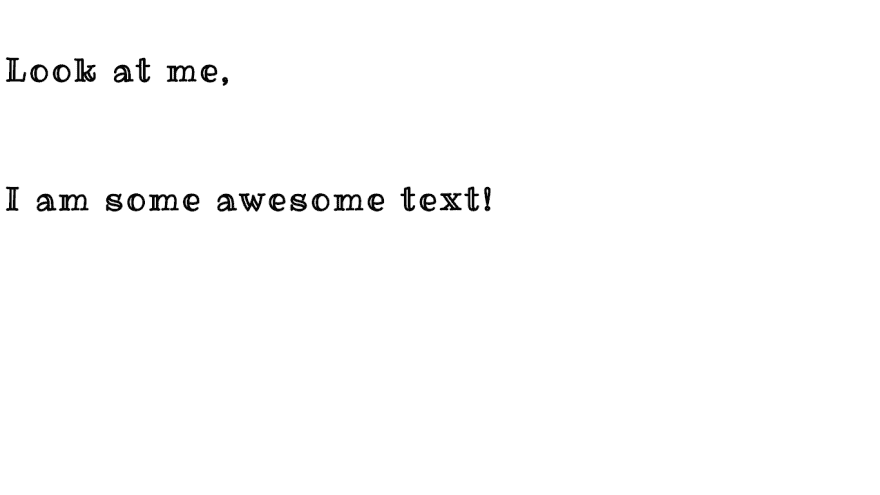](https://res.cloudinary.com/practicaldev/image/fetch/s--e9VJXMco--/c_limit%2Cf_auto%2Cfl_progressive%2Cq_auto%2Cw_880/https://codetheweb.blog/assets/img/posts/css-text-properties-and-google-fonts/font-family-ribeye-marrow.png)

现在我们的文本是 Ribeye 骨髓字体！

## 结论

呜！今天到此为止！希望这篇文章对您的编码之旅有所帮助。一如既往，如果你有任何不明白的地方，或者你有任何反馈，[请在评论中告诉我](https://codetheweb.blog/2018/01/17/css-text-properties-and-google-fonts/#disqus_thread)。

还有，这些文章不是凭空而来的！看着我的 [Pomodoro Timer](https://en.wikipedia.org/wiki/Pomodoro_Technique) ，到目前为止我在这篇文章上花了 3 小时 20 分钟，在这个博客上刚刚过了 4 万字大关！

虽然你的美好评论和知道我正在帮助你们所有人使它变得有价值，但如果你[与你的朋友分享这个](https://codetheweb.blog/2018/01/17/css-text-properties-and-google-fonts/#share)或[这个博客](https://codetheweb.blog/#share)或[注册时事通讯](https://codetheweb.blog/newsletter/)以在你的收件箱中获得最新文章，我将非常感激。

下次见，我会谈到使用自定义字体文件来扩展你的字体选择，而不仅仅是谷歌字体。到时候见！祝您在充满编码乐趣的 2018 年过得愉快而富有成效！䢜 🎆 🚀

> ### 想要更多这样的帖子？[注册我的简讯](https://codetheweb.blog/newsletter/)。
> 
> 我一直在努力学习这些教程，但是到目前为止还没有赚到任何钱，所以如果你注册的话，我会非常感激；)

这篇文章最初发表在 [Code The Web](https://codetheweb.blog) 上，这是一个有趣且易于理解的博客，帮助你学习 Web 开发🚀
学:[HTML](https://codetheweb.blog/learn/html/)|[CSS](https://codetheweb.blog/learn/css/)|[JavaScript](https://codetheweb.blog/learn/javascript/)*