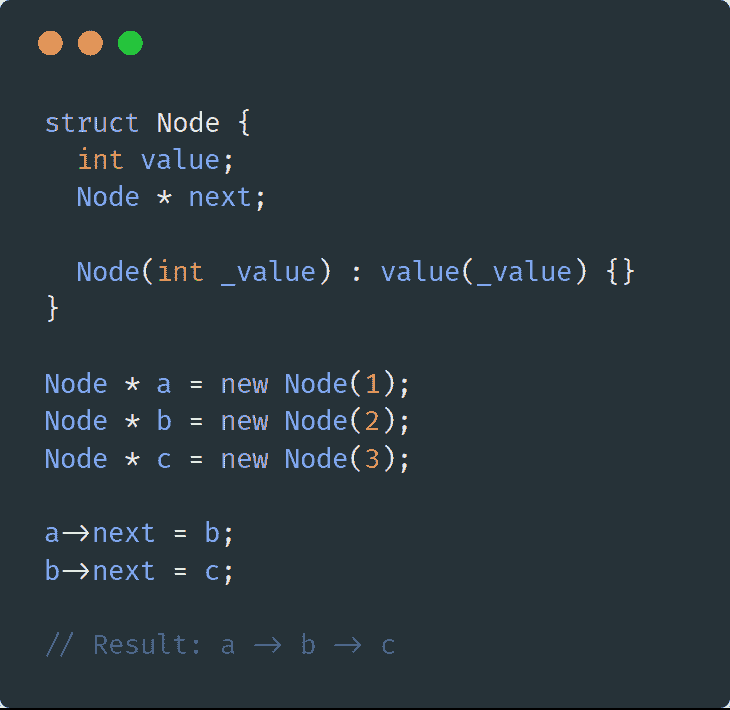
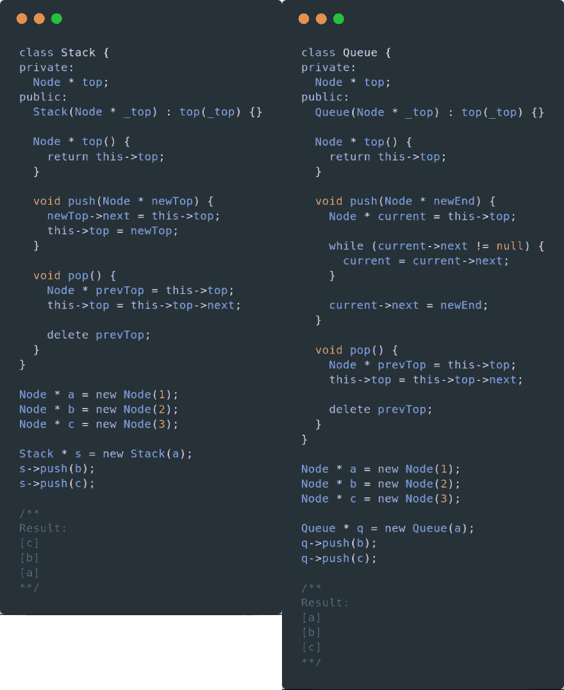
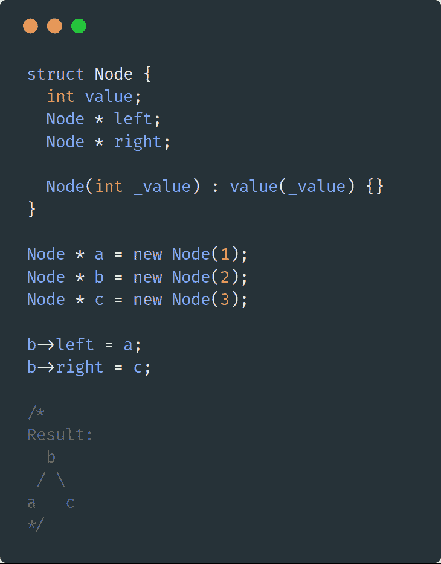
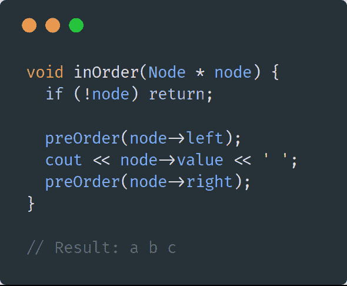
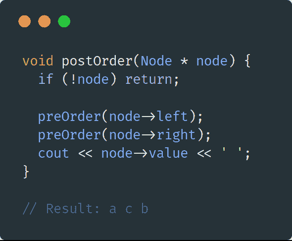
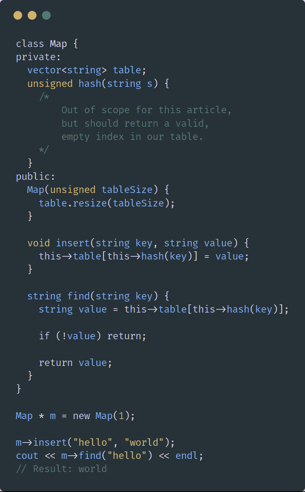
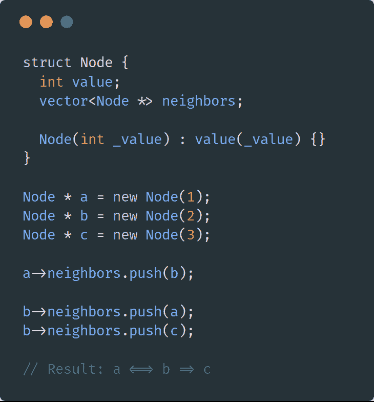

# 数据结构和算法:0 到 60

> 原文:[https://dev . to/aarohmankad/data-structures-and-algorithms-0-to-60-294h](https://dev.to/aarohmankad/data-structures-and-algorithms-0-to-60-294h)

无论是家庭作业还是面试，数据结构和算法都将是你早期职业生涯的基础。这篇文章将帮助你在计算机科学的这个关键领域从一无所知走向实用知识。

### 链表

**链表**顾名思义，就是条目的列表。每一项都指向列表中的下一个节点。把链表想象成一个寻宝游戏。

你从一个线索(列表的头部)开始，每个线索引导你到下一个线索(下一个指针)，直到你到了末尾(列表的尾部)。你能想到一个列表实现吗？

<figure> 

<figcaption>每一个节点都是自己链表的开始！</figcaption>

</figure>

使用链表的一些常见原因包括:

*   **在数据中间插入元素**:只要知道插入索引之前的节点，就可以在列表中的任意位置插入元素。向量中的 O(n)，链表中的 O(1)。
*   **更快地为你的数据扩展空间:**因为链表集中于使用指针的思想，你不必为你的数据分配连续的内存块。与 Vector 的简单实现相比，这节省了 O(n)的时间。

链表的一个主要缺点是不能通过索引随机访问列表中的元素。例如:如果您想检索一个列表中的第 5 个元素，您将不得不遍历列表，直到遇到它。

### 堆栈/队列

堆栈和队列几乎是相同的数据结构，唯一的区别是它们对信息的排序方式。我们可以用前面的节点结构来实现这两者！

**堆栈**操作后进先出(LIFO)。想象一堆自助餐厅的托盘。您放在堆叠上的最后一个托盘将是您从堆叠中拿起的第一个托盘。堆栈公开了三个主要函数:一个用于查看顶部，一个用于推至顶部，一个用于弹出顶部。

一个队列先进先出。想象一下一队人在排队。如果你是第一个排队的，你会先得到帮助。同样，如果你排在最后，你会在最后得到帮助。队列公开与堆栈相同的功能，推送的实现略有不同。(我们想推到队列的*末端*。)

<figure> 

<figcaption>基本堆栈和队列的实现基于我们之前的节点</figcaption>

</figure>

栈和队列对于**根据插入时间保持顺序非常有用:**如果你想跟踪最近的项目，可以使用栈。如果您想跟踪最旧的项目，请使用队列。

如果你关心的不是最近或最早的项目，就不要使用这两个选项。

### 树木

**树**是一种非常适合数据中父子关系的数据结构。它可以通过我们上面定义的简单节点类来实现，除了有多个子指针而不是一个下一个指针。

<figure> 

<figcaption>一棵树的简单实现。注意每个节点是它自己的子树的“开始”!</figcaption>

</figure>

树需要一种不同于向量、链表甚至堆栈/队列的思维方式。他们引入了**遍历树的概念。**因为从父节点到子节点没有固定的方式，所以您可以在三种主要的遍历方法中进行选择:

#### 前序遍历

如果你想在计算子对象之前先计算父对象，那么就使用前序遍历。

给定我们上面的树表示:

[T2】](https://res.cloudinary.com/practicaldev/image/fetch/s--ndmy-hRm--/c_limit%2Cf_auto%2Cfl_progressive%2Cq_auto%2Cw_880/https://cdn-images-1.medium.com/max/590/1%2A682N3EB9dBWURYPvHlegBA.png)

#### 按序遍历

如果你想计算左边的子节点，然后是父节点，最后是右边的子节点，那么使用有序遍历。这通常只用于二叉树，即每个节点最多只有两个子节点的树。

给定我们上面的树表示:

[T2】](https://res.cloudinary.com/practicaldev/image/fetch/s--bd04XvuV--/c_limit%2Cf_auto%2Cfl_progressive%2Cq_auto%2Cw_880/https://cdn-images-1.medium.com/max/590/1%2AjxPrzsO0IpZxRhPB5sf20g.png)

#### 后序遍历

如果您想在对父对象进行同样的操作之前对子对象进行计算，请使用后序遍历。

给定我们上面的树表示:

[T2】](https://res.cloudinary.com/practicaldev/image/fetch/s--8SluuGsE--/c_limit%2Cf_auto%2Cfl_progressive%2Cq_auto%2Cw_880/https://cdn-images-1.medium.com/max/590/1%2AWNe5ibhftL0ltNluyIAaWA.png)

### 地图

**映射**是一种用键和值来表示数据的方式。正确的实现可以提供非常快的插入、查找和删除时间。

一个好的 map 实现的基础是它的散列函数。该散列的目的是:

*   在给定任何有效输入的情况下，提供散列或编码的输出
*   给定相同的输入，总是返回相同的输出
*   当两个输入返回相同的输出时，尽量减少冲突

[T2】](https://res.cloudinary.com/practicaldev/image/fetch/s--bwQ2NdgY--/c_limit%2Cf_auto%2Cfl_progressive%2Cq_auto%2Cw_880/https://cdn-images-1.medium.com/max/856/1%2A4y-A-qQZyD6EzcmIaOrT2Q.png)

地图非常强大，因为你可以很快地操纵它们。(O(1)用于插入、删除和查找！)这种速度非常适合大多数面试问题，以至于让它们变得微不足道。

非常了解地图。

### 图表

**图**是一种灵活的数据结构，可以用来表示节点间关系复杂的数据。它与链表非常相似，但是每个节点可以有 n 个指向其他节点的指针。一个图也不能保证没有圈。(循环是指在遍历图形时，可以在同一个节点开始和结束。)

图形实现实际上非常简单:

<figure> 

<figcaption>注意你如何从 b 到达 a 或 c，但不一定反过来！</figcaption>

</figure>

我们可以用图来模拟很多情况，比如:用户之间的友谊，飞机航线等等。图可以使任何复杂关系的问题变得非常简单，从一个节点到另一个节点就像遍历它的邻居一样简单。(附录中提到了例子:寻路和 Dijkstra 的。)

### 附录

这些是可以在课程和面试问题中找到的一些基本数据结构。如果你想进一步扩大知识面(并且从 60 到 120！)，下面是一些高级的数据结构和算法:

*   [链表中的循环](https://blog.ostermiller.org/find-loop-singly-linked-list)
*   [使用堆栈评估数学表达式](http://faculty.cs.niu.edu/~hutchins/csci241/eval.htm)
*   [尝试:一棵奇特的树，允许高效的路径查找](https://www.topcoder.com/community/data-science/data-science-tutorials/using-tries/)
*   [设置:当你只想记住你是否在](https://en.wikipedia.org/wiki/Set_(abstract_data_type))之前见过一个元素时(地图<【任何东西】、布尔>的绝佳替代)
*   路径查找算法([克鲁斯卡尔的](http://blog.hackerearth.com/kruskal-algorithm-minimum-spanning-tree-example)和[普里姆的](https://www.tutorialspoint.com/data_structures_algorithms/prims_spanning_tree_algorithm.htm))，当你想在图中找到两个节点之间的路径时使用
*   [Dijkstra 算法:寻找两个节点间阻力最小的路径](https://dev.to/vaidehijoshi/finding-the-shortest-path-with-a-little-help-from-dijkstra-cmi)

### 进一步资源

如果比起博客文章，你更喜欢书，我强烈推荐(按照可读性的顺序):

*   《赖以生存的算法:人类决策的计算机科学》:一本关于如何在日常生活中应用算法的好书。不是很学术的读物。
*   《搜索算法》:这是一本不可思议的书，不仅因为它的简单解释和与现实世界例子的关系，还因为它的图片！
*   《算法导论》，第三版:一本很棒的参考书，用于 UCR 的中间数据结构和算法。
*   [《算法》第四版](http://amzn.to/2Ds0NDo):传奇人物罗伯特·塞奇威克写的，信息量超级大。(Sedgewick 从 Fortran 巅峰时期就开始教算法了！)

* * *