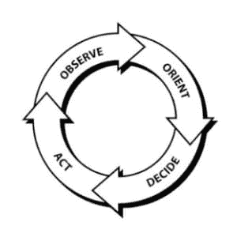

# 如何解决战术障碍，实现战略开发转型

> 原文:[https://dev . to/iedaddy/how-to-address-tactical-blocker-to-strategic-devo PS-transformation-37 H4](https://dev.to/iedaddy/how-to-address-tactical-blockers-to-strategic-devops-transformation-37h4)

关于采用 [DevOps 原则](http://iedaddy.com/2016/10/implementing-devops-principles/)的公司，已经有了很多讨论和衡量标准。总的来说，采用这些原则的公司通常比不采用这些原则的公司利润更高，恢复更快，[，部署频率是不采用这些原则的公司的 200 倍，交付周期比不采用这些原则的公司快 2，555 倍](https://www.theregister.co.uk/2017/06/06/state_of_devops_low_performers_are_fast_but_ignore_quality/)。

在大多数管理圈子里，采用 DevOps 似乎是一个伟大的战略决策。然而，我们一次又一次地看到企业为采用 DevOps 而苦苦挣扎。这是相当普遍的，因为大多数人似乎不明白实现 DevOps 不是你可以出去“购买”甚至完全计划好的事情。计划采用是很重要的，因为我们希望在正确的地方有正确的资源。[工具是有用的](https://dev.to/iedaddy/focus-on-devops-core-tool-categories-14lj-temp-slug-5838912)，因为它们有助于实现流程，但是[不要把你的工具与你的流程或你的人混淆](http://iedaddy.com/2017/03/devops-job-title-tools-or-process/)。仅仅因为你已经计划了一个采用 DevOps 的策略或者[买了一个自动化或协作工具](https://dev.to/iedaddy/focus-on-devops-core-tool-categories-14lj-temp-slug-5838912)，这并不意味着你正在做 DevOps，这仅仅意味着你在为自己的成功做准备。

> 计划是无用的，但是计划是必要的
> 
> –[德怀特·艾森豪威尔](https://en.wikipedia.org/wiki/Dwight_D._Eisenhower)

我们在战略层面上被告知，我们希望迁移到 DevOps，管理层已经制定了一个很好的推广计划，也许他们甚至已经在企业中实施了一些“DevOps”工具。但是，我们如何确保我们能够从战术和操作层面执行该计划，以使其取得成功？

[T2】](http://iedaddy.com/wp-content/uploads/2018/01/OODA-loop.png)

这就是 OODA 循环(观察、定向、决定、行动)概念的由来。OODA 概念是由美国空军上校约翰·伯伊德开发的，应用于作战过程。令人惊讶的是，它非常适合我们“身处战壕”，试图成为我们组织内的[变革代理人的其他情况。如果你不认为成为一名变革推动者和发起一场战争有很多共同之处，那你就没有注意。](http://searchcio.techtarget.com/definition/change-agent)

## 观察

> “如果我们不与外部世界交流以获得知识和理解的信息，我们就会消亡，成为那个世界中无辨识力和无趣的一部分。”
> 
> –[约翰·伯伊德](https://en.wikipedia.org/wiki/John_Boyd_(military_strategist))

第一步总是观察情况。通过观察和考虑新信息，我们创建了一个开放的系统，并获得了对创建心智模型很重要的信息。这并不是说我们的观察永远是完美的，甚至是正确的。在整个观察过程中，我们需要注意一些陷阱:

*   我们经常看不到完整的信息，或者信息在某些方面是不完善的。
*   我们接收如此多的信息，以至于从数据中分离信息变得很困难。
*   我们自己的经历和观点会影响我们对信息的感知

当希望成为 DevOps 转型的变革推动者时，首先要找到自己所处的位置，收集可以作为基准的指标，以便我们在开始 DevOps 之旅时知道前进的方向。并不是每种技术都会在每家公司奏效，所以我们需要一种方法来找出如何快速失败，同时推广正在奏效的东西。我们都有一个事物“应该”如何的心理模型，但这很少是对现实的准确描述。决定和收集指标将帮助您更好地了解您的运营情况。

但是不要以为有了数据就足够了。更重要的是，你如何解读这些数据，以挖掘出真正有价值的信息。即使你有完美的数据，如果没有对数据的判断和理解，那也是没有意义的。有效观察的挑战之一是知道要监控哪些信息，并对这些数据应用正确的过滤器。

## 方位

这是我们建立心智模型并将收集到的数据综合成知识的地方。随着我们接收到更多的信息，我们不断地打破旧的范式，重建我们的心理模型，在一个连续的过程中从碎片中创建新的模型。博伊德称之为“破坏性演绎”和“创造性归纳”，使用旧的片段形成新的心理模型，更紧密地与我们周围真正发生的事情保持一致。

大多数人并不是糟糕的决策者，他们只是没有将手头的信息放在适当的环境中。正是我们综合的信息的背景将它转化为知识，从而做出好的决策。

良好的定向能力是指在面对不确定性和不可预测的变化时，能够不断地建立新的思维模式。这也是一个持续的过程，一旦你创造了一个新的模式，随着你周围环境的改变，它很快就会过时。因此，你必须练习，并拥有一个强大的心智模型工具箱，你可以培养和成长，以便快速将信息吸收为可操作的知识。

一个很好的轶事可以证明这是一句老话，“当你只有一把锤子时，一切都是钉子。”百视达和网飞之间的范式转换很好地说明了这一点。百视达的商业模式侧重于硬拷贝电影租赁和他们的实体店作为他们的主要业务。当网飞第一次出现时，他们把通过邮件租赁 DVD 作为他们的商业计划。网飞很快看到了消费者希望通过互联网流媒体的转变，并改变了他们的商业模式。另一方面，百视达却迟迟没有摆脱他们屡试不爽的商业模式。最终百视达试图改变他们的商业模式，然而那时已经太晚了。根据你周围的环境和现有的数据，定位和改变你的思维模式是一个不断破坏和构建的过程。

你还需要有多个心智模型，因为如果你只有一个或两个，根据人类心理学的本质，你会扭曲你的现实，这样你就认为你观察到的数据和信息会符合你的模型，所有的东西都会再次成为你的锤子的钉子。

这并不容易，作为人类，我们往往是习惯性的动物。但是摧毁和创造心智模型是伴随着实践和经验而来的。它确实变得更容易，并最终成为不需要深思熟虑的事情，只是你做的事情。

永远保持方向(ABO)应该成为你每日口头禅的一部分。设定一个目标，每天你都把它添加到你的心智模型工具箱中，检查你现有的模型，问问你自己它们是否仍然适用于你现在拥有的信息。

另外，并不是所有的模式都是平等的，有的行得通，有的行不通。在一种特定情况下有效的方法在另一种情况下并不总是有效。DevOps 转换尤其如此，因为我们在等式中有许多不确定的变量，尤其是涉及到人的时候。

你可以出去[阅读案例研究](https://dzone.com/articles/devops-use-cases),看看在互联网上其他公司自己的 DevOps 之旅中哪些成功了(哪些失败了)。这些都是添加到你的工具箱的好方法，这样你就有了额外的模型、概念和策略，可以在类似的情况下立即实施。当然，由于每种情况都是不同的，如果这些都不起作用，你就需要继续这个过程，直到你创造出一个更适合你的特殊情况的模型。

这就是为什么你总是需要定位，定位将信息转化为知识，而知识才是做出好决策的真正预测因素。

## 决定

当我们做出决定时，我们会选择我们认为最符合当前情况信息的模型。这是我们在选择行动方案时的最佳猜测，也是为什么在定向阶段有许多不同的模型可供选择如此重要的原因。我们拥有的越多，我们就越有可能得到一个与我们手头的观测数据非常相似的模型。

如果你有正确的心智模型，做决定就很容易，因为你能够预测未来会发生什么。预测未来结果的能力可能是成功与失败的区别。

比你的对手做出更好、更快的选择会给你带来更大的成功机会，并在影响这些结果方面获得决定性的优势。你越能理解你的数据，并将其转化为有助于你预测未来结果的知识，你就能做出更好的决策。

随着你获得经验，最终你会观察到与某些已证实的心智模型相匹配的情况，没有必要创建和破坏一系列心智模型并决定哪一个是最合适的，你已经知道了。博伊德称这种快速定向和行动的能力为“隐性结果和控制”。这能让你加快 OODA 循环，做出快速而成功的决定。

## 行动

除非你通过实际执行决策和行动来完成闭环，否则什么都得不到。一旦观察到行动的结果，您就可以再次开始循环。

在与他人竞争时，你越快、越好地循环，你就越有优势。

## 万物相连

虽然传统上被描述为一个循环或环，因为每个决策都不是在真空中发生的，但每个循环实际上是一组相互作用的循环，它们不断相互关联，相互作用，相互环绕。一些循环将是小的、快速发生的迭代，每小时或每天发生多次，而其他循环具有更大的轨道，移动速度慢得多，有时需要几周或几个月才能看到可测量的结果。

即便如此，就像在涉及天体的轨道中一样，轨道本身也会对附近的其他环产生作用，就像行星或卫星的重力会影响其重力范围内的其他实体一样。再说一次，真空中不会发生任何事情，就像行星轨道一样，一颗流氓小行星或其他灾难性事件可能会进入并扰乱你的整个系统。

定位涉及到方方面面，因为它是我们基于文化、经验、新信息、分析、综合甚至遗产来解释情况的方式。这是在决策系统中包含多样性的主要支持者之一，它为您可以做出的决策添加了更多的模型和选项，当您根据这些决策采取行动时，会为整体成功创造更好的机会。

## 总结

这就是高层次的 OODA 循环(或轨道)，它只是一个系统/框架，可以用来帮助我们采取战术(和战略)行动，以实现预期的结果(在这种情况下，在我们公司内部实施 DevOps 文化)。显然，它可以应用于生活中的其他事情，因为该模型特别适用于战斗情况的决策框架，但正如这里所见，也可以适用于其他决策过程。

关于这个系统的工作原理，有几点确实需要强调:

*   制定正确的指标，以便收集有意义的数据，并将其转化为信息。
*   拥有多样化的思维模式，让我们能够选择最适合你收集的数据，将这些信息转化为知识。
*   你必须不断适应不断变化的环境。

DevOps 是一个涉及人员、过程和工具的过程。因为我们在这个系统中固有一定的不确定性，平衡等式将是一个杂耍行为，需要我们不断地审查系统，并随着我们获得更多的知识和看到我们行动的结果而做出调整。

我们可以在一开始就计划我们的旅程，并为成功做好准备。但我们也不能害怕随着情况的变化和适应新的数据而放弃那个计划。

> “每个人都有一个计划，直到他们被打了一拳”
> 
> –[迈克·泰森](https://en.wikipedia.org/wiki/Mike_Tyson)

决定你的是你对逆境的反应，而不是逆境本身。

帖子[如何解决战术阻碍战略发展转型](http://iedaddy.com/2018/01/address-tactical-blockers-strategic-devops-transformation/)最早出现在一个内陆帝国爸爸的[经历上。](http://iedaddy.com)