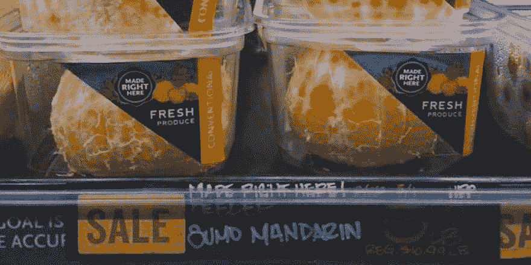

# 客座博文:UX·布斯

> 原文：<https://dev.to/wiredferret/guest-post-ux-booth-17fj>

我在 UX 展台写了一篇 [2018 用户体验预测。Amy Grace Wells 问我，我认为明年 UX 的主导主题是什么，我说，“更好的无障碍环境”。我认为这既是一个严肃的预测，也是一个希望，因为可及性永远不够，但我也认为我们正在变得更好。](http://www.uxbooth.com/articles/ux-in-2018-design-development-and-accessibility/)

很多东西都是为可访问性而设计的，但当它们发生时，我们并不总是以这种方式理解它们，我们经常嘲笑它们懒惰或奢侈。汽车上的备用摄像头看起来很傻——为什么不掉头呢？直到你身体上无法转身，然后你意识到他们有多重要。预切蔬菜、电动开罐器和 velcro 鞋看起来很可笑——除非你曾经不能同时用双手拿着一样东西。同样，如果我们的手指灵活或声音清晰，构建 web 和移动应用程序来响应各种命令风格可能不会发生在我们身上，但对于不属于这一类别的人来说，这将非常重要。

自从我受雇于 LaunchDarkly 之前，我就对功能标志提供给设计师定制用户体验的能力着迷。据我所知，我们还没有一个好的测试案例，但它会到来，我很期待。

[T2】](https://res.cloudinary.com/practicaldev/image/fetch/s--m_buAu1P--/c_limit%2Cf_auto%2Cfl_progressive%2Cq_auto%2Cw_880/http://static4.businessinsider.com/image/56d9b345dd0895fc5a8b4670-1190-625/whole-foods-is-being-criticized-for-selling-pre-peeled-oranges-in-plastic-containers.jpg)

预先去皮的橙子，方便食用