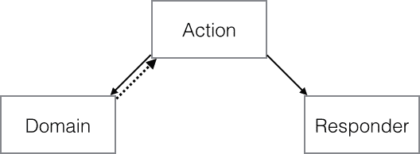

# 不再有 MVC

> 原文:[https://dev.to/mustardsauce/no-more-mvc-4l97](https://dev.to/mustardsauce/no-more-mvc-4l97)

# MVC 怎么了？

模型-视图-控制器或 MVC 是一种软件架构模式，最初是在 20 世纪 70 年代为桌面用户界面开发的。多年来，这种架构在 web 开发中变得非常流行，甚至在 50 年后的今天，MVC 仍然是许多不同语言的流行框架的发展方向。

**那么模型-视图-控制器有什么问题呢？**

MVC 最初是桌面图形用户界面的设计模式。它有许多不同的解释(尝试[谷歌定义](https://www.google.cz/search?client=safari&rls=en&dcr=0&biw=1440&bih=839&tbm=isch&sa=1&ei=p5FbWoa0Kou00gXgga-YDg&q=mvc+diagram&oq=mvc+diagram&gs_l=psy-ab.3..0j0i30k1l3j0i5i30k1l5j0i8i30k1.457354.459660.0.459819.15.14.0.0.0.0.149.1488.8j6.14.0....0...1c.1.64.psy-ab..5.10.1005...0i19k1j0i30i19k1j0i8i30i19k1.0.6XAv3kLRibU))，许多相似/不同的继任者，如 [MVP](https://en.wikipedia.org/wiki/Model%E2%80%93view%E2%80%93presenter) 或 [MVVM](https://en.wikipedia.org/wiki/Model%E2%80%93view%E2%80%93viewmodel) 。然而它并没有很好地描述(**服务器端！** ) web-app 架构的样子。这就是为什么 [pmjones](https://github.com/pmjones) 为了 web 目的，对术语 MVC 进行了改进。

# 动作-域-响应者

[T2】](https://res.cloudinary.com/practicaldev/image/fetch/s--Gz7nJDrc--/c_limit%2Cf_auto%2Cfl_progressive%2Cq_auto%2Cw_880/http://pmjones.io/adr/adr.png)

Action-Domain-Responder 或 [ADR](http://pmjones.io/adr/) 是术语 MVC 的一种改进，而不是一种全新的架构模式。但是这个新术语更好地描述了我们如何构建 web 应用程序。

**动作**(控制器)

处理传入的请求，与域交互，并最终将数据(域输出)传递给响应者。

在传统的 MVC 中，控制器通常包含多个动作，但是传入的请求被分派给这些动作方法，而不是控制器本身。这就是为什么在 ADR 中，每个动作都由单独的类或闭包来表示。

与模板系统没有交互。

**域**(型号)

业务/领域逻辑、数据操作等。MVC 和 ADR 在这个层面没有太大区别。响应方可能仅出于演示目的使用域对象，即不进行修改。

**应答者**(查看)

从操作中收集域数据。构建完整的 HTTP 响应。与模板系统交互，设置标题和 cookie 数据，状态代码等。

对于每个单独的 Action 类/闭包，都有一个 Responder 类/闭包。

* * *

再说一次，ADR 并不是什么全新的东西，而是为了现代服务器端 web 开发的目的而对 MVC 定义的细化。它更好地描述了这类系统中的交互，并且可能比原始的 MVC 更好地分离关注点。

# 进一步阅读

*   [ADR 描述](https://github.com/pmjones/adr)作者 [pmjones](https://github.com/pmjones)
*   [谈话(视频)](https://vimeo.com/106771285)作者 [pmjones](https://github.com/pmjones)