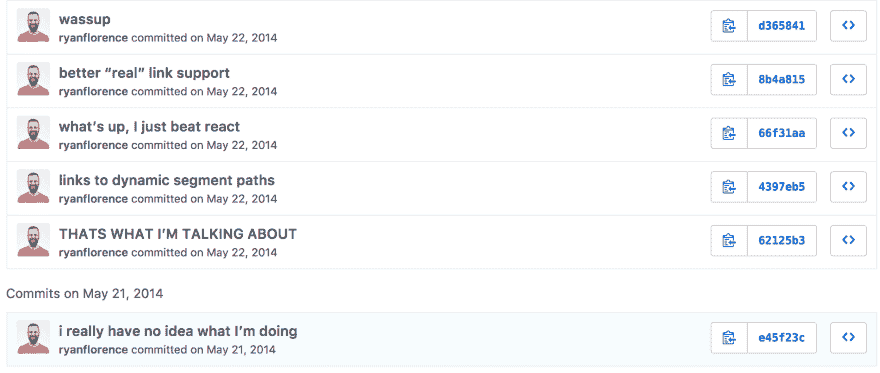

# React 路由器 v4:原理和简介

> 原文：<https://dev.to/tylermcginnis/react-router-v4-philosophy-and-introduction-4ial>

React 路由器 v4 引入了一种新的基于组件的动态路由方法。在本帖中，我们将讨论 React 路由器背后的理念，并通过分解 React 路由器文档中的“基本”示例来介绍语法。

### 视频

[https://www.youtube.com/embed/3B588JwyT18](https://www.youtube.com/embed/3B588JwyT18)

### 岗位

如果您在过去几年中一直在 React 领域工作，您会知道 React 路由器已经经历了几次不同的迭代。随便你怎么说，但很明显，我们今天的 React 路由器(v4)是对以前版本的巨大改进。这些变化原因是非常标准的——与 React Router 最初构建时相比，现在的作者是更有经验的 React 开发人员。你看，回到 2014 年，*每个人*都是新反应。React 本身还不到一年，没有人真正知道整个组件会发展到什么程度。考虑到这一点，React Router 的第一次提交看起来像这样是很自然的

[T2】](https://res.cloudinary.com/practicaldev/image/fetch/s--2gGFYnAc--/c_limit%2Cf_auto%2Cfl_progressive%2Cq_auto%2Cw_880/https://tylermcginnis.com/static/febc9b6d8bfdeeb1276fd7db6c2bf271-605ac.png)

当时，迈克尔和瑞安(React 路由器的创造者)都来自余烬背景。所以很自然，React 路由器的第一个版本在本质上与 Ember 的路由器相似。也就是说，对于这两个路由器，你可以静态地建立路由，作为应用程序初始化过程的一部分。事实上，几乎所有你可能熟悉的路由器都是这样使用的——Express，Angular，Ember。甚至 React 路由器第 4 版之前也使用静态路由。下面是 React 路由器 4 版之前的一些代码。通常你会有一个`routes.js`文件，在那里你会建立你的静态路线。

```
// routes.js

const routes = (
  <Router>
    <Route path='/' component={Main}>
      <IndexRoute component={Home} />
      <Route path='playerOne' component={Prompt} />
      <Route path='playerTwo/:playerOne' component={Prompt} />
      <Route path='battle' component={ConfirmBattle} />
      <Route path='results' component={Results} />
      <Route onEnter={checkAuth} path='dashboard' component={Dashboard} />
    </Route>
  </Router> )

export default routes 
```

然后，当您初始化应用程序时，您将导入您的路线并渲染它们。

```
// index.js

import React from 'react'
import ReactDOM from 'react-dom'
import routes from './config/routes'

ReactDOM.render(routes, document.getElementById('app')) 
```

这就带来了一个问题，“静态路由不好吗？”。答案显然是否定的。没有人会说这不是真正的“反应方式”。自从 React 路由器创建以来，它的创建者不仅在构建路由器的复杂性方面变得更有经验，而且他们自然也获得了更多关于 React 本身的经验，以至于他们的全职工作就是教授它。他们在研讨会期间发现，他们教授的关于 React 的原则，如组件组合，并不符合 React 路由器的实际 API。不仅如此，在某些地方，他们实际上是在与 React API 竞争。回头看前面的例子，我们将一个`onEnter`道具传递给`<Route>`组件。

```
<Route onEnter={checkAuth} path='dashboard' component={Dashboard} /> 
```

这里的想法是，在用户看到`Dashboard`组件之前，`checkAuth`函数验证用户已经过身份验证。嗯，这听起来不像是在`Dashboard`的`componentDidMount`生命周期钩子中应该发生的事情吗？确实是。

对于以前版本的 React 路由器，它更像是 React 的路由器，而不是实际的 React 路由器。React 路由器 v4 是为了修复这些不一致而构建的，并与 React 一起工作，而不是与之对抗。如果你已经熟悉 React 的好处和组件组合的好处，React 路由器 v4 会让你有宾至如归的感觉——你只需要忘记你所知道的关于传统静态路由器的一切。

现在的问题是，为什么 React 路由器 v4 与 React 配合得很好，而以前的版本却与之对抗？答案是因为它抛弃了静态路由而支持动态路由，并且整个 API 只是组件。这意味着您可以像声明其他组件一样，将路线声明为应用程序的一部分。

让我们来看看一些代码。

这里的目标是从一些非常基本的代码开始，然后慢慢地添加路由功能。这是我们的起始代码。

```
import React, { Component } from 'react'

class App extends Component {
  render() {
    return (
      <div>
        React Router Course
      </div>
    )
  }
}

export default App 
```

正如我前面提到的，React 路由器 v4“只是组件”。所以我们需要做的第一件事就是导入我们需要的。

```
import {
  BrowserRouter as Router,
  Route,
  Link,
} from 'react-router-dom' 
```

这里需要注意一些事情。首先，我们导入`BrowserRouter`并将其重命名为`Router`。没必要，但这很常见。`BrowserRouter`所做的是允许 React Router 将应用程序的路由信息传递给它需要的任何子组件(通过上下文)。因此，要让 React 路由器工作，您需要在应用程序的根目录下呈现`BrowserRouter`。

```
import React, { Component } from 'react'
import {
  BrowserRouter as Router,
  Route,
  Link,
} from 'react-router-dom'

class App extends Component {
  render() {
    return (
      <Router>
        <div>
          React Router Course
        </div>
      </Router>
    )
  }
}

export default App 
```

接下来我们有`Route`。`Route`既是骨干，也是 React 路由器 v4 背后的天才。当 app 的位置与某个路径匹配时，`Route`会渲染指定的组件，不匹配时，会渲染为 null。比方说，当我们的应用程序位于索引路径`/`时，我们想要呈现一个`Home`组件。我们的代码看起来会像这样

```
import React, { Component } from 'react'
import {
  BrowserRouter as Router,
  Route,
  Link,
} from 'react-router-dom'

const Home = () => (
  <h2>Home</h2> )

class App extends Component {
  render() {
    return (
      <Router>
        <div>
          <Route path='/' component={Home} />
        </div>
      </Router>
    )
  }
}

export default App 
```

使用上面的代码，如果我们在索引页(/)，我们会看到`Home`组件。如果不是，我们将什么也看不到(因为`Route`将呈现 null)。

现在再增加几条路线吧。

```
import React, { Component } from 'react'
import {
  BrowserRouter as Router,
  Route,
  Link,
} from 'react-router-dom'

const Home = () => (
  <div>
    <h2>Home</h2>
  </div> )

const About = () => (
  <div>
    <h2>About</h2>
  </div> )

const Topics = () => (
  <div>
    <h2>Topics</h2>
  </div> )

class App extends Component {
  render() {
    return (
      <Router>
        <div>
          <Route path='/' component={Home} />
          <Route path='/about' component={About} />
          <Route path='/topics' component={Topics} />
        </div>
      </Router>
    )
  }
}

export default App 
```

注意，如果我们想在应用程序中添加更多的路线，我们只需渲染更多的`Route`组件。同样，如果你来自基于静态的路由器，你的大脑可能会觉得有点奇怪，因为我们实际上是在渲染我们的路线。帮助我的一件事是记住`Route`只是一个带有渲染方法的普通 React 组件。该呈现方法要么呈现组件，要么呈现 null，这取决于路径是否匹配。所以当我们像上面一样渲染多个`Route`组件时，这些组件要么渲染组件，要么只渲染 null。

到目前为止，一切顺利。有一点你可能在上面的代码中没有注意到，现在如果你运行应用程序，并前往`/about`路径，你会注意到`About`组件和`Home`组件都被渲染了。这是因为即使`/`与位置不完全匹配，它仍然被认为是部分匹配，所以`Home`组件被渲染。要解决这个问题，您只需在`/`路线上添加一个`exact`道具，指定您只希望它在位置完全匹配时匹配。

```
<Route exact path='/' component={Home} /> 
```

既然我们已经基于应用程序的位置动态呈现了用户界面，接下来我们需要做的就是让用户改变应用程序的位置。这就是`Link`组件发挥作用的地方。这是一个简单的组件，允许用户以声明方式在应用程序中导航。现在，使用`Link`，让我们给我们的应用程序添加一个简单的导航条。

```
render() {
  return (
    <Router>
      <div>
        <ul>
          <li><Link to='/'>Home</Link></li>
          <li><Link to='/about'>About</Link></li>
          <li><Link to='/topics'>Topics</Link></li>
        </ul> 
        <Route path='/' component={Home} />
        <Route path='/about' component={About} />
        <Route path='/topics' component={Topics} />
      </div>
    </Router>
  )
} 
```

至此，我们已经了解了 React 路由器 v4 的绝对基础知识。我们通过渲染几个不同的`Route`组件来动态地改变基于位置的 UI，并且我们能够通过渲染几个不同的`Link`组件来改变我们应用的位置。让我们再深入一点，谈谈嵌套路由。嵌套路由是 React 路由器早期版本的一个基本方面，并且一直延续到今天。与以前版本的 React Router 相比，最大的不同是现在创建嵌套路由的方式。在以前的静态版本中，您只需在路由配置中嵌套路由。因为 React 路由器 v4 完全是关于动态路由的，所以你不能这样做。然而，在我看来，React Router v4 的嵌套路由比以前的版本更直观。同样，关键是忘记你以前知道的。

回头看看我们的例子，如果我们想让`Topics`组件呈现一个嵌套的导航条和一些嵌套的路线会怎么样？这个问题的答案并不复杂。就像嵌套 div 一样，您也可以嵌套`Route` s。

```
const Topic = () => {
  <div>
    <h3>TOPIC</h3>
  </div> }

const Topics = () => (
  <div>
    <h2>Topics</h2>
    <ul>
      <li>
        <Link to={`/topics/rendering`}>
          Rendering with React
        </Link>
      </li>
      <li>
        <Link to={`/topics/components`}>
          Components
        </Link>
      </li>
      <li>
        <Link to={`/topics/props-v-state`}>
          Props v. State
        </Link>
      </li>
    </ul> 
    <Route path={`/topics/rendering`} component={Topic} />
    <Route path={`/topics/components`} component={Topic} />
    <Route path={`/topics/props-v-state`} component={Topic} />
  </div> ) 
```

现在，当用户导航到`/topics`时，他们会看到一个嵌套的导航条，UI 会根据位置动态变化——就像以前一样。唯一的区别是现在我们在另一个组件中渲染 navbar 和`Route` s，这也是由 React Router 渲染的。

您可能已经注意到，我们对 URL 进行了硬编码，而不是基于我们当前所在的嵌套位置来动态创建它们。当 React Router 呈现一个组件时，它向该组件传递三样东西:`match`、`location`和`history`。在这个例子中，我们想要的是`match.url`，它将给出 URL 的当前匹配部分(在我们的例子中是`/topics`)。所以任何我们硬编码的地方`/topic`我们都可以用`match.url`代替。

```
const Topic = () => {
  <div>
    <h3>TOPIC</h3>
  </div> }

const Topics = ({ match }) => (
  <div>
    <h2>Topics</h2>
    <ul>
      <li>
        <Link to={`${match.url}/rendering`}>
          Rendering with React
        </Link>
      </li>
      <li>
        <Link to={`${match.url}/components`}>
          Components
        </Link>
      </li>
      <li>
        <Link to={`${match.url}/props-v-state`}>
          Props v. State
        </Link>
      </li>
    </ul> 
    <Route path={`${match.url}/rendering`} component={Topic} />
    <Route path={`${match.url}/components`} component={Topic} />
    <Route path={`${match.url}/props-v-state`} component={Topic} />
  </div> ) 
```

你可能已经注意到的另一件事是，我们正在呈现三个不同的`Route`,尽管每个都呈现相同的组件，唯一的区别是嵌套的 URL。这是使用 URL 参数的完美用例。

```
const Topics = ({ match }) => (
  <div>
    ...

    <Route path={`${match.url}/:topicId`} component={Topic} />
  </div> ) 
```

现在，当 React Router 渲染`Topic`组件时，因为我们已经通过了之前讨论过的`match`属性，所以我们也通过了`match.params`下的`topicId`。

```
const Topic = ({ match }) => (
  <div>
    <h3>{match.params.topicId}</h3>
  </div> ) 
```

现在，最后，当我们在`/topics`路线时，如果一个主题还没有被选择，我们想呈现一些文本说“请选择一个主题”。我们可以制作一个组件来呈现文本，或者我们可以像这样使用`Route`的`render`道具

```
<Route exact path={match.url} render={() => (
  <h3>Please select a topic.</h3> )}/> 
```

就是这样！我们最终的代码看起来像这样，

```
import React, { Component } from 'react'
import {
  BrowserRouter as Router,
  Route,
  Link
} from 'react-router-dom'

const Home = () => (
  <div>
    <h2>Home</h2>
  </div> )

const About = () => (
  <div>
    <h2>About</h2>
  </div> )

const Topic = ({ match }) => (
  <div>
    <h3>{match.params.topicId}</h3>
  </div> )

const Topics = ({ match }) => (
  <div>
    <h2>Topics</h2>
    <ul>
      <li>
        <Link to={`${match.url}/rendering`}>
          Rendering with React
        </Link>
      </li>
      <li>
        <Link to={`${match.url}/components`}>
          Components
        </Link>
      </li>
      <li>
        <Link to={`${match.url}/props-v-state`}>
          Props v. State
        </Link>
      </li>
    </ul> 
    <Route path={`${match.url}/:topicId`} component={Topic}/>
    <Route exact path={match.url} render={() => (
      <h3>Please select a topic.</h3>
    )}/>
  </div> )

class App extends Component {
  render() {
    return (
      <Router>
        <div>
          <ul>
            <li><Link to="/">Home</Link></li>
            <li><Link to="/about">About</Link></li>
            <li><Link to="/topics">Topics</Link></li>
          </ul> 
          <hr/>

          <Route exact path="/" component={Home}/>
          <Route path="/about" component={About}/>
          <Route path="/topics" component={Topics}/>
        </div>
      </Router>
    )
  }
}

export default App 
```

通过利用基于组件的 API，React 路由器 v4 真正是一个 React 路由器。我相信 React 会让你成为更好的 JavaScript 开发者，React 路由器 v4 会让你成为更好的 React 开发者。

* * *

这篇文章最初发表在 TylerMcGinnis.com 大学，是他们 T2 反应路由器课程的一部分。