# 如何轻松创建漂亮的 SVG 动画

> 原文:[https://dev . to/lewismenelaws/how-to-create-beautiful-SVG-animations-easy-ame](https://dev.to/lewismenelaws/how-to-create-beautiful-svg-animations-easily-ame)

[T2】](https://res.cloudinary.com/practicaldev/image/fetch/s--KE0x9aPG--/c_limit%2Cf_auto%2Cfl_progressive%2Cq_66%2Cw_880/https://cdn-images-1.medium.com/max/800/1%2A2xJ-TxeRusymnG9D_gY9pw.gif)

我们将创造的最终版本！

在网络上制作动画从未如此简单。SVG(可缩放矢量图形)使用 XML 标记来帮助将内容渲染到浏览器中。这里有一个例子。如果你要下载一个`png`或者一个`jpeg`，你会得到一个图像，然后你必须使用一个``标签将这个图像呈现给浏览器。这没什么不好，但是如果我想让它变得有生气，我是非常有限的。SVG 如何改变这种情况？

```
<svg width=”100" height=”100">
 <circle cx=”50" cy=”50" r=”40" stroke=”green” stroke-width=”4" fill=”yellow” />
</svg> 
```

<svg width="20px" height="20px" viewBox="0 0 24 24" class="highlight-action crayons-icon highlight-action--fullscreen-on"><title>Enter fullscreen mode</title></svg> <svg width="20px" height="20px" viewBox="0 0 24 24" class="highlight-action crayons-icon highlight-action--fullscreen-off"><title>Exit fullscreen mode</title></svg>

下面是一个 SVG 示例。它使用与 HTML 非常相似的 XML。对于动画来说，这让事情变得非常简单。

为了制作动画，我们首先需要来自 GSAP 的两个库，`TweenMax`和`TimelineMax`。[这里有更多信息](https://greensock.com/gsap)，以防你没听说过它们。对于懒人，[这里是 CDN](https://cdnjs.com/libraries/gsap) 。

出于教程的目的，我们不打算创建我们自己的 SVG。我们就从网上抓一个。我最喜欢的图标和美丽图片网站之一是 [Flaticon](http://flaticon.com/) 。他们有很多不同的选择，但因为我们是程序员，我选择了显示器。真正的原创，我知道。

[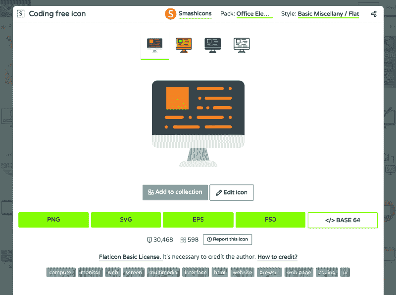](https://res.cloudinary.com/practicaldev/image/fetch/s--xVJWfKAs--/c_limit%2Cf_auto%2Cfl_progressive%2Cq_auto%2Cw_880/https://cdn-images-1.medium.com/max/800/1%2AaUjkhBWiDBSOg-b3MHW0tA.png) 
Flaticon 用一个 SVG 把我们联系起来，因为他们知道我们想要动画🙏

一旦你下载了文件，打开它，把代码复制到一个网站，比如 [CodePen](http://codepen.io/) 或者 [JSfiddle](https://jsfiddle.net/) …或者如果你不信任这些努力工作的网站，那么你可以使用你自己的代码编辑器。我们走吧！！

### 化一点妆

这一步是可选的，但我个人讨厌(抱歉，措辞激烈)SVG 不居中。背景颜色也不是很好。让我们改变它。将`body`更改为您喜欢的任何颜色，然后将这些 CSS 属性添加到 SVG 元素的 ID 中(在我的例子中，它被称为“Layer_1”)。要居中，只需添加`display: block;`和`margin: 0 auto;`。

[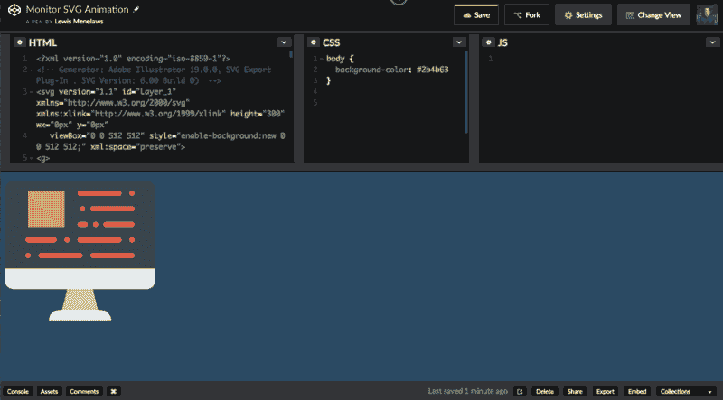](https://res.cloudinary.com/practicaldev/image/fetch/s--v37ErPMe--/c_limit%2Cf_auto%2Cfl_progressive%2Cq_66%2Cw_880/https://cdn-images-1.medium.com/max/800/1%2AY4E19AHPNmTPxIl_3hxOOQ.gif) 
等一下，这个看起来很熟悉…

### 分析我们的 SVG

在上一节中，您可能已经注意到我们使用 CSS 来使我们的 SVG 居中。让我们快速看一下我们的 SVG 文件…

```
<svg version="1.1" id="Layer_1" xmlns="
" xmlns:xlink="
" height="300" wx="0px" y="0px"
  viewBox="0 0 512 512" style="enable-background:new 0 0 512 512;" xml:space="preserve">
<g>
 <path style="fill:#E8EDEE;" d="M361.931,494.345H150.069c0-19.5,15.81-35.31,35.31-35.31h141.241
  C346.121,459.034,361.931,474.845,361.931,494.345"/>
 <polygon style="fill:#B0B6BB;" points="317.793,459.034 194.207,459.034 211.862,388.414 300.138,388.414  "/> 
```

<svg width="20px" height="20px" viewBox="0 0 24 24" class="highlight-action crayons-icon highlight-action--fullscreen-on"><title>Enter fullscreen mode</title></svg> <svg width="20px" height="20px" viewBox="0 0 24 24" class="highlight-action crayons-icon highlight-action--fullscreen-off"><title>Exit fullscreen mode</title></svg>

有意思…我们可以将 ID 应用到单独的 SVG 元素上…但是它们代表什么呢？

[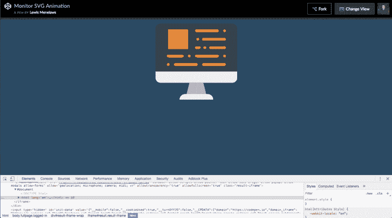](https://res.cloudinary.com/practicaldev/image/fetch/s--Tb-T8VJ9--/c_limit%2Cf_auto%2Cfl_progressive%2Cq_66%2Cw_880/https://cdn-images-1.medium.com/max/800/1%2A86L24jVGfKzkNVZVMbqhRw.gif) 
等一下…这是渲染出来的很像 HTML 的代码…

我的计算是正确的…所有这些`polygons`和`paths`是 SVG 图像中不同的元素。这肯定会使事情变得容易得多。如果你在 gif 中注意到了，我已经找到了所有的`paths`和`polygons`，并相应地为它们设置了一个 ID。例如，第一个路径元素是显示器的支架，所以我将其命名为`stand`。为了教程的缘故，我会告诉你我给每个元素起了什么名字，如果你跟着做的话。

### 制作第一个元素的动画

让我们从设置 ID 的元素开始。确保您已经导入了 2 个`GSAP`库。首先，让我们启动一个时间轴实例。下面是如何在您的 JavaScript 文件中实现这一点:

```
var tl = new TimelineMax(); 
```

<svg width="20px" height="20px" viewBox="0 0 24 24" class="highlight-action crayons-icon highlight-action--fullscreen-on"><title>Enter fullscreen mode</title></svg> <svg width="20px" height="20px" viewBox="0 0 24 24" class="highlight-action crayons-icon highlight-action--fullscreen-off"><title>Exit fullscreen mode</title></svg>

现在我们有了一个时间轴实例。让我们使用它。

```
tl.from('#stand', 0.5, {scaleY: 0, transformOrigin: "bottom", ease: Power2.easeOut}) 
```

<svg width="20px" height="20px" viewBox="0 0 24 24" class="highlight-action crayons-icon highlight-action--fullscreen-on"><title>Enter fullscreen mode</title></svg> <svg width="20px" height="20px" viewBox="0 0 24 24" class="highlight-action crayons-icon highlight-action--fullscreen-off"><title>Exit fullscreen mode</title></svg>

这将使它这样做:

[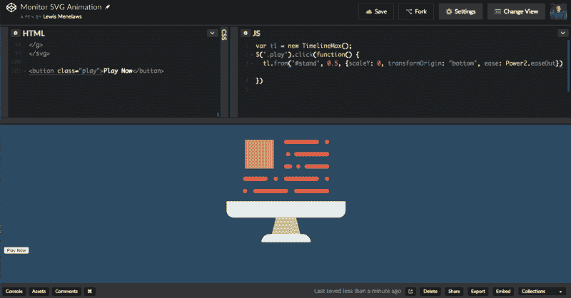](https://res.cloudinary.com/practicaldev/image/fetch/s---v6RspdP--/c_limit%2Cf_auto%2Cfl_progressive%2Cq_66%2Cw_880/https://cdn-images-1.medium.com/max/800/1%2A6eRJoMnTjf6A3QwKGfuorw.gif) 
屏幕在我的 gif 制作软件中没有正常渲染。放心吧！

开创性的动画！让我们分析一下代码到目前为止做了什么。

```
var tl = new TimelineMax(); 
```

<svg width="20px" height="20px" viewBox="0 0 24 24" class="highlight-action crayons-icon highlight-action--fullscreen-on"><title>Enter fullscreen mode</title></svg> <svg width="20px" height="20px" viewBox="0 0 24 24" class="highlight-action crayons-icon highlight-action--fullscreen-off"><title>Exit fullscreen mode</title></svg>

这将初始化变量`tl`的时间线。

```
tl.from('#stand', 0.5, {scaleY: 0, transformOrigin: "bottom", ease: Power2.easeOut}) 
```

<svg width="20px" height="20px" viewBox="0 0 24 24" class="highlight-action crayons-icon highlight-action--fullscreen-on"><title>Enter fullscreen mode</title></svg> <svg width="20px" height="20px" viewBox="0 0 24 24" class="highlight-action crayons-icon highlight-action--fullscreen-off"><title>Exit fullscreen mode</title></svg>

我们使用`tl`变量在时间轴上添加动画。它有一些我们必须输入的
参数。

from 函数让你定义动画从哪里开始，它将动画到 JavaScript 出现之前浏览器渲染 SVG 的地方。另一个受欢迎的选择是`tl.to`,但那是以后的事了。想象一下`tl.from`在一辆赛车驶向已经定义好的终点线之前，在起跑线上定义它。

在这里，我们的目标是什么元素，我们正在寻找动画。在这种情况下，它是 ID 为 stand 的元素。

`tl.from('#stand', 0.5`这定义动画的长度。在这种情况下，是半秒钟。

这些花括号内的所有内容都是动画参数。在这些参数中，我们有…

`{scaleY: 0`缩放元素，使其变得极薄而消失。

`{scaleY:0, transformOrigin: “bottom"``transformOrigin`部分告诉你你希望它在元素的什么位置变换。例如，如果我们从未选择`bottom`选项，那么它将从顶部延伸，这破坏了计算机建筑本身的幻觉。

最后但同样重要的是`ease: Power2.easeOut`。这是一个很有趣的使用。“缓动”参数可让您确定其呈现方式的缓动程度。注意到它是如何慢慢地结束而不是完全 100%停止的吗？有点难以解释，但是`GSAP` [有一个简单的可视化工具可以帮助你。](https://greensock.com/ease-visualizer)

[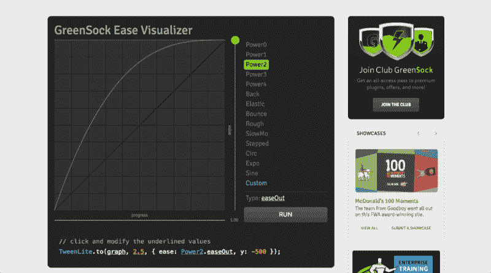](https://res.cloudinary.com/practicaldev/image/fetch/s--0WypL103--/c_limit%2Cf_auto%2Cfl_progressive%2Cq_66%2Cw_880/https://cdn-images-1.medium.com/max/800/1%2AnnEcOnuF1lhwwVMDY7zS4Q.gif) 
它甚至给你代码复制！！！！

### 继续前进…

哇，这是一个很大的进步…实际上，你现在已经掌握了制作 SVG 动画的所有知识。现在我们正准备完成我们的项目，一起到此为止。我还有几个其他的小技巧，我想你会喜欢的。让我们继续前进吧！

使用浏览器的开发工具找到支架的背面。我把`standBack`的 ID 设置为《后退》,因为这些动画会让你大吃一惊。

这个动画也相当简单，因为我们只是要做和上次一样的动画。这次我们使用`Bounce` ease。我认为它看起来真的很卡通，这就是我想要的氛围。来演示时间线是如何运作的。我将粘贴这一步的最终代码:

```
var tl = new TimelineMax();

tl.from('#stand', 0.5, {scaleY: 0, transformOrigin: "bottom", ease: Power2.easeOut}) 
```

<svg width="20px" height="20px" viewBox="0 0 24 24" class="highlight-action crayons-icon highlight-action--fullscreen-on"><title>Enter fullscreen mode</title></svg> <svg width="20px" height="20px" viewBox="0 0 24 24" class="highlight-action crayons-icon highlight-action--fullscreen-off"><title>Exit fullscreen mode</title></svg>

要一个接一个播放动画，你只需使用它下面的另一个`.from`函数。甚至不用做回调函数什么的。

[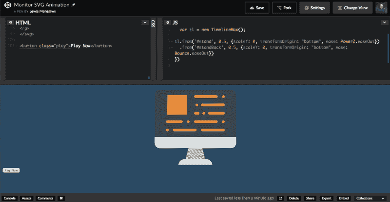](https://res.cloudinary.com/practicaldev/image/fetch/s--P_19QIej--/c_limit%2Cf_auto%2Cfl_progressive%2Cq_66%2Cw_880/https://cdn-images-1.medium.com/max/800/1%2AvhH4CO9r7HSICj3TugpgrQ.gif) 
又一部精美的动画。我的女朋友会很骄傲的！

### 变换原点

如果你不明白`transformOrigin`部分，那么这将有望使它更清楚。注意在最后两个动画中，他们是如何从下往上清除的？对于这个动画，我希望显示器的底部从中间向两边伸展。这就是在我们做`bottom`值之前`transformOrigin`发挥作用的地方，但是这次我们将做`center`。因为我们也是垂直拉伸而不是水平拉伸，所以我们也将使用`scaleX`方法。这是不言自明的。我将这个元素的 ID 设置为`monitorBottom`

```
var tl = new TimelineMax();

tl.from('#stand', 0.5, {scaleY: 0, transformOrigin: "bottom", ease: Power2.easeOut})
  .from('#standBack', 0.5, {scaleY: 0, transformOrigin: "bottom", ease: Bounce.easeOut}) 
```

<svg width="20px" height="20px" viewBox="0 0 24 24" class="highlight-action crayons-icon highlight-action--fullscreen-on"><title>Enter fullscreen mode</title></svg> <svg width="20px" height="20px" viewBox="0 0 24 24" class="highlight-action crayons-icon highlight-action--fullscreen-off"><title>Exit fullscreen mode</title></svg>

[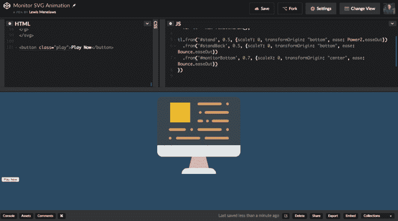](https://res.cloudinary.com/practicaldev/image/fetch/s--SJweT6Il--/c_limit%2Cf_auto%2Cfl_progressive%2Cq_66%2Cw_880/https://cdn-images-1.medium.com/max/800/1%2ANbttOU0g99uyYEN74AGxbQ.gif) 
哇！知道这些你一年能拿到超过 10 万的报酬吗？

### 稍事休息

好吧，这些动画对人类来说实在是太酷了。下一部动画我们需要一点延迟，否则我可能会恐慌发作。幸运的是`GSAP`已经覆盖了我们。我们现在将动画显示即将到来的屏幕。

我们给屏幕一个 ID`screen`。我们现在将使用这段代码来制作动画。

```
tl.from('#stand', 0.5, {scaleY: 0, transformOrigin: "bottom", ease: Power2.easeOut})
  .from('#standBack', 0.5, {scaleY: 0, transformOrigin: "bottom", ease: Bounce.easeOut}) 
  .from('#monitorBottom', 0.7, {scaleX: 0, transformOrigin: "center", ease: Bounce.easeOut}) 
```

<svg width="20px" height="20px" viewBox="0 0 24 24" class="highlight-action crayons-icon highlight-action--fullscreen-on"><title>Enter fullscreen mode</title></svg> <svg width="20px" height="20px" viewBox="0 0 24 24" class="highlight-action crayons-icon highlight-action--fullscreen-off"><title>Exit fullscreen mode</title></svg>

那里的一切都很简单。但是，我们又增加了一个参数…
会是什么呢？延迟！该延迟功能将触发播放该动画前的等待时间。我设置为 0.4 秒。让我们看看这是什么样子。

[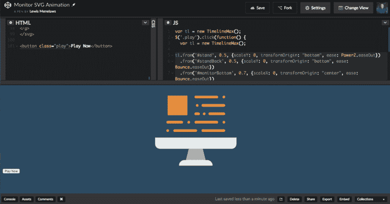](https://res.cloudinary.com/practicaldev/image/fetch/s--OxENXQ7t--/c_limit%2Cf_auto%2Cfl_progressive%2Cq_66%2Cw_880/https://cdn-images-1.medium.com/max/800/1%2AxE9wW8dp98j14_pSkQ5wGw.gif) 
有点耽误了被补充！谢天谢地。

### 不一定要复杂

现在让我们制作黄色盒子的动画。对于这个动画，我只是希望它出现。然而，为每个元素添加大量不同的参数变得很繁琐…如果简单就好了。让我们将黄色框的 ID 设置为`yellowBox`

```
var tl = new TimelineMax();

tl.from('#stand', 0.5, {scaleY: 0, transformOrigin: "bottom", ease: Power2.easeOut})
  .from('#standBack', 0.5, {scaleY: 0, transformOrigin: "bottom", ease: Bounce.easeOut}) 
  .from('#monitorBottom', 0.7, {scaleX: 0, transformOrigin: "center", ease: Bounce.easeOut})
  .from('#screen', 0.6, {scaleY: 0, transformOrigin: "bottom", ease: Circ.easeOut, delay: 0.4}) 
```

<svg width="20px" height="20px" viewBox="0 0 24 24" class="highlight-action crayons-icon highlight-action--fullscreen-on"><title>Enter fullscreen mode</title></svg> <svg width="20px" height="20px" viewBox="0 0 24 24" class="highlight-action crayons-icon highlight-action--fullscreen-off"><title>Exit fullscreen mode</title></svg>

等等，就这样？这肯定行不通！？

[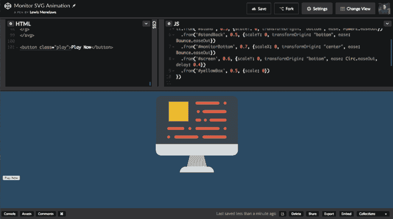](https://res.cloudinary.com/practicaldev/image/fetch/s--5tqJvOs---/c_limit%2Cf_auto%2Cfl_progressive%2Cq_66%2Cw_880/https://cdn-images-1.medium.com/max/800/1%2AyJbyW-r_ApWi-ImeGkoB6A.gif)
Easy Peasy Lemon Squeezy。

我想就这么简单。

### 数量上的质量

因此，我们一直在通过每个单独的元素来制作动画…现在我们处于所有红线的最后时刻。这将花费我永远…

等等，朋友，现在还不要这么悲观，有一个简单的方法，只用一行代码就可以将这些红线制作成漂亮的动画。让我知道你的过程。首先，让我们去我们的开发工具，找到这些红色路径的选择器。

[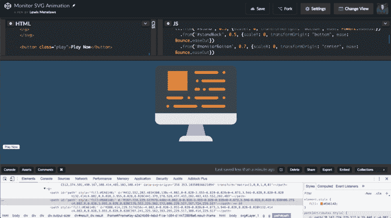](https://res.cloudinary.com/practicaldev/image/fetch/s--gkhW4gLW--/c_limit%2Cf_auto%2Cfl_progressive%2Cq_66%2Cw_880/https://cdn-images-1.medium.com/max/800/1%2Ah4q5-UD4FJ3NGDnHwkH64A.gif) 
增强！！！

有趣的是，似乎所有的红线都有一个父元素`<g>`。使用开发工具，我将复制选择器，它是:

```
#Layer_1 > g:nth-child(1) > g 
```

<svg width="20px" height="20px" viewBox="0 0 24 24" class="highlight-action crayons-icon highlight-action--fullscreen-on"><title>Enter fullscreen mode</title></svg> <svg width="20px" height="20px" viewBox="0 0 24 24" class="highlight-action crayons-icon highlight-action--fullscreen-off"><title>Exit fullscreen mode</title></svg>

现在，为了获得这个父元素的所有子元素，我只需要在选择器的末尾添加`path`。这将起作用:

```
#Layer_1 > g:nth-child(1) > g path 
```

<svg width="20px" height="20px" viewBox="0 0 24 24" class="highlight-action crayons-icon highlight-action--fullscreen-on"><title>Enter fullscreen mode</title></svg> <svg width="20px" height="20px" viewBox="0 0 24 24" class="highlight-action crayons-icon highlight-action--fullscreen-off"><title>Exit fullscreen mode</title></svg>

太好了。现在我们有了一个红色元素的列表。

现在我们可以使用`tl.from`函数来制作这些动画，但是它会同时制作它们的动画。如果他们都在不同的时间制作动画，那不是很酷吗？你现在可能已经看到我这种反问的趋势了。`tl.staggerFrom`会这样做！让我们一起来看看代码的最后一部分。

```
.staggerFrom('#Layer_1 > g:nth-child(1) > g path', 0.2, {scaleX: 0}, -0.1) 
```

<svg width="20px" height="20px" viewBox="0 0 24 24" class="highlight-action crayons-icon highlight-action--fullscreen-on"><title>Enter fullscreen mode</title></svg> <svg width="20px" height="20px" viewBox="0 0 24 24" class="highlight-action crayons-icon highlight-action--fullscreen-off"><title>Exit fullscreen mode</title></svg>

如你所见，这相当简单。我们放入之前确定的选择器，我们设置持续时间，我们还添加了属性，但是等等，这是什么？`-0.1`？这是什么意思？

在`.staggerFrom`函数中，我们需要定义我们希望每条路径在哪个点上动画化。在这种情况下，我们将做`0.1 seconds`我们在那里添加`-`的原因是为了让它从左到右，而不是相反。让我们看看实现后会是什么样子。

[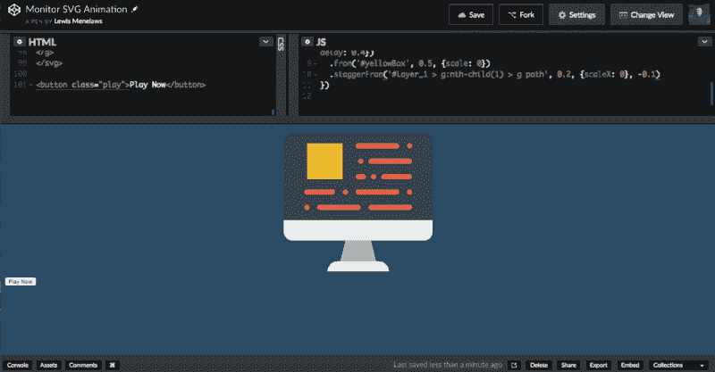](https://res.cloudinary.com/practicaldev/image/fetch/s--5cLWemeH--/c_limit%2Cf_auto%2Cfl_progressive%2Cq_66%2Cw_880/https://cdn-images-1.medium.com/max/800/1%2A-5qkT4Yn2iYm5rdaF2wqnQ.gif) 
那才叫漂亮，却没有你漂亮。

哇，太完美了。让`GSAP`如此神奇的是，你可以用 HTML 元素和 SVG 元素快速制作如此神奇的动画。一旦你理解了语法，像这样的事情只需要 10 分钟。

叉我的笔在推特上给我发消息，让我看看你自己做的东西😸。

[密码笔](https://codepen.io/lewismenelaws/pen/ypKjpd)

[推特](https://twitter.com/LewisMenelaws)

* * *

如果你喜欢这篇文章，觉得它很有帮助，请随时在 Twitter 上关注我！感谢
😸