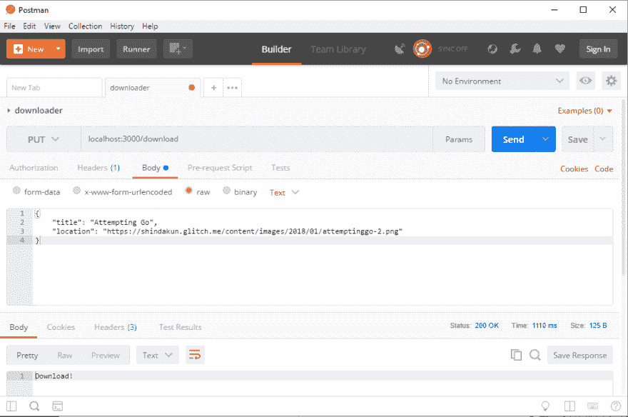

# 尝试学习围棋-构建下载器第 3 部分

> 原文:[https://dev.to/shindakun/attempting-to-learn-go-建筑-下载器-零件-03-2214](https://dev.to/shindakun/attempting-to-learn-go---building-a-downloader-part-03-2214)

当我们[上次停止](https://dev.to/shindakun/attempting-to-learn-go---building-a-downloader-part-02-2k7i)时，我们刚刚完成了下载端点的组装。这一次，我们将把它扩展到实际尝试下载一个文件。这意味着我们也将触及如何测试我们的下载端点。你准备好了吗？让我们开始吧！

## 通四

它可能看起来很可怕，因为我们已经添加了一堆更多的进口。随着 [io](https://godoc.org/io) 、 [net/url](https://godoc.org/net/url) 、 [os](https://godoc.org/os) 、 [path/filepath](https://godoc.org/path/filepath) 的首次出现。留意它们以后会被用到，你会发现它们一点也不可怕。现在，让我们沿着我们的代码跳到`handleDownRequest`函数的底部。

```
package  main  import  (  "encoding/json"  "fmt"  "io"  "io/ioutil"  "log"  "net/http"  "net/url"  "os"  "path/filepath"  )  type  download  struct  {  Title  string  `json:"title"`  Location  string  `json:"location"`  }  func  status(response  http.ResponseWriter,  request  *http.Request)  {  fmt.Fprintf(response,  "Hello!")  }  func  handleDownloadRequest(response  http.ResponseWriter,  request  *http.Request)  {  var  downloadRequest  download  r,  err  :=  ioutil.ReadAll(request.Body)  if  err  !=  nil  {  http.Error(response,  "bad request",  400)  log.Println(err)  return  }  defer  request.Body.Close()  err  =  json.Unmarshal(r,  &downloadRequest)  if  err  !=  nil  {  http.Error(response,  "bad request: "+err.Error(),  400)  return  }  log.Printf("%#v",  downloadRequest) 
```

从我们最后一次修改开始，所有的东西看起来都很熟悉。除了新的进口商品，到目前为止没有其他变化。在代码的这一点上，我们已经用标题和下载 URL 填充了结构。让我们把它传递给一个新函数`getFile`。如果成功，`getFile`将返回一个错误或`nil`。如果有事发生，我们将简单地返回一个 500“内部服务器”错误给浏览器。不过，我们将在内部日志中记录一些更具体的内容。出于安全考虑，我们希望尽可能避免将服务器信息泄露回浏览器。对于这个项目来说，我真的不太关心这个问题，但记住这一点是件好事。

```
err  =  getFile(downloadRequest)  if  err  !=  nil  {  http.Error(response,  "internal server error",  500)  return  }  fmt.Fprintf(response,  "Download!")  } 
```

目前 getFile 还不是一个很大的函数。如上所述，我们正在传入我们的`download`结构并返回一个错误(或`nil`)。因为我们要将文件保存到磁盘，所以我使用 [net/url](https://godoc.org/net/url) 包中的`url.Parse`将 url 解析成它的组成部分。

```
func  getFile(downloadRequest  download)  error  {  parsedUrl,  err  :=  url.Parse(downloadRequest.Location)  if  err  !=  nil  {  log.Println(err)  return  err  } 
```

最后，我们项目的核心！`http.Get`获取我们的 URL 并请求远程资源。然而，正如所写的，这可能是一个问题——我们假设从 JSON 检索的任何 URL 都是可以的。至少它是“格式良好”的，否则它不应该通过`url.Parse`函数。稍后，我们可能需要更仔细地检查它，以尝试并确定我们是否应该尝试 GET 请求。

```
response,  err  :=  http.Get(downloadRequest.Location)  if  err  !=  nil  {  log.Println(err)  return  err  }  defer  response.Body.Close() 
```

让我们假设一切正常，我们已经检索到了远程资源。我们将使用`parsedUrl.Path`和 [`filepath.Base`](https://godoc.org/path/filepath) 来提取出正确的文件名。同样，我们以后可能需要扩展它，如果我们得到一个没有正确文件名的 URL 怎么办？因为我们控制了测试环境，所以现在应该没问题了。

```
out,  err  :=  os.Create(filepath.Base(parsedUrl.Path))  defer  out.Close()  _,  err  =  io.Copy(out,  response.Body)  if  err  !=  nil  {  log.Println(err)  return  err  }  return  nil  }  func  main()  {  log.Println("Downloader")  http.HandleFunc("/",  status)  http.HandleFunc("/download",  handleDownloadRequest)  http.ListenAndServe(":3000",  nil)  } 
```

* * *

## 测试

为了使我们的测试更容易，我们将使用神奇的[邮递员](https://www.getpostman.com/)。如果你打算用 API 做任何工作，我建议把它添加到你的工具包中，它是必不可少的。不过，我不打算深入使用 Postman 本身，这是留给读者的练习。

在这一轮测试中，我们将使用以下 JSON 对象。

```
{  "title":  "Attempting Go",  "location":  "https://shindakun.glitch.me/conteimg/2018/01/attemptinggo-2.png"  } 
```

[T2】](https://res.cloudinary.com/practicaldev/image/fetch/s--U94_1DHb--/c_limit%2Cf_auto%2Cfl_progressive%2Cq_auto%2Cw_880/https://shindakun.glitch.me/conteimg/2018/01/postman01.png)

在运行当前版本的代码时，我们应该会看到类似这样的内容:

```
$ go run downloader.go
2018/01/11 11:06:24 Downloader 
```

现在，如果我们向 Postman 提交 PUT 请求，我们应该看到:

```
2018/01/11 11:07:32 main.download{Title:"Attempting Go", Location:"https://shindakun.glitch.me/conteimg/2018/01/attemptinggo-2.png"} 
```

以及同一目录中新创建的 PNG。

```
-rw-r--r-- 1 steve 197609 74860 Jan 11 11:07 attemptinggo-2.png 
```

厉害！明天我们会做一些清理工作，并增加将文件保存到子目录中的功能，届时请继续收听。在那之后，我想我们会考虑做我们的初始部署！

直到明天~~[下一次](https://dev.to/shindakun/attempting-to-learn-go---building-a-downloader-part-04-3ln9)...~~

* * *

你可以在 GitHub 上的 repo 中找到这个和大多数其他试图学习围棋的帖子的代码。

##  [【新达昆】](https://github.com/shindakun) / [ atlg](https://github.com/shindakun/atlg)

### 我在 dev.to 上发布的“尝试学习围棋”帖子的来源报告

<article class="markdown-body entry-content p-5" itemprop="text">

# 尝试学习围棋

在这里你可以找到我为尝试学习围棋而写的代码，这些代码是我在 [Dev.to](https://dev.to/shindakun) 上写的。

## 帖子索引

| 邮政 | 密码 |
| --- | --- |
| [制作下载器第 01 部分](https://dev.to/shindakun/attempting-to-learn-go---building-a-downloader-part-01-44gl) | - |
| [制作下载器第 02 部分](https://dev.to/shindakun/attempting-to-learn-go---building-a-downloader-part-02-2k7i) | - |
| [制作下载器第 03 部分](https://dev.to/shindakun/attempting-to-learn-go---building-a-downloader-part-03-2214) | - |
| [制作下载器第 4 部分](https://dev.to/shindakun/attempting-to-learn-go---building-a-downloader-part-04-3ln9) | - |
| [建造下载器第 05 部分](https://dev.to/shindakun/attempting-to-learn-go---building-a-downloader-part-05-44o) | - |
| [使用 REST API](https://dev.to/shindakun/attempting-to-learn-go---consuming-a-rest-api-5c7g) | [src](https://raw.githubusercontent.com/shindakun/atlg/master//go-api-01/main.go) |
| [继续休息冒险](https://dev.to/shindakun/attempting-to-learn-go---continuing-rest-adventures-2l4l) | [src](https://raw.githubusercontent.com/shindakun/atlg/master//go-api-02/main.go) |
| [现在发送休息请求](https://dev.to/shindakun/attempting-to-learn-go---now-sending-rest-requests-akp) | [src](https://raw.githubusercontent.com/shindakun/atlg/master//go-api-03/main.go) |
| [REST API 和模板上的位](https://dev.to/shindakun/attempting-to-learn-go---rest-api-and-a-bit-on-templates-4kca) | [src](https://raw.githubusercontent.com/shindakun/atlg/master//go-api-04/main.go) |
| [再次通过 API 发送电子邮件](https://dev.to/shindakun/attempting-to-learn-go---sending-email-via-api-again-2e4e) | [src](https://raw.githubusercontent.com/shindakun/atlg/master//go-api-05/main.go) |
| [让我们模块化吧！](https://dev.to/shindakun/attempting-to-learn-go---lets-get-modular-390i) | [src](https://github.com/shindakun/mailgunner) |
| [让我们再一次模块化！](https://dev.to/shindakun/attempting-to-learn-go---lets-get-modular---again-10cd) | [src](https://github.com/shindakun/mailgunner) |
| [构建开发日志第 1 部分](https://dev.to/shindakun/attempting-to-learn-go---building-dev-log-part-01-1c3m) | [src](https://raw.githubusercontent.com/shindakun/atlg/master//go-devsite-01/main.go) |
| [构建开发日志第 2 部分](https://dev.to/shindakun/attempting-to-learn-go---building-dev-log-part-02-179c) | [src](https://raw.githubusercontent.com/shindakun/atlg/master//go-devsite-02/main.go) |
| [构建开发日志第 3 部分](https://dev.to/shindakun/attempting-to-learn-go---building-dev-log-part-03-7lk) | [src](https://raw.githubusercontent.com/shindakun/atlg/master//go-devsite-03/main.go) |
| [构建开发日志第 4 部分](https://dev.to/shindakun/attempting-to-learn-go---building-dev-log-part-04-2bok) | [src](https://raw.githubusercontent.com/shindakun/atlg/master//go-devsite-04/main.go) |
| [构建开发日志第 5 部分](https://dev.to/shindakun/attempting-to-learn-go---building-dev-log-part-05-4mo1) | [src](https://raw.githubusercontent.com/shindakun/atlg/master//go-devsite-05/main.go) |
| [按扩展名 01 列出文件](https://dev.to/shindakun/attempting-to-learn-go---listing-files-by-extension-1n10) | [src](https://raw.githubusercontent.com/shindakun/atlg/master//go-sort-01/main.go) |
| [按扩展名 02 列出文件](https://dev.to/shindakun/attempting-to-learn-go---sorting-and-moving-files-by-extension-227j) | [src](https://raw.githubusercontent.com/shindakun/atlg/master//go-sort-01/main.go) |
| [开发至 API 01](https://dev.to/shindakun/interacting-with-the-devto-article-api-4g34) | [src](https://raw.githubusercontent.com/shindakun/atlg/master//go-devtoapi-01/main.go) |
| [开发至 API 02](https://dev.to/shindakun/interacting-with-the-devto-article-api---again-sort-of-2o8g) | 参见上面的代码 |

</article>

[View on GitHub](https://github.com/shindakun/atlg)

* * *

| 喜欢这篇文章吗？ |
| --- |
| 给我买杯咖啡怎么样？ |

* * *