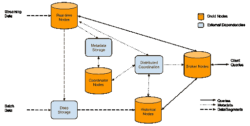
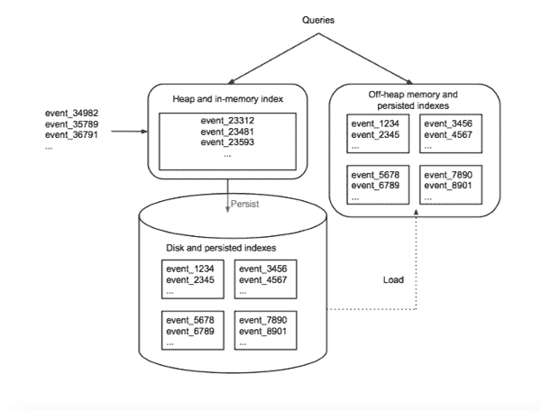
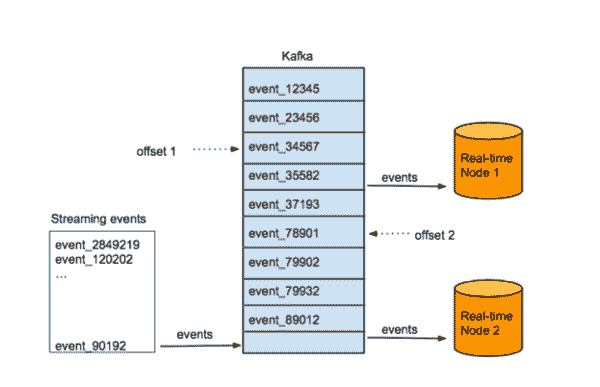

# 了解德鲁伊教架构

> 原文:[https://dev . to/rusru shal 13/learning-about-the-druid-architecture-184 c](https://dev.to/rusrushal13/learning-about-the-druid-architecture-184c)

了解德鲁伊教架构
这篇文章摘录了杨等人在 2014 年发表的题为“[德鲁伊教——一个实时分析数据存储库](http://static.druid.io/docs/druid.pdf)”的论文中的内容。

本文介绍了 Druid 的体系结构以及它在分析处理领域解决了什么问题，并详细说明了它如何支持快速聚合、灵活的过滤器和低延迟的数据接收。

**1。简介**

本文首先讨论了 Hadoop 的发展速度，以及处理 Hadoop 性能的困难。Hadoop 擅长存储和提供对大量数据的访问，但是，它不能保证数据访问的速度有多快。Hadoop 可以很好地存储数据，但它并没有针对获取数据和使数据立即可读进行优化。

该系统结合了面向列的存储布局、分布式、无共享架构和高级索引结构，允许以亚秒级延迟任意浏览十亿行表。

论文的每一部分都描述了这个问题的一点一滴，以及如何在德鲁伊存储的帮助下解决这个问题，还描述了他们离开德鲁伊后在生产中所学到的东西。

**2。问题**

Druid 解决了摄取和探索大量事务性事件(日志数据)的问题。现有的开源关系数据库管理系统(RDBMS)和 NoSQL 键/值存储不能为交互式应用程序提供低延迟的数据接收和查询平台，这一事实促进了对 Druid 的需求。除了查询延迟需求之外，它还支持系统的多租户和高可用性。它试图解决跨多个行业的数据探索、摄取和可用性问题。

**3。架构**

一个 Druid 集群由不同类型的节点组成，每种节点类型都被设计来执行一组特定的事情。不同类型的节点是松散耦合的，因此集群可以支持分布式、无共享的体系结构，这样集群内的通信故障对可用性的影响最小。

[T2】](https://res.cloudinary.com/practicaldev/image/fetch/s--1pZUJotI--/c_limit%2Cf_auto%2Cfl_progressive%2Cq_auto%2Cw_880/https://cdn-images-1.medium.com/max/800/1%2AvH-x1zx1fAHZdsNJb8Gh0Q.png)

*   实时节点

实时节点封装了接收和查询事件流的功能。通过这些节点索引的事件可立即用于查询。节点宣布它们的在线状态和它们在 Zookeeper 中提供的数据(用于协调)。Druid 充当查询的行存储，并将缓冲区中的事件处理成面向列的存储格式。每个持久化索引都是不可变的，节点将索引加载到堆外内存中进行查询。

[T2】](https://res.cloudinary.com/practicaldev/image/fetch/s--Wge3W0Zo--/c_limit%2Cf_auto%2Cfl_progressive%2Cq_auto%2Cw_880/https://cdn-images-1.medium.com/max/600/1%2AedKVl4RKNeNMnyCR3JDtZQ.png)

我们在这里将段称为不可变块，它包含实时节点在一段时间内接收的所有事件。另外，深藏大多是指 S3 或 HDFS。摄取、保持、合并和移交步骤是流畅的；在任何过程中都没有数据丢失。

[T2】](https://res.cloudinary.com/practicaldev/image/fetch/s--uNCULnZS--/c_limit%2Cf_auto%2Cfl_progressive%2Cq_auto%2Cw_880/https://cdn-images-1.medium.com/max/600/1%2AAE3stpHEr7-Wp3FhsEO6AQ.png)

实时节点是数据的消费者，需要相应的生产者来提供数据流，Kafka(或任何其他消息总线)位于生产者和实时节点之间。实时节点通过从消息总线读取事件来接收数据。从事件创建到事件消费的时间通常在数百毫秒的数量级。消息总线的作用是作为传入事件的缓冲区，并作为多个实时节点可以从中读取事件的单个端点。

*   历史节点

历史节点封装了加载和服务由实时节点创建的不可变数据块(段)的功能。Druid 中的大多数数据是不可变的，通常历史节点是集群中的主要工作节点。节点也遵循无共享架构，即节点彼此不了解；他们只知道如何加载、删除和服务不可变的段。他们还利用动物园管理员的协调。

历史节点可以支持读取一致性，因为它们只处理不可变的数据。不可变数据块还支持并行化模型；可以并发扫描和聚集不可变块，而不会阻塞。

*   代理节点

代理节点是历史和实时节点的查询路由器。代理节点理解 Zookeeper 中发布的关于哪些段是可查询的以及这些段位于何处的元数据。代理节点路由传入的查询，使得查询命中正确的历史或实时节点。在将最终合并结果返回给调用者之前，代理节点还合并来自历史和实时节点的部分结果。节点还包含一个具有 LRU 失效策略的缓存。缓存可以使用本地堆内存或外部分布式键/值存储，如 Memcached。实时数据从不缓存。在中断时，代理节点使用它们的最后状态，并将查询转发给实时节点和历史节点。

*   协调器节点

协调节点负责历史节点上的数据管理和分发。它们告诉历史节点加载新数据、丢弃过时数据、复制数据和移动数据以实现负载平衡。协调器节点经历领导者选举过程，该过程确定运行协调器功能的单个节点。剩余的协调器节点充当冗余备份。

**4。存储格式**

Druid 中的数据表(称为数据源)是带有时间戳的事件的集合，并被划分成一组段。段代表了 Druid 中的基本存储单元，复制和分发是在段中完成的。Druid 为字符串列创建了额外的查找索引，以便只扫描那些与特定查询过滤器相关的行。他们还讨论了存储多少列索引有助于最大化压缩。Druid 组件允许存储引擎，比如 JVM 堆或内存映射结构(默认)。

**5。查询 API**

Druid 有自己的查询语言，接受查询作为 POST 请求。代理、历史和实时节点都共享相同的查询 API。它还支持过滤器集。Druid 支持多种类型的聚合，包括浮点和整数类型的和、最小值、最大值以及复杂的聚合(基数估计等等)。使用 Druid 的一个主要缺点是它不支持连接查询。他们仍然没有做到这一点，并表示正在研究解决这一问题。

**6。性能**

这篇文章展示了他们在文章中分享的关于在生产中运行 druid 的许多见解(图表和表格)。结果是:

平均查询延迟:550 毫秒，90%的查询在 1 秒内返回，95%的查询在 2 秒内返回，99%的查询在 10 秒内返回。
对于最基本的数据集，集群每秒每核心接收 800，000 个事件的数据。摄取完全取决于数据源的复杂性。

**7。生产中的德鲁伊**

Druid 通常用于探索数据和生成数据报告。用户倾向于探索最近数据的短时间间隔。并发查询可能会有问题，它们通过查询优先级来解决这些问题。

假设许多节点同时发生故障是不现实的，并且有能力完全重新分配来自 2 个历史节点的数据。
在数据中心停机的情况下，它依赖于深层存储。
还提供了节点上的操作指标，包括系统级数据(CPU 使用率、可用内存、JVM 统计数据和磁盘容量)。用于集群性能和稳定性以及数据用户方面的指标。
德鲁伊还与流处理器(Apache Storm)配对，用于实时和历史数据。Storm 处理流数据处理工作，以及用于响应查询的列存储。
段位是德鲁伊的精髓，他们是分布式的。它们可以在多个数据中心精确复制。如果一个数据中心位于用户附近，则可能需要这样的设置。

**8。结论**

他们试图提供每一个关于德鲁伊的重要信息，如果有人想开始学习，他们可以从这篇文章开始。他们引用了更多有助于您理解 OLAP 数据库、列存储与行存储、分布式和实时分析存储等内容的文章。这是德鲁伊入门者的必备读物。