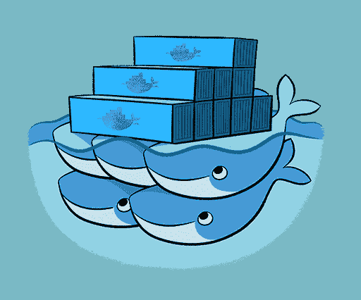

# Docker 初学者的概念、技巧和窍门

> 原文:[https://dev . to/limiw/docker-swarm-concepts-tips-and-tricks-for-a-docker-初学者-4j4h](https://dev.to/limiw/docker-swarm-concepts-tips-and-tricks-for-a-docker-beginner-4j4h)

[T2】](https://res.cloudinary.com/practicaldev/image/fetch/s--5LZW9vde--/c_limit%2Cf_auto%2Cfl_progressive%2Cq_auto%2Cw_880/https://thepracticaldev.s3.amazonaws.com/i/vet3yuzuyeusshwiut3j.png)

Docker Swarm 是一个容器编排器，这意味着它允许您管理一个 Docker 引擎集群。在一个主机系统上管理单个容器的典型方法是使用 Docker 命令行界面(CLI)。

然而，在一台机器上管理一个容器是对容器化应用程序的非常有限的使用。当您想要管理部署在多个主机上的多个容器时，CLI 不够用，必须使用 Docker Swarm 这样的专用编排工具。

Docker Swarm 方便了部署在机器集群上的多容器工作负载，从而扩展了 Docker 容器的功能。更具体地说，Docker Swarm 的用例包括:

*   将任务分配给容器组
*   管理单个容器的生命周期
*   根据工作负载扩大或缩小容器集群
*   在节点离线时提供故障转移

本文概述了一些主要的 Docker Swarm 概念，并详细介绍了这个编排工具的一些最佳实践。更详细的指南，请查看这个 [Docker Swarm 101](https://www.aquasec.com/wiki/display/containers/Docker+Swarm+101) wiki 页面。

## Docker 群体概念

### 码头工人 swarmkit

Docker 中使用的新工具，提供运行集群和分发任务的功能。Docker Swarm 模式使用 [Swarmkit](https://github.com/docker/swarmkit) 库&功能来简化和保护多个主机上的容器管理。

### 蜂群

群是一组以群模式运行的 Docker 主机，作为单个虚拟主机运行。

### 节点

一个节点是一个单独的 Docker 引擎，它是群的一部分。您可以在一台计算机上安装许多节点，但更典型的用途是将节点分布在多台计算机上。节点可以充当管理者、领导者或工作者。

### 任务

任务是群体中最小的调度单位。每个任务都有一个容器和用于运行它的命令。

### 经理节点

这种类型的节点除了帮助管理集群之外，还将任务分配给工作节点。

### 领导者节点

使用 [Raft 共识](https://raft.github.io/)算法选出一个节点作为领导节点。领导者节点在群体中执行编排任务。

### 工作者节点

工作节点只是接收和执行管理节点指定的任务。请注意，默认情况下，管理器节点同时充当管理器和工作器。

## Docker 群体最佳实践

像任何好的工具一样，当与一组最佳实践相结合时，Docker Swarm 的实用性会大放异彩，这些最佳实践可以充分利用 Docker Swarm 的功能，并确保您的集群平稳运行。

### 搭建分期平台

重要的是要建立一个临时平台，作为您将使用的生产配置的副本运行，并以集群模式运行一个 Docker 容器集群。这样，您可以证明容器集群以稳定的方式运行，并避免潜在的生产问题。

### 使用监控工具

密切监控你的 Docker 集群以发现任何可能导致失败的潜在问题是必要的，包括过多的内存使用或网络过载。好的容器编排监控工具应该提供应用定制规则的能力，比如采取自动操作，在出现故障时关闭节点。

### 保护管理者令牌

Docker 群组的运行方式是使用 docker swarm init 命令创建一个单节点群组。单个节点自动成为该群的管理节点。docker swarm init 命令的输出区域显示了用于添加更多节点的两种类型的标记——用于工作者的 join 标记和用于管理者的 join 标记。保护管理器令牌很重要，因为一旦一个节点成为管理器，它就可以控制整个群。

### 替换不可用节点

有时，一个节点变得不可用，这意味着它是一个管理器节点，但它无法与其他管理器节点通信。通过将现有的 worker 节点提升为 manager 或添加新的 manager 节点来替换这些节点是很重要的。

无论采用哪种方式，都要定期从 manager 节点运行 docker node ls 命令，并仔细查找列出了不可用值的节点。您可以识别工作节点，因为它们在该命令输出中的值为空。

### 利用服务配置

创建了希望容器运行的服务后，可以使用 docker service update 命令为该服务配置进一步的设置。具体选项包括为服务设置运行时环境、为服务保留内存或 CPU，以及选择服务的更新方式。请注意，在 Docker swarm 中，您要么拥有全局服务，要么拥有复制服务。全局服务指定在整个集群上运行的单个服务，例如反病毒工具。复制服务指定了同一任务的多个精确副本，例如一个 Apache web 服务器的三个副本。

### 维护奇数个管理节点

为了更好地利用 Raft consensus 算法对您的群的容错能力，请尝试始终保持奇数个管理器节点。奇数数量的管理器节点有助于确保在管理器节点出现故障时仍有足够的仲裁来处理请求。

### 强行删除被攻破的节点

如果一个节点受到网络攻击，毫不犹豫地将其从集群中移除是非常有用的。在 Docker swarm 模式下，您可以使用以下命令强制移除受损节点:

`$ docker node rm --force`

您可以将该命令与有问题的特定节点结合使用，以强制删除受损的节点。

## 关闭思绪

Docker swarm 是一个有用的容器编排工具，允许轻松扩展容器集群，并能够将部署在多个主机上的容器组作为单个虚拟主机进行管理。通过遵循本文概述的最佳实践，您可以确保从 Docker swarm 模式中获得最大收益，并避免潜在的性能和安全问题。

影像来源:[https://hub . docker . com/_/swarm/](https://hub.docker.com/_/swarm/)