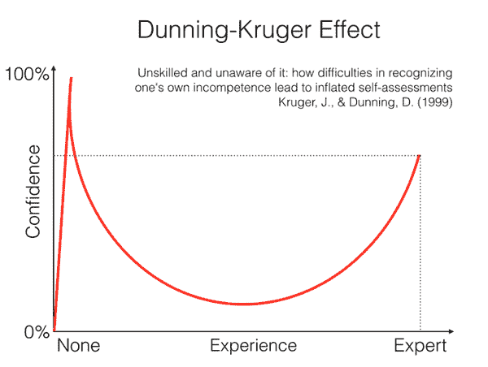

# 你对你所知道的有把握吗？

> 原文:[https://dev.to/pesse/are-you-sure-about-what-you-know-3a8f](https://dev.to/pesse/are-you-sure-about-what-you-know-3a8f)

> “如果你不称职，你就不会知道自己不称职……你需要的得出正确答案的技能正是你需要的识别什么是正确答案的技能。”
> 
> *大卫·邓宁[NYT](https://opinionator.blogs.nytimes.com/2010/06/20/the-anosognosics-dilemma-1/)*

听说过邓宁-克鲁格效应吗？如果不是，你可能想改变这一点——这是一个很好的科学基础来取笑那些——例如——使用流行语的人，显然不知道他们的意思。当你抱怨管理层、项目负责人或销售人员的技术能力不足时，这也给了你一些学术弹药。通过使用这个术语并把它扔向任何你认为是你对手的人，你可以显示你的优势。当人们甚至没有意识到被侮辱时，侮辱他们不是很有趣吗？这显然证明了你在智力上的优势，因为你不属于那群无能的人，不是吗？你够聪明，够反省，够开明，不会落入人类心灵的陷阱，不是吗？

对于那些不想通读链接的维基百科文章的人，有这样的(非常简化的)描述:

邓宁-克鲁格效应(Dunning-Kruger-Effect)描述了一种心理现象，即在某个话题上技能较低的人，最有可能认为自己懂得很多，技能至少“高于平均水平”。这是由于他们缺乏某一学科的知识也意味着他们不能认识到他们有多少不明白。

一个低技能的人可以通过教育和增加关于该主题的知识来克服这些影响。

效果的另一面是，高技能的人最有可能低估自己的能力，往往对自己的专长不太自信。

[T2】](https://res.cloudinary.com/practicaldev/image/fetch/s--l6sXPM2J--/c_limit%2Cf_auto%2Cfl_progressive%2Cq_auto%2Cw_880/https://cleandatabase.files.wordpress.com/2018/01/dunning_kruger_effect.png%3Fw%3D676)

互联网上有很多关于邓宁-克鲁格效应的信息和评论，经常结合对该现象极端例子的指责(你可以在这里的字里行间读到“特朗普”)。我们中的大多数人都见过这样的人，他们对自己提出的主题缺乏经验和知识，这让我们感到不安，而他们自己看起来却非常自信和快乐。

我也同意，看着这种效应在别人身上充分发挥很有趣，但如果你静下心来想一想，它可能会突然变得非常严重(我猜这就是邓宁教授和克鲁格的工作因“先让人发笑，然后思考”而被授予[搞笑诺贝尔奖](https://en.wikipedia.org/wiki/Ig_Nobel_Prize)的原因)。

问题是——这不是为其他人保留的现象。这不仅仅是荒谬和极端的例子。

# 记叙

我曾经认为我对安全和安全密码应该是什么样子有所了解。然后我看了詹姆斯·科普林的精彩演讲，并为自己的无知感到羞愧(虽然我强烈建议观看这个演讲，但我现在要破坏其中的一个例子)。

我认为以下是一个相当不错的强密码:

27dfJl!#uzB

它有它需要的一切，不是吗？事实上，下面的密码要安全十亿倍:

黑色小马周三午餐。

当我意识到我在一个我没有预料到的领域，以一种我没有意识到的方式陷入了邓宁-克鲁格效应时，我震惊了。这不是什么可笑的过度自信，在公众面前很容易被认出来。这是鬼鬼祟祟的，因此更加可怕。这让我想了很多关于我可能犯了严重错误的其他事情，这也是我想写这篇博客的原因。

这是怎么回事？我们为什么要相信 27dfJl！#uzB 是强密码？詹姆斯·科普林提出了一个很好的解释(在这篇文章中，我将从他那里复制的最后一样东西，我保证):这是一个很好的叙述。听起来不错。人类难猜的密码应该是计算机难猜的吧？那是错误的。但这是个好故事。我们喜欢好故事。我们喜欢听起来不错的东西——从第一眼看上去——合乎逻辑。我们也喜欢证实我们希望的或者我们非常害怕的故事(向阴谋论或者难民是随机问题的来源问好)。因此我们愿意相信。

我们可能会相信许多好故事的例子，但当我们增加对这个主题的了解时，我们——至少——开始意识到这个主题可能不像我们最初认为的那样简单:

*   人类难以猜测的密码对计算机来说也是难以猜测的
*   更强的冬天否定了全球变暖的理论
*   工作越多的人完成的越多
*   孩子们需要尽可能早地去托儿所以发展更好的社交技能
*   [TDD 带来更好的设计](https://www.amazon.com/Making-Software-Really-Works-Believe/dp/0596808321)
*   顾客不知道他真正想要什么

# 概括

邓宁-克鲁格效应的另一个可能的陷阱似乎是一般化——至少在反思和分析我自己以及我职业生涯中遇到的其他人的行为后，我是这么认为的。

我们似乎经常认为，我们非常擅长的一门学科比它实际上要宽泛得多。

我处理 Oracle 数据库已经超过 12 年了，但是这是否意味着我能够熟练地处理其他 RDBMS？这是否意味着，当突然处理 MySQL 或 SQL Server 时，我可以期望表现出同样的专业水平？

不行。当我开始钻研 SQL Server 开发时，有成千上万的事情是我不知道的——我甚至不知道它们的存在。

尝试在 Oracle 中创建分层数据结构——鉴于 CONNECT BY PRIOR，这将是一项非常简单的任务。试着用 MySQL 做同样的事情，你将不得不增长关于闭包表、邻接表和修改过的前序树遍历的知识——这些东西你以前甚至不知道它们的存在。

以偏概全很容易陷入邓宁-克鲁格效应。您的实际知识和专业技能可能已经过时，在某个用例、某个编程语言或框架上非常专业。这里有一些问题，不是责备或指责，而是让你和我思考:

*   当你有很多用 wordpress 开发网站的经验时，这是让你成为一个有经验的 web 开发者还是让你成为一个有经验的 WordPress web 开发者？
*   当你在 Java 1.5 中达到专家水平时，这意味着你是 Java 专家还是 Java 1.5 专家？
*   当你掌握了一门特定的编程语言，是让你成为一名有经验的开发人员，还是让你成为该语言的一名有经验的开发人员？
*   当你成长为三个孩子时，这是否让你成为了育儿专家或养育这三个特定孩子的专家？

要获得更一般主题的专业知识，除了掌握几个更具体的子主题之外别无他法——这意味着我们首先要知道有不同的子主题。

# 防御

那么，当我们没有意识到自己缺乏技能和知识时，我们该如何为自己辩护，避免高估自己的技能呢？

我在这个问题上远没有经验，我的结论很可能会失败，但在思考和反思这个话题很长一段时间后，我认为我至少可以写下我将在 2018 年努力做的事情并牢记在心(是的**当然**这是一个反思性的旧的一年已经过去，新的一年应该更好的帖子，你没注意到吗？)

首先，我认为**谦逊**对于开发者来说是一项被严重低估的技能，而在我看来，这是最重要的技能之一。我会努力改进它。在大多数情况下，预期你所面临的错误不是别人的错，而是你自己可能犯了一个错误会极大地帮助你进行调试。顺便说一句，这也让你成为团队成员更好的伙伴。期待不完美是抵御邓宁-克鲁格效应的一大法宝。

大多数话题都不是简单的**非黑即白**。它们有各种深浅不同的灰色，有时甚至会出现不同的颜色。在我的经验讨论中，将一个话题简化为“吃或死”的陈述和建议很可能成为邓宁-克鲁格效应的受害者。**教条**是知识的替代品，也是虚幻优越感的强烈警告信号。对我来说，更好地认识这种情况，不要轻易被一种观点或趋势所蛊惑，这似乎是一个伟大的目标，**在你(我)自己的观点中寻找简化**。

训练到 **[改变你的想法](http://Programming%20Language%20X%20sucks%20terribly%20Framework%20Y%20is%20bullshit)** 也可能对个人成长和防御无知非常有益。又和谦逊有关。

我记得 Pettr holm strm(vaa din 的高级软件架构师)在一次演讲中说过的一件事(找不到链接):“如果你创建了一个架构——鼓励其他人挑战你的决定！”这给我留下了深刻的印象，我认为这是一个非常明智的声明。如果其他人质疑你的观点或建议——不要生气，而是把它当成发现你可能错过的东西的机会。利用这种可能性来理清你的想法，并解释为什么你认为应该这样做。敞开心扉改变你的想法。

还想增加 2018 年矛盾观点的**影响力。如果你固步自封，你很容易成为邓宁-克鲁格效应的牺牲品。阅读别人写的东西，挑战他们的观点，通过阅读同一主题上不同的、相反的评论来拓宽你的视野，从而增加你的整体知识。不要呆在你的象牙塔里，多和别人接触。**

# 管理与领导

这是一个相当困难的话题(特别是考虑到我自己的老板很有可能会阅读这篇文章)，但我真的想写下我对 Dunning-Kruger 及其在发展环境中对管理、领导力和员工-雇主关系的影响的想法。

我不是领导，我不是经理，我也不是企业家。因此，我显然没有资格从关系的那一端说话。但是做了将近 20 年的员工，这可能足以让我有资格从另一端谈论我的经历、期望和想法。

2014 年 Monster.com 的一项调查显示，84%的受访员工(美国、德国:83%)认为他们能比老板做得更好。Monster.com 总结道，因此大多数员工不尊重他们的老板——这对高效工作来说是一个可怕的基础。

我认为这种情况与双方的催款-克鲁格效应有很大关系。一方面是员工，可能在他们的专业领域非常能干，非常清楚他们的经理在聊天、演示和面试中犯的每一个技术错误。最多从理论上了解一个(或这个特定的)公司是如何运作的，以及作为一个成功的领导者需要什么，他们很可能会大大高估自己的管理技能——特别是因为他们很可能没有所有的[信息和可用的必要背景](https://m.signalvnoise.com/how-transparent-should-you-be-as-a-leader-924012e53476)。

另一方面，作为一名经理或领导者通常意味着你不具备某个特定(技术)主题的知识深度，无法理解你甚至不知道的依赖和风险的数量。因此，你一直处于“催款-克鲁格效应”的危险中，尤其是因为人们期待你做出决定，并且可能会因为你是他们的老板而试图纠正你的(可能是低技能和错误的)观点。

那么，我们如何才能克服这种可能给我们公司带来灾难性影响的困境呢？让我提出一些想法:

在我看来，谦逊、诚实和相互尊重是关键。员工们，要意识到你们很有可能遭受“催款-克鲁格效应”,要相信你们的经理会尽力而为。经理们，要对你的专家有信心，因为由于催款-克鲁格效应，他们很可能对自己的技能远不如他们应该和可能的那样有信心。

邓宁和克鲁格指出，对抗虚幻优越感的最佳武器是教育和更多的相关知识。所以克服它的危险的一个好方法是**问**。员工们，如果你不理解一个管理决策，请询问更多的上下文。经理们，问问你的员工，他们为什么要提出建议或批评某项决定。有技能的人(双方)将能够从逻辑上解释他们为什么这样做，并以这样的方式判断某件事情。没有技能的人很难做到这一点。

因为在某个特定话题上的无能很难被受影响的人注意到，**批评和辩论**对于一个健康成长的公司来说非常重要。要做到这一点，经理和员工都需要学会不把(与工作相关的)批评当成针对个人的，而是“鼓励他人挑战你的决定”和观点。作为一名领导者，你有额外的责任去创造一个诚实和安全的讨论环境。

# 做某事

我最不想改进的就是防止对我技能的高估:**做点什么**。不要停留在理论假设上，开始行动吧。如果你错了，现实很可能会打击你，而你会——再一次——增加你在这个问题上的知识，这最终是对无能和不知道它的最好防御。

我真诚地邀请你通过[推特](https://twitter.com/Der_Pesse)、[电子邮件](mailto:derpesse@gmail.com)与我联系，发表你对这个话题的体验和想法。

祝大家 2018 年过得愉快。

*这篇文章最初发表于[清洁数据库开发](https://cleandatabase.wordpress.com/2018/01/09/are-you-sure-about-what-you-know/)T3】*

 