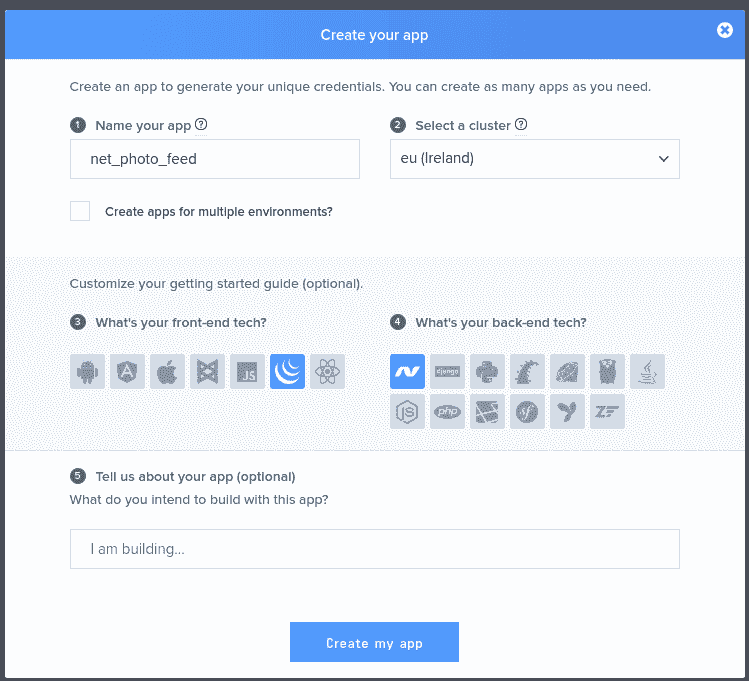

# 如何建立一个照片饲料使用？网和推动器

> 原文：<https://dev.to/samuelayo/how-to-build-a-photo-feed-using-net-and-pusher-8g1>

[T2】](https://res.cloudinary.com/practicaldev/image/fetch/s--QFL6BMbx--/c_limit%2Cf_auto%2Cfl_progressive%2Cq_66%2Cw_880/https://blog.pusher.com/wp-content/uploads/2017/09/build-a-photo-feed-using-.net-and-pusher.gif)

今天，我们将使用。网和推动器。

我们将建立一个迷你系统，允许人们上传他们的图像/照片，每个人都可以实时查看。这就像一个没有评论、喜欢和观点的迷你 Instagram。听起来很酷？让我们继续前进。

要学习本教程，请确保您熟悉以下基础知识:

*   C#，ASP.NET，MVC
*   jQuery

## 设置推手账号和 app

Pusher 是一种托管服务，可以非常容易地向 web 和移动应用程序添加实时数据和功能。

Pusher 是服务器和客户端之间的实时层。Pusher 保持与客户端的持久连接——如果可能的话，通过 Websockets，并退回到基于 HTTP 的连接——这样，一旦您的服务器有了新数据，它们就可以通过 Pusher 推送到客户端。

我们将在仪表板上注册一个新的应用程序。唯一必须的选项是应用程序名称和集群。一个集群代表 Pusher 服务器的物理位置，它将处理您的应用程序的请求。此外，选择`jQuery`作为本教程的前端技术，选择`ASP.NET`作为后端技术。对于其他项目，您可以根据自己的需求进行选择。

接下来，从`App Keys`部分复制出你的应用 ID、密钥和秘密，因为我们稍后会用到它们。

[T2】](https://res.cloudinary.com/practicaldev/image/fetch/s--_bIRn8_u--/c_limit%2Cf_auto%2Cfl_progressive%2Cq_auto%2Cw_880/https://blog.pusher.com/wp-content/uploads/2017/09/build-a-photo-feed-using-.net-and-pusher-create-app.png)

## 在 Visual Studio 中设置 Asp.Net 项目

我们需要做的下一件事是创建一个新的 Asp.Net MVC 应用程序。

为此，让我们:

*   打开 Visual Studio 并从侧栏中选择“新建项目”
*   在模板下，选择`Visual C#`
*   接下来，选择 web
*   在中间部分，选择`ASP.N` `ET MVC Web Applicat` `ion`。

对于本教程，我将项目命名为:`Real-time-photo-feed`。

现在我们差不多准备好了。下一步是为安装官方的`Pusher`库。Net 使用了`NuGet Package`。

为此，我们进入工具，通过顶栏上的菜单，点击`NuGet Package Manager`。在下拉菜单中，我们选择`Package Manager Console`。

我们将在 Visual Studio 的底部看到`Package Manager Console`。接下来，让我们通过运行以下命令来安装该软件包:

```
Install-Package PusherServer 
```

或者，我们也可以使用`NuGet Package Manager UI`安装`Pusher`库。为此，在`Solution Explorer`中，右键单击`References`或项目并选择`Manage NuGet Packages`。“浏览”选项卡按受欢迎程度显示可用的软件包。通过在右上角的搜索框中键入`PusherServer`来搜索`Pusher`包。选择推动器包装，在右侧显示包装信息，并激活`Install`按钮。

## 精心制作我们的应用程序

现在我们的环境已经设置好了，让我们开始编写代码。

默认情况下，Visual Studio 为我们创建了三个控制器。然而，我们将使用`HomeController`作为应用程序逻辑。我们要做的第一件事是定义一个模型来存储数据库中的图像列表。

在`models`文件夹下，我们创建一个名为`PhotoFeed.cs`的文件，并添加以下内容:

```
using System; 
using System.Collections.Generic; 
using System.ComponentModel.DataAnnotations; 
using System.Linq; using System.Web; 
namespace Real_time_photo_feed.Models { 
    public class PhotoFeed { 
      [Key] 
      public int Id { get; set; } 
      [Required] 
      public string Comment { get; set; } 
      public string Imagepath { get; set; } 
    }
} 
```

在上面的代码块中，我们声明了一个名为`PhotoFeed`的模型，它有三个主要属性:

*   Id:这是模型表的主键。
*   注释:图像的描述。
*   Imagepath:存储图像的路径。

现在我们已经定义了我们的模型，让我们在默认的数据库上下文中引用它。为此，让我们打开`models\IdentityModels.cs`文件，然后找到名为`ApplicationDbContext`的类，并在创建函数后添加以下内容:

```
public DbSet<PhotoFeed> FeedModel { get; set; } 
```

在上面的代码块中，`DBSet`类表示用于读取、更新和删除操作的实体集。我们将用来进行 CRUD 操作的实体是我们之前创建的`PhotoFeed`模型，我们给它命名为`FeedModel`。

## 连接我们的数据库

尽管我们的模型已经建立，我们仍然需要将一个数据库附加到我们的应用程序。为此，选择 Visual Studio 左侧的服务器资源管理器，右键单击数据连接，并添加一个数据库。

有各种轻量级的数据库，可以适合我们正在构建的应用程序，例如:

*   Microsoft access 数据库
*   Sqlite 数据库
*   ms sql server
*   火鸟
*   VistaDb

对于本教程，我使用 MSSQL 服务器。

## 创建我们的索引路线

现在我们的模型和数据库都可以工作了。让我们继续创建我们的索引路线。打开`HomeController`并用以下代码替换它:

```
using PusherServer; 
using Real_time_photo_feed.Models; 
using System; 
using System.Collections.Generic; 
using System.IO; 
using System.Linq; 
using System.Threading.Tasks; 
using System.Web; using System.Web.Mvc; 
namespace Real_time_photo_feed.Controllers { 
    public class HomeController : Controller { 
        ApplicationDbContext db = new ApplicationDbContext(); 
        public ActionResult Index() { 
            var me = db.FeedModel.AsQueryable(); 
            return View(me); 
        } 
        [HttpPost] 
        public async Task<ActionResult> Index(PhotoFeed feed, HttpPostedFileBase upload) { 
            if (ModelState.IsValid) { 
                if (upload != null && upload.ContentLength > 0) { 
                    var FileName = System.IO.Path.GetFileName(upload.FileName); 
                    var newpath = Path.Combine(HttpContext.Server.MapPath("~/UploadedFiles"), FileName);      
                    upload.SaveAs(newpath); 
                PhotoFeed setdata = new PhotoFeed(); 
                setdata.Comment = feed.Comment; 
                setdata.Imagepath = "/UploadedFiles/"+FileName; 
                db.FeedModel.Add(setdata); 
                db.SaveChanges(); 
                var options = new PusherOptions(); 
                options.Cluster = "XXX_APP_CLUSTER"; 
                var pusher = new Pusher("XXX_APP_ID", "XXX_APP_KEY", "XXX_APP_SECRET", options); 
                ITriggerResult result = await pusher.TriggerAsync("a_channel", "an_event", setdata); 
                } 
            } 
            return Content("ok"); 
        } 
    } 
} 
```

在上面的代码块中，我们已经为`GET`和`POST`请求定义了索引函数。

在查看我们的`GET`和`POST`控制器函数之前，我们注意到有一个我们的 db 上下文导入到我们的类中，代码行如下:

```
ApplicationDbContext db = new ApplicationDbContext(); 
```

这使得访问我们的数据库模型成为可能，该模型是我们在`ApplicationDbContext`类中使用`DbSet`类定义的。

在`GET`功能中，我们已经返回了视图，我们将使用它来处理我们的提要的添加和实时更新。

注意，在`GET`函数中，我们将一个变量传递给名为`me`的视图函数。这个变量是我们的`BlogFeed`模型的**可查询**版本。这将被传递给视图，该视图随后被循环和渲染。

注意到`POST`方法被设置为异步。这是因为推手。NET 库使用 await 操作符来等待发送给 Pusher 的数据的异步响应。

在这个函数中，我们首先将新电影添加到数据库中，然后触发一个事件。一旦事件被发出，我们就返回一个 ok 字符串。

但是，请注意，如果图像保存在 DB 中，但没有使用 Pusher 发布，上面的代码将不会处理任何错误。我们可能需要使用 try and catch 语句来处理发送到 Pusher 的失败。

## 创建我们的视图文件

让我们打开我们的`Views\Home\Index.cshtml`,将内容替换为以下内容:

```
@model IEnumerable < Real_time_photo_feed.Models.PhotoFeed > @{ Layout = null; } 
<html>
   <head>
      
      ASP.NET Photo feed< /title> 
      <link href="https:/ / maxcdn.bootstrapcdn.com / bootstrap / 3.3.7/ css / bootstrap.min.css" rel="stylesheet" integrity="sha384- BVYiiSIFeK1dGmJRAkycuHAHRg32OmUcww7on3RYdg4Va + PmSTsz / K68vbdEjh4u" crossorigin="anonymous">
      <script src="https://cdnjs.cloudflare.com/ajax/libs/jquery/3.2.1/jquery.js"></script> <script src="//js.pusher.com/4.0/pusher.min.js"></script> 
   </head>
   <body>
      <div class="container">
         <form method="post" enctype="multipart/form-data" action="/Home/Index" onsubmit="return feed_it()">
            <div class="form-group"> <label for="usr">Image:</label> <input type="file" id="upload" name="upload" class="form-control" required> </div>
            <div class="form-group"> <label for="pwd">comment:</label> <input type="text" id="Comment" name="Comment" class="form-control" required> </div>
            <div class="form-group"> <button type="submit" class="btn btn-success">Feed it</button> </div>
         </form>
         <div class="row" id="feeds">
            @foreach (var item in Model) { 
            <span>
               <h2>@item.Comment</h2>
                
            </span>
            } 
         </div>
      </div>
   </body>
</html> 
```

在上面的代码块中，我们创建了一个表单，它由三个主要元素组成，分别是:

*   图像注释的文本输入。
*   用于选择我们想要输入的图像的文件输入。
*   按钮将新条目保存到数据库中。

另外，请注意，我们已经包括了一些必需的库，例如:

*   Bootstrap CSS
*   jQuery JavaScript 库
*   Pusher JavaScript 库

## 推送器绑定和 jQuery 代码片段

下面是我们用来处理文件上传和 Pusher 实时更新的 jQuery 片段示例。

```
<script>
 var files; // Add events 
 $(document).ready(function() {
         $('input[type=file]').on('change', prepareUpload);
     }) // Grab the files and set them to our variable 
 function prepareUpload(event) { files = event.target.files; }

 function feed_it() {
     var data = new FormData();
     $.each(files, function(key, value) { data.append('upload', value); });
     data.append('Comment', document.getElementById('Comment').value);
     $.post({
         url: '/Home/Index',
         data: data,
         processData: false, // Don't process the files 
         contentType: false, // Set content type to false as jQuery will tell the server it's a query string request 
         success: function(data) { if (data == "ok") { alert('done');
                 document.getElementById('Comment').value = ''; } },
         error: function(error) { alert('an error occured, please try again later') }
     });
     return false;
 }
 var pusher = new Pusher("XXX_APP_KEY", { cluster: "XXX_APP_CLUSTER" });
 var my_channel = pusher.subscribe('a_channel');
 my_channel.bind("an_event", function(doc) { var new_message = `<span> <h2>` + doc.Comment + `</h2>  </span>`;
     $('#feeds').prepend(new_message); });
</script> 
```

在上面的代码块中，我们注意到我们已经完成了两个主要活动，它们是:

**上传图像代码**

为了处理从客户端到服务器的图像上传，遵循以下步骤:

*   我们在文件输入按钮上附加了一个事件监听器，将图像存储到一个名为`files`的变量中。
*   我们定义了一个名为`feed_it`的函数，它创建了一个新的`FormData`，然后将我们的图像和描述附加到表单数据中。这个函数然后向我们的`index`路线发出一个`AJAX POST`请求。

**从其他客户端订阅服务器上的 Feed Additions**

图像发送到服务器后，会向 Pusher 发送一个请求，请求返回一个包含我们已广播的新数据的事件。要收听这些实时事件，我们需要:

*   在传递我们的应用程序密钥和集群时初始化了 Pusher 对象。
*   订阅了我们的频道`a_channel`。
*   声明了一个到我们的事件`an_event`的绑定。在这个绑定的回调函数中，我们把新数据添加到我们的提要列表中。

就是这样！现在，一旦一张照片被上传，它也会被广播，我们可以通过我们的频道实时更新。

下面是我们构建的图像:

[T2】](https://res.cloudinary.com/practicaldev/image/fetch/s--QFL6BMbx--/c_limit%2Cf_auto%2Cfl_progressive%2Cq_66%2Cw_880/https://blog.pusher.com/wp-content/uploads/2017/09/build-a-photo-feed-using-.net-and-pusher.gif)

## 结论

在本文中，我们介绍了如何使用。以及在. NET 中处理文件上传。

本教程的代码库可以在 [pu](https://github.com/samuelayo/ASP.NET-PHOTO-FEED) [blic GitHub](https://github.com/samuelayo/ASP.NET-PHOTO-FEED) [资源库](https://github.com/samuelayo/ASP.NET-PHOTO-FEED)中找到。可以下载用于教育目的。

有没有更好的方法来构建我们的应用程序、预订或评论？请在评论中告诉我们。

* * *

本帖由作者[在此](https://blog.pusher.com/build-a-photo-feed-using-net-and-pusher/)原创发布。