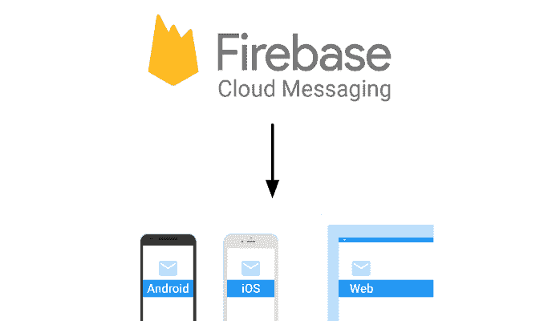

# 使用 Golang 的 Firebase 云消息传递

> 原文:[https://dev . to/douglasmakey/firebase-cloud-messaging-with-golang-4he 4](https://dev.to/douglasmakey/firebase-cloud-messaging-with-golang-4he4)

[T2】](https://res.cloudinary.com/practicaldev/image/fetch/s--BrI48wO7--/c_limit%2Cf_auto%2Cfl_progressive%2Cq_auto%2Cw_880/https://cdn-images-1.medium.com/max/1600/1%2AkkxZDEVuorkFfGwpE56LOw.png)

我需要创建一个微服务，通过 FCM 管理我的应用程序、电子邮件、短信和通知中的通信。

所以我决定为 FCM 创建一个库，在我的应用程序中使用。

示例:

```
package main
import (
    "log"
    "github.com/douglasmakey/go-fcm"
    )
func main() {
    // init client
    client := fcm.NewClient("ApiKey")

    // You can use your HTTPClient 
    //client.SetHTTPClient(client)

    data := map[string]interface{}{
        "message": "From Go-FCM",
        "details": map[string]string{
            "name": "Name",
            "user": "Admin",
            "thing": "none",
        },
    }

    // You can use PushMultiple or PushSingle
    client.PushMultiple([]string{"token 1", "token 2"}, data)
    //client.PushSingle("token 1", data)

    // registrationIds remove and return map of invalid tokens
    badRegistrations := client.CleanRegistrationIds()
    log.Println(badRegistrations) 

    status, err := client.Send()
    if err != nil {
        log.Fatalf("error: %v", err)
    }

    log.Println(status.Results)
} 
```

<svg width="20px" height="20px" viewBox="0 0 24 24" class="highlight-action crayons-icon highlight-action--fullscreen-on"><title>Enter fullscreen mode</title></svg> <svg width="20px" height="20px" viewBox="0 0 24 24" class="highlight-action crayons-icon highlight-action--fullscreen-off"><title>Exit fullscreen mode</title></svg>

[来源](https://github.com/douglasmakey/go-fcm)